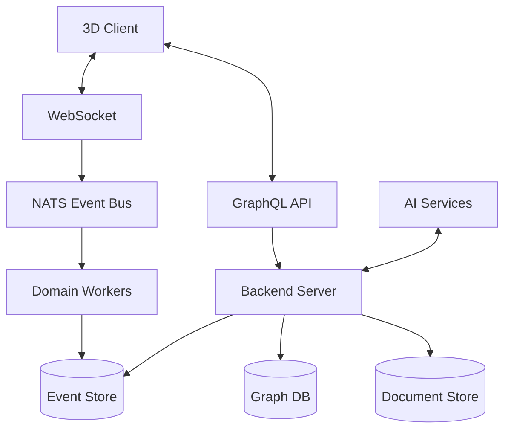

# CIM Main Application Plan

## Executive Summary

The Composable Information Machine (CIM) needs a main application that transforms the existing domain architecture into a usable 3D graph-based knowledge management and workflow system. This document outlines the plan to create a functional application that users can actually run and benefit from.

## 1. Core Purpose & Value Proposition

### Primary Goal
Create a **3D visual knowledge graph editor** that allows users to:
- Build and explore knowledge graphs in 3D space
- Design and execute workflows visually
- Connect AI agents to analyze and transform graphs
- Manage documents, identities, and organizational structures
- Integrate with existing tools (Git, document systems)

### Target Users
1. **Knowledge Workers** - Organize complex information visually
2. **Workflow Designers** - Build business processes
3. **Data Scientists** - Explore relationships in data
4. **Organizations** - Manage knowledge and processes

## 2. Core User Stories

### Epic 1: Graph Creation and Visualization
```
As a user, I want to:
- Create nodes and edges in 3D space
- Navigate through the graph with intuitive controls
- Group related nodes into clusters
- Save and load graph structures
- Search and filter nodes by properties
```

### Epic 2: Workflow Design and Execution
```
As a workflow designer, I want to:
- Design workflows by connecting nodes
- Set triggers and conditions
- Monitor workflow execution in real-time
- Handle errors and retries
- Export workflows for automation
```

### Epic 3: AI-Powered Analysis
```
As a data analyst, I want to:
- Connect AI agents to analyze graphs
- Get recommendations for connections
- Auto-organize messy graphs
- Generate insights from graph patterns
- Ask questions about my data
```

### Epic 4: Document and Knowledge Management
```
As a knowledge worker, I want to:
- Attach documents to nodes
- Version control my knowledge base
- Collaborate with team members
- Search across all content
- Export to various formats
```

## 3. Technical Architecture

### 3.1 Application Structure

```
alchemist/
├── alchemist-server/          # Backend server application
│   ├── src/
│   │   ├── main.rs           # Entry point
│   │   ├── api/              # REST/GraphQL API
│   │   ├── websocket/        # Real-time updates
│   │   ├── storage/          # Persistence layer
│   │   ├── events/           # Event processing
│   │   └── orchestration/    # Domain coordination
│   └── Cargo.toml
│
├── alchemist-client/          # Frontend 3D application
│   ├── src/
│   │   ├── main.rs           # Bevy app entry
│   │   ├── ui/               # UI components
│   │   ├── graph/            # 3D graph rendering
│   │   ├── controls/         # User input handling
│   │   ├── networking/       # Server communication
│   │   └── state/            # Client state management
│   └── Cargo.toml
│
├── alchemist-common/          # Shared types and utilities
│   ├── src/
│   │   ├── protocol.rs       # Client-server protocol
│   │   ├── models.rs         # Shared data models
│   │   └── lib.rs
│   └── Cargo.toml
│
└── alchemist-cli/            # Command-line interface
    ├── src/
    │   └── main.rs           # CLI commands
    └── Cargo.toml
```

### 3.2 Core Components

#### Backend Server (`alchemist-server`)
- **Event Store**: PostgreSQL with event sourcing
- **Graph Database**: Neo4j or embedded graph DB
- **Message Bus**: NATS for real-time updates
- **API Layer**: GraphQL for flexible queries
- **Storage**: S3-compatible for documents

#### 3D Client (`alchemist-client`)
- **Bevy Engine**: 3D rendering and ECS
- **egui Integration**: 2D UI overlays
- **WebSocket Client**: Real-time sync
- **Local Cache**: Offline capability

#### CLI Tool (`alchemist-cli`)
- Import/export functionality
- Server management
- Batch operations
- Scripting interface

### 3.3 Data Flow Architecture



## 4. Implementation Phases

### Phase 1: Basic 3D Graph Editor (4 weeks)
- [ ] Create main server application
- [ ] Implement basic GraphQL API
- [ ] Create Bevy-based 3D client
- [ ] Node creation and linking
- [ ] Basic navigation controls
- [ ] Save/load functionality

### Phase 2: Persistence & Multi-user (3 weeks)
- [ ] PostgreSQL event store
- [ ] User authentication
- [ ] Real-time collaboration via WebSocket
- [ ] Conflict resolution
- [ ] Basic permissions

### Phase 3: Workflow Engine (4 weeks)
- [ ] Visual workflow designer
- [ ] Workflow execution engine
- [ ] Step monitoring UI
- [ ] Error handling
- [ ] Workflow templates

### Phase 4: AI Integration (3 weeks)
- [ ] AI agent framework
- [ ] Graph analysis endpoints
- [ ] Natural language queries
- [ ] Auto-layout algorithms
- [ ] Recommendation engine

### Phase 5: Advanced Features (4 weeks)
- [ ] Document management
- [ ] Git integration
- [ ] Advanced search
- [ ] Export/import
- [ ] Plugin system

### Phase 6: Production Readiness (2 weeks)
- [ ] Performance optimization
- [ ] Security hardening
- [ ] Deployment automation
- [ ] Monitoring/logging
- [ ] Documentation

## 5. MVP Features (Phase 1)

### Must Have
1. **3D Graph Visualization**
   - Create/delete nodes
   - Create/delete edges
   - Pan/zoom/rotate camera
   - Select and move nodes
   - Basic node properties

2. **Persistence**
   - Save graph to file
   - Load graph from file
   - Auto-save functionality

3. **Basic UI**
   - Node property panel
   - Tool palette
   - Menu system
   - Status bar

### Nice to Have
- Undo/redo
- Node search
- Keyboard shortcuts
- Multiple graph tabs
- Export to image

## 6. Technology Stack

### Backend
- **Language**: Rust
- **Framework**: Axum (web server)
- **Database**: PostgreSQL + SQLx
- **Message Bus**: NATS
- **API**: async-graphql
- **Auth**: JWT tokens

### Frontend
- **Language**: Rust
- **Engine**: Bevy 0.16
- **UI**: bevy_egui
- **Networking**: tokio + tungstenite
- **State**: Event-driven architecture

### Infrastructure
- **Container**: Docker
- **Orchestration**: Kubernetes
- **CI/CD**: GitHub Actions
- **Monitoring**: Prometheus + Grafana

## 7. Development Approach

### Principles
1. **Start Simple**: Get basic 3D graph working first
2. **Iterate Quickly**: Release early, get feedback
3. **Test Everything**: TDD for critical paths
4. **Document as We Go**: Keep docs current
5. **Performance Matters**: Profile early and often

### First Sprint Goals
1. Create `alchemist-server` with basic GraphQL API
2. Create `alchemist-client` with 3D scene
3. Implement node creation and rendering
4. Add camera controls
5. Connect client to server
6. Save/load graphs locally

## 8. Success Metrics

### Technical
- 60 FPS in 3D view with 1000 nodes
- < 100ms API response time
- < 50ms UI interaction latency
- 99.9% uptime

### User
- Create a graph in < 5 minutes
- Design a workflow in < 15 minutes  
- Find any node in < 3 seconds
- Zero data loss

## 9. Risks & Mitigations

| Risk | Impact | Mitigation |
|------|--------|------------|
| 3D performance issues | High | Profile early, use LOD, culling |
| Complex state management | High | Event sourcing, clear boundaries |
| Real-time sync conflicts | Medium | CRDT or operational transform |
| Steep learning curve | Medium | Interactive tutorials |
| Browser compatibility | Low | Native app first, web later |

## 10. Next Steps

1. **Create Project Structure**
   ```bash
   cargo new alchemist-server
   cargo new alchemist-client  
   cargo new alchemist-common
   cargo new alchemist-cli
   ```

2. **Set Up Basic Server**
   - GraphQL schema
   - Basic CRUD endpoints
   - WebSocket support

3. **Create 3D Client Skeleton**
   - Bevy app with 3D scene
   - Basic camera controls
   - Node spawning system

4. **Connect Client to Server**
   - GraphQL client
   - Real-time updates
   - Error handling

5. **Implement First User Story**
   - "As a user, I want to create a node in 3D space"

## Conclusion

This plan transforms the CIM architecture into a real, usable application. By focusing on the core value proposition (3D knowledge graphs) and building incrementally, we can deliver a working MVP in 4 weeks and a production-ready system in 20 weeks.

The key is to start simple, validate with users early, and iterate based on feedback. The existing domain architecture provides a solid foundation - now we need to build the house.