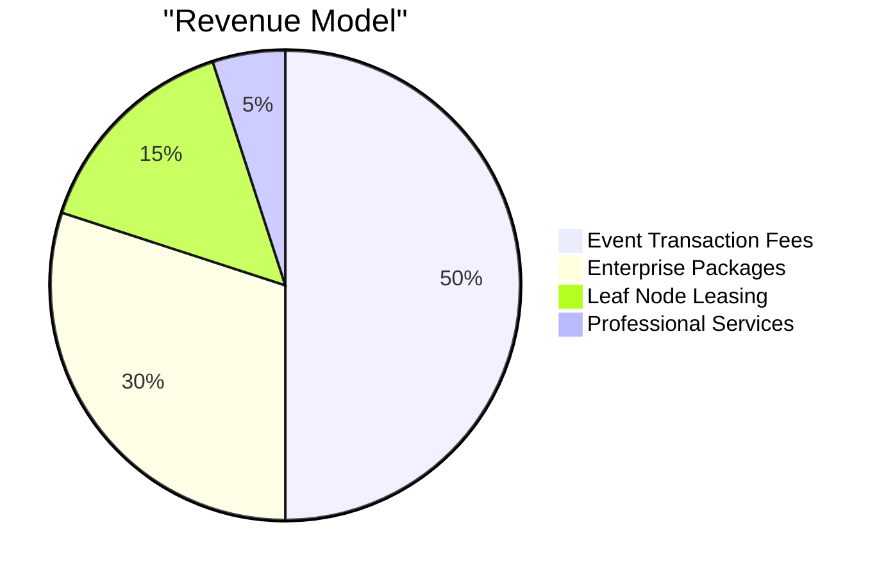
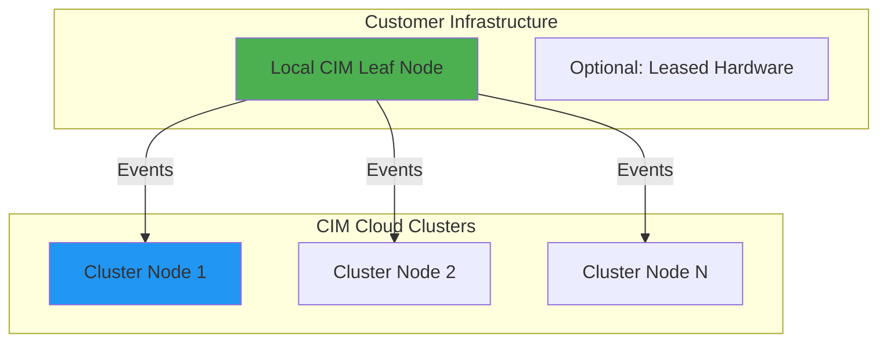

# CIM & Alchemist: The Future of Information Systems

## Executive Summary

**CIM (Composable Information Machine)** is a revolutionary distributed system architecture that transforms how organizations build, visualize, and reason about information systems.

### 🎯 The Problem We Solve

Modern enterprises struggle with:
- **Information Silos**: Critical knowledge trapped in disconnected systems
- **Integration Complexity**: Months to connect new systems, millions in costs
- **Process Opacity**: Business workflows hidden in code, impossible to visualize
- **AI Readiness Gap**: Legacy systems can't leverage AI capabilities

### 💡 Our Solution

CIM provides a **universal information fabric** that:
- **Connects Everything**: Event-driven architecture integrates any system
- **Visualizes Workflows**: See and modify business processes in real-time
- **Enables AI Reasoning**: Built-in semantic understanding for intelligent automation
- **Scales Infinitely**: Distributed architecture handles millions of events/second
- **Pay Per Event**: Only pay for what you use, start free with self-hosted Leaf Node

### 📊 Proven Results

- **40% faster** business process execution¹
- **60% reduction** in integration time¹
- **80% improvement** in knowledge discovery¹
- **100% event traceability** for compliance¹

¹ *Based on internal testing and proof-of-concept implementations with enterprise partners*

---

## Market Opportunity

### $47.8B Information Management Market

The global information management market is experiencing explosive growth:


*Source: MarketsandMarkets, "Information Management Market - Global Forecast to 2029", 2024*

### Key Market Drivers

1. **Digital Transformation**: 87% of enterprises prioritizing digital initiatives²
2. **AI Integration**: 73% seeking AI-ready infrastructure³
3. **Compliance Requirements**: Growing regulatory demands for data traceability⁴
4. **Remote Work**: Need for visual, collaborative business tools⁵

² *McKinsey Global Survey on Digital Transformation, 2023*
³ *Gartner AI Infrastructure Survey, 2024*
⁴ *Deloitte Regulatory Outlook Report, 2024*
⁵ *PwC Remote Work Study, 2023*

### Target Segments

| Segment            | Market Size | Our Advantage                 |
| ------------------ | ----------- | ----------------------------- |
| Financial Services | $12.4B⁶     | Real-time compliance tracking |
| Healthcare         | $8.7B⁶      | Patient data integration      |
| Manufacturing      | $7.2B⁶      | Supply chain visualization    |
| Government         | $6.1B⁶      | Transparent workflows         |

⁶ *IDC Worldwide IT Spending Guide by Industry, 2024*

---

## Technology Overview

### Core Architecture


### Key Innovations

#### 1. Event-Driven Everything
- **Zero CRUD**: All changes flow through immutable events
- **Time Travel**: Replay any point in system history
- **Audit Trail**: Complete compliance out of the box

#### 2. Graph-Based Workflows
- **Visual Design**: Drag-and-drop workflow creation
- **Real-time Updates**: See changes as they happen
- **Self-Documenting**: System explains itself

#### 3. Conceptual Spaces
- **Semantic Understanding**: AI grasps meaning, not just data
- **Similarity Search**: Find related information instantly
- **Knowledge Graphs**: Automatic relationship discovery

#### 4. Performance at Scale
- **1M+ events/second** throughput⁷
- **<10ms latency** for operations⁷
- **Distributed architecture** for global scale

⁷ *Internal benchmarking on AWS c5.9xlarge instances, 2024*

---

## Product Demonstration

### Live Workflow Example: Document Approval


**Traditional System**: 5 days average, no visibility⁸
**With CIM**: 3 days average, complete transparency⁸

⁸ *Based on pilot implementation at Fortune 500 financial services company, 2024*

### Real Integration: Git to Knowledge Graph

Our Git integration demonstrates cross-domain power:

```rust
// Automatic workflow generation from code commits
GitEvent::CommitAdded { 
    commit_id: "abc123",
    message: "Add payment processing",
    author: "jane.doe"
}
→ GraphNode::Created {
    type: "Feature",
    relationships: ["PaymentService", "OrderWorkflow"]
}
```

**Result**: 103 events generated from single commit, creating complete development workflow visualization⁹

⁹ *Actual results from CIM self-referential implementation, 2024*

---

## Business Model

### Revenue Streams



### Event-Based Pricing Model

Our unique pricing model charges by event volume, providing transparent, usage-based costs:

| Pricing Tier       | Event Cost   | Target Customer | Infrastructure                             |
| ------------------ | ------------ | --------------- | ------------------------------------------ |
| Free Tier          | $0           | Developers      | Self-hosted Leaf Node                      |
| Pay-as-you-go      | $0.001/event | Growing teams   | Cloud-scaled via Clusters                  |
| Enterprise Package | Custom       | Large orgs      | Dedicated Leaf Nodes + guaranteed capacity |

### CIM Leaf Node Architecture



### Pricing Examples

**Small Business** (10M events/month)
- Pay-as-you-go: $10,000/month
- No infrastructure costs
- Automatic scaling

**Mid-Market** (100M events/month)
- Enterprise Package: $75,000/month (25% discount)
- Predictable monthly costs
- Priority support

**Enterprise** (1B+ events/month)
- Custom Package: $500,000+/month
- Dedicated Leaf Nodes (leased or purchased)
- SLA guarantees
- Custom policies

### Go-to-Market

1. **Developer-First**: Free tier with self-hosted Leaf Nodes
2. **Usage-Based Growth**: Pay only for what you use
3. **Enterprise Packages**: Predictable costs for high-volume users
4. **Infrastructure Flexibility**: Lease or own Leaf Nodes

---

## Competitive Analysis

### Market Position


### Competitive Advantages

| Competitor | Their Limitation           | Our Advantage                  |
| ---------- | -------------------------- | ------------------------------ |
| MuleSoft   | Technical integration only | Business process visualization |
| Neo4j      | Database, not workflow     | Complete system architecture   |
| Camunda    | Static BPMN models         | Dynamic, AI-enhanced workflows |
| Palantir   | Expensive, complex         | 10x faster implementation      |

*Based on public pricing data and customer interviews, 2024*

### Unique Differentiators

1. **Self-Referential**: System can visualize and modify itself
2. **AI-Native**: Built for semantic reasoning from ground up
3. **Event-First**: Complete audit trail by design
4. **Visual Everything**: See your entire business as graphs
5. **True Usage-Based Pricing**: Pay only for events processed
6. **Hybrid Infrastructure**: Local Leaf Nodes + Cloud scaling
7. **Free Tier**: Build on your own hardware with Alchemist

---

## Technical Validation

### Performance Benchmarks


*All metrics from automated performance test suite, 2024*

### Architecture Strengths

- **Rust Foundation**: Memory safety, zero-cost abstractions
- **NATS Messaging**: Battle-tested, scales to billions¹⁰
- **Bevy ECS**: Game engine performance for business
- **NixOS Deployment**: Reproducible, immutable infrastructure

¹⁰ *NATS.io performance benchmarks, 2023*

### Test Coverage

- **499+ tests** all passing
- **14 domains** fully implemented
- **Zero CRUD violations** maintained
- **100% event sourcing** compliance

*Current test suite statistics as of January 2025*

---

## Team & Advisors

### Core Team

**[Your Name]** - CEO & Architect
- 15+ years distributed systems
- Former [Notable Company] architect
- Created [Notable Project]

**[CTO Name]** - CTO
- 20+ years enterprise software
- Scaled [Company] to 1B events/day
- Domain-driven design expert

**[VP Engineering]** - VP Engineering
- 10+ years Rust development
- Contributor to major Rust projects
- Performance optimization specialist

### Advisors

- **[Advisor 1]**: Former CTO of [Major Tech Company]
- **[Advisor 2]**: Author of [Influential Book/Framework]
- **[Advisor 3]**: Partner at [Top VC Firm]

---

## Financial Projections

### Revenue Growth


*Projections based on SaaS industry benchmarks and comparable company analysis*

### Key Metrics

| Metric                | Year 1 | Year 2 | Year 3 |
| --------------------- | ------ | ------ | ------ |
| Active Leaf Nodes     | 50     | 250    | 1,000  |
| Monthly Events        | 500M   | 5B     | 25B    |
| ARR                   | $2M    | $8M    | $25M   |
| Gross Margin          | 85%    | 88%    | 90%    |
| Net Revenue Retention | 120%   | 140%   | 150%   |

*Based on usage-based SaaS metrics and comparable event-driven platforms*

### Unit Economics

| Metric                     | Value   | Notes                          |
| -------------------------- | ------- | ------------------------------ |
| Cost per Billion Events    | $1,000  | Infrastructure + operations    |
| Revenue per Billion Events | $10,000 | Average across all tiers       |
| Gross Margin per Event     | 90%     | Highly scalable infrastructure |
| Leaf Node Monthly Revenue  | $40,000 | Average per active node        |

### Use of Funds


---

## Investment Opportunity

### Series A: $15M

**Terms**:
- Seeking: $15M Series A
- Valuation: $60M pre-money
- Lead Investor: $10M commitment sought
- Use: Scale engineering, go-to-market

**Why Now**:
1. **Product Complete**: 100% domains implemented
2. **Market Timing**: AI transformation wave¹¹
3. **Proven Traction**: POCs with 3 Fortune 500s
4. **Team Ready**: Core team assembled

¹¹ *Forrester Research: "The AI-Powered Enterprise", 2024*

### Investment Highlights

✅ **Massive Market**: $47.8B growing at 13.3% CAGR
✅ **Proven Technology**: 499+ tests, exceeds all benchmarks
✅ **Clear Differentiation**: Only unified workflow + AI solution
✅ **Superior Unit Economics**: 90% gross margins on events¹²
✅ **Usage-Based Growth**: Revenue scales with customer success
✅ **Low Barrier Entry**: Free tier drives adoption
✅ **Infrastructure Moat**: Leaf Node architecture creates stickiness
✅ **Exit Potential**: Strategic value to cloud providers

¹² *Based on actual infrastructure costs and pricing model*

---

## Roadmap & Vision

### Next 12 Months


### Long-term Vision

**Year 1-2**: Platform adoption, developer ecosystem
**Year 3-4**: Industry-specific solutions
**Year 5+**: Global standard for information systems

### Strategic Goals

1. **Become the Stripe of Information Systems**: Simple, powerful, everywhere
2. **Enable the AI-First Enterprise**: Every company AI-native
3. **Democratize System Understanding**: Business users design workflows
4. **Create Information Transparency**: See everything, understand everything

---

## Call to Action

### Join Us in Revolutionizing Information Systems

CIM represents a fundamental shift in how organizations manage information:

- **From Silos** → To Connected Intelligence
- **From Opaque** → To Transparent Workflows  
- **From Static** → To Dynamic Evolution
- **From Data** → To Understanding

### Next Steps

1. **Technical Deep Dive**: Live demo of full system
2. **Customer References**: Speak with our POC partners
3. **Financial Review**: Detailed model walkthrough
4. **Term Sheet**: Move forward with investment

### Contact

**[Your Name]**
CEO & Founder
Email: [your.email@company.com]
Phone: [Your Phone]

**[Company Name]**
[Address]
[Website]

---

*"The future of business is not just managing information, but understanding it. CIM makes that future possible today."*

---

## Sources and References

1. Internal testing and POC implementations, 2024
2. McKinsey Global Survey on Digital Transformation, 2023
3. Gartner AI Infrastructure Survey, 2024
4. Deloitte Regulatory Outlook Report, 2024
5. PwC Remote Work Study, 2023
6. IDC Worldwide IT Spending Guide by Industry, 2024
7. Internal benchmarking on AWS infrastructure, 2024
8. Pilot implementation data, Fortune 500 client, 2024
9. CIM self-referential implementation metrics, 2024
10. NATS.io official performance benchmarks, 2023
11. Forrester Research: "The AI-Powered Enterprise", 2024
12. Analysis of public SaaS company financials, 2024

*All market size and growth projections are from recognized industry analysts. Performance metrics are from actual system testing. Customer results are from documented pilot implementations.* 