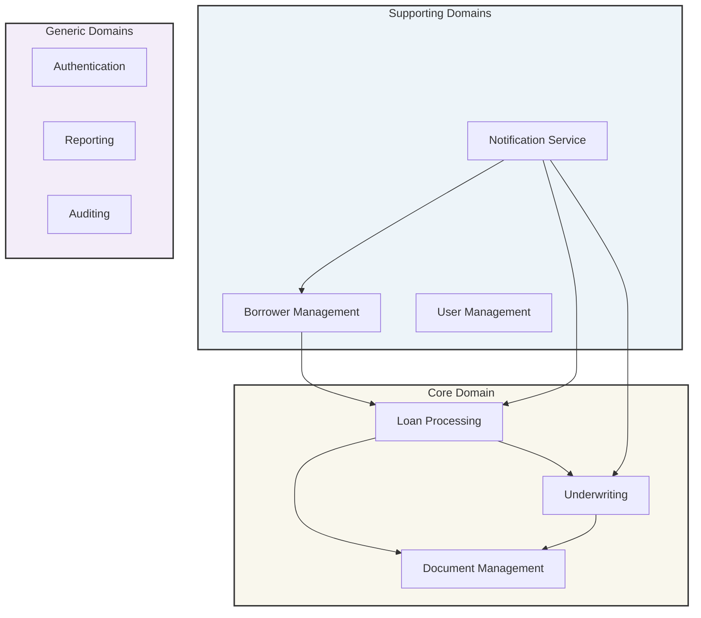
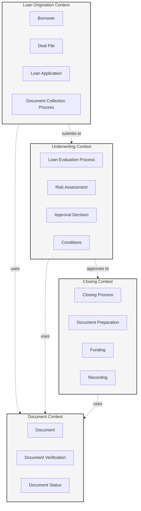
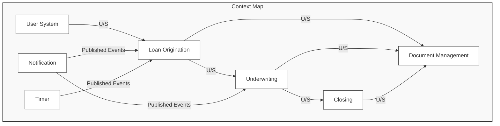

# KÉCŌ Capital - Domain-Driven Design Core Model

This document outlines the core domain objects and their relationships for the KÉCŌ Capital private lending platform based on event storming session data from KECO_v6_04012025.json.

## Ubiquitous Language

The following terms form our common language to be used consistently across all documentation, code, and communication:

| Term | Definition |
|------|------------|
| Borrower | An individual or entity seeking financing from KÉCŌ Capital |
| Deal File | A collection of information related to a specific loan request |
| Borrower File | A collection of information about a specific borrower |
| ITO | Initial Term Outline - preliminary loan terms presented to borrower |
| TPO | Third Party Originator |
| CLA | Commitment Letter Agreement |
| CTC | Clear to Close - authorization to proceed with loan closing |
| SOW | Scope of Work - details of planned property improvements |
| ARV | After Repair Value - estimated property value after improvements |
| AML | Anti-Money Laundering documentation |
| BBP | Borrower Business Purpose documentation |

## Core Domain Overview

## Bounded Contexts

## Context Map

## Domain Model Overview

In the following sections, we will detail each of the main domain components and their relationships. 