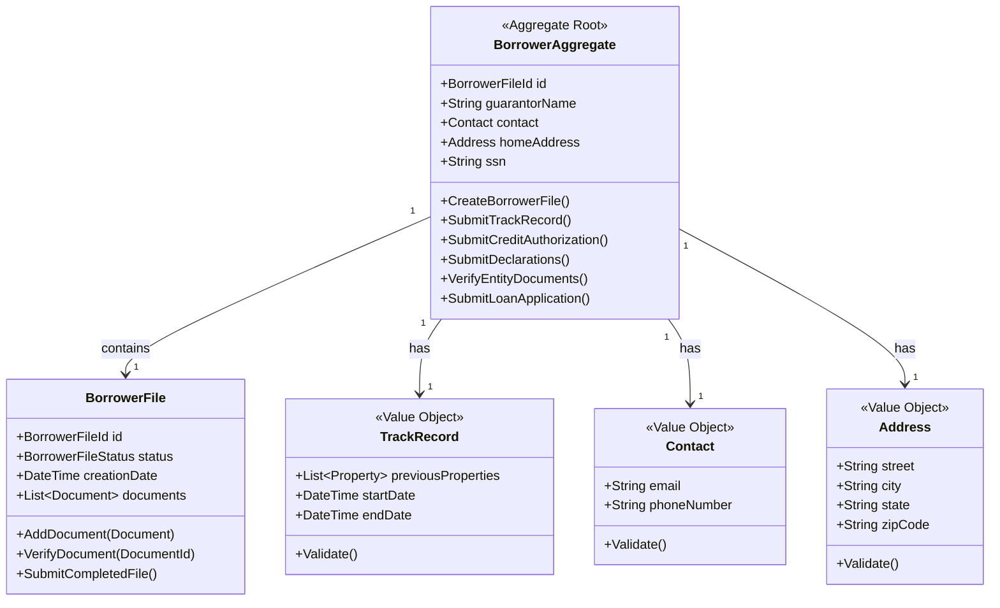
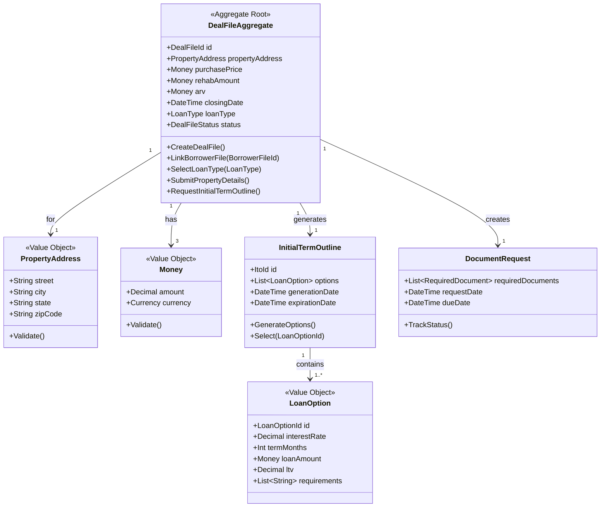
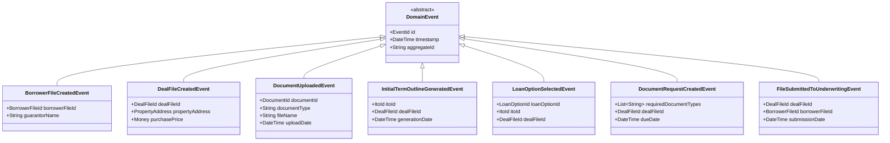
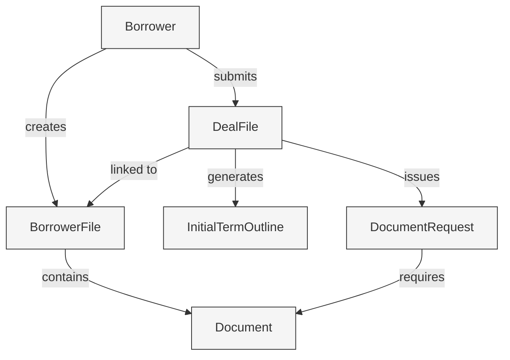

# KÉCŌ Capital - Loan Origination Context

This document details the Domain-Driven Design (DDD) elements of the Loan Origination Context, which handles the initial loan application process, borrower file creation, and document collection.

## Context Overview

The Loan Origination Context is responsible for:
- Capturing borrower information
- Creating and maintaining deal files
- Managing the document collection process
- Generating initial term outlines (ITOs)
- Handling the submission of complete files for underwriting

## Aggregate: BorrowerAggregate

## Aggregate: DealFileAggregate

## Domain Events

## Entity Relationships

## Repositories

- **BorrowerRepository** - Manages persistence of Borrower aggregates
- **DealFileRepository** - Manages persistence of DealFile aggregates
- **DocumentRepository** - Provides access to document metadata and content

## Domain Services

- **LoanOriginationService** - Orchestrates the overall loan origination process
- **InitialTermOutlineService** - Generates loan options based on borrower and property information
- **DocumentVerificationService** - Verifies uploaded documents meet requirements
- **FileSubmissionService** - Validates and prepares complete files for underwriting

## Integration with Other Contexts

- Publishes events to Document Context for document verification
- Submits completed files to Underwriting Context for evaluation
- Receives notifications from Timer Service for deadlines 