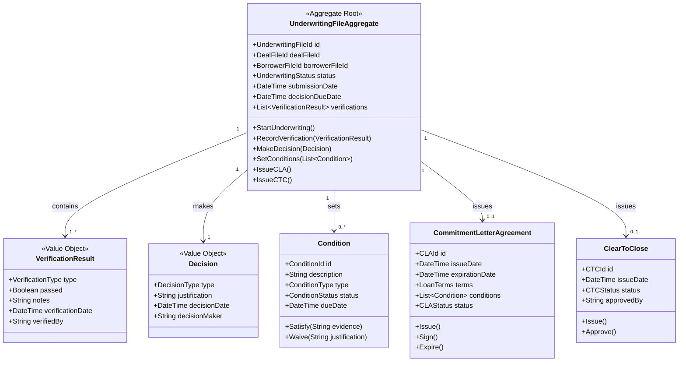
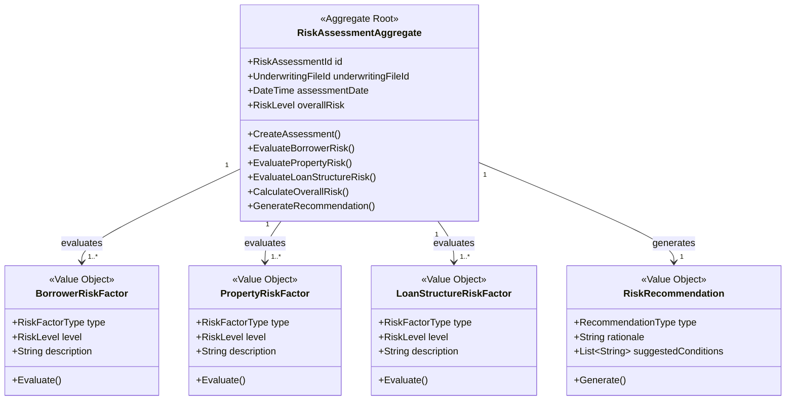
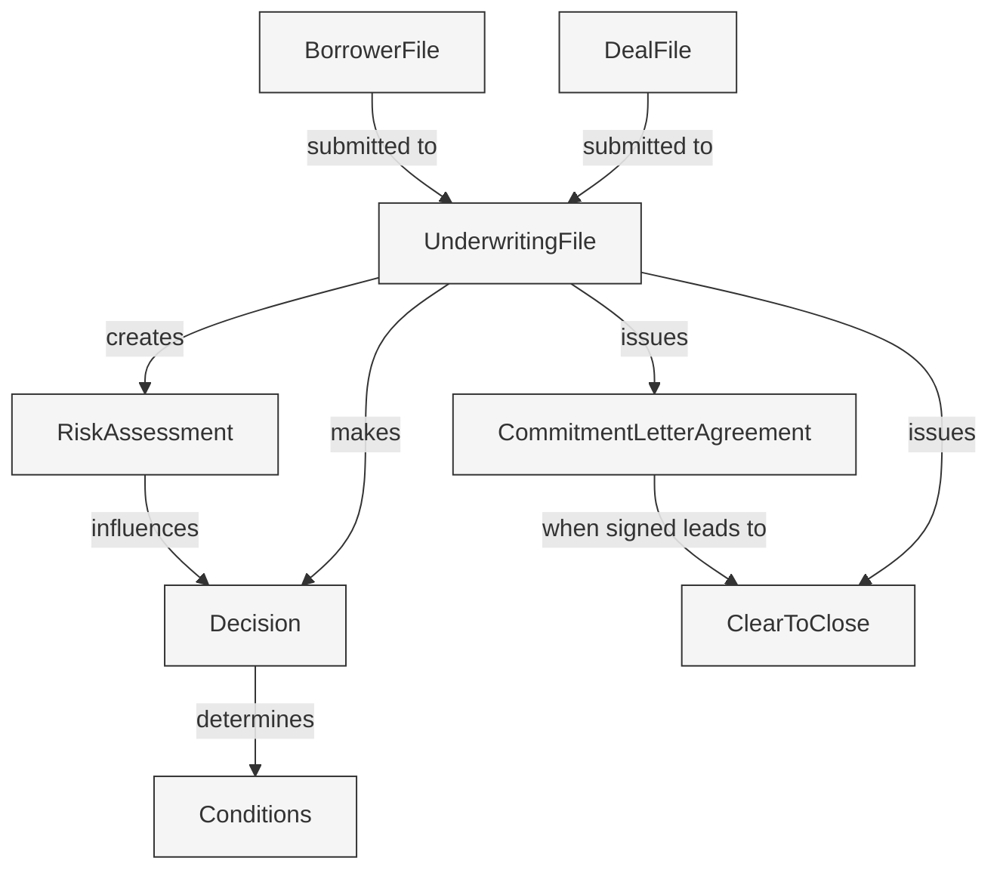
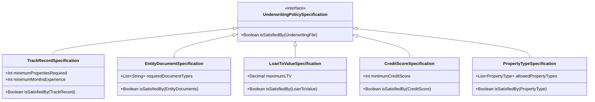

# KÉCŌ Capital - Underwriting Context

This document details the Domain-Driven Design (DDD) elements of the Underwriting Context, which handles loan evaluation, risk assessment, and approval decisions.

## Context Overview

The Underwriting Context is responsible for:
- Evaluating loan applications
- Assessing borrower risk and property value
- Making approval decisions
- Setting loan conditions
- Issuing commitment letter agreements (CLAs)
- Processing clear to close (CTC) authorizations

## Aggregate: UnderwritingFileAggregate

## Aggregate: RiskAssessmentAggregate

## Domain Events

```mermaid
classDiagram
    class DomainEvent {
        <<abstract>>
        +EventId id
        +DateTime timestamp
        +String aggregateId
    }
    
    class UnderwritingStartedEvent {
        +UnderwritingFileId underwritingFileId
        +DateTime startDate
    }
    
    class VerificationCompletedEvent {
        +UnderwritingFileId underwritingFileId
        +VerificationType type
        +Boolean passed
    }
    
    class RiskAssessmentCompletedEvent {
        +RiskAssessmentId riskAssessmentId
        +RiskLevel overallRisk
        +RecommendationType recommendation
    }
    
    class UnderwritingDecisionMadeEvent {
        +UnderwritingFileId underwritingFileId
        +DecisionType decision
        +DateTime decisionDate
    }
    
    class ConditionsSetEvent {
        +UnderwritingFileId underwritingFileId
        +List~ConditionId~ conditionIds
    }
    
    class ConditionSatisfiedEvent {
        +ConditionId conditionId
        +DateTime satisfactionDate
    }
    
    class CLAIssuedEvent {
        +CLAId claId
        +UnderwritingFileId underwritingFileId
        +DateTime issueDate
    }
    
    class CLASignedEvent {
        +CLAId claId
        +DateTime signDate
    }
    
    class CTCIssuedEvent {
        +CTCId ctcId
        +UnderwritingFileId underwritingFileId
        +DateTime issueDate
    }
    
    DomainEvent <|-- UnderwritingStartedEvent
    DomainEvent <|-- VerificationCompletedEvent
    DomainEvent <|-- RiskAssessmentCompletedEvent
    DomainEvent <|-- UnderwritingDecisionMadeEvent
    DomainEvent <|-- ConditionsSetEvent
    DomainEvent <|-- ConditionSatisfiedEvent
    DomainEvent <|-- CLAIssuedEvent
    DomainEvent <|-- CLASignedEvent
    DomainEvent <|-- CTCIssuedEvent
```

## Entity Relationships

## Policy Specifications

## Repositories

- **UnderwritingFileRepository** - Manages persistence of underwriting files
- **RiskAssessmentRepository** - Manages persistence of risk assessments
- **ConditionRepository** - Tracks loan conditions and their status
- **PolicyRepository** - Provides access to current underwriting policies

## Domain Services

- **UnderwritingService** - Orchestrates the overall underwriting process
- **PolicyEvaluationService** - Evaluates loan applications against policy specifications
- **RiskAssessmentService** - Performs risk analysis of borrower and property
- **ConditionManagementService** - Manages conditions and their satisfaction
- **DocumentVerificationService** - Verifies documents meet underwriting standards

## Integration with Other Contexts

- Receives completed files from Loan Origination Context
- Publishes approval decisions and CLAs to the Loan Origination Context
- Sends CTC authorizations to the Closing Context
- Interacts with Document Context for document verification
- Sends notifications about conditions to borrowers through Notification Context 