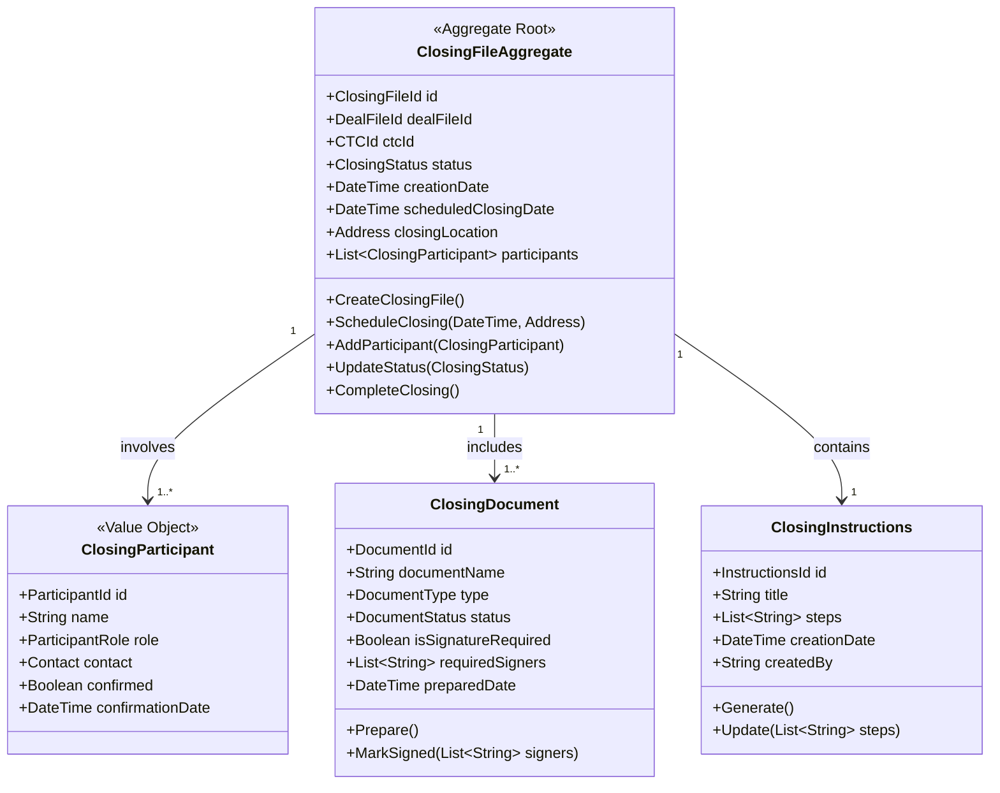
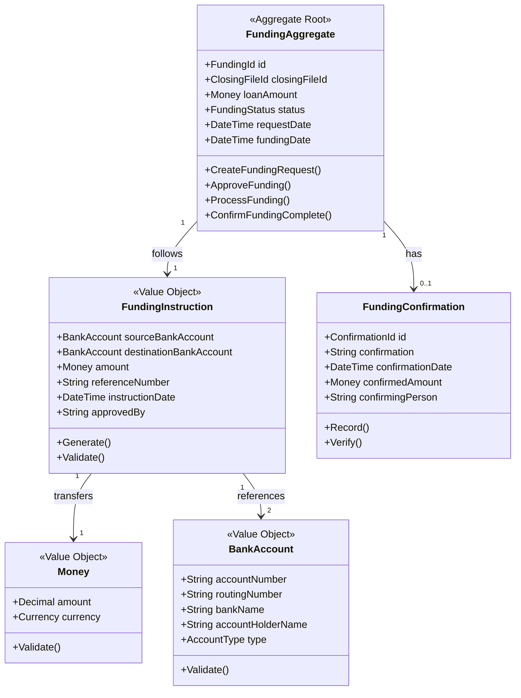
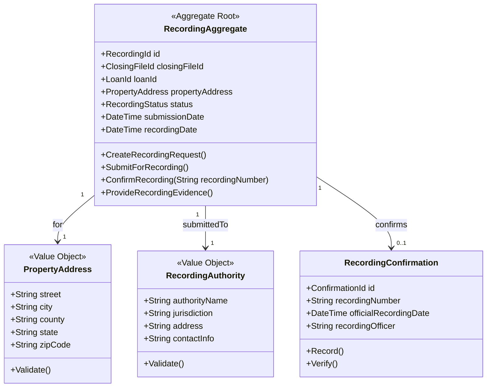
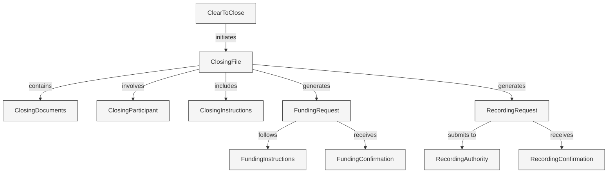
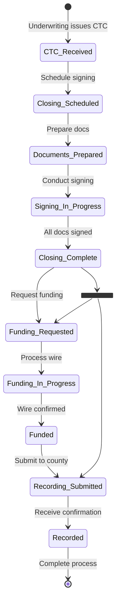

# KÉCŌ Capital - Closing Context

This document details the Domain-Driven Design (DDD) elements of the Closing Context, which handles the loan closing process, document signing, loan recording, and payment processing.

## Context Overview

The Closing Context is responsible for:
- Coordinating the loan closing process
- Managing document preparation for closing
- Scheduling and tracking document signing
- Processing loan recording with local authorities
- Handling fund disbursement
- Verifying payment receipts

## Aggregate: ClosingFileAggregate

## Aggregate: FundingAggregate

## Aggregate: RecordingAggregate

## Domain Events

```mermaid
classDiagram
    class DomainEvent {
        <<abstract>>
        +EventId id
        +DateTime timestamp
        +String aggregateId
    }
    
    class ClosingFileCreatedEvent {
        +ClosingFileId closingFileId
        +DealFileId dealFileId
        +DateTime creationDate
    }
    
    class ClosingScheduledEvent {
        +ClosingFileId closingFileId
        +DateTime scheduledDate
        +Address location
    }
    
    class ClosingDocumentPreparedEvent {
        +DocumentId documentId
        +ClosingFileId closingFileId
        +DocumentType type
        +DateTime preparedDate
    }
    
    class DocumentSignedEvent {
        +DocumentId documentId
        +List~String~ signers
        +DateTime signDate
    }
    
    class ClosingCompletedEvent {
        +ClosingFileId closingFileId
        +DateTime completionDate
    }
    
    class FundingRequestedEvent {
        +FundingId fundingId
        +ClosingFileId closingFileId
        +Money amount
        +DateTime requestDate
    }
    
    class FundingApprovedEvent {
        +FundingId fundingId
        +String approvedBy
        +DateTime approvalDate
    }
    
    class FundingCompletedEvent {
        +FundingId fundingId
        +Money amount
        +DateTime fundingDate
    }
    
    class RecordingRequestedEvent {
        +RecordingId recordingId
        +ClosingFileId closingFileId
        +DateTime requestDate
    }
    
    class RecordingConfirmedEvent {
        +RecordingId recordingId
        +String recordingNumber
        +DateTime recordingDate
    }
    
    DomainEvent <|-- ClosingFileCreatedEvent
    DomainEvent <|-- ClosingScheduledEvent
    DomainEvent <|-- ClosingDocumentPreparedEvent
    DomainEvent <|-- DocumentSignedEvent
    DomainEvent <|-- ClosingCompletedEvent
    DomainEvent <|-- FundingRequestedEvent
    DomainEvent <|-- FundingApprovedEvent
    DomainEvent <|-- FundingCompletedEvent
    DomainEvent <|-- RecordingRequestedEvent
    DomainEvent <|-- RecordingConfirmedEvent
```

## Entity Relationships

## Closing Workflow

## Repositories

- **ClosingFileRepository** - Manages persistence of closing files and related entities
- **FundingRepository** - Manages funding requests and confirmations
- **RecordingRepository** - Manages recording requests and confirmations

## Domain Services

- **ClosingService** - Orchestrates the overall closing process
- **DocumentPreparationService** - Prepares legal documents for closing
- **SigningService** - Coordinates document signing process
- **FundingService** - Manages the loan funding process
- **RecordingService** - Handles recording of mortgage documents with county offices

## Integration with Other Contexts

- Receives CTC from Underwriting Context to initiate closing
- Interacts with Document Context for document preparation and storage
- Notifies Loan Origination Context of closing status and completion
- Sends payment notifications to accounting systems
- Coordinates with Title Companies and Attorneys through external interfaces 