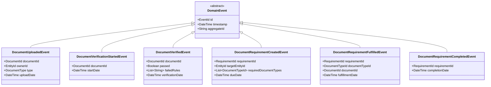

# KÉCŌ Capital - Document Context

This document details the Domain-Driven Design (DDD) elements of the Document Context, which manages document uploads, verifications, and storage across the lending platform.

## Context Overview

The Document Context is responsible for:
- Managing document uploads and storage
- Tracking document metadata and status
- Coordinating document verification processes
- Ensuring document compliance with requirements
- Providing document access to other contexts

## Aggregate: DocumentAggregate

## Aggregate: DocumentRequirementAggregate

## Domain Events

## Entity Relationships

## Service Layer: Document Verification Service

## Document Type Catalog

## Repositories

- **DocumentRepository** - Manages persistence of documents and their content
- **DocumentRequirementRepository** - Manages document requirements and fulfillment
- **VerificationRuleRepository** - Provides access to verification rules and criteria

## Domain Services

- **DocumentService** - Handles document upload, retrieval, and lifecycle management
- **DocumentVerificationService** - Coordinates document verification processes
- **DocumentRequirementService** - Manages document requirements and tracks fulfillment
- **DocumentSearchService** - Provides search capabilities across documents

## Integration with Other Contexts

- Receives document upload requests from Loan Origination Context
- Receives document verification requests from Underwriting Context
- Notifies other contexts of document verification results
- Provides document access and retrieval services to all contexts
- Coordinates with Timer Service for document requirement deadlines 