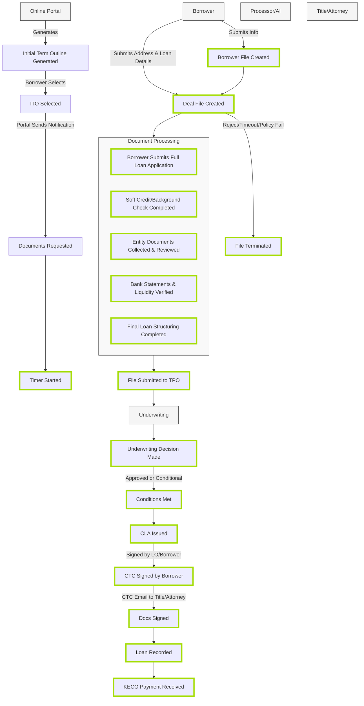

# KÉCŌ Capital Loan Processing Flow

This diagram represents the primary loan application and approval process flow extracted from the KECO_v6_04012025.json data model.

## Process Overview

The diagram shows the progression from initial loan application through document processing, underwriting, and final loan closing. It highlights the key steps and decision points in the KÉCŌ Capital private lending workflow.

## Diagram Legend

- **Green-bordered nodes**: Key process milestones
- **Rectangular boxes at top**: Primary actors in the process
- **Document Processing subgraph**: Contains the steps for verification and processing of borrower documents

## Key Terminology

- **ITO**: Initial Term Outline - The preliminary loan terms presented to the borrower
- **TPO**: Third Party Originator
- **CLA**: Commitment Letter Agreement
- **CTC**: Clear to Close

## Process Phases

1. **Application Intake**: Borrower information capture and deal file creation
2. **Document Collection**: Required documentation gathering and verification
3. **Underwriting**: Loan evaluation and decision making
4. **Closing**: Document signing, recording, and fund disbursement

This diagram simplifies the complete process flow from the original data model, which contains over 100 nodes and relationships, to focus on the main loan processing path. 