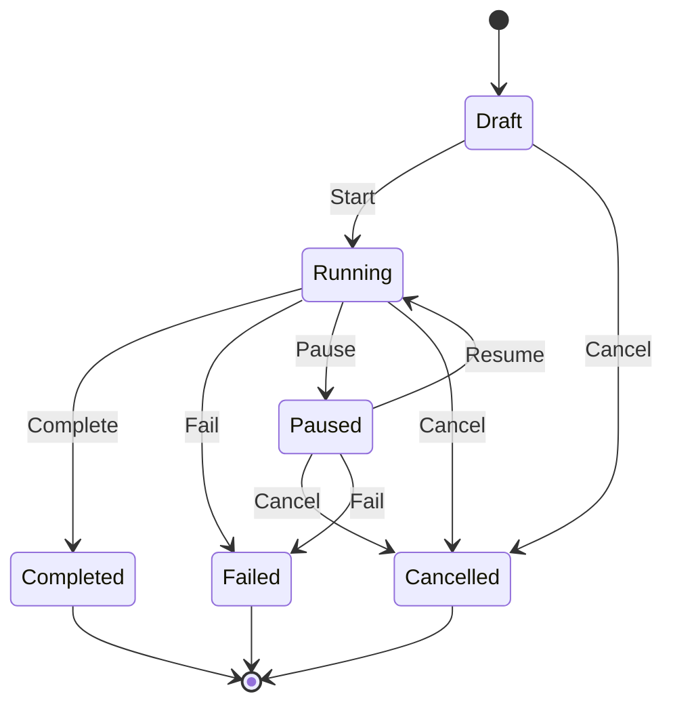
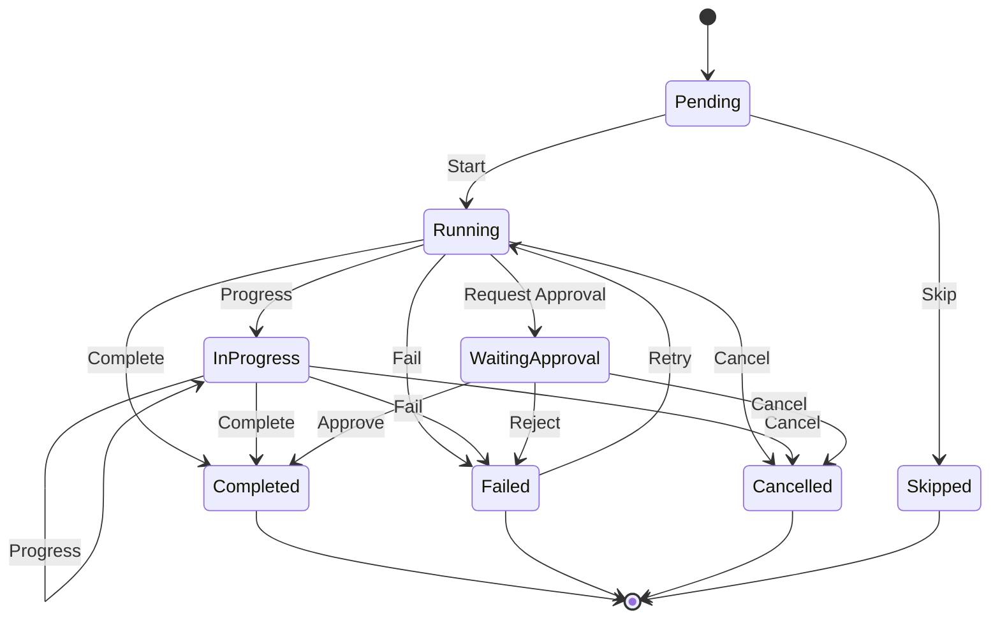

# Workflow State Machine Implementation

## Overview

The Workflow domain now implements proper state machines for both workflows and steps, ensuring all state transitions follow defined rules and generate appropriate events.

## Architecture

### 1. Workflow State Machine

The `WorkflowStateMachine` manages the lifecycle of workflows with the following states:



### 2. Step State Machine

The `StepStateMachine` manages individual step execution with these states:



## Key Components

### 1. Transitions

Each state machine defines explicit transitions:

```rust
pub enum WorkflowTransition {
    Start,
    Complete,
    Fail { reason: String },
    Pause { reason: String },
    Resume,
    Cancel { reason: String },
}

pub enum StepTransition {
    Start { executor: Option<String> },
    Progress { percentage: u8 },
    RequestApproval { approver: String },
    Approve { approved_by: String },
    Reject { rejected_by: String, reason: String },
    Complete { output: Option<serde_json::Value> },
    Fail { error: String },
    Skip { reason: String },
    Cancel { reason: String },
    Retry { attempt: u32 },
}
```

### 2. Guards

Guards ensure transitions only occur when business rules are satisfied:

- **Workflow Start Guard**: Requires workflow context to be non-empty
- **Step Start Guard**: Requires all dependencies to be completed
- **Retry Guard**: Enforces maximum retry limits

### 3. Effects

Effects execute after successful transitions:

- **Timestamp Recording**: Automatically tracks started_at, completed_at, etc.
- **Metric Calculation**: Updates duration and progress metrics
- **Event Generation**: Creates appropriate domain events

## Implementation Details

### Workflow Integration

The `Workflow` aggregate now contains:

```rust
pub struct Workflow {
    // ... existing fields ...
    
    /// State machine for managing workflow transitions
    #[serde(skip)]
    state_machine: Option<WorkflowStateMachine>,
    
    /// Step state machines
    #[serde(skip)]
    step_state_machines: HashMap<StepId, StepStateMachine>,
}
```

### State Machine Usage

Instead of manual status checks:

```rust
// OLD: Manual validation
if !self.status.can_transition_to(&WorkflowStatus::Running) {
    return Err(DomainError::generic("Invalid transition"));
}

// NEW: State machine handles validation
let (new_status, events) = state_machine.transition(
    WorkflowTransition::Start,
    &mut context
)?;
```

## Benefits

1. **Explicit State Management**: All valid transitions are clearly defined
2. **Business Rule Enforcement**: Guards ensure invariants are maintained
3. **Automatic Event Generation**: State changes produce appropriate events
4. **Better Testing**: State machines can be tested in isolation
5. **Visual Documentation**: Can generate state diagrams from code

## Usage Examples

### Starting a Workflow

```rust
let mut workflow = Workflow::new(...)?;
let mut context = WorkflowContext::new();
context.set_variable("user_id", json!("12345"));

// State machine validates and transitions
let events = workflow.start(context, Some("admin@example.com"))?;
```

### Executing a Step

```rust
let step_machine = StepStateMachine::new(step_id, StepType::Automated);
let mut context = StepContext {
    step_id,
    step_type: StepType::Automated,
    dependencies: vec![],
    completed_dependencies: vec![],
    metadata: HashMap::new(),
};

// Start the step
let (new_state, events) = step_machine.transition(
    StepTransition::Start { executor: None },
    &mut context
)?;
```

## Future Enhancements

1. **Parallel State Support**: Handle parallel workflow branches
2. **Hierarchical States**: Support sub-workflows with nested state machines
3. **State Persistence**: Save/restore state machine state
4. **Visual State Editor**: Generate workflows from visual state diagrams
5. **State Machine Composition**: Combine smaller state machines into complex workflows

## Testing

The state machines include comprehensive tests:

- Basic state transitions
- Guard validation
- Effect execution
- Invalid transition handling
- Retry logic with limits
- Approval workflows

See `src/state_machine/workflow_state_machine.rs` and `src/state_machine/step_state_machine.rs` for test examples. 