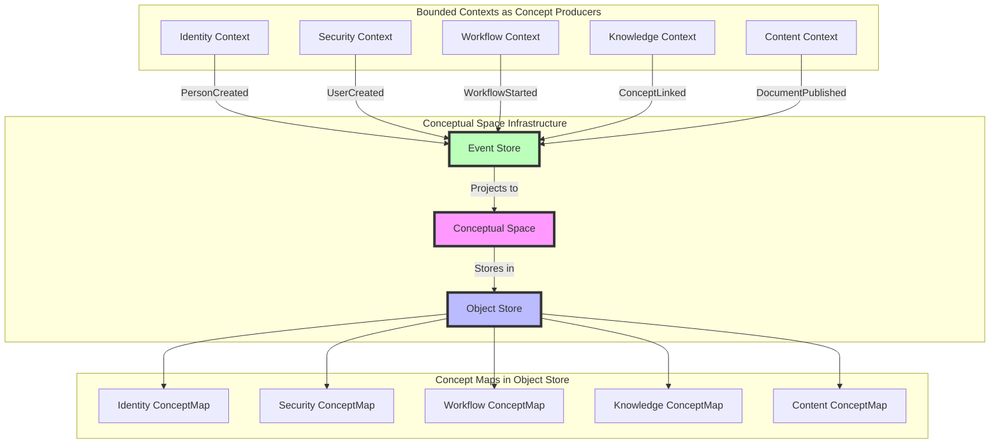

# Bounded Context and Conceptual Spaces Alignment

## Vision

Bounded contexts are not just organizational boundaries - they are regions in a unified Conceptual Space. Each context contributes concepts to a shared Object Store (as ConceptMaps). Events drive concept evolution, with only business-critical events persisted to the Event Store, creating a living, evolving knowledge graph of the entire system.

## Architecture Overview



## Core Concepts

### 1. Conceptual Spaces as Final Destination

Every bounded context ultimately produces concepts that exist in a high-dimensional conceptual space:

```rust
/// The unified conceptual space containing all domain concepts
pub struct UnifiedConceptualSpace {
    /// Quality dimensions shared across all contexts
    pub global_dimensions: Vec<QualityDimension>,

    /// Context-specific dimensions
    pub context_dimensions: HashMap<ContextId, Vec<QualityDimension>>,

    /// The actual space containing all concepts
    pub space: ConceptualSpace,

    /// Morphisms between concepts from different contexts
    pub cross_context_morphisms: Vec<ConceptualMorphism>,
}

/// A concept map stored in the Object Store
#[derive(Serialize, Deserialize)]
pub struct ConceptMap {
    pub id: ConceptMapId,
    pub context: ContextId,
    pub cid: Cid, // Content-addressed identifier

    /// The actual concept graph
    pub graph: ContextGraph<ConceptNode, ConceptEdge>,

    /// Position in conceptual space
    pub position: ConceptualPoint,

    /// Quality values for each dimension
    pub qualities: HashMap<DimensionId, f64>,

    /// Events that created/modified this concept (only persisted events)
    pub event_history: Vec<EventCid>,

    /// Count of transient events that affected this concept
    pub transient_event_count: u64,
}
```

### 2. Events Create Concepts

Events (whether persisted or transient) contribute to the creation or modification of concepts:

```rust
/// Events project into conceptual space
pub trait ConceptualProjection {
    /// Project this event into conceptual space
    fn project(&self) -> ConceptualChange;

    /// Determine which concepts this event affects
    fn affected_concepts(&self) -> Vec<ConceptId>;

    /// Calculate quality dimension changes
    fn quality_changes(&self) -> HashMap<DimensionId, f64>;
}

/// Example: PersonCreated event creates a concept
impl ConceptualProjection for PersonCreated {
    fn project(&self) -> ConceptualChange {
        ConceptualChange::CreateConcept {
            concept_type: ConceptType::Entity("Person"),
            initial_position: self.calculate_initial_position(),
            qualities: hashmap! {
                "identity_strength" => 1.0,
                "social_connectivity" => 0.0,
                "authority_level" => 0.1,
            },
        }
    }
}
```

### 3. Object Store as Concept Repository

The Object Store contains the materialized ConceptMaps:

```rust
/// Object Store interface for ConceptMaps
#[async_trait]
pub trait ConceptMapStore {
    /// Store a concept map and return its CID
    async fn store_concept(&self, concept: ConceptMap) -> Result<Cid>;

    /// Retrieve a concept map by CID
    async fn get_concept(&self, cid: &Cid) -> Result<ConceptMap>;

    /// Find concepts in a region of conceptual space
    async fn find_concepts_in_region(
        &self,
        center: ConceptualPoint,
        radius: f64,
    ) -> Result<Vec<ConceptMap>>;

    /// Find concepts by quality criteria
    async fn find_by_qualities(
        &self,
        criteria: QualityCriteria,
    ) -> Result<Vec<ConceptMap>>;
}
```

## Bounded Context Refactoring with Conceptual Spaces

### Phase 1: Foundation with Conceptual Awareness

#### cim-conceptual-core
```toml
[package]
name = "cim-conceptual-core"

[dependencies]
cim-component = { path = "../cim-component" }
cim-ipld = { path = "../cim-ipld" }
nalgebra = "0.33" # For high-dimensional geometry
```

```rust
// Core conceptual space types
pub struct QualityDimension {
    pub id: DimensionId,
    pub name: String,
    pub range: Range<f64>,
    pub metric: DistanceMetric,
    pub context: Option<ContextId>, // Global or context-specific
}

pub struct ConceptualPoint {
    pub coordinates: DVector<f64>, // n-dimensional point
    pub dimension_map: HashMap<DimensionId, usize>, // which coordinate is which dimension
}

pub trait ConceptualEntity {
    /// Get the concept's position in conceptual space
    fn conceptual_position(&self) -> ConceptualPoint;

    /// Get the concept's quality values
    fn qualities(&self) -> HashMap<DimensionId, f64>;

    /// Convert to a ConceptMap for storage
    fn to_concept_map(&self) -> ConceptMap;
}
```

### Phase 2: Context-Specific Concept Production

Each bounded context produces concepts with specific qualities:

#### Identity Context Concepts
```rust
// Identity context produces Person and Organization concepts
impl IdentityContext {
    pub fn create_person_concept(&self, person: &PersonAggregate) -> ConceptMap {
        ConceptMap {
            id: ConceptMapId::from(person.id),
            context: ContextId::Identity,
            graph: self.build_person_graph(person),
            position: ConceptualPoint::new(vec![
                person.trust_score(),      // Trust dimension
                person.activity_level(),   // Activity dimension
                person.connection_count(), // Connectivity dimension
            ]),
            qualities: hashmap! {
                "identity_type" => 1.0, // Person = 1.0, Org = 2.0
                "verification_level" => person.verification_level(),
                "reputation" => person.reputation_score(),
            },
            event_history: person.event_cids.clone(),
        }
    }
}
```

#### Security Context Concepts
```rust
// Security context produces User, Account, Policy concepts
impl SecurityContext {
    pub fn create_user_concept(&self, user: &UserAggregate) -> ConceptMap {
        ConceptMap {
            id: ConceptMapId::from(user.id),
            context: ContextId::Security,
            graph: self.build_user_graph(user),
            position: ConceptualPoint::new(vec![
                user.permission_level(),   // Authority dimension
                user.account_isolation(),  // Isolation dimension
                user.policy_count() as f64, // Complexity dimension
            ]),
            qualities: hashmap! {
                "security_clearance" => user.clearance_level(),
                "access_scope" => user.access_scope_score(),
                "authentication_strength" => user.auth_strength(),
            },
            event_history: user.event_cids.clone(),
        }
    }
}
```

### Phase 3: Cross-Context Morphisms

Concepts from different contexts are related through morphisms:

```rust
/// Morphisms between concepts across contexts
pub struct CrossContextMorphism {
    pub source: (ContextId, ConceptId),
    pub target: (ContextId, ConceptId),
    pub morphism_type: MorphismType,
    pub strength: f64,
}

pub enum MorphismType {
    /// Identity Person ↔ Security User
    IdentityMapping,
    /// Security Policy → Workflow Permissions
    PolicyApplication,
    /// Workflow State → Content Status
    StateMapping,
    /// Knowledge Concept ↔ All Contexts
    SemanticLink,
}

/// Discover morphisms between concepts
impl ConceptualSpace {
    pub fn discover_morphisms(
        &self,
        concept_a: &ConceptMap,
        concept_b: &ConceptMap,
    ) -> Vec<CrossContextMorphism> {
        let mut morphisms = vec![];

        // Identity to Security mapping
        if concept_a.context == ContextId::Identity
            && concept_b.context == ContextId::Security {
            if let Some(person_id) = concept_a.extract_person_id() {
                if let Some(user_person_id) = concept_b.extract_person_reference() {
                    if person_id == user_person_id {
                        morphisms.push(CrossContextMorphism {
                            source: (concept_a.context, concept_a.id),
                            target: (concept_b.context, concept_b.id),
                            morphism_type: MorphismType::IdentityMapping,
                            strength: 1.0,
                        });
                    }
                }
            }
        }

        // Semantic similarity morphisms
        let distance = self.calculate_distance(&concept_a.position, &concept_b.position);
        if distance < self.semantic_threshold {
            morphisms.push(CrossContextMorphism {
                source: (concept_a.context, concept_a.id),
                target: (concept_b.context, concept_b.id),
                morphism_type: MorphismType::SemanticLink,
                strength: 1.0 - (distance / self.semantic_threshold),
            });
        }

        morphisms
    }
}
```

### Event Persistence

Persistence is simply a trait that events can implement:

```rust
pub trait Persistable {
    fn persist(&self, store: &dyn EventStore) -> Result<Cid>;
}

// Only implement for events that need persistence
impl Persistable for OrderPlaced {
    fn persist(&self, store: &dyn EventStore) -> Result<Cid> {
        store.append(self)
    }
}

impl Persistable for PaymentProcessed {
    fn persist(&self, store: &dyn EventStore) -> Result<Cid> {
        store.append(self)
    }
}

// UI events don't implement Persistable
// struct ViewportChanged { ... } // No Persistable impl
```

### Phase 4: Event-Driven Concept Evolution

Events drive the evolution of the conceptual space:

```rust
/// Process events to update conceptual space
pub struct ConceptualProjector {
    event_store: Arc<dyn EventStore>,
    object_store: Arc<dyn ObjectStore>,
    conceptual_space: Arc<RwLock<ConceptualSpace>>,
}

impl ConceptualProjector {
    pub async fn project_event<E: ConceptualProjection>(&self, event: E) -> Result<()> {
        // 1. Persist if the event implements Persistable
        let event_cid = if let Some(persistable) = event.as_persistable() {
            Some(persistable.persist(&*self.event_store).await?)
        } else {
            None
        };

        // 2. Project to conceptual space (always happens)
        let changes = event.project();

        // 3. Load affected concepts from Object Store
        let affected_cids = self.get_affected_concept_cids(&event).await?;
        let mut concepts = self.load_concepts(affected_cids).await?;

        // 3. Apply changes
        for change in changes {
            match change {
                ConceptualChange::CreateConcept { .. } => {
                    let new_concept = self.create_concept_from_event(&event).await?;
                    let cid = self.object_store.put(new_concept).await?;
                    concepts.push((cid, new_concept));
                }
                ConceptualChange::RemoveConcept { concept_id } => {
                    // Remove the old concept from Object Store
                    if let Some((cid, _)) = concepts.iter()
                        .find(|(_, c)| c.id == concept_id) {
                        // Mark for removal from index
                        concepts.retain(|(_, c)| c.id != concept_id);
                    }
                }
                ConceptualChange::AddConcept { concept_id, position, qualities, .. } => {
                    // Add new concept to Object Store
                    let new_concept = ConceptMap {
                        id: concept_id,
                        position,
                        qualities,
                        // ... other fields
                    };
                    let cid = self.object_store.put(new_concept.clone()).await?;
                    concepts.push((cid, new_concept));
                }
            }
        }

        // 4. Update conceptual space index
        let mut space = self.conceptual_space.write().await;
        for (cid, concept) in concepts {
            space.update_concept(cid, concept);
        }

        // 5. Discover new morphisms
        space.discover_new_morphisms().await?;

        Ok(())
    }
}
```

## Implementation Strategy

### 1. Modify Foundation Modules

Add conceptual space awareness to core modules:

```rust
// In cim-core-domain
pub trait DomainConcept {
    /// Convert to a concept in conceptual space
    fn to_conceptual(&self) -> ConceptualRepresentation;

    /// Get quality dimensions this concept contributes to
    fn quality_dimensions(&self) -> Vec<QualityDimension>;
}

// In cim-infrastructure
pub struct ConceptualInfrastructure {
    pub event_store: Arc<dyn EventStore>,
    pub object_store: Arc<dyn ObjectStore>,
    pub projector: ConceptualProjector,
    pub space_index: ConceptualSpaceIndex,
}
```

### 2. Update Each Bounded Context

Each context must implement concept production:

```rust
// Example: Identity Context
impl ConceptProducer for IdentityContext {
    type Concept = IdentityConcept;

    fn produce_concepts(&self, event: DomainEvent) -> Vec<Self::Concept> {
        match event {
            DomainEvent::PersonCreated(e) => vec![
                IdentityConcept::Person(self.create_person_concept(e))
            ],
            DomainEvent::OrganizationCreated(e) => vec![
                IdentityConcept::Organization(self.create_org_concept(e))
            ],
            _ => vec![],
        }
    }

    fn concept_dimensions(&self) -> Vec<QualityDimension> {
        vec![
            QualityDimension::new("trust", 0.0..1.0),
            QualityDimension::new("activity", 0.0..100.0),
            QualityDimension::new("connectivity", 0.0..1000.0),
        ]
    }
}
```

### 3. Create Unified Conceptual Space

```rust
/// The unified space containing all concepts
pub struct UnifiedConceptualSpace {
    /// All concepts indexed by CID
    concepts: HashMap<Cid, ConceptMap>,

    /// Spatial index for efficient queries
    rtree: RTree<ConceptualPoint>,

    /// Morphisms between concepts
    morphisms: Graph<ConceptId, CrossContextMorphism>,

    /// Quality dimension registry
    dimensions: DimensionRegistry,
}

impl UnifiedConceptualSpace {
    /// Find concepts similar to a given concept
    pub fn find_similar(
        &self,
        concept: &ConceptMap,
        threshold: f64,
    ) -> Vec<(Cid, f64)> {
        self.rtree
            .nearest_neighbors(&concept.position, threshold)
            .map(|point| {
                let cid = self.point_to_cid(point);
                let distance = self.calculate_distance(&concept.position, point);
                (cid, distance)
            })
            .collect()
    }

    /// Navigate from one concept to another
    pub fn navigate(
        &self,
        from: ConceptId,
        to: ConceptId,
    ) -> Option<ConceptPath> {
        // Use morphisms and spatial distance to find path
        self.morphisms.shortest_path(from, to)
            .map(|path| ConceptPath::from_morphisms(path))
    }
}
```

## Benefits of This Approach

1. **Unified Knowledge Representation**: All domain concepts exist in a single conceptual space
2. **Cross-Context Understanding**: Morphisms reveal hidden relationships
3. **Event-Driven Evolution**: The space evolves naturally from domain events
4. **Content-Addressed Storage**: Concepts are immutable and verifiable
5. **Semantic Navigation**: Find related concepts across all contexts
6. **Applied Category Theory**: Morphisms preserve structure and meaning

## Success Criteria

1. **Every bounded context produces ConceptMaps**
2. **All events project into conceptual space**
3. **Cross-context morphisms are automatically discovered**
4. **The Object Store contains the complete conceptual model**
5. **The Event Store provides complete history**
6. **Navigation between concepts is intuitive and efficient**

## Next Steps

1. Implement `cim-conceptual-core` module
2. Add `ConceptProducer` trait to each context
3. Create `ConceptualProjector` for event processing
4. Build spatial indices for efficient queries
5. Implement morphism discovery algorithms
6. Create visualization for conceptual space navigation
