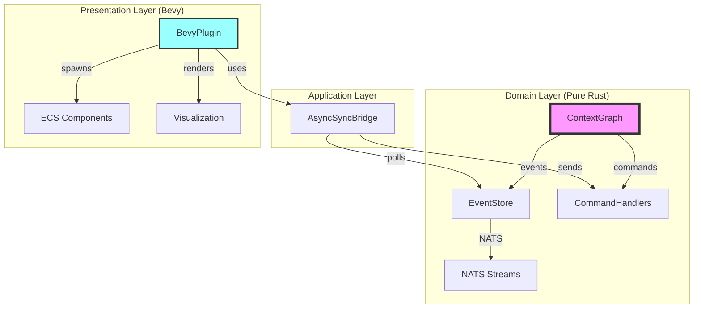
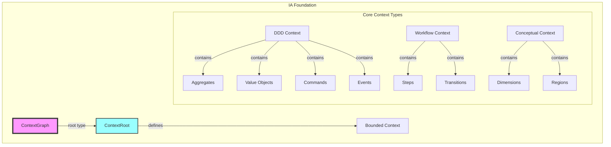

# IA Rebuild from ContextGraph Foundation

## Core Principle

Everything in IA is a ContextGraph with a ContextRoot entity that defines its semantic boundary and purpose. This creates a clean, recursive architecture where all domain concepts follow the same pattern.

## Modular Architecture - Critical Design Principle

**Domain logic is COMPLETELY INDEPENDENT of Bevy**. Bevy is ONLY a presentation layer that consumes domain events through plugins.



### Key Architectural Rules

1. **No Bevy imports in domain modules** - Domain knows nothing about ECS, Components, or Resources
2. **Events are the contract** - Domain emits events, Bevy plugins consume them
3. **Plugins are adapters** - They translate domain events to ECS operations
4. **Pure domain tests** - Domain logic tested without any Bevy dependencies

## Architecture Overview



## Phase 1: Core ContextGraph Infrastructure

### 1.1 Create Clean Domain Structure
```
src/
├── contexts/           # Each bounded context in its own module (NO BEVY)
│   ├── graph/         # Core graph context (foundation)
│   │   ├── domain/    # Pure domain logic
│   │   ├── application/ # Command/Query handlers
│   │   └── infrastructure/ # NATS integration
│   ├── ddd/           # DDD modeling context
│   ├── workflow/      # Workflow management context
│   └── conceptual/    # Conceptual space context
├── shared/            # Shared kernel (minimal!)
│   ├── types/         # Core types like GraphId, NodeId
│   └── events/        # Cross-context event types
├── infrastructure/    # Technical concerns (NATS, persistence)
└── presentation/      # BEVY ONLY - All ECS/rendering code
    ├── plugins/       # Bevy plugins for each context
    │   ├── graph_plugin.rs
    │   ├── workflow_plugin.rs
    │   └── conceptual_plugin.rs
    ├── components/    # ECS components
    ├── systems/       # Bevy systems
    └── bridge/        # AsyncSyncBridge
```

### 1.2 Core ContextGraph Implementation (Pure Domain)

```rust
// src/contexts/graph/domain/context_graph.rs
// NO BEVY IMPORTS!
use crate::shared::types::{GraphId, NodeId, EdgeId};
use serde::{Serialize, Deserialize};
use std::collections::HashMap;

pub struct ContextGraph {
    pub id: GraphId,
    pub context_root: NodeId,
    pub context_type: ContextType,
    pub ubiquitous_language: HashMap<String, String>,
    pub invariants: Vec<ContextInvariant>,
    pub nodes: HashMap<NodeId, Node>,
    pub edges: HashMap<EdgeId, Edge>,
}

pub enum ContextType {
    BoundedContext { name: String, domain: String },
    AggregateContext { name: String, root_type: String },
    ModuleContext { name: String, purpose: String },
    ServiceContext { name: String, capability: String },
}

// Domain events - serializable for NATS
#[derive(Debug, Clone, Serialize, Deserialize)]
pub enum ContextGraphEvent {
    ContextCreated {
        graph_id: GraphId,
        context_type: ContextType,
        root_id: NodeId,
    },
    NodeAdded {
        graph_id: GraphId,
        node_id: NodeId,
        node_data: NodeData,
    },
    // ... other events
}
```

### 1.3 Bevy Plugin (Presentation Only)

```rust
// src/presentation/plugins/graph_plugin.rs
use bevy::prelude::*;
use crate::contexts::graph::domain::ContextGraphEvent;
use crate::presentation::bridge::AsyncSyncBridge;

pub struct ContextGraphPlugin;

impl Plugin for ContextGraphPlugin {
    fn build(&self, app: &mut App) {
        app
            .add_systems(Update, (
                poll_graph_events,
                render_graph_nodes,
                handle_graph_interactions,
            ));
    }
}

fn poll_graph_events(
    bridge: Res<AsyncSyncBridge>,
    mut commands: Commands,
) {
    // Poll domain events and spawn ECS entities
    for event in bridge.receive_events::<ContextGraphEvent>() {
        match event {
            ContextGraphEvent::NodeAdded { node_id, .. } => {
                commands.spawn((
                    // ECS components for visualization
                    Transform::default(),
                    GlobalTransform::default(),
                    // ... rendering components
                ));
            }
            // ... handle other events
        }
    }
}
```

## Phase 2: Feature Extraction from Demos

### Features to Rebuild (Priority Order)

1. **Basic Graph Operations** (from demo_graph_create)
   - Create ContextGraph with root (pure domain)
   - Add/remove nodes (domain commands)
   - Connect with edges (domain logic)
   - Validate invariants (domain rules)
   - Bevy plugin renders the graph

2. **Event Persistence** (from demo_event_persistence)
   - Event sourcing for ContextGraph (domain + NATS)
   - CID chain integrity (infrastructure)
   - Event replay (domain logic)
   - No Bevy involvement in persistence

3. **DDD Modeling** (from demo_context_graph)
   - Create DDD contexts (pure domain)
   - Define ubiquitous language (domain)
   - Enforce invariants (domain)
   - Bevy plugin for visualization only

4. **Node Operations** (from demo_node_operations)
   - Node lifecycle in context (domain)
   - Relationship management (domain)
   - Context-aware operations (domain)
   - Bevy handles user interactions

5. **Workflow Design** (from workflow_designer_demo)
   - Workflow as ContextGraph (domain model)
   - Steps as nodes (domain)
   - Transitions as edges (domain)
   - Bevy provides drag-and-drop UI

6. **Conceptual Spaces** (from demo_conceptual_space_create)
   - Conceptual space as ContextGraph (domain)
   - Dimensions and regions (pure math)
   - Semantic relationships (domain logic)
   - Bevy visualizes the space

7. **Import/Export** (from import_graph, json_import_demo)
   - Serialize ContextGraph (domain)
   - Import from various formats (application layer)
   - Maintain context integrity (domain)
   - No Bevy involvement

8. **Visualization** (from conceptual_graph_visual_demo)
   - Bevy rendering of ContextGraph (presentation only)
   - Context-aware layouts (domain provides positions)
   - Interactive editing (Bevy handles input)

## Phase 3: Implementation Steps

### Step 1: Create New Domain Structure
```bash
# Clean slate approach
mkdir -p src/contexts/{graph,ddd,workflow,conceptual}/{domain,application,infrastructure}
mkdir -p src/shared/{types,events}
mkdir -p src/presentation/{plugins,components,systems,bridge}
```

### Step 2: Implement Core ContextGraph (NO BEVY)
- Start with graph context only
- Pure domain model, no dependencies
- Event sourced from the start
- Full test coverage without Bevy

### Step 3: Add Each Context Type
- DDD Context (for modeling bounded contexts)
- Workflow Context (for process design)
- Conceptual Context (for knowledge representation)
- All as pure domain modules

### Step 4: Create Bevy Plugins
- One plugin per context
- Plugins only translate events to ECS
- No domain logic in plugins
- Clean separation of concerns

### Step 5: Rebuild Demos
- One demo at a time
- Domain logic tested separately
- Bevy integration tested with headless mode
- Build only what demos need

## Benefits of This Approach

1. **Clean Architecture**: Domain completely independent of presentation
2. **No Mixed Concerns**: Clear separation between domain and UI
3. **Testability**: Domain logic tested without Bevy overhead
4. **Flexibility**: Can swap Bevy for another presentation layer
5. **Modularity**: Each context is a self-contained module

## Migration Strategy

1. **Keep old code running** during rebuild
2. **Build domain modules first** without any Bevy
3. **Test domain logic thoroughly** in isolation
4. **Add Bevy plugins last** as thin adapters
5. **Port demos incrementally** to new structure
6. **Delete old code** only after all demos work

## Success Criteria

- [ ] All domain modules compile without Bevy
- [ ] Domain tests pass without ECS dependencies
- [ ] Events flow correctly through NATS
- [ ] Bevy plugins are thin adapters only
- [ ] All demos work with new architecture
- [ ] Clear module boundaries maintained

## Next Steps

1. Create new directory structure
2. Implement core ContextGraph aggregate (no Bevy!)
3. Add event persistence with NATS
4. Create thin Bevy plugin for visualization
5. Port demo_graph_create to new architecture
6. Continue with other demos in priority order
