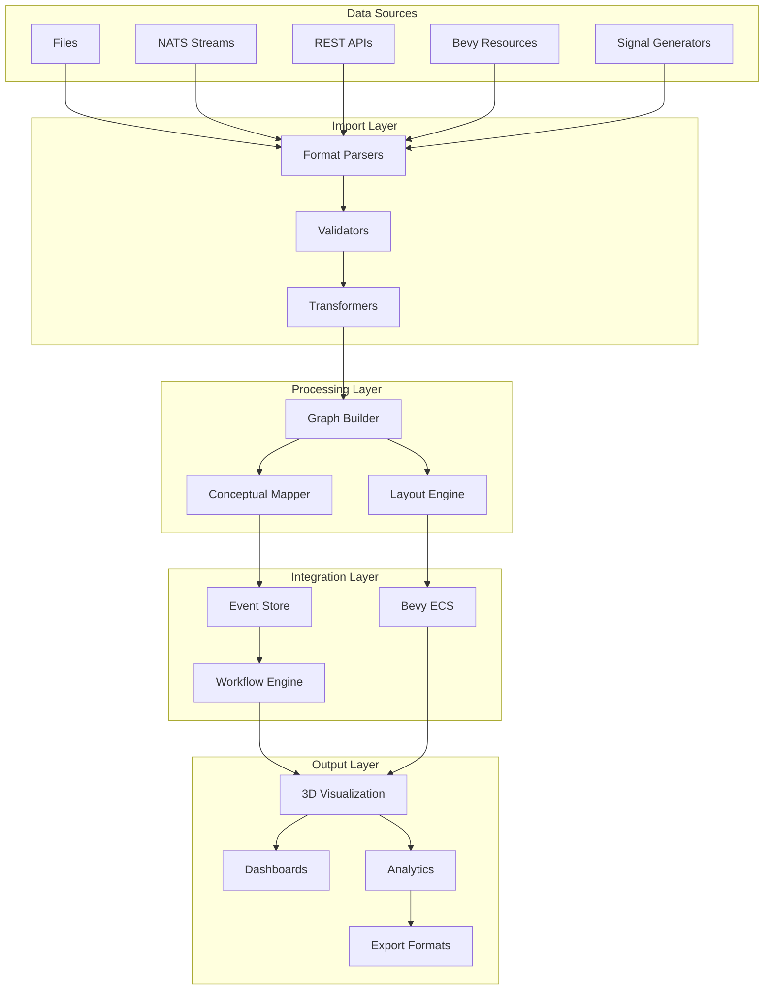

# The Universal Import System: Transforming Data into Knowledge

## Executive Summary

The Universal Import System in CIM represents a paradigm shift in how we interact with information. By treating all data as potential graphs, CIM becomes a universal lens through which any information can be:

- **Visualized** as interactive, navigable structures
- **Analyzed** using graph algorithms and conceptual spaces
- **Transformed** through morphisms and workflows
- **Integrated** into real-time event streams
- **Understood** through semantic relationships

This capability transforms CIM from a graph editor into a **Universal Information Processing Platform**.

## Key Capabilities

### 1. Universal Data Ingestion

**Any structured or semi-structured data becomes a graph:**

- **Text Formats**: JSON, XML, CSV, Markdown
- **Graph Formats**: DOT, GraphML, Cypher, Mermaid
- **Event Streams**: NATS messages, RSS/Atom feeds
- **Binary Assets**: Images, animations, 3D models
- **System Metrics**: CPU usage, network traffic, logs
- **Domain Models**: Workflows, knowledge bases, ontologies

### 2. Real-time Stream Processing

**Live data becomes live insights:**

```rust
// CPU metrics become visual dashboard
let cpu_stream = SystemMetrics::cpu_usage_stream();
let graph_stream = import_service.stream_to_graph(cpu_stream);
dashboard.display_live(graph_stream);

// NATS events become workflow triggers
nats_client.subscribe("sensors.>")
    .map(|msg| import_service.parse_sensor_data(msg))
    .filter(|graph| graph.has_anomaly())
    .for_each(|anomaly| workflow.trigger_alert(anomaly));
```

### 3. Semantic Understanding

**Automatic conceptual analysis of imported data:**

- Nodes are embedded in conceptual space
- Semantic relationships are discovered
- Patterns are identified across domains
- Knowledge graphs emerge from raw data

### 4. Workflow Integration

**Any import becomes a workflow step:**

```yaml
workflow: DataAnalysisPipeline
steps:
  - import:
      source: "https://api.example.com/metrics"
      format: json
      transform: normalize_values
  - analyze:
      algorithm: community_detection
  - visualize:
      layout: force_directed
  - export:
      format: report_pdf
```

## Architecture Overview



## Use Cases

### 1. Infrastructure Monitoring

Transform system metrics into interactive dashboards:

- Import Prometheus metrics as graphs
- Visualize service dependencies
- Detect anomalies through graph patterns
- Trigger automated responses

### 2. Knowledge Management

Build knowledge graphs from diverse sources:

- Import documentation as concept graphs
- Connect RSS feeds to existing knowledge
- Analyze research papers for relationships
- Create navigable information spaces

### 3. Visual Asset Analysis

Understand visual content as graphs:

- Import textures as color relationship graphs
- Analyze animation sequences as temporal graphs
- Extract patterns from 3D models
- Generate procedural content from analysis

### 4. Event Stream Visualization

See event flows as they happen:

- Import NATS event streams as temporal graphs
- Visualize microservice communications
- Debug distributed systems visually
- Monitor business processes in real-time

### 5. Data Science Workflows

Transform analysis pipelines into visual workflows:

- Import datasets as graphs
- Apply graph algorithms
- Visualize results interactively
- Export findings in multiple formats

## Technical Highlights

### Format Extensibility

Adding new formats is straightforward:

```rust
impl Parser for MyCustomParser {
    fn parse(&self, content: &str) -> Result<ImportedGraph> {
        // Parse custom format
        // Return graph representation
    }
}

// Register parser
import_service.register_parser(
    ImportFormat::Custom("myformat"),
    Box::new(MyCustomParser::new())
);
```

### Performance Optimization

- **Streaming Import**: Process large files incrementally
- **Parallel Parsing**: Utilize all CPU cores
- **Caching**: Reuse parsed results
- **Incremental Layout**: Update only changed portions

### Integration Points

- **NATS Subjects**: `import.request.*`, `import.stream.*`
- **Bevy Events**: `ImportRequested`, `GraphImported`
- **Workflow Steps**: `ImportStep`, `TransformStep`
- **REST API**: `/api/import`, `/api/export`

## Benefits

### For Developers

- **Unified API**: One import system for all data types
- **Extensible**: Easy to add new formats
- **Testable**: Clear separation of concerns
- **Performant**: Optimized for large datasets

### For Users

- **Visual Understanding**: See structure in any data
- **Interactive Exploration**: Navigate imported graphs
- **Real-time Updates**: Live data becomes live visuals
- **Workflow Automation**: Import as part of larger processes

### For Organizations

- **Data Integration**: Connect disparate systems
- **Knowledge Discovery**: Find hidden relationships
- **Process Optimization**: Visualize and improve workflows
- **Decision Support**: See patterns across domains

## Future Roadmap

### Phase 1: Enhanced Format Support
- Protocol Buffers
- Apache Arrow
- Parquet files
- MQTT streams

### Phase 2: Advanced Analysis
- Machine learning model import
- Neural network visualization
- Tensor graph representation
- Quantum circuit import

### Phase 3: Augmented Reality
- 3D scene graph import
- Spatial data visualization
- Gesture stream analysis
- AR/VR workflow design

### Phase 4: AI Integration
- Natural language to graph
- Automatic format detection
- Intelligent layout suggestions
- Semantic enrichment

## Getting Started

### Basic Import

```bash
# CLI import
./import_graph data.json

# With format specification
./import_graph workflow.mermaid mermaid

# From URL
./import_graph https://example.com/graph.dot dot
```

### Programmatic Import

```rust
use ia::domain::services::{GraphImportService, ImportFormat};

let service = GraphImportService::new();
let graph = service.import_from_file("data.json", ImportFormat::ArrowsApp)?;
```

### NATS Import

```bash
# Publish import request
nats pub import.request.json '{"source": "inline", "content": "{...}"}'

# Stream continuous imports
nats sub import.stream.metrics
```

## Conclusion

The Universal Import System embodies CIM's vision: **information is not static data to be stored, but living structures to be understood, transformed, and composed**. By making any data source a potential graph, we enable:

- **Universal Analysis**: One set of tools for all information
- **Visual Reasoning**: See patterns humans excel at recognizing
- **Semantic Integration**: Connect data through meaning
- **Real-time Intelligence**: Live data drives live insights

This transforms how we interact with information, making CIM not just a tool, but a new way of thinking about and working with the digital world.
