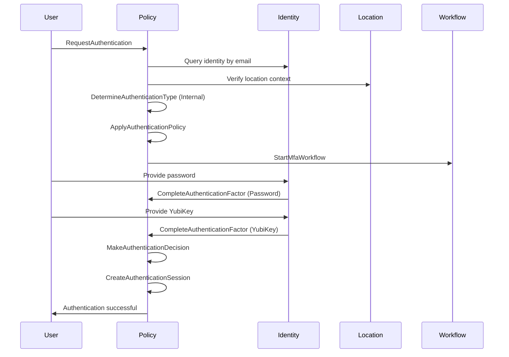

# Authentication Composition Example

This example demonstrates how the Policy, Identity, Location, and Workflow domains compose to provide authentication capabilities.

## Scenario: Employee Authentication

An employee attempts to authenticate from their corporate office.

### 1. Authentication Request Flow

```rust
// User initiates authentication
let auth_request = RequestAuthentication {
    request_id: Uuid::new_v4(),
    identity_ref: None, // Not yet identified
    location: LocationContext {
        ip_address: Some("192.168.1.100".parse().unwrap()),
        coordinates: Some(GeoCoordinates {
            latitude: 37.7749,
            longitude: -122.4194,
        }),
        country: Some("US".to_string()),
        network_type: Some("corporate".to_string()),
        device_id: Some("laptop-12345".to_string()),
    },
    available_factors: vec![
        AuthenticationFactor::Password,
        AuthenticationFactor::HardwareToken(TokenType::YubiKey),
        AuthenticationFactor::Biometric(BiometricType::Fingerprint),
    ],
    client_metadata: HashMap::new(),
};

// Policy Domain receives the request
// Event: AuthenticationRequested
```

### 2. Determine Authentication Type

```rust
// Policy Domain queries Identity Domain
let determine_type = DetermineAuthenticationType {
    request_id: auth_request.request_id,
    identity_ref: None,
    location: auth_request.location.clone(),
    email: Some("john.doe@company.com".to_string()),
};

// Policy evaluates internal criteria
let internal_criteria = InternalCriteria {
    internal_organizations: hashset![org_id],
    internal_networks: vec![
        IpNetwork {
            network: "192.168.0.0/16".parse().unwrap(),
            name: "Corporate Network".to_string(),
        }
    ],
    internal_domains: vec!["company.com".to_string()],
    trusted_device_required: true,
};

// Result: Internal authentication determined
// Event: AuthenticationTypeDetermined { authentication_type: Internal }
```

### 3. Apply Authentication Policy

```rust
// Find applicable policy for internal authentication
let policy = Policy::new(
    PolicyId::new(),
    PolicyType::Authentication,
    PolicyScope::Organization(org_id),
);

// Policy has authentication requirements
let auth_requirements = AuthenticationRequirementsComponent {
    min_factors: 2,
    required_factors: vec![AuthenticationFactor::Password],
    optional_factors: vec![
        AuthenticationFactor::HardwareToken(TokenType::YubiKey),
        AuthenticationFactor::Biometric(BiometricType::Fingerprint),
    ],
    location_requirements: Some(LocationRequirements {
        allowed_locations: vec![
            LocationConstraint::IpRange(IpNetwork {
                network: "192.168.0.0/16".parse().unwrap(),
                name: "Corporate Network".to_string(),
            }),
        ],
        denied_locations: vec![],
        require_location_verification: true,
        max_location_uncertainty: Some(100.0), // 100 meters
    }),
    time_requirements: Some(TimeRequirements {
        time_constraints: vec![
            TimeConstraint::TimeRange(TimeRange {
                start: "08:00:00".parse().unwrap(),
                end: "20:00:00".parse().unwrap(),
                timezone: "America/Los_Angeles".to_string(),
            }),
        ],
        max_session_duration: Duration::hours(8),
        idle_timeout: Duration::minutes(30),
        require_time_sync: true,
    }),
    risk_adjustments: RiskAdjustments {
        risk_thresholds: HashMap::new(),
        risk_factors: vec![],
        default_action: RiskAction::Allow,
    },
    min_trust_level: TrustLevel::High,
};

// Event: AuthenticationPolicyApplied
```

### 4. Start MFA Workflow

```rust
// Policy triggers workflow for multi-factor authentication
let mfa_workflow = StartMfaWorkflow {
    policy_id: policy.id(),
    request_id: auth_request.request_id,
    identity_ref: IdentityRef::Person(person_id),
    required_factors: vec![
        AuthenticationFactor::Password,
        AuthenticationFactor::HardwareToken(TokenType::YubiKey),
    ],
    timeout: Duration::minutes(5),
};

// Workflow Domain creates MFA process
// Event: MfaWorkflowStarted
```

### 5. Complete Authentication Factors

```rust
// Step 1: Password verification
// Identity Domain verifies password
let password_verification = CompleteAuthenticationFactor {
    policy_id: policy.id(),
    workflow_id: workflow_id,
    factor: AuthenticationFactor::Password,
    verification_proof: VerificationProof::PasswordHash {
        hash: "argon2_hash...".to_string(),
    },
};

// Event: AuthenticationFactorCompleted

// Step 2: Hardware token verification
let token_verification = CompleteAuthenticationFactor {
    policy_id: policy.id(),
    workflow_id: workflow_id,
    factor: AuthenticationFactor::HardwareToken(TokenType::YubiKey),
    verification_proof: VerificationProof::TokenSignature {
        signature: vec![/* signature bytes */],
    },
};

// Event: AuthenticationFactorCompleted
```

### 6. Make Authentication Decision

```rust
// Policy evaluates completed factors
let decision = MakeAuthenticationDecision {
    policy_id: policy.id(),
    request_id: auth_request.request_id,
    completed_factors: vec![
        CompletedFactor {
            factor: AuthenticationFactor::Password,
            completed_at: Utc::now(),
            verification_method: "argon2".to_string(),
            metadata: HashMap::new(),
        },
        CompletedFactor {
            factor: AuthenticationFactor::HardwareToken(TokenType::YubiKey),
            completed_at: Utc::now(),
            verification_method: "yubikey-otp".to_string(),
            metadata: HashMap::new(),
        },
    ],
    risk_assessment: RiskAssessment {
        risk_score: 0.1, // Low risk
        risk_level: RiskLevel::Low,
        risk_factors: vec![],
        recommended_actions: vec![RiskAction::Allow],
    },
};

// Decision: Allowed
// Event: AuthenticationDecisionMade { decision: Allowed }
```

### 7. Create Authentication Session

```rust
// Create session for authenticated user
let session = CreateAuthenticationSession {
    policy_id: policy.id(),
    identity_ref: IdentityRef::Person(person_id),
    factors_used: vec![
        AuthenticationFactor::Password,
        AuthenticationFactor::HardwareToken(TokenType::YubiKey),
    ],
    trust_level: TrustLevel::High,
    session_duration: Duration::hours(8),
    location: auth_request.location,
};

// Event: AuthenticationSessionCreated
```

## Cross-Domain Event Flow



## Key Points

1. **External Composition**: All domains communicate through events, no direct dependencies
2. **Policy as Orchestrator**: Policy domain coordinates the authentication flow
3. **Domain Responsibilities**:
   - **Policy**: Defines and enforces authentication rules
   - **Identity**: Verifies credentials and manages identities
   - **Location**: Provides and validates location context
   - **Workflow**: Manages multi-step authentication processes
4. **Event-Driven**: Each step produces events that other domains can react to
5. **Flexible**: Different policies can require different authentication flows
