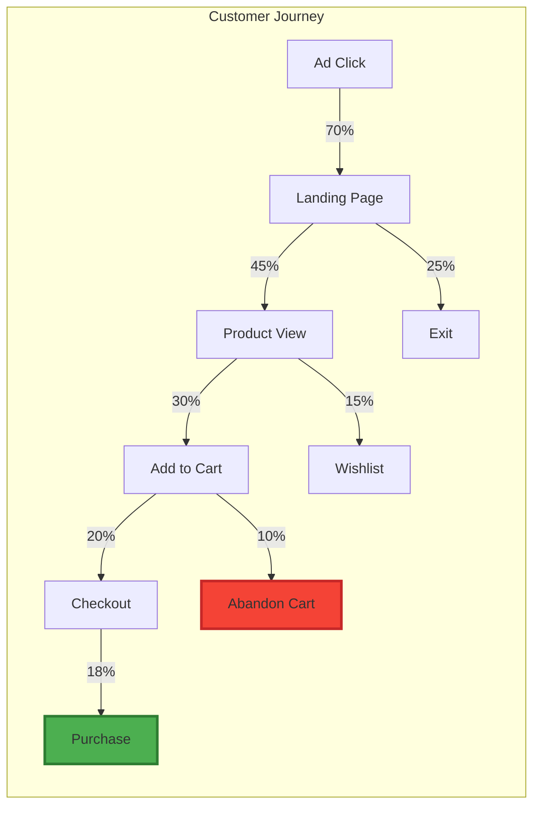
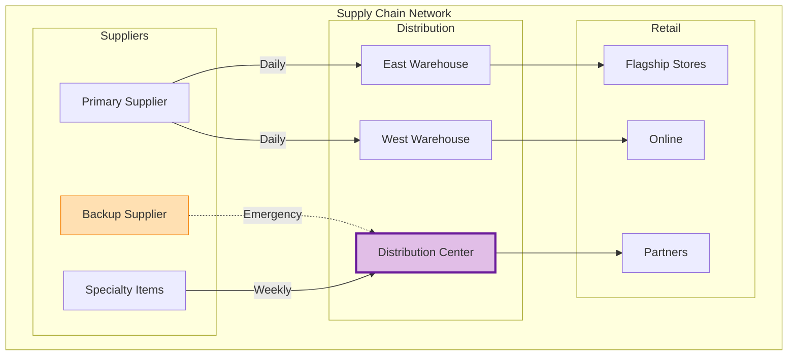
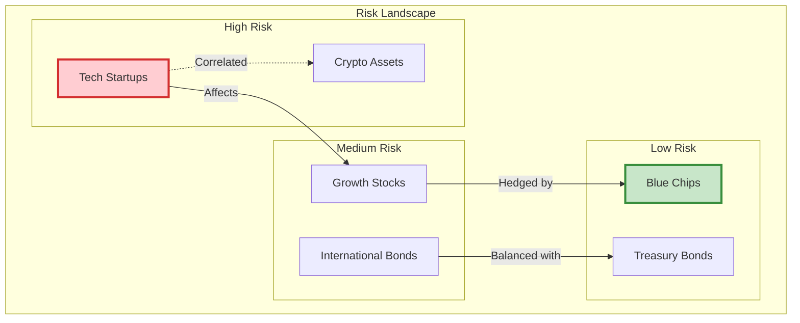
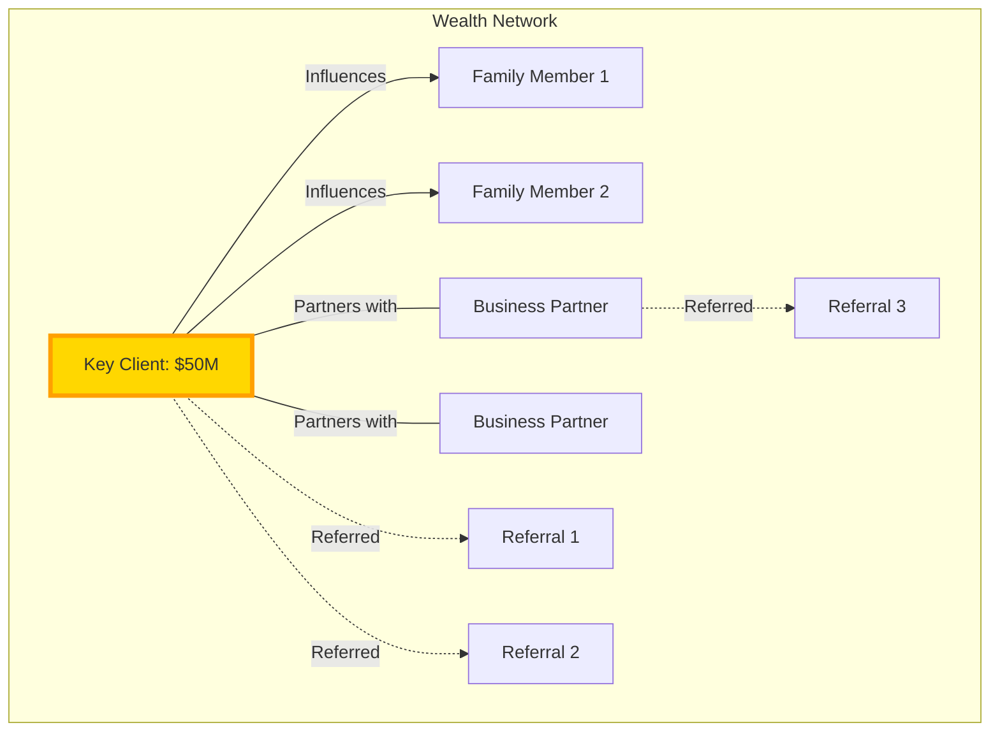
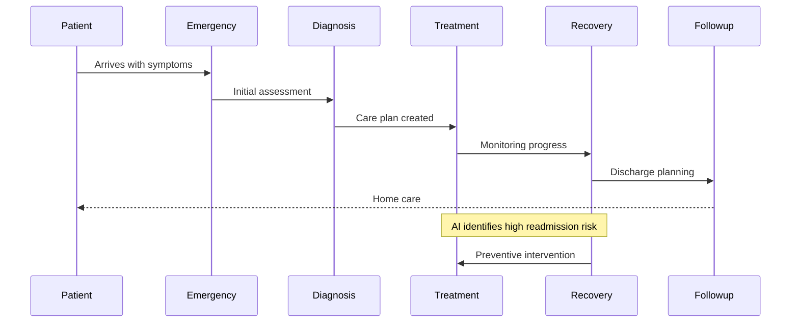
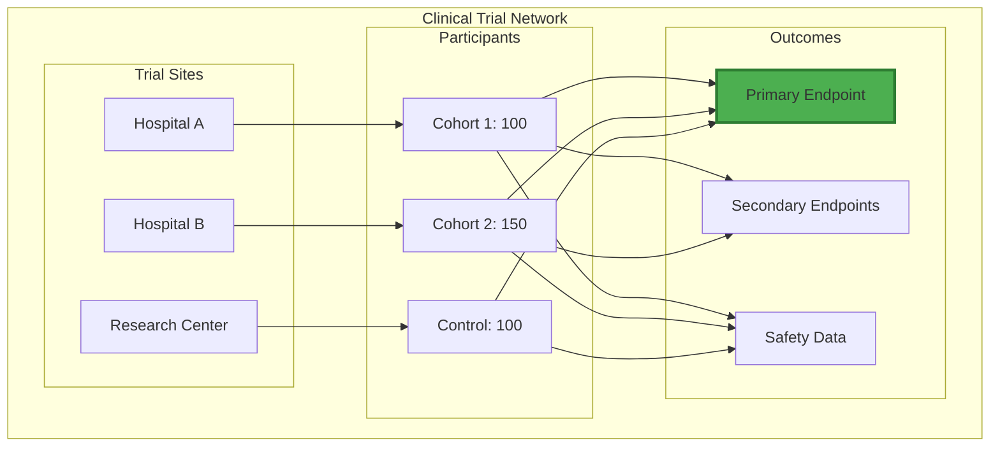
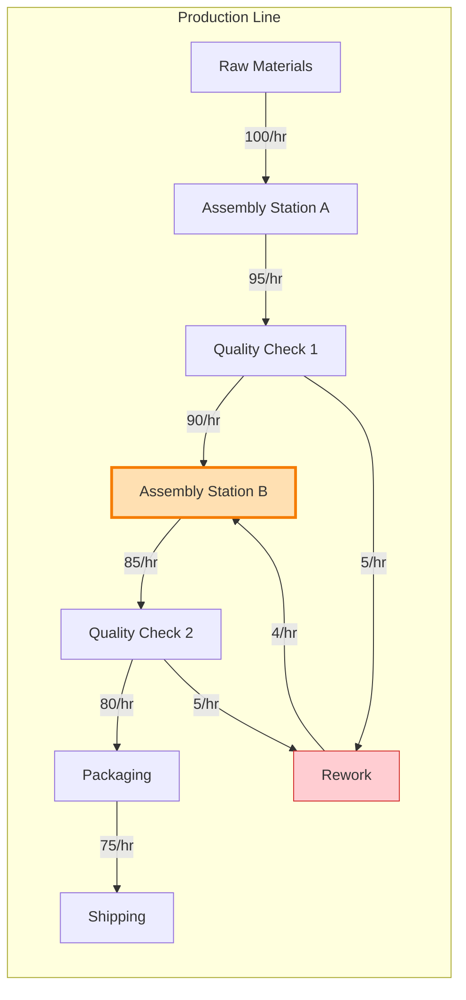
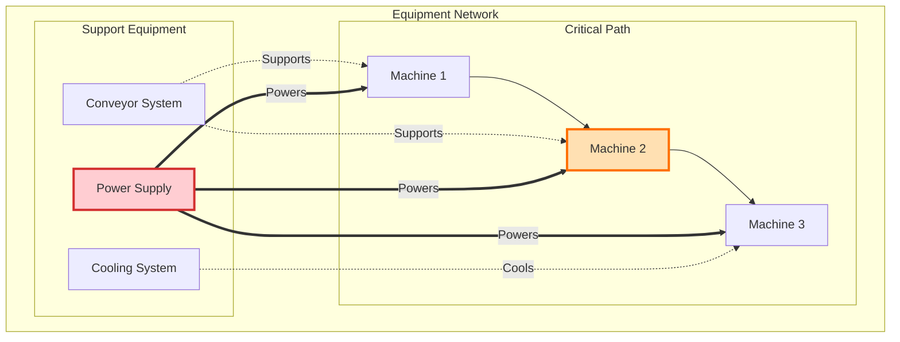
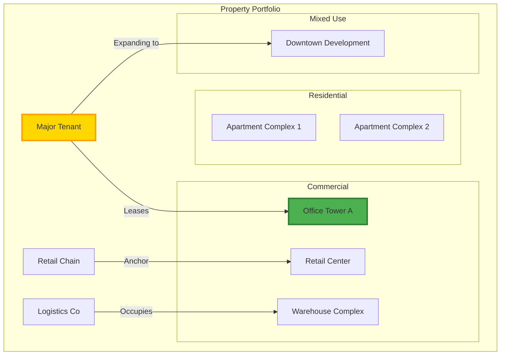

# Use Cases: Information Alchemist in Action

## Real-World Applications Across Industries

Information Alchemist transforms how businesses visualize and understand their operations. Here are practical examples of how different industries leverage this powerful platform.

## 1. Retail & E-Commerce

### Customer Journey Optimization

**Challenge**: Understanding how customers move through your sales funnel and where they drop off.

**Solution**: Information Alchemist creates a visual map of every customer touchpoint, revealing:

**Business Impact**:
- Identified that simplifying checkout increased conversion by 35%
- Discovered that wishlist users convert 3x higher when retargeted
- Reduced cart abandonment by 25% through visual insight

### Supply Chain Visibility

**Challenge**: Managing complex supplier relationships and inventory flows.

**Solution**: Create a living map of your entire supply chain:

**Business Impact**:
- Reduced stockouts by 40% through visual bottleneck identification
- Optimized inventory placement saving $2M annually
- Improved supplier relationships through transparent performance tracking

## 2. Financial Services

### Risk Network Analysis

**Challenge**: Understanding interconnected financial risks across portfolios.

**Solution**: Visualize risk relationships and contagion paths:

**Business Impact**:
- Prevented $10M loss by visualizing hidden risk correlations
- Improved portfolio balance reducing volatility by 30%
- Enhanced regulatory compliance through clear risk documentation

### Customer Relationship Mapping

**Challenge**: Identifying high-value relationship networks for wealth management.

**Solution**: Map customer connections and influence patterns:

**Business Impact**:
- Increased AUM by 25% through relationship-based prospecting
- Improved client retention by understanding connection patterns
- Identified $100M in new opportunities through network effects

## 3. Healthcare

### Patient Journey Mapping

**Challenge**: Optimizing patient care pathways and reducing readmissions.

**Solution**: Visualize complete patient journeys through the healthcare system:

**Business Impact**:
- Reduced readmission rates by 35%
- Improved patient satisfaction scores by 40%
- Saved $5M annually through optimized care pathways

### Clinical Trial Network

**Challenge**: Managing complex clinical trial relationships and data flows.

**Solution**: Create a comprehensive view of trial participants, sites, and outcomes:

**Business Impact**:
- Accelerated trial completion by 6 months
- Improved data quality through visual anomaly detection
- Enhanced regulatory submissions with clear data lineage

## 4. Manufacturing

### Production Flow Optimization

**Challenge**: Identifying bottlenecks in complex manufacturing processes.

**Solution**: Visualize entire production networks with real-time performance data:

**Business Impact**:
- Increased throughput by 20% by addressing visual bottlenecks
- Reduced defect rates by 30% through process visualization
- Saved $3M annually in operational improvements

### Predictive Maintenance Network

**Challenge**: Preventing equipment failures before they impact production.

**Solution**: Map equipment relationships and failure patterns:

**Business Impact**:
- Reduced unplanned downtime by 45%
- Extended equipment life by 25% through predictive maintenance
- Saved $4M in emergency repair costs

## 5. Real Estate

### Portfolio Visualization

**Challenge**: Managing diverse property portfolios and their relationships.

**Solution**: Create an interactive map of properties, tenants, and performance:

**Business Impact**:
- Improved occupancy rates by 15% through relationship insights
- Identified $20M in expansion opportunities
- Reduced tenant churn by 25% through predictive analytics

## Key Takeaways

### Common Benefits Across Industries:

1. **Visibility**: See complex relationships that spreadsheets hide
2. **Prediction**: AI agents identify patterns before they become problems
3. **Optimization**: Visual insights lead to immediate improvements
4. **Collaboration**: Teams align around shared visual understanding
5. **Agility**: Respond faster to market changes with real-time visualization

### ROI Metrics:

- Average time to insight: **Reduced by 75%**
- Decision-making speed: **Increased by 60%**
- Operational efficiency: **Improved by 30-40%**
- Revenue opportunities identified: **15-25% increase**

## Getting Started with Your Use Case

1. **Identify Your Challenge**: What relationships matter most to your business?
2. **Start Small**: Pick one process or department for your pilot
3. **Import Your Data**: Connect existing systems to Information Alchemist
4. **Visualize and Explore**: Let the platform reveal hidden patterns
5. **Act on Insights**: Transform visualization into business value

---

*Ready to see how Information Alchemist can transform your specific business challenges? Contact us for a personalized demonstration.*
