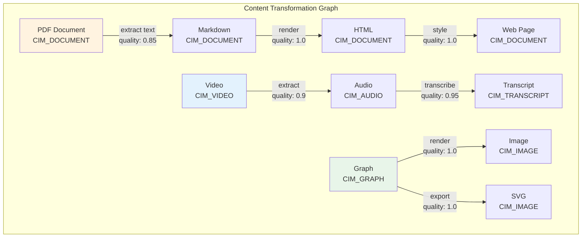

# Content Transformations

> Part of the [CID/IPLD Architecture](./cid-ipld-architecture.md)

## Overview

Content transformations are a core feature of CIM, enabling content to flow between different representations while maintaining provenance through CIDs. Each transformation creates a new CID, building a traceable graph of content evolution.

## Transformation Architecture

### Core Components

```rust
#[derive(Debug, Clone)]
pub struct TransformationRegistry {
    transformations: HashMap<(ContentType, ContentType), TransformationHandler>,
    transformation_graph: petgraph::Graph<ContentType, TransformationMetadata>,
}

#[derive(Debug, Clone)]
pub struct TransformationMetadata {
    pub quality_loss: Option<f32>,      // 0.0 = lossless, 1.0 = complete loss
    pub computational_cost: Cost,        // Time/resource requirements
    pub requires_external: Vec<String>,  // External tools needed
    pub preserves_semantics: bool,       // Whether meaning is preserved
}

#[derive(Debug, Clone)]
pub struct ContentTransformation {
    pub source_cid: Cid,
    pub source_type: ContentType,
    pub target_type: ContentType,
    pub transformation_type: TransformationType,
    pub parameters: TransformationParams,
    pub provenance: TransformationProvenance,
}
```

### Transformation Types

```rust
#[derive(Debug, Clone)]
pub enum TransformationType {
    // Document conversions
    PdfToMarkdown,
    DocxToMarkdown,
    MarkdownToHtml,
    HtmlToPdf,

    // Media transformations
    VideoToAudio,
    AudioTranscription,
    ImageResize(Dimensions),
    VideoThumbnail(Duration),

    // Code transformations
    SourceToAst,
    AstToSource,
    CodeFormatting(FormatterConfig),
    CodeTranspilation(Language, Language),

    // Visualization transformations
    GraphToImage,
    DataToChart,
    MarkdownToPresentation,

    // Infrastructure transformations
    NixToDocker,
    DockerToNix,
    ConfigMerge(Vec<Cid>),

    // AI-powered transformations
    TextSummarization,
    ImageCaptioning,
    CodeExplanation,
    ConceptExtraction,

    // Custom transformations
    Custom(String),
}
```

## Transformation Execution

### Path Finding

The transformation system uses Dijkstra's algorithm to find optimal conversion paths:

```rust
impl TransformationRegistry {
    pub async fn transform(
        &self,
        source_cid: Cid,
        target_type: ContentType,
        params: TransformationParams,
        stores: &mut Stores,
    ) -> Result<TransformationResult> {
        // Load source content
        let source = stores.object_store.get_typed_content(source_cid).await?;
        let source_type = source.content_type();

        // Find transformation path
        let path = self.find_transformation_path(source_type, target_type)?;

        // Execute transformation chain
        let mut current_cid = source_cid;
        let mut current_type = source_type;
        let mut transformation_chain = Vec::new();

        for (next_type, metadata) in path {
            // Get transformation handler
            let handler = self.transformations
                .get(&(current_type, next_type))
                .ok_or(TransformationError::NoHandler)?;

            // Execute transformation
            let result = handler.transform(
                current_cid,
                current_type,
                next_type,
                &params,
                stores
            ).await?;

            // Store transformed content
            let transformed_cid = create_typed_cid(&result.content)?;
            stores.object_store.put_typed_object(
                result.content.to_bytes()?,
                next_type
            ).await?;

            // Record transformation
            transformation_chain.push(TransformationRecord {
                from_cid: current_cid,
                to_cid: transformed_cid,
                from_type: current_type,
                to_type: next_type,
                metadata: metadata.clone(),
                timestamp: SystemTime::now(),
            });

            current_cid = transformed_cid;
            current_type = next_type;
        }

        // Create and store provenance
        let provenance = create_provenance(source_cid, current_cid, transformation_chain);

        Ok(TransformationResult {
            target_cid: current_cid,
            provenance,
            quality_metrics: assess_transformation_quality(&transformation_chain),
        })
    }
}
```

### Transformation Graph



## Transformation Handlers

### Document Transformations

```rust
pub struct PdfToMarkdownTransformer;

impl TransformationHandler for PdfToMarkdownTransformer {
    async fn transform(
        &self,
        source_cid: Cid,
        _source_type: ContentType,
        _target_type: ContentType,
        params: &TransformationParams,
        stores: &Stores,
    ) -> Result<TransformedContent> {
        let pdf_content = stores.object_store.get(source_cid).await?;

        // Extract text from PDF
        let text = extract_pdf_text(&pdf_content)?;

        // Convert to markdown with formatting
        let markdown = convert_to_markdown(text, params)?;

        // Preserve metadata
        let metadata = extract_pdf_metadata(&pdf_content)?;

        Ok(TransformedContent {
            content: TypedContent::Document(DocumentFormat::Markdown, markdown),
            metadata: Some(metadata),
            quality_score: 0.85, // Some formatting may be lost
        })
    }
}
```

### Media Transformations

```rust
pub struct VideoToAudioTransformer;

impl TransformationHandler for VideoToAudioTransformer {
    async fn transform(
        &self,
        source_cid: Cid,
        _source_type: ContentType,
        _target_type: ContentType,
        params: &TransformationParams,
        stores: &Stores,
    ) -> Result<TransformedContent> {
        let video_content = stores.object_store.get(source_cid).await?;

        // Extract audio track
        let audio = extract_audio_track(&video_content, params)?;

        // Determine audio format
        let format = params.get("audio_format")
            .and_then(|v| AudioFormat::from_str(v).ok())
            .unwrap_or(AudioFormat::Mp3);

        Ok(TransformedContent {
            content: TypedContent::Audio(format, audio),
            metadata: Some(json!({
                "source_video": source_cid.to_string(),
                "extraction_params": params,
            })),
            quality_score: 0.9, // Minor quality loss in extraction
        })
    }
}
```

## Node Visualization Transformations

### Visual Representations

```rust
#[derive(Debug, Clone)]
pub struct NodeVisualizationTransform {
    pub node_type: NodeType,
    pub visualization_type: VisualizationType,
    pub decal_cid: Option<Cid>,           // Custom decal/texture
    pub shader_params: ShaderParameters,   // Rendering parameters
    pub interaction_hints: InteractionHints,
}

#[derive(Debug, Clone)]
pub enum VisualizationType {
    // 3D representations
    Sphere { radius: f32, segments: u32 },
    Cube { size: f32 },
    CustomMesh { mesh_cid: Cid },
    Billboard { texture_cid: Cid },

    // 2D representations
    Icon { icon_cid: Cid, size: f32 },
    Text { font: String, size: f32 },
    Shape { shape_type: ShapeType },

    // Dynamic representations
    ParticleSystem { config: ParticleConfig },
    ProceduralMesh { generator: ProceduralType },
}
```

### Applying Visual Transformations

```rust
pub async fn apply_node_visualization(
    node: &GraphNode,
    viz_transform: &NodeVisualizationTransform,
    renderer: &mut Renderer,
) -> Result<VisualizedNode> {
    match &viz_transform.visualization_type {
        VisualizationType::Sphere { radius, segments } => {
            let mesh = create_sphere_mesh(*radius, *segments);

            if let Some(decal_cid) = &viz_transform.decal_cid {
                let decal = load_decal(decal_cid).await?;
                apply_decal_to_mesh(&mut mesh, &decal)?;
            }

            Ok(VisualizedNode {
                mesh,
                shader_params: viz_transform.shader_params.clone(),
                interaction_hints: viz_transform.interaction_hints.clone(),
            })
        }
        // ... other visualization types
    }
}
```

## Transformation Use Cases

### Automatic Format Conversion

```rust
pub async fn get_content_as_type(
    source_cid: Cid,
    desired_type: ContentType,
    stores: &Stores,
    transformer: &TransformationRegistry,
) -> Result<Cid> {
    // Check if already in desired format
    let source = stores.object_store.get_typed_content(source_cid).await?;
    if source.content_type() == desired_type {
        return Ok(source_cid);
    }

    // Check cache for existing transformation
    if let Some(cached_cid) = stores.transformation_cache
        .get(&(source_cid, desired_type))
        .await? {
        return Ok(cached_cid);
    }

    // Perform transformation
    let result = transformer.transform(
        source_cid,
        desired_type,
        TransformationParams::default(),
        stores
    ).await?;

    // Cache result
    stores.transformation_cache.put(
        (source_cid, desired_type),
        result.target_cid
    ).await?;

    Ok(result.target_cid)
}
```

### Content Adaptation

```rust
pub async fn adapt_content_for_context(
    content_cid: Cid,
    context: &UserContext,
    stores: &Stores,
) -> Result<AdaptedContent> {
    let content = stores.object_store.get_typed_content(content_cid).await?;

    match context {
        UserContext::MobileDevice { screen_size, .. } => {
            // Convert to mobile-friendly format
            match content.content_type() {
                ContentType::Document(DocumentFormat::Pdf) => {
                    // PDF → Markdown → Mobile HTML
                    let md_cid = transform_to_markdown(content_cid, stores).await?;
                    let mobile_html = transform_to_mobile_html(md_cid, screen_size, stores).await?;
                    Ok(AdaptedContent {
                        cid: mobile_html,
                        adaptations: vec!["mobile_optimized", "responsive_layout"],
                    })
                }
                // ... other adaptations
            }
        }
        // ... other contexts
    }
}
```

## Transformation Benefits

1. **Composability**: Chain transformations to create complex workflows
2. **Caching**: Reuse previously computed transformations
3. **Type Safety**: Transformations respect content type semantics
4. **Auditability**: Every transformation creates a new CID with full provenance
5. **Extensibility**: Easy to add new transformation types and handlers

## Related Documents

- [Content Types and Codecs](./cid-ipld-content-types.md) - Type definitions
- [MIME Type Intelligence](./cid-ipld-mime-filegroups.md) - Automatic type detection
- [Business Intelligence Network](./cid-ipld-business-intelligence.md) - How transformations enable insights

## Next Steps

1. Implement transformation handlers for your content types
2. Define quality metrics for your transformations
3. Set up transformation caching
4. Create custom visualization transforms for your nodes
