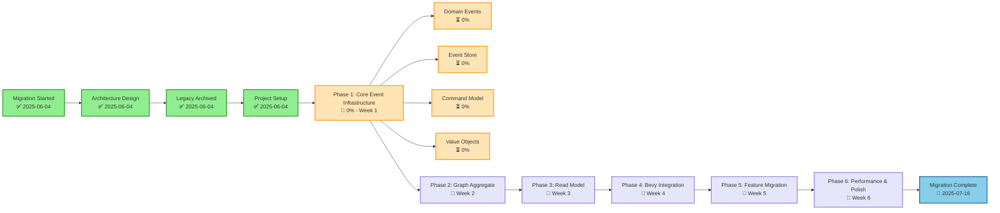

# Event Sourcing Implementation Progress Graph

## Visual Progress Timeline

## Progress Summary

### ✅ Completed (4/4 milestones)
- Migration decision made
- Architecture designed (Event Sourcing + CQRS)
- Legacy system fully archived
- New project structure set up

### 🚧 In Progress (Phase 1)
- **Domain Events**: 0% - Event type definitions
- **Event Store**: 0% - In-memory implementation
- **Command Model**: 0% - Command handlers
- **Value Objects**: 0% - Core domain types

### 📅 Planned (5 phases)
- Phase 2: Petgraph integration
- Phase 3: CQRS read models
- Phase 4: Bevy visualization
- Phase 5: Feature restoration
- Phase 6: Performance optimization

## Key Metrics

| Metric | Current | Target |
|--------|---------|--------|
| Overall Progress | ~5% | 100% |
| Implementation | 0% | 100% |
| Test Coverage | 0% | 90%+ |
| Performance | N/A | 100K+ nodes |
| Timeline | Week 0 | Week 6 |

## Node Types in Graph

- **Milestone**: Major completion points (circles)
- **Phase**: Implementation phases (rectangles)
- **Task**: Specific work items (sub-rectangles)

## Edge Types

- **sequence**: Linear progression
- **hierarchy**: Parent-child relationship
- **dependency**: Required before proceeding

---

**Graph Format**: Compatible with Information Alchemist JSON format
**Last Updated**: June 2025
