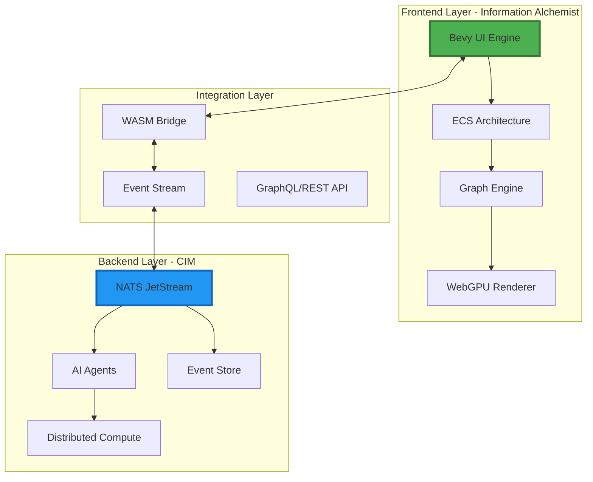
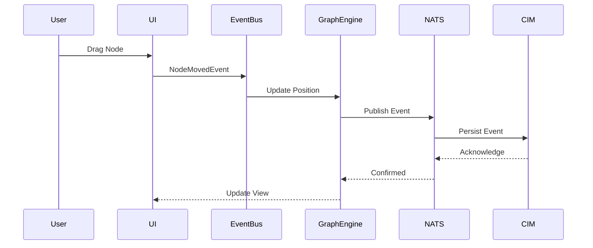
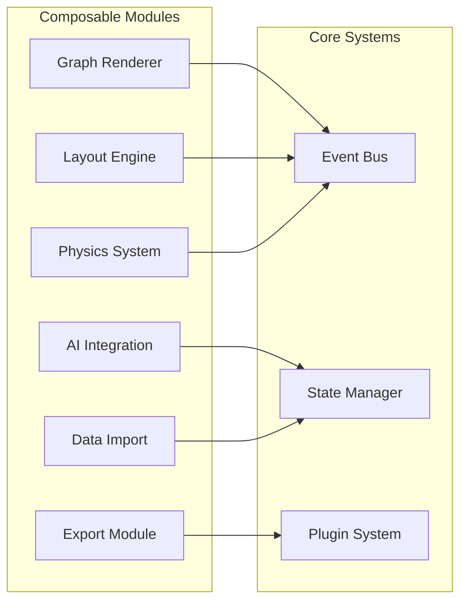
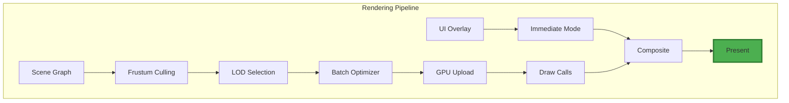
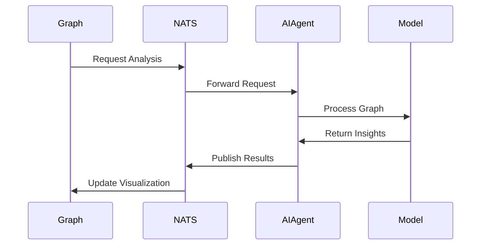
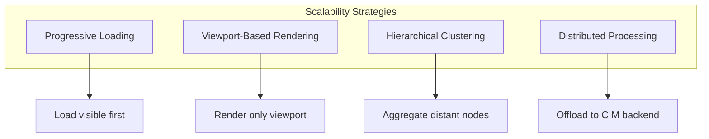

# Information Alchemist Technical Architecture

## System Architecture for CIM Frontend Implementation

Information Alchemist serves as the visual frontend for the Composable Information Machine (CIM), providing a sophisticated graph visualization and manipulation interface built on modern, composable principles.

## Architectural Overview



## Core Technologies

### Frontend Stack
- **Bevy 0.16.0**: Game engine providing ECS architecture and rendering
- **WebGPU/Vulkan**: Modern graphics API for high-performance rendering
- **bevy_egui 0.34+**: Immediate mode GUI for overlays and controls
- **egui-snarl 0.7.1+**: Node graph editor for workflow visualization
- **petgraph 0.8+**: Core graph algorithms and data structures
- **daggy 0.9+**: Directed acyclic graph operations

### Integration Technologies
- **WASM**: WebAssembly for plugin architecture and sandboxed execution
- **NATS JetStream**: Event streaming and state synchronization
- **Event Sourcing**: Append-only event log for all state changes
- **CQRS**: Command Query Responsibility Segregation pattern

### Development Environment
- **Rust**: Primary implementation language
- **Nix**: Deterministic build system and deployment
- **NixOS**: Target development and deployment platform

## Architectural Principles

### 1. Entity-Component-System (ECS)

Information Alchemist leverages Bevy's ECS architecture for maximum performance and flexibility:

```rust
// Example: Graph node as ECS entity
#[derive(Component)]
struct GraphNode {
    id: NodeId,
    position: Vec3,
    properties: HashMap<String, Value>,
}

#[derive(Component)]
struct GraphEdge {
    source: NodeId,
    target: NodeId,
    relationship: EdgeRelationship,
}

#[derive(Component)]
struct Subgraph {
    id: SubgraphId,
    boundary: ConvexHull,
    nodes: HashSet<NodeId>,
}
```

### 2. Event-Driven Architecture

All state changes flow through domain events:



### 3. Composable Components

Following CIM's "Lego block" philosophy:



## System Components

### 1. Graph Engine

The core graph management system:

```rust
pub struct GraphEngine {
    // Core graph data structure
    graph: StableGraph<NodeData, EdgeData>,

    // Spatial indexing for performance
    spatial_index: RTree<NodeId>,

    // Subgraph management
    subgraphs: HashMap<SubgraphId, SubgraphData>,

    // Layout algorithms
    layout_engine: Box<dyn LayoutAlgorithm>,
}
```

**Responsibilities:**
- Graph data structure management
- Spatial indexing for efficient queries
- Subgraph composition and boundaries
- Layout algorithm orchestration

### 2. Rendering Pipeline

High-performance 3D/2D visualization:



**Performance Features:**
- Level of Detail (LOD) system
- Instanced rendering for repeated elements
- Frustum culling for off-screen objects
- GPU-accelerated physics simulation

### 3. Event System

Domain-driven event architecture:

```rust
#[derive(Event, Serialize, Deserialize)]
pub enum GraphEvent {
    // Graph structure events
    NodeAdded { id: NodeId, data: NodeData },
    NodeRemoved { id: NodeId },
    EdgeCreated { id: EdgeId, source: NodeId, target: NodeId },

    // Subgraph events
    SubgraphImported { id: SubgraphId, source: GraphSource },
    InterSubgraphEdgeCreated { edge: EdgeId, from: SubgraphId, to: SubgraphId },

    // Layout events
    LayoutStarted { algorithm: LayoutType },
    LayoutCompleted { duration: Duration },
}
```

### 4. Plugin Architecture

Extensible through WASM plugins:

```rust
pub trait GraphPlugin: Send + Sync {
    fn name(&self) -> &str;
    fn version(&self) -> Version;

    fn on_load(&mut self, context: &mut PluginContext);
    fn on_event(&mut self, event: &GraphEvent) -> Option<Command>;
    fn on_unload(&mut self);
}
```

## Data Flow Architecture

### 1. Command Flow

User actions to state changes:


### 2. Query Flow

Efficient data retrieval:


## Integration with CIM Backend

### 1. Event Stream Integration

```rust
// NATS JetStream integration
pub struct CIMConnector {
    connection: async_nats::Connection,
    event_stream: JetStream,
    subscription: Subscription,
}

impl CIMConnector {
    pub async fn publish_event(&self, event: GraphEvent) -> Result<()> {
        let payload = serde_json::to_vec(&event)?;
        self.event_stream
            .publish("graph.events", payload)
            .await?;
        Ok(())
    }
}
```

### 2. AI Agent Communication



### 3. State Synchronization

Maintaining consistency across distributed systems:

```rust
// Event sourcing for state reconstruction
pub struct EventStore {
    events: Vec<VersionedEvent>,
    snapshots: HashMap<Version, GraphSnapshot>,
}

impl EventStore {
    pub fn replay_from(&self, version: Version) -> Graph {
        let snapshot = self.get_nearest_snapshot(version);
        let events = self.events_since(snapshot.version);

        events.iter().fold(snapshot.graph, |graph, event| {
            graph.apply_event(event)
        })
    }
}
```

## Performance Optimization

### 1. Rendering Optimizations

- **Spatial Indexing**: R-tree for efficient culling
- **Level of Detail**: Reduced complexity for distant objects
- **Instancing**: GPU instancing for repeated elements
- **Batch Rendering**: Minimize draw calls

### 2. Data Structure Optimizations

- **Memory Pool**: Pre-allocated object pools
- **Cache-Friendly Layouts**: Data-oriented design
- **Lazy Evaluation**: Compute on demand
- **Incremental Updates**: Partial graph updates

### 3. Scalability Patterns



## Security Architecture

### 1. WASM Sandboxing

- Plugins run in isolated WASM runtime
- Capability-based security model
- Resource limits enforced

### 2. Event Validation

- Schema validation for all events
- Authentication via JWT tokens
- Authorization through RBAC

### 3. Data Protection

- End-to-end encryption for sensitive data
- Audit logging for compliance
- GDPR-compliant data handling

## Deployment Architecture

### 1. Nix-Based Deployment

```nix
{
  inputs = {
    nixpkgs.url = "github:NixOS/nixpkgs/nixos-unstable";
    rust-overlay.url = "github:oxalica/rust-overlay";
  };

  outputs = { self, nixpkgs, rust-overlay }: {
    packages.x86_64-linux.information-alchemist =
      nixpkgs.legacyPackages.x86_64-linux.rustPlatform.buildRustPackage {
        pname = "information-alchemist";
        version = "0.1.0";
        src = ./.;
        # Deterministic builds
      };
  };
}
```

### 2. Container Strategy

- Minimal container images
- Multi-stage builds
- Deterministic reproduction

## Next Steps

This architecture provides the foundation for building a scalable, performant, and maintainable graph visualization system. The next sections will dive deeper into specific implementation details:

1. [Core Components](02-core-components.md) - Detailed component design
2. [Event System](03-event-system.md) - Event-driven architecture patterns
3. [Integration Guide](04-integration-guide.md) - CIM backend integration
4. [Performance Guide](05-performance-guide.md) - Optimization strategies
5. [Plugin Development](06-plugin-development.md) - Extending the system

---

*Information Alchemist: Engineering Visual Intelligence at Scale*
