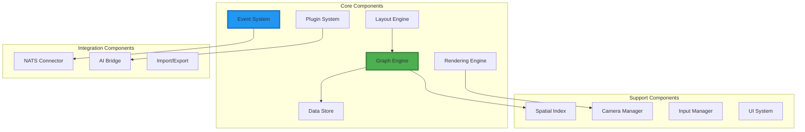
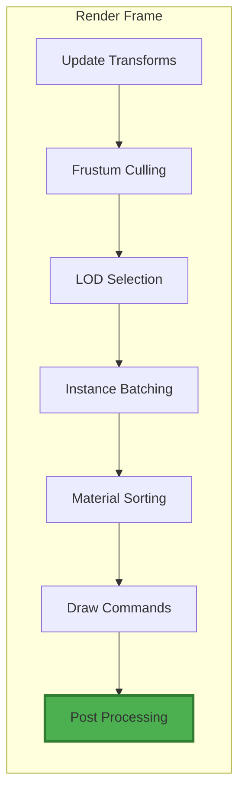
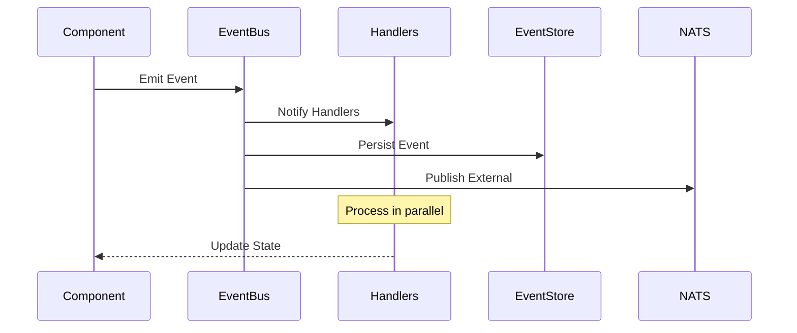
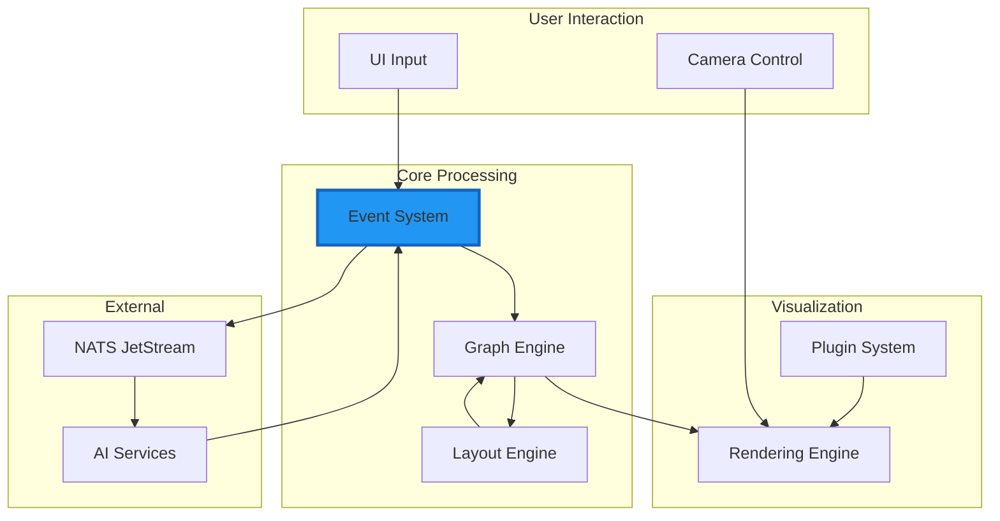

# Core Components Design

## Detailed Component Architecture for Information Alchemist

This document provides an in-depth look at the core components that make up Information Alchemist, their responsibilities, interactions, and implementation details.

## Component Overview



## 1. Graph Engine

The Graph Engine is the heart of Information Alchemist, managing all graph data structures and operations.

### Architecture

```rust
pub struct GraphEngine {
    // Core graph storage
    graph: Arc<RwLock<StableGraph<NodeData, EdgeData>>>,

    // Subgraph management
    subgraphs: DashMap<SubgraphId, SubgraphData>,

    // Spatial indexing for performance
    spatial_index: Arc<RwLock<RTree<NodeId>>>,

    // Graph metadata
    metadata: GraphMetadata,

    // Active layout engine
    layout_engine: Box<dyn LayoutAlgorithm + Send + Sync>,

    // Event publisher
    event_tx: Sender<GraphEvent>,
}

impl GraphEngine {
    pub fn add_node(&mut self, data: NodeData) -> NodeId {
        let mut graph = self.graph.write();
        let node_id = graph.add_node(data.clone());

        // Update spatial index
        self.spatial_index.write()
            .insert(node_id, data.position.into());

        // Emit event
        self.event_tx.send(GraphEvent::NodeAdded {
            id: node_id,
            data
        });

        node_id
    }

    pub fn import_subgraph(&mut self, source: GraphSource) -> Result<SubgraphId> {
        let subgraph_id = SubgraphId::new();
        let imported_graph = source.load()?;

        // Map external IDs to internal IDs
        let id_mapping = HashMap::new();

        // Import nodes with offset
        let offset = self.calculate_subgraph_offset();
        for node in imported_graph.nodes() {
            let mut data = node.data.clone();
            data.position += offset;
            data.subgraph_id = Some(subgraph_id);

            let new_id = self.add_node(data);
            id_mapping.insert(node.id, new_id);
        }

        // Import edges with mapped IDs
        for edge in imported_graph.edges() {
            let source = id_mapping[&edge.source];
            let target = id_mapping[&edge.target];
            self.add_edge(source, target, edge.data);
        }

        // Create subgraph boundary
        let boundary = self.calculate_convex_hull(&id_mapping.values());

        self.subgraphs.insert(subgraph_id, SubgraphData {
            id: subgraph_id,
            source,
            nodes: id_mapping.values().cloned().collect(),
            boundary,
            metadata: imported_graph.metadata,
        });

        self.event_tx.send(GraphEvent::SubgraphImported {
            id: subgraph_id,
            source,
        });

        Ok(subgraph_id)
    }
}
```

### Key Features

#### Subgraph Composition
```rust
pub struct SubgraphData {
    id: SubgraphId,
    source: GraphSource,
    nodes: HashSet<NodeId>,
    edges: HashSet<EdgeId>,
    boundary: ConvexHull,
    transform: Transform3D,
    metadata: SubgraphMetadata,
}

impl SubgraphData {
    pub fn contains_point(&self, point: Vec3) -> bool {
        self.boundary.contains(&point)
    }

    pub fn merge_into_parent(&mut self, parent: &mut GraphEngine) {
        // Remove subgraph boundaries while keeping nodes
        for node_id in &self.nodes {
            if let Some(mut node) = parent.get_node_mut(*node_id) {
                node.subgraph_id = None;
            }
        }

        parent.event_tx.send(GraphEvent::SubgraphMerged {
            id: self.id,
        });
    }

    pub fn extract_as_graph(&self, parent: &GraphEngine) -> Graph {
        // Create independent graph from subgraph
        let mut extracted = Graph::new();

        // Clone nodes
        for node_id in &self.nodes {
            if let Some(node) = parent.get_node(*node_id) {
                extracted.add_node(node.data.clone());
            }
        }

        // Clone internal edges
        for edge_id in &self.edges {
            if let Some(edge) = parent.get_edge(*edge_id) {
                extracted.add_edge(edge.source, edge.target, edge.data.clone());
            }
        }

        extracted
    }
}
```

#### Spatial Indexing
```rust
pub struct SpatialIndex {
    rtree: RTree<SpatialNode>,
    grid: HashMap<GridCell, Vec<NodeId>>,
    octree: Octree<NodeId>,
}

impl SpatialIndex {
    pub fn query_region(&self, bounds: &AABB) -> Vec<NodeId> {
        self.rtree.locate_in_envelope(&bounds.into())
            .map(|sn| sn.id)
            .collect()
    }

    pub fn nearest_neighbors(&self, point: Vec3, k: usize) -> Vec<NodeId> {
        self.rtree.nearest_neighbor_iter(&point.into())
            .take(k)
            .map(|sn| sn.id)
            .collect()
    }

    pub fn update_position(&mut self, id: NodeId, old_pos: Vec3, new_pos: Vec3) {
        // Remove from old position
        self.rtree.remove(&SpatialNode { id, pos: old_pos });

        // Insert at new position
        self.rtree.insert(SpatialNode { id, pos: new_pos });

        // Update grid
        self.update_grid_position(id, old_pos, new_pos);
    }
}
```

## 2. Rendering Engine

The Rendering Engine handles all visual representation using Bevy's rendering pipeline.

### Architecture

```rust
pub struct RenderingEngine {
    // Mesh generation
    mesh_generator: MeshGenerator,

    // Material management
    materials: MaterialCache,

    // Level of detail system
    lod_system: LODSystem,

    // Instancing manager
    instance_manager: InstanceManager,

    // Render settings
    settings: RenderSettings,
}

#[derive(Component)]
pub struct GraphNodeMesh {
    lod_levels: Vec<Handle<Mesh>>,
    current_lod: usize,
    base_material: Handle<StandardMaterial>,
}

#[derive(Component)]
pub struct SubgraphBoundary {
    mesh: Handle<Mesh>,
    material: Handle<StandardMaterial>,
    visibility: bool,
}
```

### Rendering Pipeline



### Implementation

```rust
pub fn rendering_system(
    mut commands: Commands,
    graph_engine: Res<GraphEngine>,
    mut meshes: ResMut<Assets<Mesh>>,
    mut materials: ResMut<Assets<StandardMaterial>>,
    camera_query: Query<(&Camera, &Transform)>,
    mut node_query: Query<(&GraphNode, &mut GraphNodeMesh, &mut Transform)>,
) {
    let (camera, camera_transform) = camera_query.single();
    let frustum = camera.frustum(camera_transform);

    for (node, mut node_mesh, mut transform) in node_query.iter_mut() {
        // Frustum culling
        if !frustum.intersects_sphere(&node.position, node.radius) {
            continue;
        }

        // LOD selection based on distance
        let distance = camera_transform.translation.distance(node.position);
        let target_lod = calculate_lod_level(distance, &node_mesh.lod_levels);

        if node_mesh.current_lod != target_lod {
            node_mesh.current_lod = target_lod;
            // Update mesh handle
            commands.entity(node.entity)
                .insert(node_mesh.lod_levels[target_lod].clone());
        }

        // Update transform
        transform.translation = node.position;
        transform.scale = Vec3::splat(node.scale);
    }
}

pub fn subgraph_rendering_system(
    mut commands: Commands,
    subgraphs: Res<SubgraphRegistry>,
    mut meshes: ResMut<Assets<Mesh>>,
    mut materials: ResMut<Assets<StandardMaterial>>,
    mut boundary_query: Query<(&SubgraphId, &mut SubgraphBoundary, &mut Visibility)>,
) {
    for (subgraph_id, mut boundary, mut visibility) in boundary_query.iter_mut() {
        if let Some(subgraph) = subgraphs.get(subgraph_id) {
            // Update boundary mesh if needed
            if subgraph.boundary_dirty {
                let mesh = generate_convex_hull_mesh(&subgraph.boundary);
                boundary.mesh = meshes.add(mesh);
            }

            // Toggle visibility based on settings
            *visibility = if subgraph.show_boundary {
                Visibility::Visible
            } else {
                Visibility::Hidden
            };
        }
    }
}
```

### Level of Detail System

```rust
pub struct LODSystem {
    thresholds: Vec<f32>,
    mesh_simplifier: MeshSimplifier,
}

impl LODSystem {
    pub fn generate_lods(&self, base_mesh: &Mesh) -> Vec<Mesh> {
        let mut lods = vec![base_mesh.clone()];

        for threshold in &self.thresholds {
            let simplified = self.mesh_simplifier.simplify(
                &lods.last().unwrap(),
                *threshold
            );
            lods.push(simplified);
        }

        lods
    }

    pub fn select_lod(&self, distance: f32) -> usize {
        self.thresholds.iter()
            .position(|&threshold| distance < threshold)
            .unwrap_or(self.thresholds.len())
    }
}
```

## 3. Layout Engine

The Layout Engine provides various algorithms for organizing graph elements spatially.

### Architecture

```rust
pub trait LayoutAlgorithm: Send + Sync {
    fn name(&self) -> &str;
    fn initialize(&mut self, graph: &Graph);
    fn step(&mut self, graph: &mut Graph, dt: f32) -> bool;
    fn is_stable(&self) -> bool;
}

pub struct LayoutEngine {
    algorithms: HashMap<String, Box<dyn LayoutAlgorithm>>,
    active_algorithm: String,
    constraints: Vec<LayoutConstraint>,
    physics_enabled: bool,
}
```

### Force-Directed Layout

```rust
pub struct ForceDirectedLayout {
    settings: ForceSettings,
    node_forces: HashMap<NodeId, Vec3>,
    stability_threshold: f32,
    max_displacement: f32,
}

impl LayoutAlgorithm for ForceDirectedLayout {
    fn step(&mut self, graph: &mut Graph, dt: f32) -> bool {
        // Clear forces
        self.node_forces.clear();

        // Calculate repulsive forces (Coulomb's law)
        for (i, node_a) in graph.nodes().enumerate() {
            for node_b in graph.nodes().skip(i + 1) {
                let delta = node_b.position - node_a.position;
                let distance = delta.length().max(self.settings.min_distance);

                let force = self.settings.repulsion / (distance * distance);
                let force_vec = delta.normalize() * force;

                *self.node_forces.entry(node_a.id).or_default() -= force_vec;
                *self.node_forces.entry(node_b.id).or_default() += force_vec;
            }
        }

        // Calculate attractive forces (Hooke's law)
        for edge in graph.edges() {
            let source_pos = graph.node(edge.source).position;
            let target_pos = graph.node(edge.target).position;

            let delta = target_pos - source_pos;
            let distance = delta.length();
            let force = self.settings.attraction * (distance - edge.rest_length);
            let force_vec = delta.normalize() * force;

            *self.node_forces.entry(edge.source).or_default() += force_vec;
            *self.node_forces.entry(edge.target).or_default() -= force_vec;
        }

        // Apply subgraph cohesion forces
        for subgraph in graph.subgraphs() {
            self.apply_subgraph_cohesion(subgraph, &mut self.node_forces);
        }

        // Update positions
        let mut max_displacement = 0.0;
        for (node_id, force) in &self.node_forces {
            if let Some(node) = graph.node_mut(*node_id) {
                if !node.pinned {
                    let acceleration = force / node.mass;
                    node.velocity += acceleration * dt;
                    node.velocity *= self.settings.damping;

                    let displacement = node.velocity * dt;
                    let clamped = displacement.clamp_length_max(self.max_displacement);

                    node.position += clamped;
                    max_displacement = max_displacement.max(clamped.length());
                }
            }
        }

        max_displacement < self.stability_threshold
    }
}
```

### Hierarchical Layout

```rust
pub struct HierarchicalLayout {
    layers: Vec<Vec<NodeId>>,
    layer_spacing: f32,
    node_spacing: f32,
    alignment: LayerAlignment,
}

impl HierarchicalLayout {
    fn calculate_layers(&mut self, graph: &Graph) {
        // Perform topological sort for DAGs
        if let Ok(topo_order) = graph.topological_sort() {
            self.assign_layers_dag(graph, topo_order);
        } else {
            // Handle cycles with feedback arc set
            self.assign_layers_cyclic(graph);
        }
    }

    fn position_nodes(&mut self, graph: &mut Graph) {
        for (layer_idx, layer) in self.layers.iter().enumerate() {
            let y = layer_idx as f32 * self.layer_spacing;

            // Position nodes within layer
            let width = layer.len() as f32 * self.node_spacing;
            let start_x = -width / 2.0;

            for (node_idx, &node_id) in layer.iter().enumerate() {
                if let Some(node) = graph.node_mut(node_id) {
                    node.position.x = start_x + node_idx as f32 * self.node_spacing;
                    node.position.y = y;
                    node.position.z = 0.0;
                }
            }
        }

        // Minimize edge crossings
        self.minimize_crossings(graph);
    }
}
```

## 4. Event System

The Event System handles all state changes through domain events.

### Architecture

```rust
pub struct EventSystem {
    // Event bus
    bus: EventBus<GraphEvent>,

    // Event store for persistence
    store: EventStore,

    // NATS integration
    nats_publisher: Option<NatsPublisher>,

    // Event handlers
    handlers: HashMap<TypeId, Vec<Box<dyn EventHandler>>>,
}

#[async_trait]
pub trait EventHandler: Send + Sync {
    async fn handle(&mut self, event: &GraphEvent) -> Result<()>;
}
```

### Event Flow



### Implementation

```rust
impl EventSystem {
    pub async fn emit(&mut self, event: GraphEvent) -> Result<()> {
        // Assign event metadata
        let event = event.with_metadata(EventMetadata {
            id: EventId::new(),
            timestamp: Utc::now(),
            version: self.store.next_version(),
        });

        // Persist to event store
        self.store.append(&event).await?;

        // Notify local handlers
        if let Some(handlers) = self.handlers.get(&event.type_id()) {
            let futures = handlers.iter()
                .map(|h| h.handle(&event))
                .collect::<Vec<_>>();

            futures::future::try_join_all(futures).await?;
        }

        // Publish to NATS
        if let Some(ref publisher) = self.nats_publisher {
            publisher.publish(&event).await?;
        }

        Ok(())
    }
}

// Example event handler
pub struct SubgraphBoundaryUpdater {
    graph_engine: Arc<RwLock<GraphEngine>>,
}

#[async_trait]
impl EventHandler for SubgraphBoundaryUpdater {
    async fn handle(&mut self, event: &GraphEvent) -> Result<()> {
        match event {
            GraphEvent::NodeMoved { id, new_position } => {
                let graph = self.graph_engine.read();
                if let Some(subgraph_id) = graph.get_node_subgraph(*id) {
                    drop(graph);

                    let mut graph = self.graph_engine.write();
                    graph.update_subgraph_boundary(subgraph_id)?;
                }
            }
            _ => {}
        }
        Ok(())
    }
}
```

## 5. Plugin System

The Plugin System enables extensibility through WASM modules.

### Architecture

```rust
pub struct PluginSystem {
    runtime: WasmRuntime,
    plugins: HashMap<PluginId, LoadedPlugin>,
    registry: PluginRegistry,
}

pub struct LoadedPlugin {
    instance: Instance,
    metadata: PluginMetadata,
    capabilities: Vec<Capability>,
}

pub trait PluginApi {
    fn on_graph_event(&mut self, event: &[u8]) -> Result<Vec<u8>>;
    fn get_custom_renderer(&self) -> Option<Vec<u8>>;
    fn process_layout(&mut self, graph: &[u8]) -> Result<Vec<u8>>;
}
```

### Plugin Loading

```rust
impl PluginSystem {
    pub async fn load_plugin(&mut self, path: &Path) -> Result<PluginId> {
        // Load WASM module
        let module = self.runtime.load_module(path).await?;

        // Verify plugin signature
        let metadata = self.extract_metadata(&module)?;
        self.verify_capabilities(&metadata.capabilities)?;

        // Create sandboxed instance
        let instance = self.runtime.instantiate(module, &self.host_functions())?;

        let plugin_id = PluginId::new();
        let plugin = LoadedPlugin {
            instance,
            metadata,
            capabilities: metadata.capabilities.clone(),
        };

        // Initialize plugin
        plugin.instance.call("on_load", &[]).await?;

        self.plugins.insert(plugin_id, plugin);
        self.registry.register(plugin_id, metadata);

        Ok(plugin_id)
    }

    fn host_functions(&self) -> HostFunctions {
        HostFunctions {
            log: |msg: &str| println!("[Plugin]: {}", msg),
            query_graph: |query: &[u8]| self.handle_graph_query(query),
            emit_event: |event: &[u8]| self.handle_plugin_event(event),
        }
    }
}
```

## Component Interactions

### Data Flow Between Components



### System Update Loop

```rust
pub fn main_update_system(
    mut graph_engine: ResMut<GraphEngine>,
    mut layout_engine: ResMut<LayoutEngine>,
    mut event_system: ResMut<EventSystem>,
    time: Res<Time>,
) {
    let dt = time.delta_seconds();

    // Process pending events
    event_system.process_queue();

    // Update layout
    if layout_engine.is_active() {
        let stable = layout_engine.step(&mut graph_engine, dt);
        if stable {
            event_system.emit(GraphEvent::LayoutCompleted {
                algorithm: layout_engine.current_algorithm(),
                duration: layout_engine.elapsed_time(),
            });
        }
    }

    // Update spatial indices
    graph_engine.update_spatial_indices();

    // Garbage collect removed entities
    graph_engine.cleanup_removed();
}
```

## Performance Considerations

### Memory Layout

```rust
// Cache-friendly component storage
#[repr(C, align(64))] // Cache line alignment
pub struct NodeData {
    // Hot data (frequently accessed)
    position: Vec3,        // 12 bytes
    velocity: Vec3,        // 12 bytes
    entity: Entity,        // 8 bytes
    flags: NodeFlags,      // 4 bytes
    _pad1: [u8; 28],      // Padding to 64 bytes

    // Cold data (infrequently accessed)
    properties: Box<HashMap<String, Value>>,
    labels: Box<HashSet<String>>,
    metadata: Box<NodeMetadata>,
}
```

### Parallel Processing

```rust
pub fn parallel_force_calculation(
    graph: &Graph,
    settings: &ForceSettings,
) -> HashMap<NodeId, Vec3> {
    use rayon::prelude::*;

    let nodes: Vec<_> = graph.nodes().collect();

    nodes.par_iter()
        .map(|node| {
            let mut force = Vec3::ZERO;

            // Calculate forces for this node
            for other in &nodes {
                if node.id != other.id {
                    force += calculate_repulsion(node, other, settings);
                }
            }

            (node.id, force)
        })
        .collect()
}
```

## Summary

These core components work together to provide a high-performance, extensible graph visualization system. The modular architecture allows for:

- **Scalability**: Handle graphs with 250k+ elements
- **Extensibility**: Plugin system for custom functionality
- **Performance**: Optimized data structures and algorithms
- **Maintainability**: Clear separation of concerns

The next sections will explore the event system, integration patterns, and performance optimization in greater detail.

---

*Continue to [Event System Design](03-event-system.md) →*
