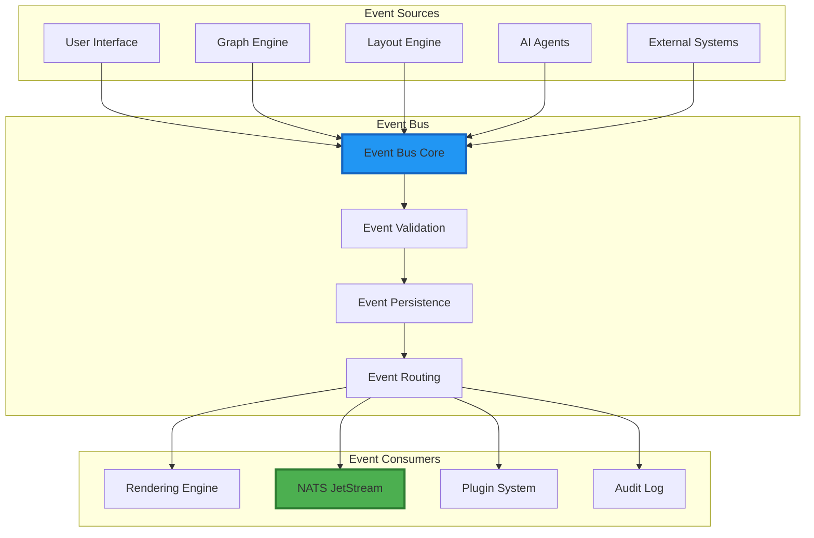
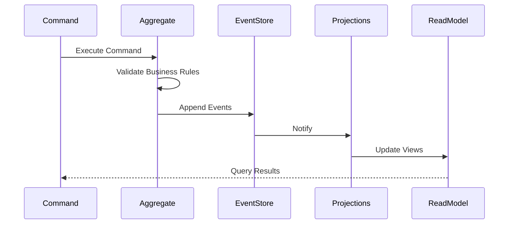
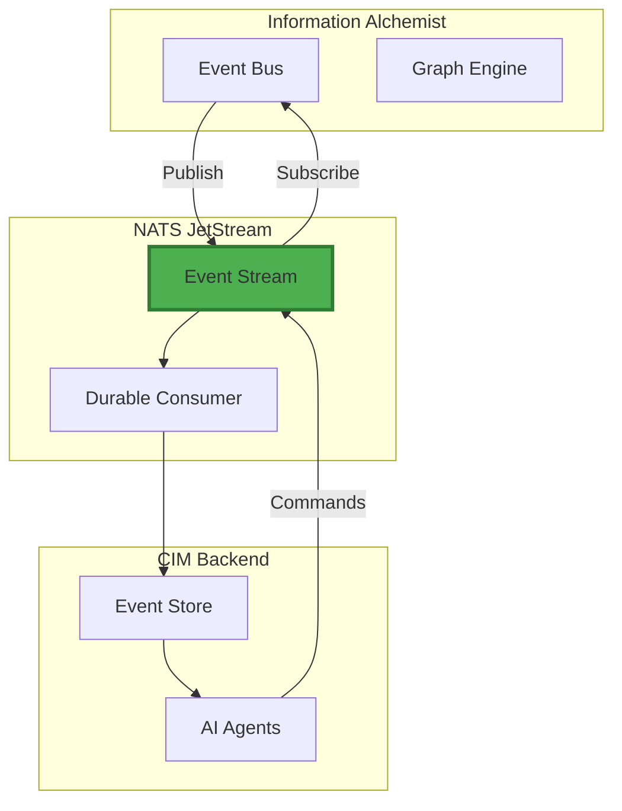

# Event System Design

## Event-Driven Architecture for Information Alchemist

The Event System is the backbone of Information Alchemist, providing a deterministic, composable foundation for all state changes and system interactions. This document details the event-driven architecture that enables real-time synchronization between the frontend visualization and the CIM backend.

## Architecture Overview



## Core Concepts

### 1. Event Definition

All events in Information Alchemist follow a strict schema:

```rust
#[derive(Debug, Clone, Serialize, Deserialize)]
pub struct DomainEvent<T> {
    // Event metadata
    pub id: EventId,
    pub timestamp: DateTime<Utc>,
    pub version: u64,
    pub correlation_id: Option<CorrelationId>,
    pub causation_id: Option<EventId>,

    // Event payload
    pub aggregate_id: AggregateId,
    pub event_type: EventType,
    pub payload: T,

    // Security and audit
    pub actor: Actor,
    pub signature: Option<EventSignature>,
}

// Example event types
#[derive(Debug, Clone, Serialize, Deserialize)]
#[serde(tag = "type")]
pub enum GraphEvent {
    // Node events
    NodeAddedEvent {
        node_id: NodeId,
        position: Vec3,
        properties: HashMap<String, Value>,
        subgraph_id: Option<SubgraphId>,
    },

    NodeMovedEvent {
        node_id: NodeId,
        old_position: Vec3,
        new_position: Vec3,
        velocity: Vec3,
    },

    NodeRemovedEvent {
        node_id: NodeId,
        cascade_edges: Vec<EdgeId>,
    },

    // Edge events
    EdgeCreatedEvent {
        edge_id: EdgeId,
        source: NodeId,
        target: NodeId,
        relationship: EdgeRelationship,
    },

    // Subgraph events
    SubgraphImportedEvent {
        subgraph_id: SubgraphId,
        source: GraphSource,
        node_count: usize,
        edge_count: usize,
    },

    InterSubgraphEdgeCreatedEvent {
        edge_id: EdgeId,
        from_subgraph: SubgraphId,
        to_subgraph: SubgraphId,
        bridge_nodes: (NodeId, NodeId),
    },
}
```

### 2. Event Bus Implementation

The Event Bus provides reliable, ordered event delivery:

```rust
pub struct EventBus {
    // Event channels
    sender: broadcast::Sender<Arc<dyn Event>>,
    receiver: broadcast::Receiver<Arc<dyn Event>>,

    // Event store
    store: Arc<EventStore>,

    // Handler registry
    handlers: Arc<RwLock<HandlerRegistry>>,

    // Metrics
    metrics: EventMetrics,
}

impl EventBus {
    pub async fn emit<E: Event>(&self, event: E) -> Result<EventId> {
        // Validate event
        self.validate_event(&event)?;

        // Assign metadata
        let event = self.enrich_event(event)?;

        // Persist to event store
        self.store.append(&event).await?;

        // Broadcast to handlers
        let arc_event = Arc::new(event);
        self.sender.send(arc_event.clone())?;

        // Update metrics
        self.metrics.record_event(&arc_event);

        Ok(arc_event.id())
    }

    pub async fn subscribe<E: Event>(
        &self,
        handler: impl EventHandler<E> + 'static,
    ) -> SubscriptionId {
        let mut registry = self.handlers.write().await;
        registry.register(handler)
    }
}
```

### 3. Event Sourcing

All state changes are captured as events:



Implementation:

```rust
pub struct EventStore {
    // Append-only event log
    events: Arc<RwLock<Vec<StoredEvent>>>,

    // Snapshots for performance
    snapshots: Arc<RwLock<HashMap<AggregateId, Snapshot>>>,

    // Stream positions
    positions: Arc<RwLock<HashMap<StreamId, u64>>>,

    // Persistence backend
    backend: Box<dyn EventStorageBackend>,
}

impl EventStore {
    pub async fn append_events(
        &self,
        stream_id: StreamId,
        events: Vec<DomainEvent>,
        expected_version: Option<u64>,
    ) -> Result<()> {
        // Optimistic concurrency control
        if let Some(expected) = expected_version {
            let current = self.get_stream_version(stream_id).await?;
            if current != expected {
                return Err(ConcurrencyError::VersionMismatch {
                    expected,
                    actual: current,
                });
            }
        }

        // Persist events
        let mut stored_events = Vec::new();
        for event in events {
            let stored = StoredEvent {
                id: event.id,
                stream_id: stream_id.clone(),
                version: self.next_version(stream_id).await?,
                event_type: event.event_type(),
                payload: serde_json::to_value(&event)?,
                metadata: event.metadata(),
                timestamp: event.timestamp,
            };
            stored_events.push(stored);
        }

        self.backend.append_batch(stored_events).await?;
        Ok(())
    }

    pub async fn load_events(
        &self,
        stream_id: StreamId,
        from_version: u64,
    ) -> Result<Vec<DomainEvent>> {
        self.backend.load_stream(stream_id, from_version).await
    }
}
```

## Event Patterns

### 1. Command-Event Flow

Commands trigger events following CQRS pattern:

```rust
// Command definition
#[derive(Debug, Clone)]
pub struct MoveNodeCommand {
    pub node_id: NodeId,
    pub new_position: Vec3,
    pub animation_duration: Option<Duration>,
}

// Command handler
pub struct MoveNodeHandler {
    graph_engine: Arc<GraphEngine>,
    event_bus: Arc<EventBus>,
}

#[async_trait]
impl CommandHandler<MoveNodeCommand> for MoveNodeHandler {
    type Result = Result<()>;

    async fn handle(&self, command: MoveNodeCommand) -> Self::Result {
        // Load current state
        let node = self.graph_engine.get_node(command.node_id)?;

        // Business logic validation
        if node.locked {
            return Err(DomainError::NodeLocked);
        }

        // Calculate changes
        let old_position = node.position;
        let velocity = (command.new_position - old_position)
            / command.animation_duration.unwrap_or(Duration::ZERO).as_secs_f32();

        // Emit event
        self.event_bus.emit(NodeMovedEvent {
            node_id: command.node_id,
            old_position,
            new_position: command.new_position,
            velocity,
        }).await?;

        Ok(())
    }
}
```

### 2. Event Handlers

Event handlers react to domain events:

```rust
#[async_trait]
pub trait EventHandler<E: Event>: Send + Sync {
    async fn handle(&mut self, event: &E) -> Result<()>;
}

// Example: Update spatial index on node movement
pub struct SpatialIndexUpdater {
    spatial_index: Arc<RwLock<SpatialIndex>>,
}

#[async_trait]
impl EventHandler<NodeMovedEvent> for SpatialIndexUpdater {
    async fn handle(&mut self, event: &NodeMovedEvent) -> Result<()> {
        let mut index = self.spatial_index.write().await;
        index.update_position(
            event.node_id,
            event.old_position,
            event.new_position,
        );
        Ok(())
    }
}

// Example: Update subgraph boundaries
pub struct SubgraphBoundaryUpdater {
    graph_engine: Arc<GraphEngine>,
}

#[async_trait]
impl EventHandler<NodeMovedEvent> for SubgraphBoundaryUpdater {
    async fn handle(&mut self, event: &NodeMovedEvent) -> Result<()> {
        if let Some(subgraph_id) = self.graph_engine
            .get_node_subgraph(event.node_id).await?
        {
            self.graph_engine
                .recalculate_subgraph_boundary(subgraph_id)
                .await?;
        }
        Ok(())
    }
}
```

### 3. Event Aggregation

Complex operations emit multiple related events:

```rust
pub struct GraphImporter {
    event_bus: Arc<EventBus>,
}

impl GraphImporter {
    pub async fn import_graph(
        &self,
        source: GraphSource,
        target_position: Vec3,
    ) -> Result<SubgraphId> {
        let correlation_id = CorrelationId::new();
        let subgraph_id = SubgraphId::new();

        // Start transaction
        let mut events = Vec::new();

        // Import started event
        events.push(GraphImportStartedEvent {
            subgraph_id,
            source: source.clone(),
            correlation_id,
        }.into());

        // Load graph data
        let graph_data = source.load().await?;

        // Import nodes
        for node in graph_data.nodes {
            events.push(NodeAddedEvent {
                node_id: NodeId::new(),
                position: node.position + target_position,
                properties: node.properties,
                subgraph_id: Some(subgraph_id),
            }.into());
        }

        // Import edges
        for edge in graph_data.edges {
            events.push(EdgeCreatedEvent {
                edge_id: EdgeId::new(),
                source: edge.source,
                target: edge.target,
                relationship: edge.relationship,
            }.into());
        }

        // Import completed event
        events.push(GraphImportCompletedEvent {
            subgraph_id,
            node_count: graph_data.nodes.len(),
            edge_count: graph_data.edges.len(),
            correlation_id,
        }.into());

        // Emit all events atomically
        self.event_bus.emit_batch(events).await?;

        Ok(subgraph_id)
    }
}
```

## Integration with NATS

### 1. Event Stream Bridge

```rust
pub struct NATSEventBridge {
    connection: async_nats::Connection,
    jetstream: async_nats::jetstream::Context,
    event_bus: Arc<EventBus>,
    stream_name: String,
}

impl NATSEventBridge {
    pub async fn start(&self) -> Result<()> {
        // Create or update stream
        self.ensure_stream().await?;

        // Subscribe to local events
        let mut receiver = self.event_bus.subscribe_all().await?;

        // Forward events to NATS
        tokio::spawn(async move {
            while let Ok(event) = receiver.recv().await {
                if let Err(e) = self.publish_to_nats(&event).await {
                    error!("Failed to publish to NATS: {}", e);
                }
            }
        });

        // Subscribe to NATS events
        self.subscribe_from_nats().await?;

        Ok(())
    }

    async fn publish_to_nats(&self, event: &Arc<dyn Event>) -> Result<()> {
        let subject = format!("graph.events.{}", event.event_type());
        let payload = serde_json::to_vec(&event)?;

        self.jetstream
            .publish(subject, payload.into())
            .await?
            .await?;

        Ok(())
    }
}
```

### 2. Event Synchronization



## Event Processing Patterns

### 1. Saga Pattern

Long-running processes coordinated through events:

```rust
pub struct GraphLayoutSaga {
    saga_id: SagaId,
    state: LayoutSagaState,
    event_bus: Arc<EventBus>,
}

#[derive(Debug)]
enum LayoutSagaState {
    Started { algorithm: LayoutAlgorithm },
    Running { iteration: u32 },
    Stabilizing { stability: f32 },
    Completed,
    Failed { error: String },
}

#[async_trait]
impl Saga for GraphLayoutSaga {
    async fn handle_event(&mut self, event: &dyn Event) -> Result<()> {
        match (&self.state, event.as_any().downcast_ref()) {
            (LayoutSagaState::Started { algorithm }, Some(LayoutStartedEvent { .. })) => {
                self.state = LayoutSagaState::Running { iteration: 0 };
                self.event_bus.emit(LayoutIterationEvent {
                    saga_id: self.saga_id,
                    iteration: 0,
                }).await?;
            }

            (LayoutSagaState::Running { iteration }, Some(LayoutIterationCompletedEvent { stability })) => {
                if *stability < 0.01 {
                    self.state = LayoutSagaState::Completed;
                    self.event_bus.emit(LayoutCompletedEvent {
                        saga_id: self.saga_id,
                        total_iterations: *iteration,
                    }).await?;
                } else {
                    self.state = LayoutSagaState::Running { iteration: iteration + 1 };
                    self.event_bus.emit(LayoutIterationEvent {
                        saga_id: self.saga_id,
                        iteration: iteration + 1,
                    }).await?;
                }
            }

            _ => {}
        }
        Ok(())
    }
}
```

### 2. Event Replay

Reconstruct state from event history:

```rust
pub struct GraphProjection {
    graph: Graph,
    version: u64,
}

impl GraphProjection {
    pub async fn rebuild_from_events(
        event_store: &EventStore,
        up_to_version: Option<u64>,
    ) -> Result<Self> {
        let mut projection = Self {
            graph: Graph::new(),
            version: 0,
        };

        let events = event_store
            .load_all_events(0, up_to_version)
            .await?;

        for event in events {
            projection.apply_event(&event)?;
        }

        Ok(projection)
    }

    fn apply_event(&mut self, event: &DomainEvent) -> Result<()> {
        match event {
            DomainEvent::NodeAdded { node_id, position, properties, .. } => {
                self.graph.add_node(Node {
                    id: *node_id,
                    position: *position,
                    properties: properties.clone(),
                });
            }

            DomainEvent::EdgeCreated { edge_id, source, target, .. } => {
                self.graph.add_edge(Edge {
                    id: *edge_id,
                    source: *source,
                    target: *target,
                });
            }

            // Handle other events...
            _ => {}
        }

        self.version = event.version;
        Ok(())
    }
}
```

## Performance Optimization

### 1. Event Batching

```rust
pub struct BatchedEventEmitter {
    buffer: Arc<Mutex<Vec<DomainEvent>>>,
    flush_interval: Duration,
    max_batch_size: usize,
    event_bus: Arc<EventBus>,
}

impl BatchedEventEmitter {
    pub async fn emit(&self, event: DomainEvent) -> Result<()> {
        let mut buffer = self.buffer.lock().await;
        buffer.push(event);

        if buffer.len() >= self.max_batch_size {
            let events = std::mem::take(&mut *buffer);
            drop(buffer);
            self.flush_events(events).await?;
        }

        Ok(())
    }

    async fn flush_events(&self, events: Vec<DomainEvent>) -> Result<()> {
        if events.is_empty() {
            return Ok(());
        }

        self.event_bus.emit_batch(events).await
    }
}
```

### 2. Event Filtering

```rust
pub struct EventFilter {
    predicates: Vec<Box<dyn Fn(&dyn Event) -> bool + Send + Sync>>,
}

impl EventFilter {
    pub fn add_predicate<F>(&mut self, predicate: F)
    where
        F: Fn(&dyn Event) -> bool + Send + Sync + 'static,
    {
        self.predicates.push(Box::new(predicate));
    }

    pub fn matches(&self, event: &dyn Event) -> bool {
        self.predicates.iter().all(|p| p(event))
    }
}

// Usage
let mut filter = EventFilter::new();
filter.add_predicate(|e| e.aggregate_type() == "Graph");
filter.add_predicate(|e| e.timestamp() > cutoff_time);
```

## Testing Event-Driven Systems

### 1. Event Testing Framework

```rust
#[cfg(test)]
mod tests {
    use super::*;

    #[tokio::test]
    async fn test_node_movement_saga() {
        // Setup
        let event_bus = Arc::new(EventBus::new());
        let test_recorder = TestEventRecorder::new();
        event_bus.subscribe(test_recorder.clone()).await;

        // Execute command
        let command = MoveNodeCommand {
            node_id: NodeId::new(),
            new_position: Vec3::new(10.0, 20.0, 0.0),
            animation_duration: Some(Duration::from_secs(1)),
        };

        let handler = MoveNodeHandler::new(event_bus.clone());
        handler.handle(command).await.unwrap();

        // Verify events
        let events = test_recorder.events().await;
        assert_eq!(events.len(), 1);

        match &events[0] {
            DomainEvent::NodeMoved { new_position, .. } => {
                assert_eq!(*new_position, Vec3::new(10.0, 20.0, 0.0));
            }
            _ => panic!("Unexpected event type"),
        }
    }
}
```

## Summary

The Event System provides:

1. **Deterministic State Management**: All changes captured as events
2. **Composability**: Events can trigger other events in a controlled manner
3. **Integration**: Seamless connection with CIM backend via NATS
4. **Auditability**: Complete history of all system changes
5. **Testability**: Event-driven design enables comprehensive testing

This architecture ensures that Information Alchemist maintains consistency while providing real-time, responsive visualization of complex graph structures.

---

*Continue to [Integration Guide](04-integration-guide.md) →*
