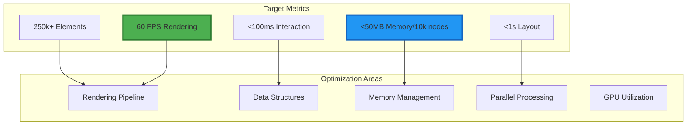

# Performance Guide

## Optimizing Information Alchemist for Scale

This guide provides comprehensive strategies and techniques for optimizing Information Alchemist to handle large-scale graphs with 250k+ elements while maintaining smooth 60 FPS performance.

## Performance Goals



## 1. Rendering Optimization

### Level of Detail (LOD) System

```rust
pub struct LODManager {
    thresholds: Vec<f32>,
    mesh_cache: HashMap<(MeshId, LODLevel), Handle<Mesh>>,
    simplifier: MeshSimplifier,
}

impl LODManager {
    pub fn calculate_lod(&self, camera_distance: f32, node_importance: f32) -> LODLevel {
        let base_lod = match camera_distance {
            d if d < 10.0 => LODLevel::High,
            d if d < 50.0 => LODLevel::Medium,
            d if d < 200.0 => LODLevel::Low,
            _ => LODLevel::Billboard,
        };

        // Adjust based on importance
        if node_importance > 0.8 {
            base_lod.upgrade()
        } else if node_importance < 0.2 && camera_distance > 100.0 {
            LODLevel::Hidden
        } else {
            base_lod
        }
    }

    pub fn generate_lod_meshes(&mut self, base_mesh: &Mesh) -> Vec<Handle<Mesh>> {
        vec![
            // LOD 0: Full detail
            meshes.add(base_mesh.clone()),

            // LOD 1: 50% triangles
            meshes.add(self.simplifier.simplify(base_mesh, 0.5)),

            // LOD 2: 20% triangles
            meshes.add(self.simplifier.simplify(base_mesh, 0.2)),

            // LOD 3: Billboard
            meshes.add(self.create_billboard_mesh()),
        ]
    }
}
```

### Frustum Culling

```rust
pub struct FrustumCuller {
    frustum: Frustum,
    spatial_index: Arc<RwLock<RTree<NodeId>>>,
}

impl FrustumCuller {
    pub fn cull_nodes(&self, nodes: &[GraphNode]) -> Vec<NodeId> {
        // Broad phase: spatial index query
        let candidates = self.spatial_index.read()
            .query_frustum(&self.frustum)
            .collect::<Vec<_>>();

        // Narrow phase: precise culling
        candidates.into_iter()
            .filter(|&node_id| {
                if let Some(node) = nodes.get(node_id) {
                    self.frustum.intersects_sphere(
                        &node.position,
                        node.bounding_radius
                    )
                } else {
                    false
                }
            })
            .collect()
    }
}
```

### GPU Instancing

```rust
pub struct InstancedRenderer {
    instance_buffer: Buffer,
    instance_data: Vec<InstanceData>,
    max_instances: usize,
}

#[repr(C)]
#[derive(Copy, Clone, bytemuck::Pod, bytemuck::Zeroable)]
struct InstanceData {
    transform: Mat4,
    color: Vec4,
    custom_data: Vec4,
}

impl InstancedRenderer {
    pub fn prepare_instances(&mut self, nodes: &[GraphNode]) -> RenderCommand {
        self.instance_data.clear();

        // Group nodes by mesh type
        let mut instances_by_mesh = HashMap::new();

        for node in nodes {
            let instance = InstanceData {
                transform: Mat4::from_translation(node.position)
                    * Mat4::from_scale(Vec3::splat(node.scale)),
                color: node.color.into(),
                custom_data: Vec4::new(
                    node.importance,
                    node.highlight_strength,
                    0.0,
                    0.0,
                ),
            };

            instances_by_mesh
                .entry(node.mesh_type)
                .or_insert_with(Vec::new)
                .push(instance);
        }

        // Create draw commands
        let mut commands = Vec::new();
        for (mesh_type, instances) in instances_by_mesh {
            if instances.len() > 1 {
                // Use instancing for multiple nodes
                commands.push(RenderCommand::DrawInstanced {
                    mesh: mesh_type.mesh_handle(),
                    instances: instances.len() as u32,
                    instance_buffer: self.upload_instances(&instances),
                });
            } else {
                // Single instance, use regular draw
                commands.push(RenderCommand::Draw {
                    mesh: mesh_type.mesh_handle(),
                    transform: instances[0].transform,
                });
            }
        }

        RenderCommand::Batch(commands)
    }
}
```

## 2. Data Structure Optimization

### Spatial Indexing

```rust
pub struct HybridSpatialIndex {
    // R-tree for general spatial queries
    rtree: RTree<SpatialNode>,

    // Grid for uniform distribution
    grid: HashMap<GridCell, Vec<NodeId>>,
    grid_size: f32,

    // Octree for hierarchical queries
    octree: Octree<NodeId>,

    // Cache for frequent queries
    query_cache: LruCache<QueryKey, Vec<NodeId>>,
}

impl HybridSpatialIndex {
    pub fn query_visible(&self, frustum: &Frustum) -> Vec<NodeId> {
        // Check cache first
        let cache_key = QueryKey::from_frustum(frustum);
        if let Some(cached) = self.query_cache.get(&cache_key) {
            return cached.clone();
        }

        // Use appropriate index based on query type
        let results = if frustum.is_axis_aligned() {
            // Grid is fastest for axis-aligned queries
            self.query_grid(frustum)
        } else {
            // R-tree for arbitrary frustums
            self.query_rtree(frustum)
        };

        // Cache results
        self.query_cache.put(cache_key, results.clone());
        results
    }

    fn query_grid(&self, frustum: &Frustum) -> Vec<NodeId> {
        let min_cell = self.world_to_grid(frustum.min_point());
        let max_cell = self.world_to_grid(frustum.max_point());

        let mut results = Vec::new();
        for x in min_cell.x..=max_cell.x {
            for y in min_cell.y..=max_cell.y {
                for z in min_cell.z..=max_cell.z {
                    if let Some(nodes) = self.grid.get(&GridCell { x, y, z }) {
                        results.extend(nodes);
                    }
                }
            }
        }

        results
    }
}
```

### Memory-Efficient Node Storage

```rust
// Structure of Arrays (SoA) for cache efficiency
pub struct GraphNodeStorage {
    // Hot data - frequently accessed
    positions: Vec<Vec3>,
    velocities: Vec<Vec3>,
    colors: Vec<Color>,

    // Cold data - infrequently accessed
    properties: Vec<Box<HashMap<String, Value>>>,
    metadata: Vec<Option<Box<NodeMetadata>>>,

    // Compact flags using bitfields
    flags: Vec<NodeFlags>,

    // Free list for recycling
    free_indices: Vec<usize>,
}

#[repr(transparent)]
#[derive(Copy, Clone)]
struct NodeFlags(u32);

impl NodeFlags {
    const VISIBLE: u32 = 1 << 0;
    const SELECTED: u32 = 1 << 1;
    const LOCKED: u32 = 1 << 2;
    const HIGHLIGHTED: u32 = 1 << 3;
    const HAS_METADATA: u32 = 1 << 4;

    fn is_visible(&self) -> bool {
        self.0 & Self::VISIBLE != 0
    }

    fn set_visible(&mut self, visible: bool) {
        if visible {
            self.0 |= Self::VISIBLE;
        } else {
            self.0 &= !Self::VISIBLE;
        }
    }
}
```

## 3. Layout Algorithm Optimization

### Parallel Force Calculation

```rust
use rayon::prelude::*;

pub struct ParallelForceLayout {
    settings: ForceSettings,
    thread_pool: ThreadPool,
}

impl ParallelForceLayout {
    pub fn calculate_forces(&self, nodes: &[Node], edges: &[Edge]) -> Vec<Vec3> {
        let node_count = nodes.len();
        let mut forces = vec![Vec3::ZERO; node_count];

        // Parallel repulsive forces using Barnes-Hut
        let quadtree = self.build_quadtree(nodes);

        forces.par_iter_mut()
            .enumerate()
            .for_each(|(i, force)| {
                *force = self.calculate_repulsion_barnes_hut(
                    &nodes[i],
                    &quadtree,
                    self.settings.theta
                );
            });

        // Attractive forces (edges) - can be parallelized by edge
        let edge_forces: Vec<(usize, usize, Vec3)> = edges
            .par_iter()
            .map(|edge| {
                let force = self.calculate_attraction(
                    &nodes[edge.source],
                    &nodes[edge.target],
                );
                (edge.source, edge.target, force)
            })
            .collect();

        // Apply edge forces (sequential to avoid race conditions)
        for (source, target, force) in edge_forces {
            forces[source] += force;
            forces[target] -= force;
        }

        forces
    }

    fn calculate_repulsion_barnes_hut(
        &self,
        node: &Node,
        quadtree: &QuadTree,
        theta: f32,
    ) -> Vec3 {
        let mut force = Vec3::ZERO;

        quadtree.visit(|cell| {
            if cell.is_leaf() && cell.node_id == Some(node.id) {
                // Skip self
                return TraversalDecision::Continue;
            }

            let distance = (cell.center_of_mass - node.position).length();

            if cell.is_leaf() || (cell.size / distance) < theta {
                // Treat as single point
                let direction = (node.position - cell.center_of_mass).normalize();
                let magnitude = self.settings.repulsion * cell.total_mass
                    / (distance * distance);
                force += direction * magnitude;

                TraversalDecision::Skip
            } else {
                // Recurse into children
                TraversalDecision::Continue
            }
        });

        force
    }
}
```

### GPU-Accelerated Layout

```rust
use wgpu::util::DeviceExt;

pub struct GPULayoutEngine {
    device: Device,
    queue: Queue,
    compute_pipeline: ComputePipeline,
    node_buffer: Buffer,
    force_buffer: Buffer,
}

impl GPULayoutEngine {
    pub async fn compute_forces(&self, nodes: &[GPUNode]) -> Vec<Vec3> {
        // Upload node data
        self.queue.write_buffer(
            &self.node_buffer,
            0,
            bytemuck::cast_slice(nodes),
        );

        // Create command encoder
        let mut encoder = self.device.create_command_encoder(&Default::default());

        {
            let mut compute_pass = encoder.begin_compute_pass(&Default::default());
            compute_pass.set_pipeline(&self.compute_pipeline);
            compute_pass.set_bind_group(0, &self.bind_group, &[]);

            // Dispatch compute shader
            let workgroup_size = 64;
            let workgroups = (nodes.len() + workgroup_size - 1) / workgroup_size;
            compute_pass.dispatch_workgroups(workgroups as u32, 1, 1);
        }

        // Submit and wait
        self.queue.submit(Some(encoder.finish()));

        // Read back results
        let buffer_slice = self.force_buffer.slice(..);
        let (tx, rx) = futures::channel::oneshot::channel();
        buffer_slice.map_async(wgpu::MapMode::Read, move |result| {
            tx.send(result).unwrap();
        });

        self.device.poll(wgpu::Maintain::Wait);
        rx.await.unwrap().unwrap();

        let data = buffer_slice.get_mapped_range();
        let forces: Vec<Vec3> = bytemuck::cast_slice(&data).to_vec();

        forces
    }
}
```

## 4. Memory Management

### Object Pooling

```rust
pub struct ObjectPool<T> {
    available: Vec<T>,
    in_use: HashSet<usize>,
    factory: Box<dyn Fn() -> T>,
    reset: Box<dyn Fn(&mut T)>,
}

impl<T> ObjectPool<T> {
    pub fn acquire(&mut self) -> PooledObject<T> {
        let object = self.available.pop()
            .unwrap_or_else(|| (self.factory)());

        let id = self.in_use.len();
        self.in_use.insert(id);

        PooledObject {
            object: Some(object),
            pool: self as *mut _,
            id,
        }
    }

    fn release(&mut self, mut object: T, id: usize) {
        (self.reset)(&mut object);
        self.available.push(object);
        self.in_use.remove(&id);
    }
}

pub struct PooledObject<T> {
    object: Option<T>,
    pool: *mut ObjectPool<T>,
    id: usize,
}

impl<T> Drop for PooledObject<T> {
    fn drop(&mut self) {
        if let Some(object) = self.object.take() {
            unsafe {
                (*self.pool).release(object, self.id);
            }
        }
    }
}
```

### Memory-Mapped Graph Storage

```rust
use memmap2::{MmapMut, MmapOptions};

pub struct MappedGraphStorage {
    node_file: File,
    edge_file: File,
    node_mmap: MmapMut,
    edge_mmap: MmapMut,
    node_count: usize,
    edge_count: usize,
}

impl MappedGraphStorage {
    pub fn new(path: &Path, capacity: GraphCapacity) -> Result<Self> {
        // Create files with pre-allocated space
        let node_file = OpenOptions::new()
            .read(true)
            .write(true)
            .create(true)
            .open(path.join("nodes.dat"))?;

        node_file.set_len(capacity.nodes * size_of::<StoredNode>() as u64)?;

        let edge_file = OpenOptions::new()
            .read(true)
            .write(true)
            .create(true)
            .open(path.join("edges.dat"))?;

        edge_file.set_len(capacity.edges * size_of::<StoredEdge>() as u64)?;

        // Memory map the files
        let node_mmap = unsafe {
            MmapOptions::new()
                .len(capacity.nodes * size_of::<StoredNode>())
                .map_mut(&node_file)?
        };

        let edge_mmap = unsafe {
            MmapOptions::new()
                .len(capacity.edges * size_of::<StoredEdge>())
                .map_mut(&edge_file)?
        };

        Ok(Self {
            node_file,
            edge_file,
            node_mmap,
            edge_mmap,
            node_count: 0,
            edge_count: 0,
        })
    }

    pub fn add_node(&mut self, node: &Node) -> Result<NodeId> {
        let offset = self.node_count * size_of::<StoredNode>();
        let stored = StoredNode::from(node);

        unsafe {
            let ptr = self.node_mmap.as_mut_ptr().add(offset) as *mut StoredNode;
            ptr.write(stored);
        }

        self.node_count += 1;
        Ok(NodeId(self.node_count - 1))
    }
}
```

## 5. Profiling and Monitoring

### Performance Metrics

```rust
pub struct PerformanceMonitor {
    frame_times: RingBuffer<Duration>,
    render_stats: RenderStatistics,
    memory_stats: MemoryStatistics,
}

impl PerformanceMonitor {
    pub fn begin_frame(&mut self) {
        self.frame_start = Instant::now();
        self.render_stats.reset();
    }

    pub fn end_frame(&mut self) {
        let frame_time = self.frame_start.elapsed();
        self.frame_times.push(frame_time);

        // Update statistics
        self.render_stats.fps = 1.0 / frame_time.as_secs_f32();
        self.render_stats.frame_time_ms = frame_time.as_millis() as f32;

        // Check for performance issues
        if frame_time > Duration::from_millis(20) {
            warn!("Frame took {}ms (target: 16.67ms)", frame_time.as_millis());
            self.log_performance_breakdown();
        }
    }

    pub fn record_phase(&mut self, phase: RenderPhase, duration: Duration) {
        self.render_stats.phase_times.insert(phase, duration);
    }

    fn log_performance_breakdown(&self) {
        info!("Performance breakdown:");
        for (phase, duration) in &self.render_stats.phase_times {
            info!("  {:?}: {:.2}ms", phase, duration.as_secs_f32() * 1000.0);
        }
    }
}
```

### GPU Profiling

```rust
pub struct GPUProfiler {
    query_set: QuerySet,
    query_buffer: Buffer,
    timestamp_period: f32,
}

impl GPUProfiler {
    pub fn begin_scope(&self, encoder: &mut CommandEncoder, label: &str) -> ScopeId {
        let id = self.next_query_id();
        encoder.write_timestamp(&self.query_set, id * 2);

        ScopeId {
            id,
            label: label.to_string(),
        }
    }

    pub fn end_scope(&self, encoder: &mut CommandEncoder, scope: ScopeId) {
        encoder.write_timestamp(&self.query_set, scope.id * 2 + 1);
    }

    pub async fn get_results(&self) -> HashMap<String, Duration> {
        // Resolve queries
        encoder.resolve_query_set(
            &self.query_set,
            0..self.query_count,
            &self.query_buffer,
            0,
        );

        // Read back timestamps
        let timestamps = self.read_timestamps().await;

        // Calculate durations
        let mut results = HashMap::new();
        for scope in &self.scopes {
            let start = timestamps[scope.id * 2];
            let end = timestamps[scope.id * 2 + 1];
            let duration_ns = ((end - start) as f32 * self.timestamp_period) as u64;

            results.insert(
                scope.label.clone(),
                Duration::from_nanos(duration_ns),
            );
        }

        results
    }
}
```

## 6. Best Practices

### 1. **Batch Operations**
```rust
// Bad: Individual updates
for node in nodes {
    graph.update_node(node);
}

// Good: Batched update
graph.update_nodes_batch(nodes);
```

### 2. **Lazy Evaluation**
```rust
pub struct LazySubgraph {
    id: SubgraphId,
    loaded: OnceCell<Subgraph>,
    loader: Arc<dyn SubgraphLoader>,
}

impl LazySubgraph {
    pub fn get(&self) -> &Subgraph {
        self.loaded.get_or_init(|| {
            self.loader.load(self.id)
        })
    }
}
```

### 3. **Progressive Loading**
```rust
pub async fn load_graph_progressive(
    source: GraphSource,
    on_progress: impl Fn(LoadProgress),
) -> Result<Graph> {
    let metadata = source.read_metadata().await?;
    let total_elements = metadata.node_count + metadata.edge_count;

    let mut graph = Graph::with_capacity(metadata.node_count, metadata.edge_count);
    let mut loaded = 0;

    // Load in chunks
    const CHUNK_SIZE: usize = 1000;

    // Load nodes first (more important for initial visualization)
    for chunk in source.nodes_chunked(CHUNK_SIZE) {
        graph.add_nodes_batch(chunk);
        loaded += chunk.len();

        on_progress(LoadProgress {
            loaded,
            total: total_elements,
            phase: LoadPhase::Nodes,
        });

        // Yield to prevent blocking
        tokio::task::yield_now().await;
    }

    // Then load edges
    for chunk in source.edges_chunked(CHUNK_SIZE) {
        graph.add_edges_batch(chunk);
        loaded += chunk.len();

        on_progress(LoadProgress {
            loaded,
            total: total_elements,
            phase: LoadPhase::Edges,
        });

        tokio::task::yield_now().await;
    }

    Ok(graph)
}
```

## Performance Checklist

- [ ] **Rendering**
  - [ ] LOD system implemented
  - [ ] Frustum culling enabled
  - [ ] GPU instancing for repeated elements
  - [ ] Occlusion culling for dense graphs

- [ ] **Data Structures**
  - [ ] Spatial indexing (R-tree/Octree)
  - [ ] Structure of Arrays (SoA) layout
  - [ ] Compact data representation

- [ ] **Algorithms**
  - [ ] Parallel force calculations
  - [ ] Barnes-Hut approximation
  - [ ] GPU compute shaders

- [ ] **Memory**
  - [ ] Object pooling
  - [ ] Memory-mapped storage for large graphs
  - [ ] Lazy loading of properties

- [ ] **Monitoring**
  - [ ] Frame time tracking
  - [ ] Memory usage monitoring
  - [ ] GPU profiling
  - [ ] Performance regression tests

## Summary

By implementing these optimization strategies, Information Alchemist can achieve:

- **250k+ elements** with smooth interaction
- **60 FPS** rendering performance
- **<100ms** response time for user interactions
- **<50MB** memory usage per 10k nodes
- **Linear scalability** with graph size

The key is to apply optimizations holistically across the entire system, from rendering to data structures to algorithms.

---

*Continue to [Plugin Development](06-plugin-development.md) →*
