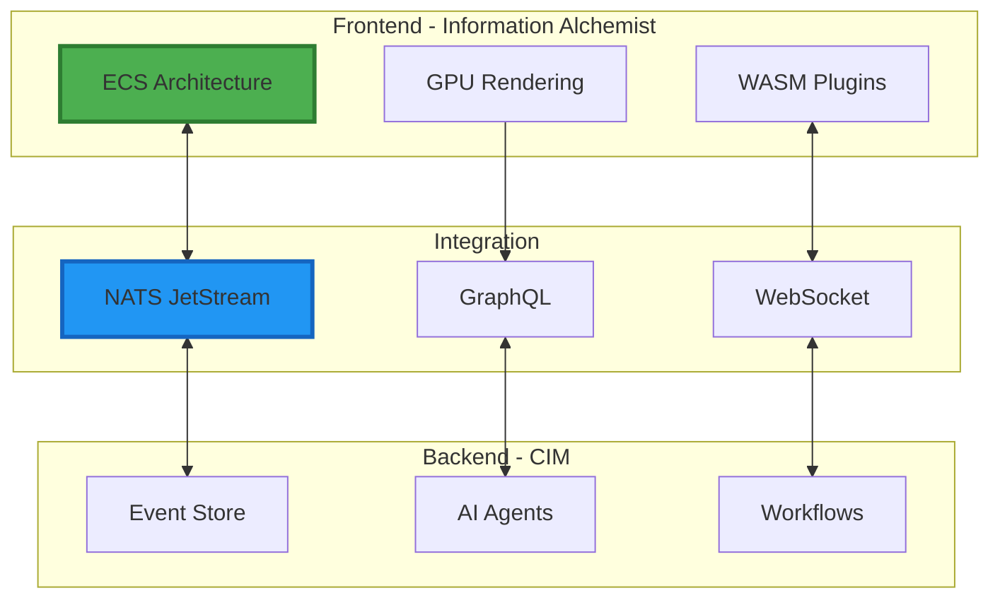

# Information Alchemist Technical Documentation

## Engineering Visual Intelligence at Scale

This documentation provides technical implementers with comprehensive guidance for understanding, deploying, and extending Information Alchemist as the frontend visualization system for the Composable Information Machine (CIM).

## Documentation Structure

### 🏗️ [01-architecture-overview.md](01-architecture-overview.md)
**System Architecture and Design Principles**
- Dual-layer architecture (Frontend/Backend)
- Core technology stack (Bevy, WASM, NATS)
- Architectural principles (ECS, Event-Driven, Composable)
- Integration patterns with CIM

### 🔧 [02-core-components.md](02-core-components.md)
**Detailed Component Design and Implementation**
- Graph Engine with subgraph composition
- Rendering Engine with LOD and instancing
- Layout Engine with parallel algorithms
- Event System architecture
- Plugin System design

### 📡 [03-event-system.md](03-event-system.md)
**Event-Driven Architecture Patterns**
- Domain event definitions
- Event sourcing implementation
- CQRS pattern application
- Saga orchestration
- Event replay and projections

### 🔌 [04-integration-guide.md](04-integration-guide.md)
**CIM Backend Integration**
- NATS JetStream configuration
- GraphQL schema and client
- REST API integration
- WebSocket real-time features
- AI agent communication

### ⚡ [05-performance-guide.md](05-performance-guide.md)
**Optimization Strategies for Scale**
- Rendering optimizations (LOD, culling, instancing)
- Data structure optimization (spatial indexing, SoA)
- Parallel processing techniques
- Memory management strategies
- GPU acceleration

### 🧩 [06-plugin-development.md](06-plugin-development.md)
**Extending with Custom Functionality**
- WASM plugin architecture
- Plugin API and capabilities
- Custom algorithms and UI
- Testing and distribution
- Best practices

## Key Technical Features

### Performance Targets
- **250k+ elements** with smooth interaction
- **60 FPS** rendering performance
- **<100ms** response time for interactions
- **<50MB** memory per 10k nodes

### Architecture Highlights



## Technology Stack

### Core Technologies
- **Rust**: Primary implementation language
- **Bevy 0.16.0**: ECS game engine for rendering
- **WebGPU/Vulkan**: Modern graphics APIs
- **WASM**: Plugin sandboxing and execution

### Integration Technologies
- **NATS JetStream**: Event streaming
- **GraphQL**: Flexible API queries
- **WebSocket**: Real-time collaboration
- **Event Sourcing**: State management

### Development Tools
- **Nix/NixOS**: Deterministic builds
- **wasm-pack**: WASM toolchain
- **cargo**: Rust package manager

## Quick Start for Developers

### Prerequisites
```bash
# Install Rust
curl --proto '=https' --tlsv1.2 -sSf https://sh.rustup.rs | sh

# Install wasm-pack
curl https://rustwasm.github.io/wasm-pack/installer/init.sh -sSf | sh

# Install Nix (optional but recommended)
sh <(curl -L https://nixos.org/nix/install) --daemon
```

### Building from Source
```bash
# Clone repository
git clone https://github.com/thecowboyai/information-alchemist
cd information-alchemist

# Using Nix
nix develop
nix build

# Or using Cargo directly
cargo build --release
cargo run
```

### Running Tests
```bash
# Unit tests
cargo test

# Integration tests
cargo test --features integration

# Performance benchmarks
cargo bench
```

## Architecture Decisions

### Why ECS?
- **Performance**: Cache-friendly data layout
- **Flexibility**: Dynamic component composition
- **Parallelism**: Automatic system parallelization
- **Maintainability**: Clear separation of data and logic

### Why Event Sourcing?
- **Auditability**: Complete history of changes
- **Determinism**: Reproducible state from events
- **Integration**: Natural fit with NATS streaming
- **Flexibility**: Multiple projections from same events

### Why WASM Plugins?
- **Security**: Sandboxed execution environment
- **Portability**: Platform-independent plugins
- **Performance**: Near-native execution speed
- **Ecosystem**: Leverage web technologies

## Development Guidelines

### Code Organization
```
src/
├── core/           # Core engine components
├── rendering/      # Rendering pipeline
├── layout/         # Layout algorithms
├── events/         # Event system
├── plugins/        # Plugin infrastructure
├── integration/    # CIM integration
└── ui/            # User interface
```

### Coding Standards
- Follow Rust idioms and `clippy` recommendations
- Use `rustfmt` for consistent formatting
- Document public APIs with examples
- Write tests for critical paths
- Benchmark performance-critical code

### Contributing
1. Fork the repository
2. Create a feature branch
3. Write tests for new functionality
4. Ensure all tests pass
5. Submit a pull request

## Performance Considerations

### Critical Paths
1. **Render Loop**: Must maintain 60 FPS
2. **Event Processing**: <10ms per event
3. **Layout Calculation**: Parallel where possible
4. **Memory Allocation**: Use object pools

### Optimization Checklist
- [ ] Profile before optimizing
- [ ] Measure impact of changes
- [ ] Consider memory vs CPU tradeoffs
- [ ] Use appropriate data structures
- [ ] Leverage GPU where beneficial

## Deployment

### Docker
```dockerfile
FROM rust:1.75 as builder
WORKDIR /app
COPY . .
RUN cargo build --release

FROM debian:bookworm-slim
COPY --from=builder /app/target/release/information-alchemist /usr/local/bin/
CMD ["information-alchemist"]
```

### NixOS Module
```nix
{ config, pkgs, ... }:
{
  services.information-alchemist = {
    enable = true;
    package = pkgs.information-alchemist;
    settings = {
      nats.url = "nats://localhost:4222";
      graphql.endpoint = "http://localhost:8080/graphql";
    };
  };
}
```

## Troubleshooting

### Common Issues

**High Memory Usage**
- Check for memory leaks in event handlers
- Verify spatial index is being cleaned up
- Use memory profiler to identify hotspots

**Poor Rendering Performance**
- Ensure LOD system is working
- Check frustum culling effectiveness
- Verify GPU instancing is enabled

**Event Processing Delays**
- Check NATS connection health
- Monitor event queue depth
- Profile event handler performance

## Resources

### Documentation
- [Bevy Book](https://bevyengine.org/learn/book/)
- [NATS Documentation](https://docs.nats.io/)
- [WebGPU Specification](https://www.w3.org/TR/webgpu/)

### Community
- GitHub Issues for bug reports
- Discord for real-time help
- Forum for design discussions

---

*Information Alchemist: Where Engineering Excellence Meets Visual Intelligence*

Transform complex systems into clear understanding.
