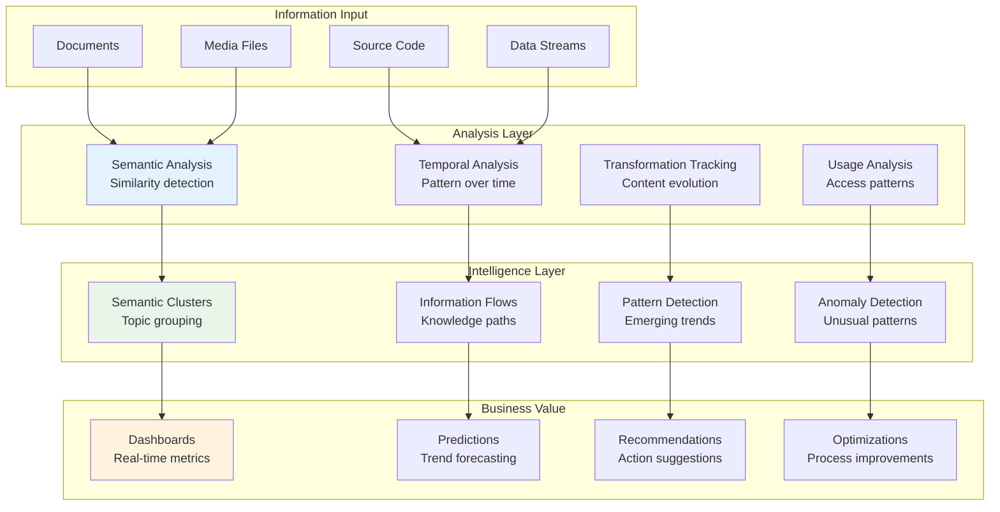
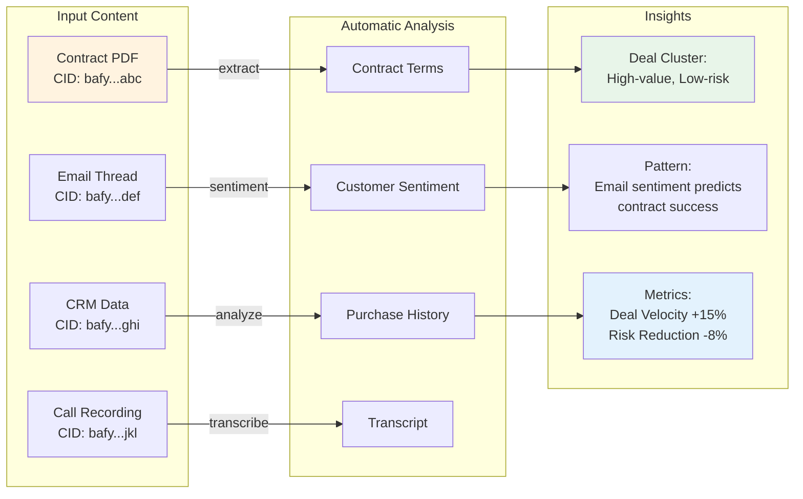

# Intelligent Business Network

> Part of the [CID/IPLD Architecture](./cid-ipld-architecture.md)

## Overview

CIM's CID-based architecture creates a living, growing intelligence network where every piece of content contributes to collective understanding. Typed information flows create emergent business intelligence through automatic relationship discovery, pattern detection, and insight generation.

## The Living Information Graph

### Core Architecture

```rust
#[derive(Debug, Clone)]
pub struct IntelligentBusinessNetwork {
    // Core information graph
    pub content_graph: ContentGraph,
    // Derived insights and projections
    pub insight_projections: HashMap<ProjectionType, InsightProjection>,
    // Real-time metrics and analytics
    pub metric_streams: Vec<MetricStream>,
    // Pattern detection engines
    pub pattern_detectors: Vec<PatternDetector>,
    // Relationship strength calculator
    pub relationship_analyzer: RelationshipAnalyzer,
}

#[derive(Debug, Clone)]
pub struct ContentGraph {
    // All content nodes indexed by CID
    pub nodes: HashMap<Cid, ContentNode>,
    // Typed relationships between content
    pub edges: Vec<TypedRelationship>,
    // Semantic clusters discovered through analysis
    pub clusters: Vec<SemanticCluster>,
    // Information flow patterns
    pub flow_patterns: Vec<InformationFlow>,
}
```

## Dynamic Relationship Discovery

### Information Flow Analysis

```rust
impl IntelligentBusinessNetwork {
    pub async fn analyze_information_flow(
        &mut self,
        new_content: Cid,
        stores: &Stores,
    ) -> Result<FlowAnalysis> {
        let content = stores.object_store.get_typed_content(new_content).await?;

        // 1. Semantic Analysis - Find related content
        let semantic_neighbors = self.find_semantic_neighbors(&content, 0.8)?;

        // 2. Temporal Analysis - Identify patterns over time
        let temporal_patterns = self.analyze_temporal_patterns(&content)?;

        // 3. Transformation Analysis - Track how content evolves
        let transformation_paths = self.trace_transformation_paths(new_content)?;

        // 4. Usage Analysis - Understand access patterns
        let usage_patterns = self.analyze_usage_patterns(new_content)?;

        // 5. Create new relationships based on discoveries
        let new_relationships = self.create_relationships(
            new_content,
            &semantic_neighbors,
            &temporal_patterns,
        )?;

        // 6. Update semantic clusters
        self.update_semantic_clusters(new_content, &semantic_neighbors)?;

        // 7. Detect emerging patterns
        let emerging_patterns = self.detect_emerging_patterns()?;

        Ok(FlowAnalysis {
            content_cid: new_content,
            semantic_neighbors,
            temporal_patterns,
            transformation_paths,
            usage_patterns,
            new_relationships,
            emerging_patterns,
            business_impact: self.calculate_business_impact(&new_relationships),
        })
    }
}
```

## Pattern Detection

### Pattern Types

```rust
#[derive(Debug, Clone)]
pub enum PatternType {
    // Convergence - multiple sources creating similar content
    Convergence {
        theme: String,
        sources: Vec<Cid>,
        strength: f64,
    },

    // Divergence - single source spawning multiple variants
    Divergence {
        origin: Cid,
        variants: Vec<Cid>,
        diversity: f64,
    },

    // Cascade - information triggering chain reactions
    Cascade {
        trigger: Cid,
        cascade_depth: usize,
        affected_nodes: Vec<Cid>,
    },

    // Cycle - information flowing in loops
    Cycle {
        cycle_members: Vec<Cid>,
        cycle_length: usize,
        frequency: f64,
    },

    // Emergence - new patterns forming from interactions
    Emergence {
        contributing_nodes: Vec<Cid>,
        emergent_property: String,
        novelty_score: f64,
    },
}
```

### Pattern Detection Engine

```rust
#[derive(Debug, Clone)]
pub struct PatternDetector {
    pub pattern_type: PatternType,
    pub detection_window: Duration,
    pub sensitivity: f64,
    pub business_relevance: BusinessRelevance,
}

impl PatternDetector {
    pub fn detect_patterns(
        &self,
        graph: &ContentGraph,
        time_window: TimeRange,
    ) -> Vec<DetectedPattern> {
        match &self.pattern_type {
            PatternType::Convergence { .. } => {
                self.detect_convergence_patterns(graph, time_window)
            }
            PatternType::Cascade { .. } => {
                self.detect_cascade_patterns(graph, time_window)
            }
            // ... other pattern types
        }
    }
}
```

## Business Metrics and Insights

### Real-Time Metrics

```rust
#[derive(Debug, Clone)]
pub struct BusinessMetrics {
    // Content velocity - how fast new information enters and transforms
    pub content_velocity: f64,
    // Knowledge density - interconnectedness of information
    pub knowledge_density: f64,
    // Information freshness - age distribution of active content
    pub freshness_score: f64,
    // Collaboration index - multi-source content creation patterns
    pub collaboration_index: f64,
    // Innovation indicators - novel connection patterns
    pub innovation_score: f64,
    // Risk indicators - isolated or anomalous patterns
    pub risk_indicators: Vec<RiskIndicator>,
}

#[derive(Debug, Clone)]
pub struct MetricStream {
    pub stream_id: Uuid,
    pub metric_type: MetricType,
    pub update_frequency: Duration,
    pub aggregation_window: Duration,
    pub alert_thresholds: Vec<AlertThreshold>,
}
```

### Automated Insights

```rust
#[derive(Debug, Clone)]
pub struct AutomatedInsight {
    pub insight_type: InsightType,
    pub confidence: f64,
    pub description: String,
    pub supporting_evidence: Vec<Cid>,
    pub recommended_actions: Vec<RecommendedAction>,
    pub business_impact: BusinessImpact,
}

#[derive(Debug, Clone)]
pub enum InsightType {
    // Trend Detection
    TrendIdentified {
        trend_direction: TrendDirection,
        affected_categories: Vec<String>,
        projected_impact: f64,
    },

    // Anomaly Detection
    AnomalyDetected {
        anomaly_type: AnomalyType,
        severity: f64,
        affected_nodes: Vec<Cid>,
    },

    // Opportunity Identification
    OpportunityFound {
        opportunity_type: OpportunityType,
        potential_value: f64,
        required_actions: Vec<String>,
    },

    // Relationship Discovery
    RelationshipDiscovered {
        relationship_type: RelationshipPredicate,
        strength: f64,
        business_relevance: f64,
    },
}
```

## Dashboard Projections

### Knowledge Discovery Dashboard

```rust
pub async fn create_knowledge_discovery_dashboard(
    network: &IntelligentBusinessNetwork,
    time_range: TimeRange,
) -> Result<DashboardProjection> {
    let mut dashboard = DashboardProjection {
        projection_id: Uuid::new_v4(),
        projection_type: ProjectionType::KnowledgeDiscovery,
        data_points: Vec::new(),
        visualizations: Vec::new(),
        insights: Vec::new(),
        refresh_rate: Duration::from_secs(300), // 5 minutes
    };

    // 1. Knowledge Growth Visualization
    dashboard.visualizations.push(VisualizationConfig {
        viz_type: VisualizationType::LineChart,
        title: "Knowledge Base Growth".to_string(),
        data_source: DataSource::TimeSeries(growth_data),
        options: json!({
            "x_axis": "time",
            "y_axis": "total_knowledge_nodes",
            "color_by": "content_type"
        }),
    });

    // 2. Relationship Network Visualization
    dashboard.visualizations.push(VisualizationConfig {
        viz_type: VisualizationType::ForceDirectedGraph,
        title: "Knowledge Relationship Network".to_string(),
        data_source: DataSource::Graph(relationship_graph),
        options: json!({
            "node_size": "importance_score",
            "edge_width": "relationship_strength",
            "color_scheme": "semantic_category"
        }),
    });

    // 3. Information Flow Heatmap
    dashboard.visualizations.push(VisualizationConfig {
        viz_type: VisualizationType::Heatmap,
        title: "Information Flow Patterns".to_string(),
        data_source: DataSource::Matrix(flow_heatmap),
        options: json!({
            "x_axis": "source_category",
            "y_axis": "destination_category",
            "intensity": "flow_volume"
        }),
    });

    Ok(dashboard)
}
```

## Emergent Intelligence Flow



## Practical Example: Sales Intelligence



## Key Benefits

1. **Self-Organizing Knowledge**: Content automatically finds its place in the semantic network
2. **Emergent Insights**: Patterns and relationships discovered without explicit programming
3. **Predictive Intelligence**: Historical patterns enable future trend prediction
4. **Adaptive Optimization**: System learns optimal information flows over time
5. **Collaborative Intelligence**: Multiple sources contribute to collective understanding
6. **Real-time Awareness**: Instant detection of anomalies and opportunities
7. **Business Alignment**: All insights tied to measurable business value

## The Network Effect

As more typed content enters the system:
1. Each new CID is automatically analyzed for type, content, and context
2. Relationships are discovered through multiple analysis methods
3. Patterns emerge from the collective relationships
4. Business insights are automatically generated
5. The system becomes smarter about future content

This creates a **compound intelligence effect** where:
- Past knowledge improves future analysis
- Relationships reveal hidden patterns
- Patterns generate actionable insights
- Insights drive business value

## Related Documents

- [Core CID/IPLD Implementation](./cid-ipld-core.md) - Foundation
- [IPLD Relationships](./cid-ipld-relationships.md) - Relationship system
- [Content Transformations](./cid-ipld-transformations.md) - How content evolves
- [Event and Object Stores](./cid-ipld-stores.md) - Storage architecture

## Next Steps

1. Configure pattern detectors for your business domain
2. Set up metric streams for key indicators
3. Design custom dashboards for your use cases
4. Implement insight handlers for automated actions
