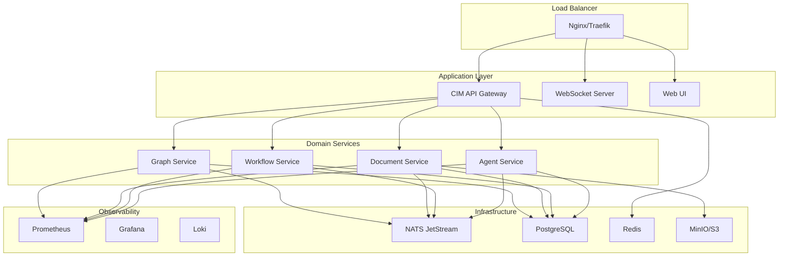

# CIM Production Deployment Guide

This comprehensive guide covers deploying the Composable Information Machine (CIM) to production environments using NixOS, Docker, and Kubernetes.

## Table of Contents

1. [Prerequisites](#prerequisites)
2. [Architecture Overview](#architecture-overview)
3. [Infrastructure Setup](#infrastructure-setup)
4. [NATS Deployment](#nats-deployment)
5. [CIM Services Deployment](#cim-services-deployment)
6. [Database Configuration](#database-configuration)
7. [Monitoring and Observability](#monitoring-and-observability)
8. [Security Configuration](#security-configuration)
9. [Scaling Strategies](#scaling-strategies)
10. [Backup and Recovery](#backup-and-recovery)
11. [Troubleshooting](#troubleshooting)

## Prerequisites

### System Requirements

**Minimum Production Requirements:**
- CPU: 8 cores (16 recommended)
- RAM: 32GB (64GB recommended)
- Storage: 500GB SSD (1TB recommended)
- Network: 1Gbps connection
- OS: NixOS 24.05 or Ubuntu 22.04 LTS

### Software Dependencies

```bash
# NixOS (recommended)
nix-channel --add https://nixos.org/channels/nixos-24.05 nixos
nix-channel --update

# Ubuntu alternative
curl -L https://nixos.org/nix/install | sh
```

### Required Services

1. **NATS JetStream** - Message broker
2. **PostgreSQL 16** - Event store
3. **Redis** - Caching and sessions
4. **MinIO** - Object storage (or S3)
5. **Prometheus** - Metrics
6. **Grafana** - Dashboards
7. **Loki** - Log aggregation

## Architecture Overview

CIM deploys as a distributed system with the following components:



### Deployment Patterns

1. **Monolithic** - All services in one process (development/small deployments)
2. **Microservices** - Each domain as separate service (recommended for production)
3. **Serverless** - Event-driven functions (for specific workloads)

### Network Architecture

```yaml
# Production network topology
networks:
  public:
    subnet: 10.0.1.0/24
    services:
      - load_balancer
      - web_ui
      
  application:
    subnet: 10.0.2.0/24
    services:
      - api_gateway
      - domain_services
      
  data:
    subnet: 10.0.3.0/24
    services:
      - postgresql
      - redis
      - nats
      - minio
      
  monitoring:
    subnet: 10.0.4.0/24
    services:
      - prometheus
      - grafana
      - loki
``` 