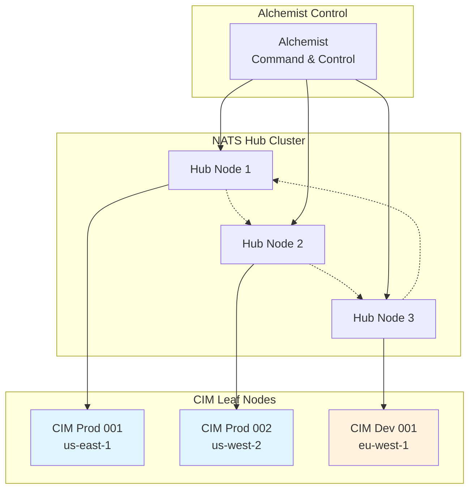

# CIM NATS Leaf Node Configuration Guide

## Overview

Each CIM instance operates as a NATS Leaf Node, providing isolated event processing while maintaining connectivity to the central NATS hub. This guide covers the configuration, deployment, and management of NATS Leaf Nodes in the CIM architecture.

## Architecture



## Leaf Node Benefits

1. **Isolation**: Each CIM instance has its own event space
2. **Security**: Leaf nodes can't access hub internals
3. **Scalability**: Add/remove nodes without cluster reconfiguration
4. **Flexibility**: Different configurations per instance
5. **Resilience**: Leaf node failures don't affect the hub

## Basic Configuration

### Minimal Leaf Node

```yaml
# /etc/nats/leaf-node.conf
server_name: cim-prod-001
listen: 0.0.0.0:4222

# Leaf node configuration
leafnodes {
  remotes: [
    {
      url: "nats://hub.cim.example.com:7422"
      credentials: "/etc/nats/leaf.creds"
    }
  ]
}

# JetStream for persistence
jetstream {
  store_dir: "/var/lib/nats/jetstream"
  max_memory_store: 4GB
  max_file_store: 100GB
}

# Monitoring
http: 0.0.0.0:8222
```

### NixOS Configuration

```nix
# nats-leaf.nix
{ config, pkgs, ... }:

{
  services.nats = {
    enable = true;
    serverName = "cim-${config.cim.instance.id}";
    
    # JetStream configuration
    jetstream = {
      enable = true;
      memoryStore = "4GB";
      fileStore = "100GB";
      storeDir = "/var/lib/nats/jetstream";
    };
    
    # Leaf node configuration
    settings = {
      leafnodes = {
        remotes = [
          {
            url = "nats://hub.cim.example.com:7422";
            credentials = config.sops.secrets."nats-leaf-creds".path;
            
            # TLS configuration
            tls = {
              cert_file = config.sops.secrets."nats-cert".path;
              key_file = config.sops.secrets."nats-key".path;
              ca_file = "/etc/ssl/certs/cim-ca.pem";
              verify = true;
            };
          }
        ];
        
        # Reconnect settings
        reconnect_interval = "5s";
        compression = "s2_auto";
      };
      
      # Local authorization
      authorization = {
        users = [
          {
            user = "cim-local";
            password = "$2a$11$..."; # bcrypt hash
            permissions = {
              publish = {
                allow = [ "domain.>" "events.>" ];
                deny = [ "system.>" ];
              };
              subscribe = {
                allow = [ ">" ];
              };
            };
          }
        ];
      };
    };
    
    # Monitoring endpoint
    monitoring = {
      enable = true;
      port = 8222;
    };
  };
}
```

## Advanced Configuration

### Multi-Hub Failover

```yaml
# Multi-hub configuration for high availability
leafnodes {
  remotes: [
    {
      urls: [
        "nats://hub1.cim.example.com:7422"
        "nats://hub2.cim.example.com:7422"
        "nats://hub3.cim.example.com:7422"
      ]
      credentials: "/etc/nats/leaf.creds"
      
      # Connection pool
      connection {
        name: "CIM-PROD-001"
        verbose: false
        pedantic: false
        tls_timeout: 2
        
        # Compression for WAN links
        compression: s2_better
      }
    }
  ]
  
  # Local reconnect buffer
  reconnect_buf_size: 8MB
}
```

### Subject Mapping

```yaml
# Map local subjects to hub subjects
leafnodes {
  remotes: [
    {
      url: "nats://hub:7422"
      
      # Import from hub
      import: [
        {
          stream: "commands.>"
          prefix: "hub"  # Becomes hub.commands.>
        }
        {
          stream: "global.events.>"
          # No prefix, imported as-is
        }
      ]
      
      # Export to hub
      export: [
        {
          stream: "domain.graph.>"
          prefix: "leaf.cim-001"  # Becomes leaf.cim-001.domain.graph.>
        }
        {
          stream: "metrics.>"
          # Exported as-is
        }
      ]
    }
  ]
}
```

### Security Configuration

```yaml
# Enhanced security configuration
leafnodes {
  remotes: [
    {
      url: "nats://hub:7422"
      
      # mTLS authentication
      tls: {
        cert_file: "/etc/nats/certs/leaf-cert.pem"
        key_file: "/etc/nats/certs/leaf-key.pem"
        ca_file: "/etc/nats/certs/ca.pem"
        verify: true
        verify_and_map: true
        timeout: 3
      }
      
      # JWT-based authentication
      credentials: "/etc/nats/leaf.creds"
      
      # Account isolation
      account: "CIM-PROD"
    }
  ]
}

# Local security
authorization {
  # JWT resolver for dynamic permissions
  resolver: {
    type: full
    dir: "/etc/nats/jwt"
    allow_delete: false
    interval: "2m"
  }
  
  # Timeout for auth calls
  auth_timeout: 3
}

# Connection limits
max_connections: 10000
max_control_line: 4KB
max_payload: 8MB
max_pending: 64MB

# Rate limiting
write_deadline: "10s"
max_subscriptions: 1000000
```

## JetStream Configuration

### Stream Templates

```yaml
# Automatic stream creation for domains
jetstream {
  store_dir: "/var/lib/nats/jetstream"
  
  # Domain event streams
  streams: [
    {
      name: "DOMAIN_EVENTS"
      subjects: [
        "domain.*.events.>"
        "domain.*.commands.>"
      ]
      retention: "limits"
      max_msgs: 10000000
      max_age: "30d"
      max_msg_size: "1MB"
      storage: "file"
      replicas: 1
      
      # Deduplication window
      duplicate_window: "2m"
    }
    {
      name: "METRICS"
      subjects: ["metrics.>"]
      retention: "interest"  # Delete when no consumers
      max_age: "1h"
      storage: "memory"
    }
  ]
}
```

### Consumer Configuration

```nix
# NixOS JetStream consumers
{ config, pkgs, ... }:

let
  createConsumer = name: cfg: pkgs.writeText "${name}-consumer.json" (builtins.toJSON {
    durable_name = name;
    deliver_subject = cfg.deliverSubject;
    ack_policy = cfg.ackPolicy or "explicit";
    ack_wait = cfg.ackWait or "30s";
    max_deliver = cfg.maxDeliver or 3;
    filter_subject = cfg.filterSubject or "";
    replay_policy = cfg.replayPolicy or "instant";
    
    # Rate limiting
    rate_limit = cfg.rateLimit or null;
    
    # Sampling
    sample_freq = cfg.sampleFreq or "";
  });
in
{
  # Create consumers on startup
  systemd.services.nats-consumers = {
    description = "NATS JetStream Consumers";
    after = [ "nats.service" ];
    wantedBy = [ "multi-user.target" ];
    
    script = ''
      # Wait for NATS
      until ${pkgs.natscli}/bin/nats stream ls; do
        sleep 1
      done
      
      # Create consumers
      ${pkgs.natscli}/bin/nats consumer add DOMAIN_EVENTS \
        --config ${createConsumer "graph-processor" {
          deliverSubject = "process.graph";
          filterSubject = "domain.graph.>";
          rateLimit = 1000;
        }}
      
      ${pkgs.natscli}/bin/nats consumer add DOMAIN_EVENTS \
        --config ${createConsumer "workflow-engine" {
          deliverSubject = "process.workflow";
          filterSubject = "domain.workflow.>";
          ackPolicy = "all";
        }}
    '';
  };
}
```

## Monitoring and Operations

### Health Checks

```nix
# health-check.nix
{ config, pkgs, ... }:

{
  # Leaf node health check script
  environment.systemPackages = [
    (pkgs.writeScriptBin "check-leaf-health" ''
      #!${pkgs.bash}/bin/bash
      
      set -e
      
      echo "=== NATS Leaf Node Health Check ==="
      echo "Instance: ${config.cim.instance.id}"
      echo
      
      # Check NATS service
      if systemctl is-active --quiet nats; then
        echo "✓ NATS service: Running"
      else
        echo "✗ NATS service: Not running"
        exit 1
      fi
      
      # Check leaf connection
      LEAF_STATUS=$(${pkgs.curl}/bin/curl -s http://localhost:8222/leafz | \
        ${pkgs.jq}/bin/jq -r '.leafnodes[0].current.state // "disconnected"')
      
      if [ "$LEAF_STATUS" = "connected" ]; then
        echo "✓ Leaf connection: Connected to hub"
      else
        echo "✗ Leaf connection: $LEAF_STATUS"
        exit 1
      fi
      
      # Check JetStream
      JS_ENABLED=$(${pkgs.natscli}/bin/nats --server=localhost:4222 \
        server report jetstream 2>/dev/null | grep -c "JetStream|enabled" || true)
      
      if [ "$JS_ENABLED" -gt 0 ]; then
        echo "✓ JetStream: Enabled"
      else
        echo "✗ JetStream: Disabled"
        exit 1
      fi
      
      # Check streams
      STREAMS=$(${pkgs.natscli}/bin/nats stream ls -j | \
        ${pkgs.jq}/bin/jq -r '.streams[]' 2>/dev/null || true)
      
      echo "✓ Streams: $(echo "$STREAMS" | wc -l) configured"
      
      # Check message rates
      MSG_RATE=$(${pkgs.curl}/bin/curl -s http://localhost:8222/varz | \
        ${pkgs.jq}/bin/jq -r '.in_msgs_rate // 0')
      
      echo "✓ Message rate: $MSG_RATE msg/s"
      
      echo
      echo "=== Leaf node healthy ==="
    '')
  ];
  
  # Automated health monitoring
  services.prometheus.exporters.nats = {
    enable = true;
    url = "http://localhost:8222";
  };
}
```

### Metrics Collection

```yaml
# Prometheus metrics configuration
scrape_configs:
  - job_name: 'nats-leaf'
    static_configs:
      - targets: ['localhost:7777']
    metric_relabel_configs:
      # Add instance labels
      - source_labels: [__address__]
        target_label: instance
        replacement: 'cim-${INSTANCE_ID}'
      
      # Add leaf node labels
      - source_labels: []
        target_label: leaf_node
        replacement: 'true'
```

### Grafana Dashboard

```json
{
  "dashboard": {
    "title": "CIM NATS Leaf Node",
    "panels": [
      {
        "title": "Leaf Connection Status",
        "targets": [
          {
            "expr": "nats_leafnode_connected"
          }
        ]
      },
      {
        "title": "Message Flow",
        "targets": [
          {
            "expr": "rate(nats_leafnode_in_msgs[5m])",
            "legendFormat": "Inbound"
          },
          {
            "expr": "rate(nats_leafnode_out_msgs[5m])",
            "legendFormat": "Outbound"
          }
        ]
      },
      {
        "title": "JetStream Storage",
        "targets": [
          {
            "expr": "nats_jetstream_storage_used_bytes / nats_jetstream_storage_total_bytes",
            "legendFormat": "Storage Usage %"
          }
        ]
      }
    ]
  }
}
```

## Troubleshooting

### Common Issues

#### 1. Leaf Node Won't Connect

```bash
# Check connectivity
nats --server=nats://hub:7422 --creds=/etc/nats/leaf.creds rtt

# Verify credentials
nats --server=nats://hub:7422 --creds=/etc/nats/leaf.creds \
  pub test.connection "hello"

# Check TLS
openssl s_client -connect hub:7422 \
  -cert /etc/nats/certs/leaf-cert.pem \
  -key /etc/nats/certs/leaf-key.pem \
  -CAfile /etc/nats/certs/ca.pem
```

#### 2. Message Flow Issues

```bash
# Trace message flow
nats --server=localhost:4222 sub ">" --headers-only

# Check subject mappings
curl -s http://localhost:8222/leafz | jq '.leafnodes[0].import'

# Verify permissions
nats --server=localhost:4222 pub domain.test "test" || echo "Permission denied"
```

#### 3. JetStream Problems

```bash
# Check stream status
nats stream info DOMAIN_EVENTS

# Repair stream
nats stream repair DOMAIN_EVENTS

# Check consumer lag
nats consumer report DOMAIN_EVENTS
```

### Debug Configuration

```yaml
# Enable debug logging
debug: true
trace: true
logtime: true
logfile: "/var/log/nats/debug.log"
logfile_size_limit: 100MB

# Connection debugging
connect_error_reports: 10
reconnect_error_reports: 10

# Verbose leaf node logging
leafnodes {
  remotes: [
    {
      url: "nats://hub:7422"
      verbose: true
      
      # Custom debug headers
      headers: {
        "X-Debug-Instance": "cim-001"
        "X-Debug-Time": "$time"
      }
    }
  ]
}
```

## Performance Tuning

### Network Optimization

```yaml
# Optimize for WAN connections
leafnodes {
  remotes: [
    {
      url: "nats://hub:7422"
      
      # Compression for bandwidth savings
      compression: s2_best
      
      # Connection pooling
      connections: 4
      
      # TCP tuning
      no_delay: false  # Enable Nagle's algorithm
      write_deadline: "30s"
      
      # Buffer sizes
      pending_size: 32MB
    }
  ]
}

# System tuning
max_pending: 128MB
write_deadline: "30s"
max_control_line: 4KB
```

### JetStream Optimization

```yaml
jetstream {
  # Memory vs disk trade-off
  max_memory_store: 8GB
  max_file_store: 1TB
  
  # Sync interval (performance vs durability)
  sync_interval: "30s"
  
  # Cipher for encryption at rest
  cipher: "aes"
  
  # Compression
  compression: "s2"
  
  # File store block size
  block_size: 64KB
}
```

## Best Practices

1. **Unique Server Names**: Always use unique server names for each leaf
2. **Credential Rotation**: Implement automated credential rotation
3. **Monitor Lag**: Watch for message lag between leaf and hub
4. **Resource Limits**: Set appropriate memory and storage limits
5. **Backup Streams**: Regular JetStream backup for disaster recovery
6. **Network Isolation**: Use separate network interfaces for leaf connections
7. **Rate Limiting**: Implement rate limits to prevent overload
8. **Circuit Breakers**: Add circuit breakers for downstream services

## Security Checklist

- [ ] TLS enabled for all connections
- [ ] Strong credentials with regular rotation
- [ ] Network firewall rules configured
- [ ] Subject permissions properly scoped
- [ ] Monitoring alerts configured
- [ ] Audit logging enabled
- [ ] Regular security scans
- [ ] Disaster recovery plan tested

---

This guide provides comprehensive coverage of NATS Leaf Node configuration for CIM deployments, ensuring secure, scalable, and reliable event-driven communication. 