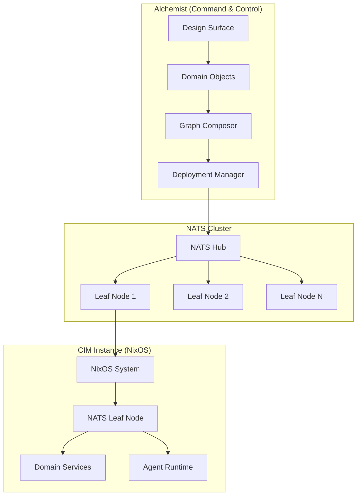
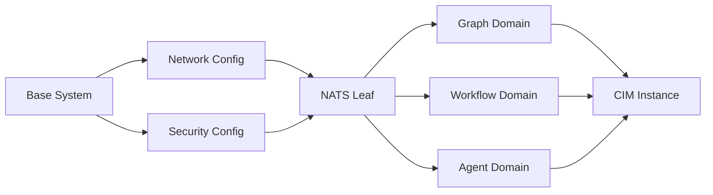

# CIM Production Deployment Guide

## Overview

The Composable Information Machine (CIM) is deployed as a distributed system where each CIM instance runs as a NixOS system configured as a NATS Leaf Node. Alchemist serves as the command and control system, providing the design surface for composing and deploying CIM instances.

## Architecture Overview



## Key Concepts

### 1. CIM as NixOS Leaf Node
- Each CIM instance is a complete NixOS system
- Runs as a NATS Leaf Node for event-driven communication
- Configured declaratively through Nix expressions
- Immutable infrastructure with atomic updates

### 2. Domain-Driven Configuration
- Domain Objects define the desired state
- Configurations are composed as Graphs
- Existing Nix files are imported and integrated
- Graph-based composition enables visual design

### 3. Alchemist Control Plane
- Central command and control system
- Visual design surface for CIM composition
- Deploys Agents and Services to Leaf Nodes
- Manages the lifecycle of CIM instances

## Prerequisites

### Hardware Requirements
- **Minimum**: 8 cores, 32GB RAM, 256GB SSD
- **Recommended**: 16 cores, 64GB RAM, 512GB NVMe SSD
- **GPU** (optional): NVIDIA RTX 3080+ or AMD equivalent for AI workloads

### Software Requirements
- NixOS 24.05 or later
- NATS Server 2.10+ with JetStream enabled
- Alchemist Control Plane deployed
- Valid TLS certificates for secure communication

### Network Requirements
- Static IP addresses or reliable DNS
- Ports: 4222 (NATS), 8222 (NATS monitoring), 6222 (NATS routing)
- Low latency connection to NATS hub (<50ms recommended)

## Deployment Process

### Step 1: Prepare Domain Configuration

```nix
# cim-instance-config.nix
{ config, pkgs, lib, ... }:

{
  # CIM Identity
  cim = {
    instance = {
      id = "cim-prod-001";
      name = "Production CIM Instance 001";
      location = "us-east-1";
      capabilities = [ "workflow" "agent" "graph" ];
    };
  };

  # NATS Leaf Node Configuration
  services.nats = {
    enable = true;
    jetstream = true;
    
    leafnode = {
      remotes = [{
        url = "nats://hub.cim.example.com:7422";
        credentials = "/etc/nats/leaf.creds";
      }];
    };
    
    authorization = {
      users = [
        {
          user = "cim-agent";
          permissions = {
            publish = [ "agent.>" "workflow.>" ];
            subscribe = [ "commands.>" "events.>" ];
          };
        }
      ];
    };
  };

  # Domain Services
  cim.domains = {
    graph = {
      enable = true;
      config = {
        maxNodes = 100000;
        persistence = "rocksdb";
      };
    };
    
    workflow = {
      enable = true;
      config = {
        maxConcurrent = 50;
        timeout = "30m";
      };
    };
    
    agent = {
      enable = true;
      config = {
        providers = [ "openai" "anthropic" "ollama" ];
        maxAgents = 100;
      };
    };
  };
}
```

### Step 2: Compose Configuration Graph

```typescript
// In Alchemist Design Surface
const cimConfig = new CIMConfiguration({
  id: "cim-prod-001",
  name: "Production CIM Instance 001",
  
  // Import existing Nix configurations
  imports: [
    "./hardware-configuration.nix",
    "./network-configuration.nix",
    "./security-hardening.nix"
  ],
  
  // Define domain objects
  domains: {
    graph: new GraphDomain({
      maxNodes: 100000,
      persistence: PersistenceType.RocksDB,
      indexing: IndexingStrategy.RTree
    }),
    
    workflow: new WorkflowDomain({
      maxConcurrent: 50,
      timeout: Duration.minutes(30),
      persistence: true
    }),
    
    agent: new AgentDomain({
      providers: [
        new OpenAIProvider({ apiKey: "..." }),
        new AnthropicProvider({ apiKey: "..." }),
        new OllamaProvider({ endpoint: "..." })
      ],
      maxAgents: 100
    })
  },
  
  // NATS Leaf Node configuration
  nats: {
    leafNode: {
      hub: "nats://hub.cim.example.com:7422",
      credentials: "/etc/nats/leaf.creds"
    }
  }
});

// Compose and validate
const graph = await composeConfiguration(cimConfig);
await validateConfiguration(graph);
```

### Step 3: Deploy to Target System

```bash
# Generate NixOS configuration from graph
alchemist deploy generate \
  --instance cim-prod-001 \
  --output /tmp/cim-config

# Deploy using nixos-anywhere
nixos-anywhere \
  --flake .#cim-prod-001 \
  --target-host root@cim-001.example.com \
  --disk-encryption-keys /secret/encryption-key

# Or deploy to existing system
nixos-rebuild switch \
  --flake .#cim-prod-001 \
  --target-host root@cim-001.example.com \
  --use-remote-sudo
```

### Step 4: Deploy Agents and Services

```typescript
// Deploy agents from Alchemist
const agent = new WorkflowAgent({
  id: "doc-processor",
  capabilities: ["document.process", "workflow.execute"],
  
  configuration: {
    maxConcurrent: 10,
    timeout: Duration.minutes(5)
  }
});

await alchemist.deployAgent(agent, "cim-prod-001");

// Deploy custom service
const service = new CustomService({
  id: "invoice-processor",
  runtime: "nodejs",
  
  code: await bundle("./services/invoice-processor"),
  
  resources: {
    cpu: "2",
    memory: "4Gi"
  }
});

await alchemist.deployService(service, "cim-prod-001");
```

## Configuration Management

### Domain Object Model

```typescript
interface DomainConfiguration {
  // Core identity
  id: string;
  version: string;
  
  // Domain-specific config
  config: Record<string, any>;
  
  // Dependencies on other domains
  dependencies: string[];
  
  // Resource requirements
  resources: {
    cpu?: string;
    memory?: string;
    storage?: string;
    gpu?: string;
  };
}
```

### Graph-Based Composition

Domain configurations are composed as directed graphs:



### Configuration Import

Existing Nix files are imported and merged:

```nix
# Import existing configurations
{ config, pkgs, lib, ... }:

let
  # Import existing Nix files
  existingHardware = import ./hardware-configuration.nix;
  existingNetwork = import ./network-configuration.nix;
  customPackages = import ./custom-packages.nix;
  
  # Domain configurations from Alchemist
  domainConfig = builtins.fromJSON (
    builtins.readFile ./domain-config.json
  );
in
{
  imports = [
    existingHardware
    existingNetwork
    customPackages
  ];
  
  # Apply domain configurations
  cim.domains = domainConfig.domains;
}
```

## Monitoring and Observability

### Metrics Collection

```nix
# Enable Prometheus metrics
services.prometheus = {
  enable = true;
  
  scrapeConfigs = [
    {
      job_name = "nats";
      static_configs = [{
        targets = [ "localhost:8222" ];
      }];
    }
    {
      job_name = "cim-domains";
      static_configs = [{
        targets = [ "localhost:9090" ];
      }];
    }
  ];
};

# Enable Grafana dashboards
services.grafana = {
  enable = true;
  
  provision = {
    dashboards = [
      {
        name = "CIM Instance";
        folder = "CIM";
        type = "file";
        path = ./dashboards/cim-instance.json;
      }
    ];
  };
};
```

### Event Monitoring

```typescript
// Monitor CIM events in Alchemist
const monitor = alchemist.createMonitor({
  instance: "cim-prod-001",
  
  events: [
    "domain.*.started",
    "agent.*.deployed",
    "workflow.*.completed",
    "error.*"
  ],
  
  handlers: {
    onEvent: (event) => {
      metrics.increment(`cim.${event.type}`);
      logger.info("CIM Event", { event });
    },
    
    onError: (error) => {
      alerts.send("CIM Error", { 
        instance: "cim-prod-001",
        error 
      });
    }
  }
});
```

## Security Hardening

### Network Security

```nix
# Firewall configuration
networking.firewall = {
  enable = true;
  
  allowedTCPPorts = [ 
    4222  # NATS client
    8222  # NATS monitoring
  ];
  
  # Restrict NATS routing to known hosts
  extraCommands = ''
    iptables -A INPUT -p tcp --dport 6222 -s 10.0.0.0/8 -j ACCEPT
    iptables -A INPUT -p tcp --dport 6222 -j DROP
  '';
};

# Enable fail2ban
services.fail2ban = {
  enable = true;
  
  jails.nats = {
    enabled = true;
    filter = "nats-auth";
    maxretry = 3;
  };
};
```

### TLS Configuration

```nix
# TLS for NATS
services.nats.tls = {
  enable = true;
  
  cert = "/etc/nats/certs/server-cert.pem";
  key = "/etc/nats/certs/server-key.pem";
  ca = "/etc/nats/certs/ca.pem";
  
  verify = true;
  verifyAndMap = true;
};

# Automatic certificate renewal
security.acme = {
  enable = true;
  
  certs."cim-001.example.com" = {
    email = "ops@example.com";
    
    postRun = ''
      systemctl reload nats
    '';
  };
};
```

### Access Control

```nix
# SELinux/AppArmor policies
security.apparmor = {
  enable = true;
  
  policies = {
    nats = builtins.readFile ./policies/nats.apparmor;
    cim-agent = builtins.readFile ./policies/cim-agent.apparmor;
  };
};

# User isolation
users.users.cim-agent = {
  isSystemUser = true;
  group = "cim";
  home = "/var/lib/cim-agent";
  createHome = true;
};
```

## Backup and Recovery

### Automated Backups

```nix
# Backup configuration
services.borgbackup.jobs.cim = {
  paths = [
    "/var/lib/cim"
    "/etc/nats"
    "/var/lib/grafana"
  ];
  
  repo = "borg@backup.example.com:cim-backups";
  
  encryption = {
    mode = "repokey-blake2";
    passCommand = "cat /etc/borg/passphrase";
  };
  
  startAt = "daily";
  
  prune.keep = {
    daily = 7;
    weekly = 4;
    monthly = 6;
  };
};
```

### Disaster Recovery

```bash
#!/usr/bin/env bash
# disaster-recovery.sh

# 1. Restore system configuration
nixos-rebuild switch \
  --flake .#cim-prod-001-restore \
  --target-host root@cim-001-dr.example.com

# 2. Restore data from backup
borg extract \
  borg@backup.example.com:cim-backups::latest \
  --target /

# 3. Rejoin NATS cluster
systemctl restart nats

# 4. Verify recovery
alchemist verify-instance cim-prod-001-dr
```

## Troubleshooting

### Common Issues

#### 1. NATS Leaf Node Connection Failed
```bash
# Check NATS logs
journalctl -u nats -f

# Verify credentials
nats-server -c /etc/nats/nats.conf -TVV

# Test connection
nats pub test "hello" --server nats://hub.cim.example.com:4222
```

#### 2. Domain Service Failures
```bash
# Check domain logs
journalctl -u cim-graph -f
journalctl -u cim-workflow -f

# Verify domain health
curl http://localhost:9090/health

# Restart domain
systemctl restart cim-graph
```

#### 3. Agent Deployment Issues
```typescript
// Debug agent deployment
const debug = await alchemist.debugDeployment({
  agent: "doc-processor",
  instance: "cim-prod-001",
  
  checks: [
    "connectivity",
    "resources",
    "permissions",
    "dependencies"
  ]
});

console.log(debug.report);
```

### Performance Tuning

```nix
# System performance tuning
boot.kernel.sysctl = {
  # Network optimizations
  "net.core.rmem_max" = 134217728;
  "net.core.wmem_max" = 134217728;
  
  # File handle limits
  "fs.file-max" = 1000000;
  
  # Memory management
  "vm.swappiness" = 10;
  "vm.dirty_ratio" = 15;
};

# NATS performance tuning
services.nats.extraConfig = ''
  max_payload: 8MB
  max_pending: 64MB
  
  write_deadline: "10s"
  
  max_connections: 10000
  max_subscriptions: 1000000
'';
```

## Maintenance Operations

### Rolling Updates

```bash
# Update CIM instance with zero downtime
alchemist update rolling \
  --instance cim-prod-001 \
  --strategy blue-green \
  --health-check http://localhost:9090/health
```

### Scaling Operations

```typescript
// Scale CIM instance
await alchemist.scale({
  instance: "cim-prod-001",
  
  domains: {
    agent: {
      replicas: 3,
      resources: {
        cpu: "4",
        memory: "8Gi"
      }
    }
  }
});
```

### Health Checks

```bash
#!/usr/bin/env bash
# health-check.sh

# Check NATS connectivity
nats rtt --server $NATS_URL

# Check domain health
for domain in graph workflow agent; do
  curl -f http://localhost:9090/api/v1/domains/$domain/health
done

# Check resource usage
free -h
df -h
systemctl status
```

## Best Practices

### 1. Configuration as Code
- Store all configurations in Git
- Use semantic versioning for changes
- Review changes before deployment
- Maintain configuration history

### 2. Immutable Infrastructure
- Never modify running systems directly
- Deploy new configurations atomically
- Roll back by deploying previous versions
- Use NixOS generations for recovery

### 3. Monitoring First
- Deploy monitoring before services
- Set up alerts for critical metrics
- Monitor both technical and business metrics
- Use distributed tracing for debugging

### 4. Security by Default
- Enable TLS everywhere
- Use least privilege principles
- Rotate credentials regularly
- Audit access logs

### 5. Documentation
- Document all custom configurations
- Maintain runbooks for operations
- Keep architecture diagrams updated
- Record deployment decisions

## Appendix A: Example Configurations

### Minimal CIM Instance

```nix
# minimal-cim.nix
{ config, pkgs, lib, ... }:

{
  cim = {
    instance.id = "cim-minimal";
    
    domains.graph = {
      enable = true;
      config.persistence = "memory";
    };
  };
  
  services.nats = {
    enable = true;
    leafnode.remotes = [{
      url = "nats://hub:7422";
    }];
  };
}
```

### High-Performance CIM Instance

```nix
# high-performance-cim.nix
{ config, pkgs, lib, ... }:

{
  cim = {
    instance = {
      id = "cim-performance";
      capabilities = [ "graph" "workflow" "agent" "gpu" ];
    };
    
    domains = {
      graph = {
        enable = true;
        config = {
          persistence = "rocksdb";
          cache = "64GB";
          parallelism = 32;
        };
      };
      
      agent = {
        enable = true;
        config = {
          gpu = true;
          providers = [ "local-llm" ];
          maxAgents = 1000;
        };
      };
    };
  };
  
  # GPU support
  services.xserver.videoDrivers = [ "nvidia" ];
  hardware.nvidia.package = config.boot.kernelPackages.nvidiaPackages.stable;
}
```

## Appendix B: Automation Scripts

### Deployment Pipeline

```yaml
# .github/workflows/deploy-cim.yml
name: Deploy CIM Instance

on:
  push:
    branches: [ main ]
    paths:
      - 'configurations/**.nix'
      - 'domains/**.json'

jobs:
  deploy:
    runs-on: ubuntu-latest
    
    steps:
    - uses: actions/checkout@v3
    
    - name: Validate Configuration
      run: |
        nix flake check
        alchemist validate configurations/
    
    - name: Deploy to Staging
      run: |
        alchemist deploy \
          --instance cim-staging \
          --wait \
          --health-check
    
    - name: Run Integration Tests
      run: |
        alchemist test integration \
          --target cim-staging
    
    - name: Deploy to Production
      if: success()
      run: |
        alchemist deploy \
          --instance cim-prod-001 \
          --strategy blue-green \
          --approval required
```

---

This deployment guide provides a comprehensive overview of deploying CIM instances as NixOS Leaf Nodes managed by Alchemist. The graph-based configuration approach enables visual design while maintaining the benefits of declarative infrastructure. 