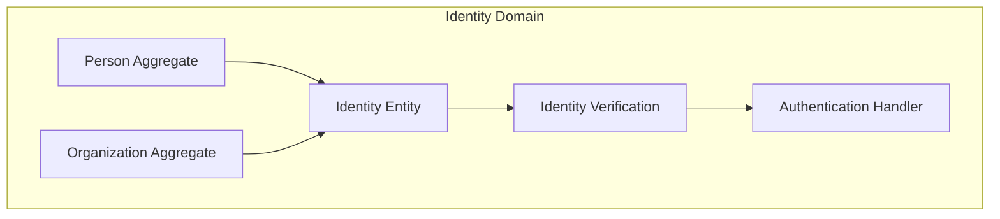
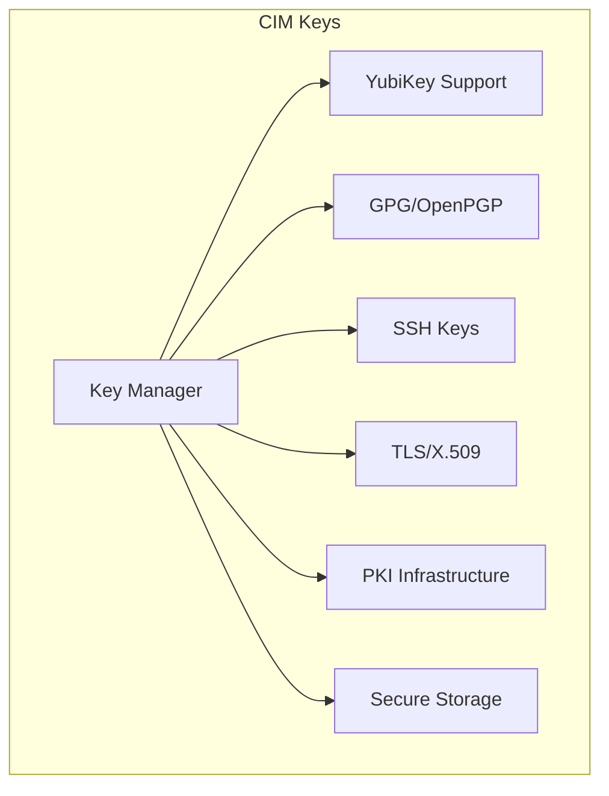
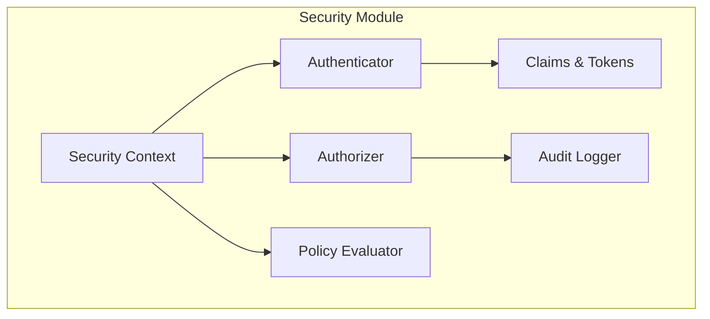
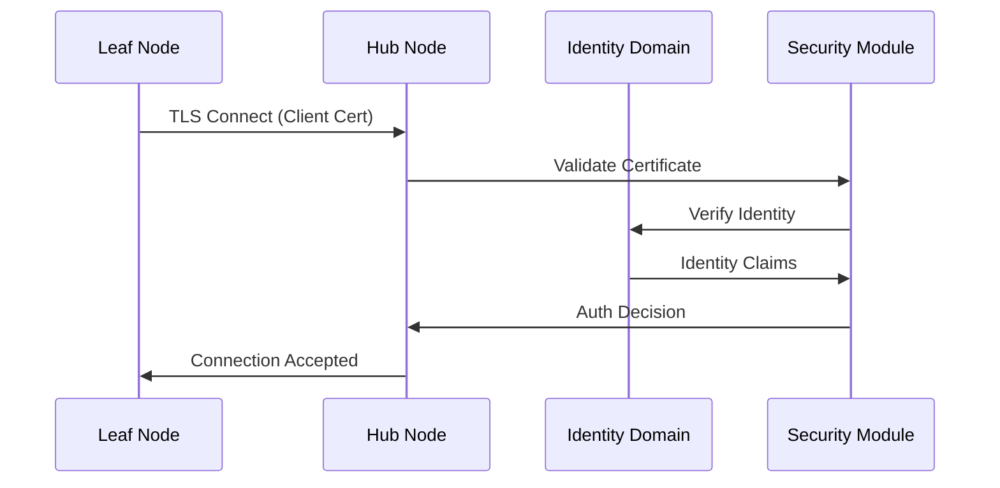
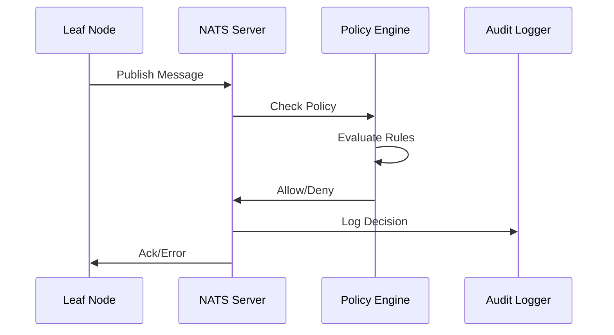

# CIM Security Architecture for Leaf Nodes

This document describes how CIM's security modules (`cim-security`, `cim-domain-identity`, and `cim-keys`) work together to establish secure Leaf Node deployments in the distributed CIM architecture.

## Overview

CIM implements a comprehensive security architecture that combines:
- **Identity Management** (`cim-domain-identity`): Managing persons, organizations, and their identities
- **Cryptographic Operations** (`cim-keys`): Key management, PKI, and hardware security modules
- **Security Policies** (`cim-security`): Authentication, authorization, and security context

These modules work together to secure NATS Leaf Nodes with strong identity verification, encrypted communications, and policy-based access control.

## Architecture Components

### 1. Identity Domain (`cim-domain-identity`)

The Identity domain manages the core identity concepts:



Key features:
- **Person/Organization Management**: Core identity aggregates
- **Identity Verification Levels**: Unverified → Email → Phone → Document → Fully Verified
- **Authentication Methods**: Password, OAuth2, SAML, API Key, Certificate
- **Cross-Domain Integration**: Links identities to other domains

### 2. Cryptographic Key Management (`cim-keys`)

The keys module provides comprehensive cryptographic operations:



Key features:
- **Hardware Security**: YubiKey integration for secure key storage
- **Multiple Key Types**: RSA, Ed25519, ECDSA, AES
- **PKI Infrastructure**: Root CA, Intermediate CA, certificate chains
- **Protocol Support**: SSH, GPG, TLS/X.509

### 3. Security Abstractions (`cim-security`)

The security module provides the policy and context layer:



Key features:
- **Claims-Based Security**: Flexible claim types and validation
- **Policy Engine**: Declarative security policies with conditions
- **Security Context**: Thread-safe context propagation
- **Audit Trail**: Comprehensive security event logging

## Leaf Node Security Setup Process

### Phase 1: Identity Establishment

1. **Create Node Identity**
   ```rust
   // Create a system identity for the Leaf Node
   let node_identity = IdentityAggregate::create_system_identity(
       node_name,
       IdentityType::System,
   )?;
   
   // Set initial verification level
   node_identity.update_verification(
       VerificationLevel::Basic,
       VerificationMethod::Document,
   )?;
   ```

2. **Link to Organization**
   ```rust
   // Link node to managing organization
   let relationship = IdentityRelationship {
       source_identity: org_identity_id,
       target_identity: node_identity_id,
       relationship_type: RelationshipType::Manages,
   };
   ```

### Phase 2: Cryptographic Setup

1. **Generate Node Keys**
   ```rust
   // Generate TLS certificate for NATS connection
   let (tls_key_id, tls_cert_id) = tls_manager
       .generate_self_signed_certificate(
           &format!("CN={},O=CIM,C=US", node_name),
           KeyAlgorithm::Ecdsa(EcdsaCurve::P256),
           365, // 1 year validity
       )
       .await?;
   
   // Generate Ed25519 key for signing
   let signing_key_id = ssh_manager
       .generate_key(
           KeyAlgorithm::Ed25519,
           format!("{}-signing", node_name),
           KeyUsage {
               sign: true,
               verify: true,
               ..Default::default()
           },
       )
       .await?;
   ```

2. **Hardware Security Module (Optional)**
   ```rust
   // If YubiKey is available, generate keys on hardware
   if let Some(yubikey) = yubikey_manager.detect_yubikey()? {
       let hw_key_id = yubikey_manager
           .generate_key_on_hardware(
               yubikey.serial,
               KeyAlgorithm::Ecdsa(EcdsaCurve::P256),
               format!("{}-hw", node_name),
           )
           .await?;
   }
   ```

### Phase 3: PKI Integration

1. **Certificate Chain Creation**
   ```rust
   // Create certificate request for node
   let csr = pki_manager
       .generate_csr(
           &tls_key_id,
           &node_subject,
           vec![node_fqdn.clone()], // SANs
       )
       .await?;
   
   // Issue certificate from intermediate CA
   let node_cert = pki_manager
       .issue_certificate(
           &intermediate_ca_key_id,
           &csr,
           365, // validity days
           false, // not a CA
           None, // no path length
       )
       .await?;
   ```

2. **Trust Store Configuration**
   ```rust
   // Add root CA to trust store
   pki_manager
       .add_trusted_root(root_ca_cert_id, root_ca_metadata)
       .await?;
   ```

### Phase 4: Security Policy Configuration

1. **Define Node Policies**
   ```rust
   // Create security policy for node
   let node_policy = SecurityPolicy::new(
       format!("node-policy-{}", node_name),
       "Leaf Node Access Policy",
   )
   .add_rule(
       PolicyRule::new(
           "allow-node-operations",
           PolicyCondition::And(vec![
               PolicyCondition::HasClaim("node_id".to_string()),
               PolicyCondition::InRole("leaf_node".to_string()),
           ]),
           PolicyEffect::Allow,
       )
       .with_resource("nats.publish.*")
       .with_action("publish")
   )
   .add_rule(
       PolicyRule::new(
           "deny-admin-operations",
           PolicyCondition::Not(Box::new(
               PolicyCondition::InRole("admin".to_string())
           )),
           PolicyEffect::Deny,
       )
       .with_resource("nats.admin.*")
       .with_action("*")
   );
   ```

2. **Authentication Configuration**
   ```rust
   // Configure authentication context
   let auth_context = AuthContext::new(
       node_identity.to_claims_identity(),
       "certificate", // authentication method
   )
   .with_property("node_id", node_id.to_string())
   .with_property("node_type", "leaf")
   .with_session_id(session_id);
   ```

### Phase 5: NATS Security Configuration

1. **Generate NATS Configuration**
   ```nix
   {
     # Nix configuration for NATS Leaf Node
     services.nats = {
       enable = true;
       
       leafnode = {
         remotes = [{
           url = "tls://hub.cim.network:7422";
           credentials = "/var/lib/cim/credentials/leaf.creds";
           tls = {
             cert_file = "/var/lib/cim/certs/${node_name}.crt";
             key_file = "/var/lib/cim/keys/${node_name}.key";
             ca_file = "/var/lib/cim/certs/ca-chain.crt";
           };
         }];
       };
       
       authorization = {
         users = [{
           user = "${node_name}";
           permissions = {
             publish = {
               allow = [ "node.${node_name}.>" ];
               deny = [ "admin.>" "system.>" ];
             };
             subscribe = {
               allow = [ "node.${node_name}.>" "broadcast.>" ];
             };
           };
         }];
       };
     };
   }
   ```

2. **Deploy Security Artifacts**
   ```rust
   // Export certificates and keys for deployment
   let cert_bundle = CertificateBundle {
       node_cert: tls_manager.export_certificate(&node_cert_id, CertificateFormat::Pem, true).await?,
       node_key: tls_manager.export_key(&tls_key_id, KeyExportFormat::Pem, true).await?,
       ca_chain: pki_manager.create_certificate_chain(&[root_ca_id, intermediate_ca_id]).await?,
   };
   
   // Create NATS credentials file
   let nats_creds = generate_nats_credentials(
       &node_identity,
       &signing_key_id,
       &node_policy,
   ).await?;
   ```

## Security Event Flow

### 1. Node Connection



### 2. Message Authorization



## Security Best Practices

### 1. Key Management

- **Hardware Security**: Use YubiKeys for high-value keys when available
- **Key Rotation**: Rotate signing keys every 90 days, TLS certs annually
- **Key Backup**: Maintain encrypted backups of critical keys
- **Separation**: Different keys for different purposes (signing, encryption, auth)

### 2. Identity Verification

- **Progressive Verification**: Start with basic, upgrade as trust increases
- **Multi-Factor**: Require MFA for administrative operations
- **Regular Audits**: Review identity relationships and permissions quarterly

### 3. Policy Management

- **Least Privilege**: Grant minimum necessary permissions
- **Explicit Deny**: Use explicit deny rules for sensitive operations
- **Policy Versioning**: Version control all policy changes
- **Regular Review**: Audit policy effectiveness monthly

### 4. Network Security

- **TLS Everywhere**: All NATS connections must use TLS
- **Certificate Pinning**: Pin CA certificates for critical connections
- **Network Segmentation**: Isolate Leaf Nodes in separate network segments
- **Monitoring**: Real-time monitoring of connection patterns

## Monitoring and Auditing

### 1. Security Metrics

```rust
// Track security metrics
let metrics = SecurityMetrics {
    authentication_attempts: Counter::new(),
    authentication_failures: Counter::new(),
    authorization_denials: Counter::new(),
    certificate_expirations: Gauge::new(),
    policy_violations: Counter::new(),
};
```

### 2. Audit Events

All security-relevant events are logged:
- Authentication attempts (success/failure)
- Authorization decisions
- Certificate operations
- Key usage
- Policy changes
- Identity modifications

### 3. Alerting

Configure alerts for:
- Failed authentication spikes
- Certificate expiration (30, 7, 1 day warnings)
- Policy violations
- Unusual access patterns
- Hardware token removal

## Disaster Recovery

### 1. Key Recovery

- Maintain secure backups of all keys (except hardware-bound)
- Use Shamir's Secret Sharing for critical keys
- Document recovery procedures
- Test recovery quarterly

### 2. Identity Recovery

- Regular snapshots of identity state
- Cross-domain relationship mapping
- Verification level documentation
- Recovery authentication procedures

### 3. Certificate Recovery

- Maintain certificate backups
- Document CA chain
- Emergency certificate issuance procedure
- Revocation procedures

## Integration Examples

### 1. Creating a Secure Leaf Node

```rust
async fn create_secure_leaf_node(
    node_name: &str,
    org_id: OrganizationId,
) -> Result<LeafNodeConfig> {
    // 1. Create identity
    let identity = create_node_identity(node_name, org_id).await?;
    
    // 2. Generate keys
    let keys = generate_node_keys(node_name).await?;
    
    // 3. Issue certificates
    let certs = issue_node_certificates(&identity, &keys).await?;
    
    // 4. Configure policies
    let policies = configure_node_policies(&identity).await?;
    
    // 5. Generate NATS config
    let nats_config = generate_nats_config(&identity, &certs, &policies)?;
    
    // 6. Deploy to NixOS
    deploy_to_nixos(node_name, &nats_config).await?;
    
    Ok(LeafNodeConfig {
        identity,
        keys,
        certs,
        policies,
        nats_config,
    })
}
```

### 2. Verifying Node Identity

```rust
async fn verify_node_identity(
    node_id: &str,
    presented_cert: &[u8],
) -> Result<VerificationResult> {
    // 1. Parse certificate
    let cert = parse_certificate(presented_cert)?;
    
    // 2. Verify certificate chain
    let chain_valid = pki_manager
        .verify_certificate_chain(&cert, &trusted_roots)
        .await?;
    
    // 3. Check identity claims
    let identity = identity_domain
        .find_by_certificate_fingerprint(&cert.fingerprint())
        .await?;
    
    // 4. Verify not revoked
    let not_revoked = !pki_manager
        .is_certificate_revoked(&cert.serial_number())
        .await?;
    
    // 5. Check verification level
    let verification_level = identity
        .verification()
        .verification_level;
    
    Ok(VerificationResult {
        valid: chain_valid && not_revoked,
        identity: Some(identity),
        verification_level,
    })
}
```

## Conclusion

The integration of `cim-security`, `cim-domain-identity`, and `cim-keys` provides a comprehensive security foundation for CIM Leaf Nodes. This architecture ensures:

1. **Strong Identity**: Every node has a verified identity linked to managing organizations
2. **Cryptographic Security**: Hardware-backed keys, PKI infrastructure, and secure protocols
3. **Policy-Based Access**: Fine-grained authorization with declarative policies
4. **Comprehensive Auditing**: Full audit trail of all security events
5. **Operational Excellence**: Monitoring, alerting, and disaster recovery procedures

By following this architecture, CIM Leaf Nodes maintain security while enabling the distributed, event-driven architecture that powers the Composable Information Machine. 