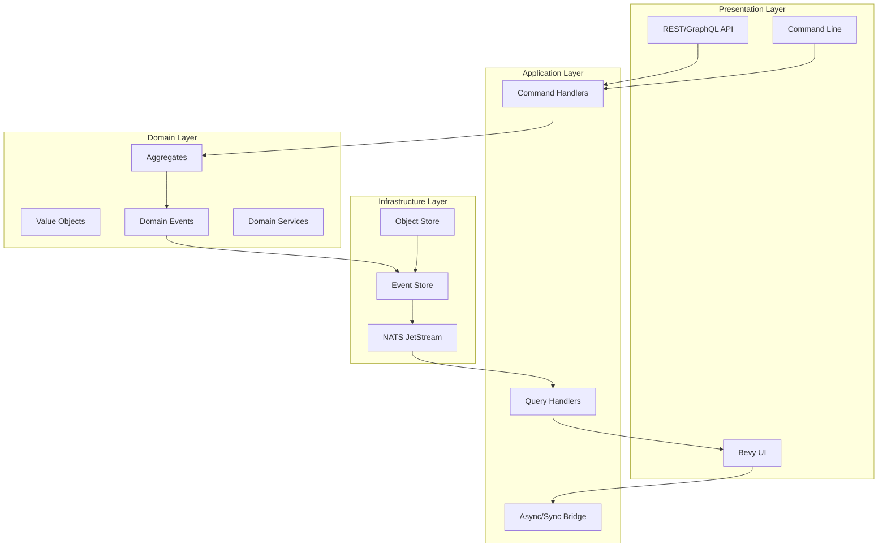

# CIM Architecture Overview

## Executive Summary

The Composable Information Machine (CIM) is a distributed, event-driven system that combines Domain-Driven Design (DDD), Event Sourcing, and Entity Component System (ECS) patterns to create a flexible platform for graph-based workflow management and knowledge representation.

## Architectural Principles

### 1. Event-Driven Architecture
- **Immutable Events**: All state changes are recorded as events
- **Event Sourcing**: Events are the source of truth
- **CID Chains**: Cryptographic integrity through content-addressed identifiers
- **NATS JetStream**: Distributed event streaming with persistence

### 2. Domain-Driven Design
- **Bounded Contexts**: Clear separation of domain concerns
- **Aggregates**: Consistency boundaries with business invariants
- **Value Objects**: Immutable domain concepts
- **Ubiquitous Language**: Consistent terminology across code and documentation

### 3. CQRS Pattern
- **Command Side**: Aggregates process commands and emit events
- **Query Side**: Projections optimized for read operations
- **Event Bridge**: Events flow from write to read models
- **Eventual Consistency**: Read models updated asynchronously

### 4. ECS Integration
- **Components**: Data-only structures for flexibility
- **Systems**: Pure functions operating on components
- **Entities**: Unique identifiers linking components
- **Resources**: Shared state for read models only

## System Architecture



## Domain Structure

### Core Domains

1. **Graph Domain** (`cim-domain-graph`)
   - Core graph operations (nodes, edges)
   - Spatial and conceptual positioning
   - Graph traversal and analysis
   - Multiple graph type support

2. **Agent Domain** (`cim-domain-agent`)
   - AI provider integration
   - Graph analysis capabilities
   - Semantic search infrastructure
   - Multi-model support

3. **Workflow Domain** (`cim-domain-workflow`)
   - Business process execution
   - State machine management
   - Context propagation
   - Decision logic

4. **ConceptualSpaces Domain** (`cim-domain-conceptualspaces`)
   - Semantic reasoning
   - Quality dimensions
   - Convex regions
   - Similarity metrics

5. **Identity Domain** (`cim-domain-identity`)
   - Person management
   - Organization hierarchies
   - Relationship tracking
   - Access control

### Supporting Domains

6. **Location Domain** (`cim-domain-location`)
   - Geospatial data
   - Hierarchical locations
   - Boundary management

7. **Document Domain** (`cim-domain-document`)
   - Document lifecycle
   - Version control
   - Content management

8. **Git Domain** (`cim-domain-git`)
   - Repository integration
   - Commit tracking
   - Cross-domain examples

## Event Flow Architecture

### Event Structure
```rust
pub struct DomainEvent {
    pub event_id: EventId,
    pub aggregate_id: AggregateId,
    pub event_cid: Cid,
    pub previous_cid: Option<Cid>,
    pub sequence: u64,
    pub payload: EventPayload,
    pub metadata: EventMetadata,
    pub timestamp: SystemTime,
}
```

### Event Processing Pipeline
1. **Command Reception**: External command enters system
2. **Aggregate Processing**: Business logic validation and state changes
3. **Event Generation**: Domain events created with CID chains
4. **Event Storage**: Persisted to NATS JetStream
5. **Projection Update**: Read models updated asynchronously
6. **UI Synchronization**: Bevy ECS components updated via bridge

## Integration Patterns

### Cross-Domain Communication
- **Event Translation**: Adapters convert between domain events
- **Bounded Context Mapping**: Clear interfaces between domains
- **Anti-Corruption Layers**: Protect domain integrity

### External System Integration
- **AI Providers**: OpenAI, Anthropic, Ollama
- **Version Control**: Git integration
- **Message Broker**: NATS for all communication
- **Object Storage**: IPLD for large objects

## Data Flow Patterns

### Write Path
```
Command → Handler → Aggregate → Events → EventStore → NATS
```

### Read Path
```
NATS → Projection → Query Handler → Response
```

### Bevy Visualization
```
NATS Events → AsyncSyncBridge → Bevy Systems → ECS Components → Rendering
```

## Scalability Architecture

### Horizontal Scaling
- **Stateless Handlers**: Command and query handlers can scale independently
- **Partitioned Aggregates**: Aggregates sharded by ID
- **Distributed Projections**: Read models can be replicated
- **NATS Clustering**: Built-in message broker scaling

### Performance Optimizations
- **Event Batching**: Reduce network overhead
- **Projection Caching**: In-memory caches for hot data
- **Lazy Loading**: On-demand aggregate reconstruction
- **Snapshot Strategy**: Periodic state snapshots

## Security Architecture

### Authentication & Authorization
- **Identity Domain**: Manages users and permissions
- **Policy Domain**: Business rule enforcement
- **Event-Level Security**: Signed events with actor tracking
- **NATS Security**: Subject-based access control

### Data Protection
- **CID Integrity**: Cryptographic event verification
- **Encryption at Rest**: Object store encryption
- **TLS in Transit**: All network communication encrypted
- **Audit Trail**: Complete event history

## Deployment Architecture

### Development Environment
```yaml
services:
  nats:
    image: nats:2.10-alpine
    command: ["-js"]
  
  cim-api:
    build: .
    environment:
      - NATS_URL=nats://nats:4222
      - RUST_LOG=info
```

### Production Considerations
- **Container Orchestration**: Kubernetes-ready
- **Service Mesh**: Istio/Linkerd compatible
- **Observability**: OpenTelemetry integration
- **Backup Strategy**: Event stream snapshots

## Technology Stack

### Core Technologies
- **Language**: Rust (Nightly 2024+)
- **Runtime**: Tokio async runtime
- **Message Broker**: NATS with JetStream
- **ECS Framework**: Bevy 0.16+
- **Serialization**: Serde with JSON/CBOR

### Key Libraries
- **Event Sourcing**: Custom implementation
- **CQRS**: cim-domain framework
- **AI Integration**: reqwest + provider SDKs
- **Vector Search**: In-memory with upgrade path

## Architectural Decisions

### ADR-001: Event Sourcing Over CRUD
**Decision**: Use event sourcing for all state changes
**Rationale**: Provides audit trail, enables replay, supports CQRS
**Consequences**: More complex, eventual consistency

### ADR-002: NATS as Message Backbone
**Decision**: All inter-service communication via NATS
**Rationale**: Unified messaging, built-in persistence, proven scale
**Consequences**: NATS becomes critical dependency

### ADR-003: ECS for Visualization
**Decision**: Use Bevy ECS for UI and visualization
**Rationale**: High performance, flexible composition, Rust native
**Consequences**: Learning curve, async/sync bridge needed

### ADR-004: DDD with Bounded Contexts
**Decision**: Strict domain boundaries with no shared state
**Rationale**: Maintainability, team autonomy, clear ownership
**Consequences**: Some duplication, explicit integration

## Future Architecture Evolution

### Planned Enhancements
1. **Graph Database Integration**: Neo4j/DGraph for complex queries
2. **Vector Database**: Qdrant/Weaviate for production search
3. **Workflow Engine**: Temporal integration for long-running processes
4. **Multi-Region**: Geographic distribution support

### Extension Points
- **Plugin Architecture**: Dynamic domain loading
- **Custom AI Providers**: Pluggable provider interface
- **Graph Algorithms**: Extensible analysis capabilities
- **Visualization Themes**: Customizable rendering

## Conclusion

The CIM architecture provides a solid foundation for building complex, event-driven systems with strong domain boundaries and flexible visualization capabilities. The combination of DDD, Event Sourcing, and ECS creates a unique platform for graph-based workflow management that can evolve with changing business needs while maintaining architectural integrity. 