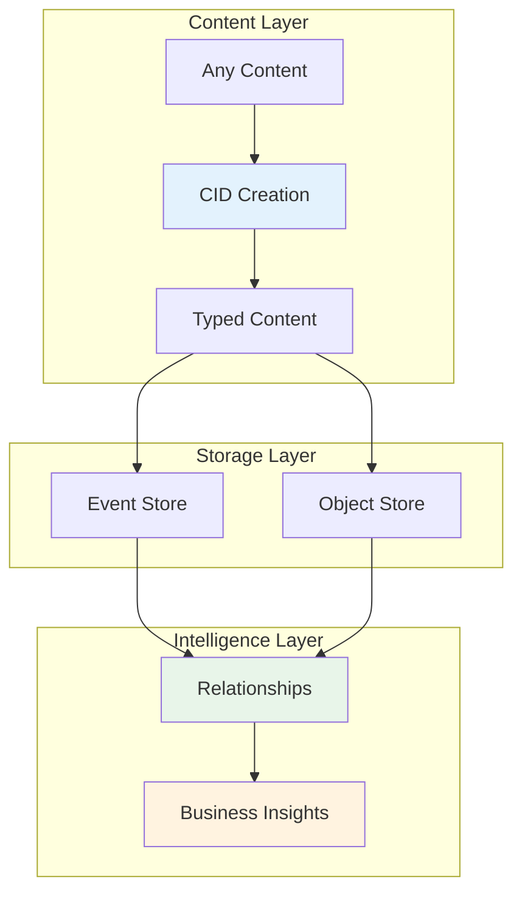

# CID and IPLD Architecture for CIM

## Overview

The Composable Information Machine (CIM) uses Content Identifiers (CIDs) and InterPlanetary Linked Data (IPLD) as the foundation for its content-addressed storage and intelligent information network. This architecture enables:

- **Type-safe content addressing** with domain-specific codecs
- **Cryptographic integrity** through Merkle DAGs
- **Intelligent content handling** with MIME type detection
- **Rich relationships** between all content
- **Emergent business intelligence** from information flows

## Architecture Documents

### Core Components

1. **[Core CID/IPLD Implementation](./cid-ipld-core.md)**
   - CID creation and multihash selection
   - TypedContent trait and implementation
   - Basic IPLD integration

2. **[Content Types and Codecs](./cid-ipld-content-types.md)**
   - Domain-specific IPLD codec definitions
   - Content type enumeration
   - Type-safe content handling

3. **[Event and Object Stores](./cid-ipld-stores.md)**
   - Event Store with Merkle DAG
   - Object Store architecture
   - Distributed partitioning strategies

### Content Management

4. **[Documents and Multimedia](./cid-ipld-documents-media.md)**
   - Document format support
   - Multimedia bundles and synchronization
   - Text extraction and embedding generation

5. **[Infrastructure Tracking](./cid-ipld-infrastructure.md)**
   - Source code and AST support
   - Nix configuration tracking
   - Git integration and dog-fooding capabilities

6. **[Git Hash and CID Isomorphism](./cid-ipld-git-isomorphism.md)**
   - Bidirectional Git hash to CID translation
   - Git object storage in IPLD
   - Seamless Git remote integration

7. **[Content Transformations](./cid-ipld-transformations.md)**
   - Transformation registry and graph
   - Quality tracking and provenance
   - Node visualization transformations

### Advanced Features

8. **[MIME Types and File Groups](./cid-ipld-mime-filegroups.md)**
   - Dynamic MIME type detection
   - File group management
   - Container and archive support

9. **[IPLD Relationships](./cid-ipld-relationships.md)**
   - Relationship predicates and types
   - Relationship indexing and queries
   - Path finding algorithms

10. **[Business Intelligence Network](./cid-ipld-business-intelligence.md)**
    - Intelligent information graph
    - Pattern detection and insights
    - Dashboard projections and metrics

## Quick Start

For implementing CID support in CIM:

1. Start with [Core CID/IPLD Implementation](./cid-ipld-core.md) for basic CID creation
2. Define your content types in [Content Types and Codecs](./cid-ipld-content-types.md)
3. Set up storage with [Event and Object Stores](./cid-ipld-stores.md)
4. Add intelligence with [IPLD Relationships](./cid-ipld-relationships.md)

## Key Benefits

- **Self-describing content** through typed CIDs
- **Automatic content routing** based on type
- **Cryptographic integrity** for all data
- **Rich semantic relationships** between content
- **Emergent business intelligence** from usage patterns

## Architecture Diagram

## Next Steps

- Review the [Core Implementation](./cid-ipld-core.md) to understand the foundation
- Explore [Business Intelligence](./cid-ipld-business-intelligence.md) to see the full potential
- Check [Content Transformations](./cid-ipld-transformations.md) for content processing capabilities
