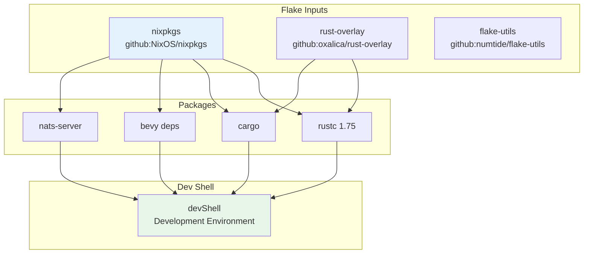

# Infrastructure Tracking

> Part of the [CID/IPLD Architecture](./cid-ipld-architecture.md)

## Overview

CIM provides first-class support for tracking infrastructure, source code, and development environments. This enables powerful dog-fooding scenarios where CIM becomes the primary tool for understanding and managing its own development evolution.

## Source Code Tracking

### Code Content Types

```rust
#[derive(Debug, Clone, PartialEq, Serialize, Deserialize)]
pub enum Language {
    Rust,
    Python,
    JavaScript,
    TypeScript,
    Go,
    Java,
    CSharp,
    Cpp,
    Nix,
    Shell,
    Yaml,
    Toml,
    Other(String),
}

#[derive(Debug, Clone, Serialize, Deserialize)]
pub struct SourceCode {
    pub cid: Cid,
    pub language: Language,
    pub content: String,
    pub ast: Option<AbstractSyntaxTree>,
    pub dependencies: Vec<Dependency>,
    pub metadata: CodeMetadata,
}

#[derive(Debug, Clone, Serialize, Deserialize)]
pub struct CodeMetadata {
    pub file_path: PathBuf,
    pub line_count: usize,
    pub byte_size: usize,
    pub complexity_metrics: ComplexityMetrics,
    pub last_modified: SystemTime,
    pub author: Option<String>,
}

#[derive(Debug, Clone, Serialize, Deserialize)]
pub struct ComplexityMetrics {
    pub cyclomatic_complexity: u32,
    pub cognitive_complexity: u32,
    pub lines_of_code: u32,
    pub comment_lines: u32,
    pub test_coverage: Option<f32>,
}
```

### Abstract Syntax Tree Support

```rust
#[derive(Debug, Clone, Serialize, Deserialize)]
pub struct AbstractSyntaxTree {
    pub root: AstNode,
    pub language: Language,
    pub parser_version: String,
}

#[derive(Debug, Clone, Serialize, Deserialize)]
pub struct AstNode {
    pub node_type: AstNodeType,
    pub span: SourceSpan,
    pub children: Vec<AstNode>,
    pub attributes: HashMap<String, Value>,
}

#[derive(Debug, Clone, Serialize, Deserialize)]
pub enum AstNodeType {
    // Common nodes
    Module,
    Function,
    Class,
    Method,
    Variable,
    Import,

    // Language-specific nodes
    RustImpl,
    RustTrait,
    RustMacro,

    PythonDecorator,
    PythonAsyncDef,

    JavaScriptArrowFunction,
    TypeScriptInterface,

    // Generic
    Other(String),
}

impl AbstractSyntaxTree {
    pub fn extract_symbols(&self) -> Vec<Symbol> {
        let mut symbols = Vec::new();
        self.extract_symbols_recursive(&self.root, &mut symbols);
        symbols
    }

    pub fn find_dependencies(&self) -> Vec<Dependency> {
        let mut deps = Vec::new();
        self.find_imports_recursive(&self.root, &mut deps);
        deps
    }

    pub fn calculate_complexity(&self) -> ComplexityMetrics {
        // Calculate various complexity metrics from AST
        ComplexityMetrics {
            cyclomatic_complexity: self.calculate_cyclomatic(),
            cognitive_complexity: self.calculate_cognitive(),
            lines_of_code: self.count_executable_lines(),
            comment_lines: self.count_comment_lines(),
            test_coverage: None, // Requires external data
        }
    }
}
```

## Nix Configuration Tracking

### Nix Types

```rust
#[derive(Debug, Clone, PartialEq, Serialize, Deserialize)]
pub enum NixConfigType {
    Flake,
    Module,
    Package,
    Overlay,
    DevShell,
    NixOSConfig,
    HomeManagerConfig,
    DarwinConfig,
}

#[derive(Debug, Clone, Serialize, Deserialize)]
pub struct NixConfiguration {
    pub cid: Cid,
    pub config_type: NixConfigType,
    pub content: String,
    pub parsed: NixExpression,
    pub dependencies: NixDependencies,
    pub metadata: NixMetadata,
}

#[derive(Debug, Clone, Serialize, Deserialize)]
pub struct NixDependencies {
    pub flake_inputs: HashMap<String, FlakeInput>,
    pub packages: Vec<NixPackage>,
    pub overlays: Vec<Cid>,
    pub modules: Vec<Cid>,
}

#[derive(Debug, Clone, Serialize, Deserialize)]
pub struct FlakeInput {
    pub name: String,
    pub url: String,
    pub follows: Option<String>,
    pub flake: bool,
}

impl NixConfiguration {
    pub fn build_dependency_graph(&self) -> DependencyGraph {
        let mut graph = DependencyGraph::new();

        // Add flake inputs
        for (name, input) in &self.dependencies.flake_inputs {
            graph.add_node(DependencyNode {
                name: name.clone(),
                node_type: DependencyType::FlakeInput,
                source: input.url.clone(),
            });
        }

        // Add packages
        for package in &self.dependencies.packages {
            graph.add_node(DependencyNode {
                name: package.name.clone(),
                node_type: DependencyType::Package,
                source: package.source.clone(),
            });
        }

        // Build edges based on dependencies
        self.trace_dependencies(&mut graph);

        graph
    }

    pub fn visualize_closure(&self) -> ClosureVisualization {
        // Create visual representation of Nix closure
        ClosureVisualization {
            root: self.cid,
            nodes: self.collect_closure_nodes(),
            edges: self.collect_closure_edges(),
            size_info: self.calculate_closure_size(),
        }
    }
}
```

### Nix Dependency Graph



## Git Integration

### Git Object Tracking

```rust
#[derive(Debug, Clone, PartialEq, Serialize, Deserialize)]
pub enum GitObjectType {
    Commit,
    Tree,
    Blob,
    Tag,
    Branch,
}

#[derive(Debug, Clone, Serialize, Deserialize)]
pub struct GitObject {
    pub cid: Cid,
    pub git_oid: String,
    pub object_type: GitObjectType,
    pub content: GitObjectContent,
    pub metadata: GitMetadata,
}

#[derive(Debug, Clone, Serialize, Deserialize)]
pub enum GitObjectContent {
    Commit {
        tree: String,
        parents: Vec<String>,
        author: GitSignature,
        committer: GitSignature,
        message: String,
    },
    Tree {
        entries: Vec<TreeEntry>,
    },
    Blob {
        content: Vec<u8>,
        size: usize,
    },
    Tag {
        target: String,
        tagger: GitSignature,
        message: String,
    },
}

impl GitObject {
    pub fn to_cid(&self) -> Result<Cid> {
        // Convert Git object to CID
        let bytes = self.serialize()?;
        let hash = Sha256::digest(&bytes); // Use SHA256 for Git compatibility
        let mh = Multihash::wrap(0x12, &hash)?;
        Ok(Cid::new_v1(CIM_GIT_OBJECT, mh))
    }

    pub fn track_history(&self, depth: usize) -> Vec<GitCommitHistory> {
        // Track commit history up to specified depth
        match &self.content {
            GitObjectContent::Commit { parents, .. } => {
                self.follow_parents(parents, depth)
            }
            _ => Vec::new(),
        }
    }
}
```

### Repository Tracking

```rust
pub struct GitRepositoryTracker {
    repo_path: PathBuf,
    object_store: Arc<ObjectStore>,
    index: GitObjectIndex,
}

impl GitRepositoryTracker {
    pub async fn track_repository(&mut self) -> Result<RepositorySnapshot> {
        let repo = Repository::open(&self.repo_path)?;

        // Track all branches
        let branches = self.track_branches(&repo).await?;

        // Track all tags
        let tags = self.track_tags(&repo).await?;

        // Track working directory
        let working_dir = self.track_working_directory(&repo).await?;

        // Create repository snapshot
        let snapshot = RepositorySnapshot {
            snapshot_time: SystemTime::now(),
            head: self.get_head_cid(&repo)?,
            branches,
            tags,
            working_dir,
            statistics: self.calculate_repo_stats(&repo)?,
        };

        // Store snapshot
        let snapshot_cid = create_typed_cid(&snapshot)?;
        self.object_store.put_typed_object(
            serde_json::to_vec(&snapshot)?,
            ContentType::GitObject(GitObjectType::Commit)
        ).await?;

        Ok(snapshot)
    }

    pub async fn visualize_commit_graph(
        &self,
        start: Cid,
        depth: usize,
    ) -> CommitGraph {
        // Create visual representation of commit history
        let mut graph = CommitGraph::new();
        let mut queue = VecDeque::new();
        queue.push_back((start, 0));

        while let Some((commit_cid, current_depth)) = queue.pop_front() {
            if current_depth >= depth {
                continue;
            }

            let commit = self.object_store.get_typed::<GitObject>(commit_cid).await?;
            graph.add_commit(commit_cid, &commit);

            if let GitObjectContent::Commit { parents, .. } = &commit.content {
                for parent in parents {
                    let parent_cid = self.index.get_cid(parent)?;
                    queue.push_back((parent_cid, current_depth + 1));
                    graph.add_edge(commit_cid, parent_cid);
                }
            }
        }

        graph
    }
}
```

## Development Environment Snapshots

### Environment Tracking

```rust
#[derive(Debug, Clone, Serialize, Deserialize)]
pub struct DevelopmentEnvironment {
    pub environment_id: Cid,
    pub timestamp: SystemTime,
    pub os_info: OsInfo,
    pub nix_config: Option<Cid>,
    pub installed_packages: Vec<InstalledPackage>,
    pub environment_variables: HashMap<String, String>,
    pub tool_versions: HashMap<String, Version>,
}

#[derive(Debug, Clone, Serialize, Deserialize)]
pub struct OsInfo {
    pub os_type: String,
    pub version: String,
    pub kernel_version: String,
    pub architecture: String,
}

#[derive(Debug, Clone, Serialize, Deserialize)]
pub struct InstalledPackage {
    pub name: String,
    pub version: Version,
    pub source: PackageSource,
    pub dependencies: Vec<String>,
}

impl DevelopmentEnvironment {
    pub async fn capture_current() -> Result<Self> {
        let os_info = Self::get_os_info()?;
        let nix_config = Self::find_nix_config().await?;
        let installed_packages = Self::scan_installed_packages().await?;
        let environment_variables = Self::get_relevant_env_vars()?;
        let tool_versions = Self::detect_tool_versions().await?;

        Ok(Self {
            environment_id: Cid::default(), // Will be set when stored
            timestamp: SystemTime::now(),
            os_info,
            nix_config,
            installed_packages,
            environment_variables,
            tool_versions,
        })
    }

    pub fn compare_with(&self, other: &Self) -> EnvironmentDiff {
        EnvironmentDiff {
            os_changed: self.os_info != other.os_info,
            package_changes: self.diff_packages(&other.installed_packages),
            env_var_changes: self.diff_env_vars(&other.environment_variables),
            tool_version_changes: self.diff_tool_versions(&other.tool_versions),
        }
    }
}
```

## Dog-fooding Capabilities

### Self-Analysis

```rust
pub struct CimSelfAnalyzer {
    codebase_tracker: CodebaseTracker,
    dependency_analyzer: DependencyAnalyzer,
    evolution_tracker: EvolutionTracker,
}

impl CimSelfAnalyzer {
    pub async fn analyze_self(&self) -> SelfAnalysis {
        // Analyze CIM's own codebase
        let code_analysis = self.codebase_tracker.analyze_codebase().await?;

        // Track dependencies
        let dependency_graph = self.dependency_analyzer.build_full_graph().await?;

        // Analyze evolution over time
        let evolution = self.evolution_tracker.analyze_history().await?;

        SelfAnalysis {
            codebase_metrics: code_analysis.metrics,
            architecture_diagram: self.generate_architecture_diagram(&code_analysis),
            dependency_graph,
            evolution_timeline: evolution.timeline,
            insights: self.generate_insights(&code_analysis, &evolution),
        }
    }

    pub async fn track_development_session(&mut self) -> DevelopmentSession {
        let start_snapshot = DevelopmentEnvironment::capture_current().await?;
        let start_codebase = self.codebase_tracker.snapshot().await?;

        // Track changes during session
        let session = DevelopmentSession {
            session_id: Uuid::new_v4(),
            start_time: SystemTime::now(),
            start_environment: start_snapshot.environment_id,
            start_codebase: start_codebase.cid,
            changes: Vec::new(),
        };

        // Start monitoring for changes
        self.start_monitoring(session.session_id).await?;

        session
    }
}
```

### Architecture Visualization

```rust
pub struct ArchitectureVisualizer {
    module_analyzer: ModuleAnalyzer,
    dependency_tracer: DependencyTracer,
}

impl ArchitectureVisualizer {
    pub fn generate_module_diagram(&self) -> ModuleDiagram {
        let modules = self.module_analyzer.discover_modules();
        let dependencies = self.dependency_tracer.trace_module_dependencies(&modules);

        ModuleDiagram {
            modules: modules.into_iter().map(|m| ModuleNode {
                name: m.name,
                path: m.path,
                size: m.line_count,
                complexity: m.complexity,
            }).collect(),
            dependencies: dependencies.into_iter().map(|d| DependencyEdge {
                from: d.from_module,
                to: d.to_module,
                dependency_type: d.dep_type,
                strength: d.coupling_score,
            }).collect(),
        }
    }
}
```

## Build Artifact Tracking

```rust
#[derive(Debug, Clone, Serialize, Deserialize)]
pub struct BuildArtifact {
    pub artifact_id: Cid,
    pub artifact_type: ArtifactType,
    pub source_commit: Cid,
    pub build_config: BuildConfiguration,
    pub dependencies: Vec<Cid>,
    pub metadata: BuildMetadata,
}

#[derive(Debug, Clone, Serialize, Deserialize)]
pub enum ArtifactType {
    Binary,
    Library,
    Documentation,
    Container,
    Package,
}

#[derive(Debug, Clone, Serialize, Deserialize)]
pub struct BuildConfiguration {
    pub target: String,
    pub profile: String,
    pub features: Vec<String>,
    pub environment: HashMap<String, String>,
}

impl BuildArtifact {
    pub fn track_provenance(&self) -> BuildProvenance {
        BuildProvenance {
            source_code: self.source_commit,
            build_time: self.metadata.build_time,
            builder: self.metadata.builder_id,
            inputs: self.collect_build_inputs(),
            outputs: vec![self.artifact_id],
            reproducible: self.check_reproducibility(),
        }
    }
}
```

## Related Documents

- [Git Hash and CID Isomorphism](./cid-ipld-git-isomorphism.md) - Git/CID translation
- [Content Types and Codecs](./cid-ipld-content-types.md) - Infrastructure codecs
- [Event and Object Stores](./cid-ipld-stores.md) - Storage for infrastructure data
- [Business Intelligence Network](./cid-ipld-business-intelligence.md) - Infrastructure insights
- [Content Transformations](./cid-ipld-transformations.md) - Code transformations

## Next Steps

1. Set up source code tracking for your repositories
2. Configure Nix dependency analysis
3. Implement development environment snapshots
4. Enable self-analysis for dog-fooding insights
