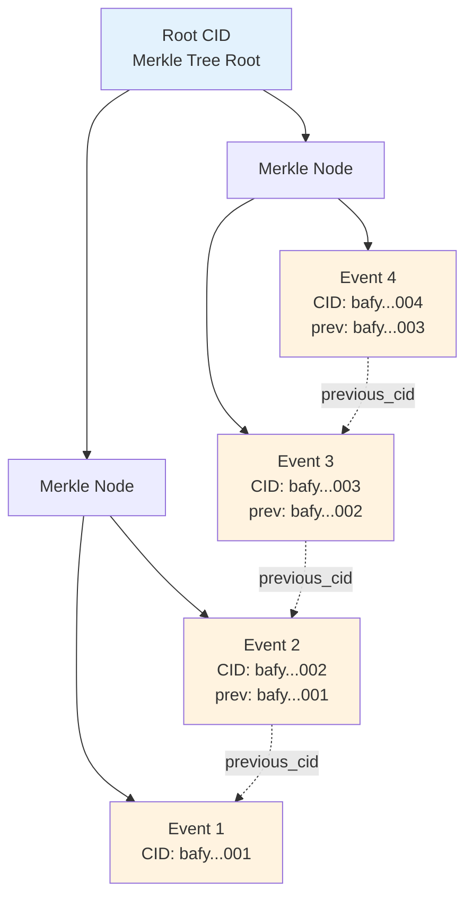
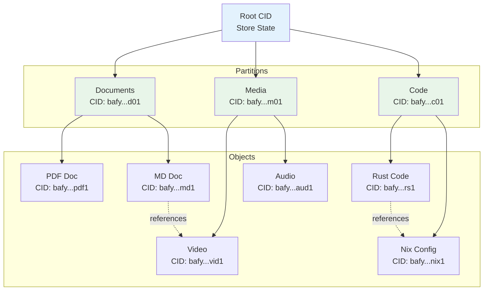

# Event and Object Stores

> Part of the [CID/IPLD Architecture](./cid-ipld-architecture.md)

## Overview

CIM implements two primary storage systems built on CIDs:
- **Event Store**: Sequential, append-only storage for domain events
- **Object Store**: Content-addressed storage for arbitrary objects

Both stores form Merkle DAGs that provide cryptographic integrity and enable distributed operation.

## Event Store Architecture

### Core Structure

```rust
pub struct EventStore {
    // Current root CID representing entire event history
    pub root_cid: RwLock<Cid>,

    // Event storage backend
    storage: Box<dyn EventStorage>,

    // Index for efficient queries
    index: EventIndex,

    // Merkle tree for event verification
    merkle_tree: MerkleTree,
}

#[derive(Debug, Clone, Serialize, Deserialize)]
pub struct StoredEvent {
    pub event_cid: Cid,
    pub previous_cid: Option<Cid>,
    pub aggregate_id: AggregateId,
    pub sequence: u64,
    pub timestamp: SystemTime,
    pub event_type: String,
    pub payload: Vec<u8>,
    pub metadata: EventMetadata,
}

impl EventStore {
    pub async fn append_event(&mut self, event: DomainEvent) -> Result<Cid> {
        // Serialize event
        let payload = serde_json::to_vec(&event)?;

        // Get current root
        let previous_cid = *self.root_cid.read().await;

        // Create event with chain
        let stored_event = StoredEvent {
            event_cid: Cid::default(), // Will be set after hashing
            previous_cid: Some(previous_cid),
            aggregate_id: event.aggregate_id(),
            sequence: self.next_sequence().await?,
            timestamp: SystemTime::now(),
            event_type: event.event_type(),
            payload: payload.clone(),
            metadata: event.metadata(),
        };

        // Calculate CID including previous CID
        let event_cid = self.calculate_event_cid(&stored_event)?;
        let stored_event = StoredEvent { event_cid, ..stored_event };

        // Store event
        self.storage.store_event(&stored_event).await?;

        // Update index
        self.index.index_event(&stored_event).await?;

        // Update merkle tree
        self.merkle_tree.add_leaf(event_cid);

        // Update root CID
        let new_root = self.merkle_tree.root();
        *self.root_cid.write().await = new_root;

        Ok(event_cid)
    }

    fn calculate_event_cid(&self, event: &StoredEvent) -> Result<Cid> {
        let mut hasher = blake3::Hasher::new();

        // Include previous CID in hash
        if let Some(prev) = &event.previous_cid {
            hasher.update(prev.to_bytes().as_slice());
        }

        // Include event data
        hasher.update(&event.aggregate_id.to_bytes());
        hasher.update(&event.sequence.to_le_bytes());
        hasher.update(&event.timestamp.duration_since(UNIX_EPOCH)?.as_secs().to_le_bytes());
        hasher.update(event.event_type.as_bytes());
        hasher.update(&event.payload);

        let hash = hasher.finalize();
        let mh = Multihash::wrap(0x1e, hash.as_bytes())?;
        Ok(Cid::new_v1(CIM_EVENT, mh))
    }
}
```

### Event Merkle DAG



## Object Store Architecture

### Core Structure

```rust
pub struct ObjectStore {
    // Root CID representing entire object store state
    pub root_cid: RwLock<Cid>,

    // Object storage backend
    storage: Box<dyn ObjectStorage>,

    // Type-based partitioning
    partitions: HashMap<ContentType, Partition>,

    // Object index
    index: ObjectIndex,

    // Deduplication cache
    dedup_cache: DedupCache,
}

#[derive(Debug, Clone)]
pub struct StoredObject {
    pub cid: Cid,
    pub content_type: ContentType,
    pub size: u64,
    pub created_at: SystemTime,
    pub metadata: ObjectMetadata,
    pub references: Vec<Cid>, // Other objects this references
}

impl ObjectStore {
    pub async fn put_typed_object(
        &mut self,
        content: Vec<u8>,
        content_type: ContentType,
    ) -> Result<Cid> {
        // Create CID from content
        let cid = create_typed_cid_from_bytes(&content, content_type)?;

        // Check deduplication
        if self.dedup_cache.contains(&cid).await? {
            return Ok(cid);
        }

        // Extract references from content
        let references = extract_cid_references(&content)?;

        // Create stored object
        let stored_object = StoredObject {
            cid,
            content_type: content_type.clone(),
            size: content.len() as u64,
            created_at: SystemTime::now(),
            metadata: ObjectMetadata::default(),
            references,
        };

        // Route to appropriate partition
        let partition = self.partitions
            .entry(content_type)
            .or_insert_with(|| Partition::new(content_type));

        // Store object
        partition.store_object(&stored_object, content).await?;

        // Update index
        self.index.index_object(&stored_object).await?;

        // Update root CID
        self.update_root_cid().await?;

        Ok(cid)
    }

    async fn update_root_cid(&mut self) -> Result<()> {
        // Collect partition roots
        let mut partition_roots = Vec::new();
        for (content_type, partition) in &self.partitions {
            let root = partition.calculate_root().await?;
            partition_roots.push((content_type.clone(), root));
        }

        // Create root object
        let root_object = RootObject {
            version: 1,
            timestamp: SystemTime::now(),
            partitions: partition_roots,
            event_store_root: self.get_event_store_root().await?,
        };

        // Calculate root CID
        let root_bytes = serde_json::to_vec(&root_object)?;
        let root_cid = create_cid(&root_bytes)?;

        *self.root_cid.write().await = root_cid;
        Ok(())
    }
}
```

### Object Merkle DAG



## Distributed Partitioning

### Partition Strategy

```rust
pub struct PartitionStrategy {
    // Partition by content type
    pub type_partitions: HashMap<ContentType, PartitionConfig>,

    // Partition by size
    pub size_thresholds: Vec<SizeThreshold>,

    // Geographic partitioning
    pub geo_partitions: Option<GeoPartitionConfig>,
}

pub struct PartitionConfig {
    pub partition_id: Uuid,
    pub content_types: Vec<ContentType>,
    pub storage_backend: StorageBackend,
    pub replication_factor: u32,
    pub consistency_level: ConsistencyLevel,
}

impl PartitionStrategy {
    pub fn route_content(&self, content_type: ContentType, size: u64) -> PartitionConfig {
        // First check type-based routing
        if let Some(config) = self.type_partitions.get(&content_type) {
            return config.clone();
        }

        // Then check size-based routing
        for threshold in &self.size_thresholds {
            if size >= threshold.min_size && size < threshold.max_size {
                return threshold.partition_config.clone();
            }
        }

        // Default partition
        self.default_partition()
    }
}
```

## Query Capabilities

### Event Queries

```rust
impl EventStore {
    pub async fn query_by_aggregate(
        &self,
        aggregate_id: AggregateId,
        from_sequence: Option<u64>,
    ) -> Result<Vec<StoredEvent>> {
        self.index.query_by_aggregate(aggregate_id, from_sequence).await
    }

    pub async fn query_by_time_range(
        &self,
        start: SystemTime,
        end: SystemTime,
    ) -> Result<Vec<StoredEvent>> {
        self.index.query_by_time_range(start, end).await
    }

    pub async fn replay_from_cid(
        &self,
        start_cid: Cid,
        filter: Option<EventFilter>,
    ) -> Result<EventStream> {
        let mut events = Vec::new();
        let mut current_cid = Some(start_cid);

        while let Some(cid) = current_cid {
            let event = self.storage.get_event(cid).await?;

            if filter.as_ref().map_or(true, |f| f.matches(&event)) {
                events.push(event.clone());
            }

            current_cid = event.previous_cid;
        }

        Ok(EventStream::from(events))
    }
}
```

### Object Queries

```rust
impl ObjectStore {
    pub async fn get_by_cid(&self, cid: Cid) -> Result<Vec<u8>> {
        // Check all partitions
        for partition in self.partitions.values() {
            if let Ok(content) = partition.get_object(cid).await {
                return Ok(content);
            }
        }

        Err(ObjectNotFound(cid))
    }

    pub async fn query_by_type(
        &self,
        content_type: ContentType,
        limit: Option<usize>,
    ) -> Result<Vec<StoredObject>> {
        let partition = self.partitions
            .get(&content_type)
            .ok_or(PartitionNotFound)?;

        partition.list_objects(limit).await
    }

    pub async fn find_references_to(&self, target_cid: Cid) -> Result<Vec<Cid>> {
        self.index.find_references_to(target_cid).await
    }
}
```

## Performance Optimizations

1. **Parallel Writes**: Events and objects can be written in parallel
2. **Read Caching**: Frequently accessed CIDs are cached
3. **Index Optimization**: Type-specific indexes for fast queries
4. **Compression**: Content compressed based on type
5. **Deduplication**: Identical content shares storage

## Related Documents

- [Core CID/IPLD Implementation](./cid-ipld-core.md) - CID creation basics
- [Content Types and Codecs](./cid-ipld-content-types.md) - Type definitions
- [Business Intelligence Network](./cid-ipld-business-intelligence.md) - How stores enable intelligence

## Next Steps

1. Choose storage backends for your deployment
2. Configure partitioning strategy
3. Set up replication for high availability
4. Implement custom indexes for your queries
