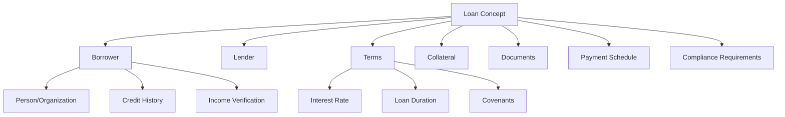
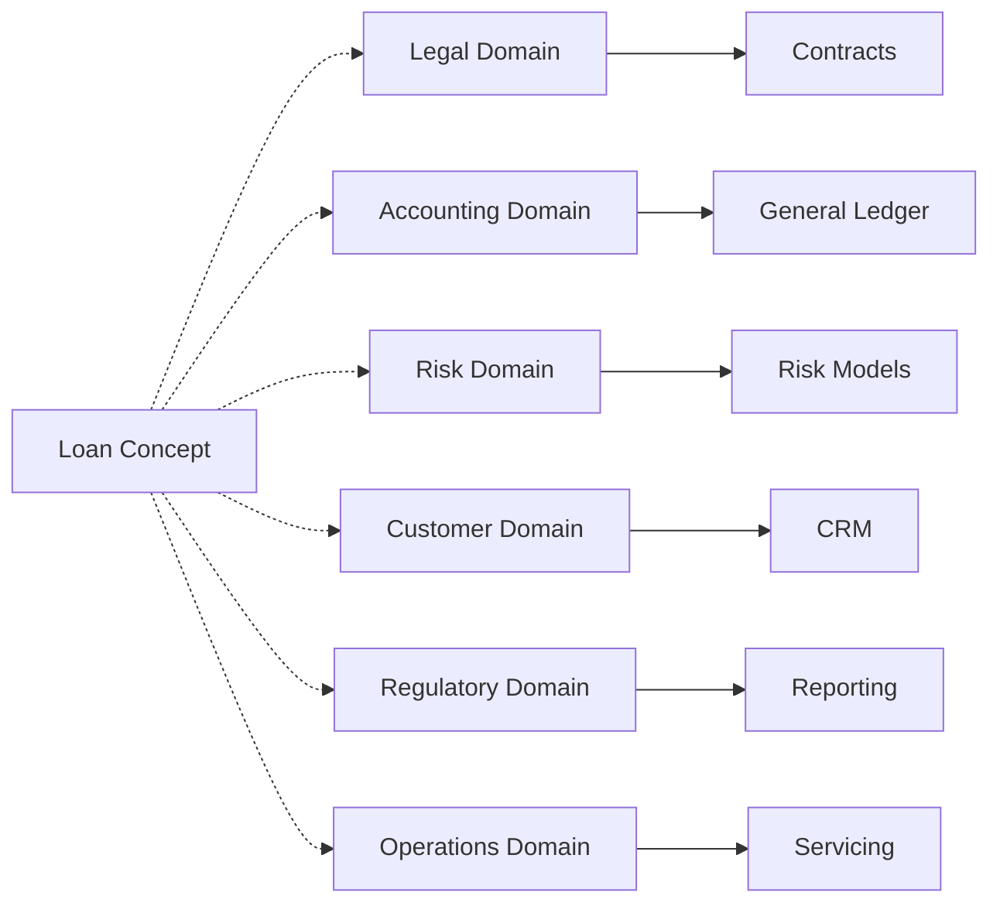

# Conceptual Spaces in Business Domains: Private Mortgage Lending

## Introduction: From Colors to Private Lending Concepts

Gärdenfors' theory of conceptual spaces elegantly explains how we think about colors - different languages carve up the continuous spectrum differently, yet we all understand "redness" even if our boundaries differ. This same principle applies powerfully to business concepts in **Private Mortgage Lending**. A "Private Mortgage" isn't just data fields in a database; it's a rich concept that exists in a high-dimensional space of business qualities specific to non-bank real estate lending.

## What is a Business Concept in Private Mortgage Lending?

In the private mortgage lending domain, a business concept is an idea that exists in the minds of domain experts, shaped by:
- **Context**: The private lending environment (non-bank, asset-based lending)
- **Culture**: Regional real estate practices and investor preferences
- **Regulations**: State lending laws, usury limits, foreclosure procedures
- **Relationships**: Borrower-lender trust, broker networks, investor syndicates
- **History**: Market cycles, default patterns, successful deal structures

Just as "blue" might include different shades in different languages, a "Private Mortgage" encompasses different qualities across different markets - a hard money loan in California differs from a bridge loan in New York, yet both exist in the same conceptual space.

## The Anatomy of a Private Mortgage Concept

Let's dissect how a "Private Mortgage" exists as a concept in our specialized lending space:

### Core Quality Dimensions for Private Mortgages

```rust
// Quality dimensions specific to Private Mortgage Lending
pub struct PrivateMortgageDimensions {
    // Asset-based dimensions (primary in private lending)
    ltv_ratio: f64,              // 0.0 (0% LTV) to 1.0 (100% LTV)
    property_quality: f64,       // 0.0 (distressed) to 1.0 (prime)
    location_desirability: f64,  // 0.0 (rural) to 1.0 (prime urban)
    exit_strategy_clarity: f64,  // 0.0 (unclear) to 1.0 (guaranteed)

    // Speed dimensions (key differentiator from banks)
    funding_speed: f64,          // 0.0 (30+ days) to 1.0 (same day)
    decision_speed: f64,         // 0.0 (weeks) to 1.0 (hours)
    documentation_flexibility: f64, // 0.0 (full doc) to 1.0 (asset only)

    // Borrower dimensions (different from traditional lending)
    borrower_experience: f64,    // 0.0 (first-time) to 1.0 (repeat client)
    credit_relevance: f64,       // 0.0 (ignored) to 1.0 (critical)
    liquidity_proof: f64,        // 0.0 (none) to 1.0 (verified reserves)

    // Deal structure dimensions
    rate_premium: f64,           // 0.0 (bank rate) to 1.0 (max legal rate)
    points_charged: f64,         // 0.0 (no points) to 1.0 (5+ points)
    prepayment_flexibility: f64, // 0.0 (locked) to 1.0 (no penalty)

    // Risk dimensions specific to private lending
    foreclosure_probability: f64, // 0.0 (unlikely) to 1.0 (imminent)
    renovation_risk: f64,        // 0.0 (turnkey) to 1.0 (gut rehab)
    market_timing_risk: f64,     // 0.0 (stable) to 1.0 (volatile)
}
```

### Private Mortgage Concept Regions

Different types of private mortgages form convex regions in this specialized space:

```
┌─────────────────────────────────────────────────────────────┐
│              Private Mortgage Conceptual Space               │
│                                                              │
│    ┌──────────────┐         ┌──────────────┐               │
│    │  Hard Money  │         │    Bridge    │               │
│    │    Loans     │         │    Loans     │               │
│    │ • 6-12 months         │ • 12-36 months              │
│    │ • 65-75% LTV          │ • 70-80% LTV               │
│    │ • 10-15% rates        │ • 8-12% rates              │
│    │ • Fix & flip focus    │ • Acquisition focus        │
│    └──────────────┘         └──────────────┘               │
│                                                              │
│         ┌──────────────┐         ┌──────────────┐          │
│         │Construction │         │  Rehab/Fix   │          │
│         │    Loans    │         │   & Flip     │          │
│         │ • Progress draws      │ • Single advance        │
│         │ • 12-18 months       │ • 6-9 months           │
│         │ • Higher risk        │ • Quick turnaround     │
│         └──────────────┘         └──────────────┘          │
│                                                              │
│              ┌──────────────────────┐                       │
│              │   Non-Performing     │                       │
│              │   Note Purchase      │                       │
│              │ • Distressed assets  │                       │
│              │ • Deep discounts     │                       │
│              │ • Workout expertise  │                       │
│              └──────────────────────┘                       │
└─────────────────────────────────────────────────────────────┘
```

## How Concepts Relate to Each Other

### 1. Hierarchical Relationships
```
Financial Instrument
    ├── Debt Instrument
    │   ├── Loan
    │   │   ├── Secured Loan
    │   │   │   ├── Mortgage
    │   │   │   └── Auto Loan
    │   │   └── Unsecured Loan
    │   │       ├── Personal Loan
    │   │       └── Credit Card
    │   └── Bond
    └── Equity Instrument
```

### 2. Compositional Relationships

A Loan concept is composed of multiple sub-concepts:



### 3. Cross-Domain Relationships

The Loan concept touches multiple domains:



## Bounded Contexts and Concept Boundaries

### Is a Concept a Bounded Context?

Not necessarily. A concept like "Loan" might:
- **Span multiple contexts**: Different aspects handled by different teams
- **Be viewed differently**: Each context has its own perspective
- **Have different boundaries**: What's included varies by context

### Example: Private Mortgage in Different Bounded Contexts

```rust
// In the Origination Context (Deal Sourcing)
pub struct PrivateMortgageApplication {
    property: PropertyDetails,
    purchase_price: Money,
    requested_loan_amount: Money,
    exit_strategy: ExitStrategy,
    borrower_experience: BorrowerTrackRecord,
    broker: Option<MortgageBroker>,
    urgency: FundingTimeline,
}

// In the Underwriting Context
pub struct UnderwritingPackage {
    property_valuation: PropertyAppraisal,
    ltv_calculation: LoanToValue,
    borrower_liquidity: ProofOfFunds,
    title_report: TitleInsuranceCommitment,
    environmental: Option<PhaseOneReport>,
    exit_analysis: ExitStrategyValidation,
}

// In the Servicing Context
pub struct PrivateMortgageAccount {
    loan_number: LoanNumber,
    current_balance: Money,
    maturity_date: Date,
    extension_options: Vec<ExtensionTerms>,
    draw_schedule: Option<ConstructionDraws>,
    default_status: Option<DefaultNotice>,
}

// In the Asset Management Context
pub struct MortgageAssetProfile {
    current_ltv: LoanToValue,
    property_condition: PropertyStatus,
    market_value_trend: ValueTrend,
    workout_options: Vec<WorkoutScenario>,
    foreclosure_timeline: Option<ForeclosureSchedule>,
    investor_reporting: InvestorPackage,
}
```

## Quality Dimensions in Business Concepts

### 1. Intrinsic Dimensions
Properties inherent to the concept:
- **Financial**: Amount, rate, term
- **Temporal**: Start date, maturity, payment frequency
- **Risk**: Credit score, collateral value, default probability

### 2. Relational Dimensions
How the concept relates to others:
- **Customer relationship**: New vs. existing, trust level
- **Market position**: Competitive rate, unique features
- **Portfolio fit**: Diversification impact, concentration risk

### 3. Contextual Dimensions
Properties that depend on context:
- **Regulatory**: Jurisdiction-specific rules
- **Operational**: Servicing requirements
- **Cultural**: Regional lending practices

### 4. Dynamic Dimensions
Properties that change over time:
- **Performance**: Payment history, delinquency
- **Market conditions**: Interest rate environment
- **Customer situation**: Income changes, life events

## Concept Evolution and Learning

### How Concepts Change

Business concepts evolve through:

1. **Regulatory Changes**: New laws create new dimensions
   ```rust
   // Before GDPR
   struct CustomerData {
       name: String,
       address: Address,
   }

   // After GDPR - new dimension added
   struct CustomerData {
       name: String,
       address: Address,
       consent: DataConsent,  // New quality dimension
       retention_period: Duration,
   }
   ```

2. **Market Innovation**: New products stretch concept boundaries
   - Peer-to-peer loans added new dimensions around platform risk
   - Cryptocurrency loans added digital asset dimensions

3. **Organizational Learning**: Experience refines concept boundaries
   - Failed loans teach which dimensions predict risk
   - Successful products reveal profitable regions

### Concept Discovery Through Events

In CIM, we discover and refine concepts through event patterns:

```rust
// Events reveal concept dimensions
impl ConceptualProjection for LoanEvent {
    fn project(&self) -> Vec<ConceptualChange> {
        match self {
            LoanEvent::PaymentMade { loan_id, amount, on_time } => {
                // Payment changes loan state - remove and re-add
                vec![
                    ConceptualChange::RemoveConcept {
                        concept_id: ConceptId::from(*loan_id)
                    },
                    ConceptualChange::AddConcept {
                        concept_id: ConceptId::from(*loan_id),
                        concept_type: "PrivateMortgage".to_string(),
                        position: self.calculate_position_after_payment(on_time),
                        qualities: self.calculate_qualities_after_payment(on_time),
                    }
                ]
            }
            LoanEvent::DefaultOccurred { loan_id, loss_amount } => {
                // Default is a major state change - remove and re-add as distressed
                vec![
                    ConceptualChange::RemoveConcept {
                        concept_id: ConceptId::from(*loan_id)
                    },
                    ConceptualChange::AddConcept {
                        concept_id: ConceptId::from(*loan_id),
                        concept_type: "DistressedMortgage".to_string(),
                        position: self.calculate_default_position(loss_amount),
                        qualities: self.calculate_distressed_qualities(loss_amount),
                    }
                ]
            }
        }
    }
}
```

## Practical Implementation in CIM

### 1. Concept Definition
```rust
pub struct BusinessConcept {
    pub id: ConceptId,
    pub name: String,
    pub domain: DomainId,
    pub dimensions: Vec<QualityDimension>,
    pub prototype: ConceptualPoint,  // Typical example
    pub boundaries: Vec<Hyperplane>, // What's included/excluded
    pub relationships: Vec<ConceptRelationship>,
}
```

### 2. Cross-Context Morphisms
```rust
// How the same concept appears in different contexts
pub struct LoanMorphism {
    origination_view: OriginationLoan,
    servicing_view: ServicingLoan,
    risk_view: RiskLoan,
    accounting_view: AccountingLoan,

    // Mappings between views
    morphisms: Vec<CrossContextMorphism>,
}
```

### 3. Concept Similarity and Search
```rust
// Find similar concepts for reasoning
pub fn find_similar_loans(
    target: &LoanConcept,
    space: &ConceptualSpace,
    threshold: f64,
) -> Vec<(LoanConcept, f64)> {
    space.k_nearest_neighbors(&target.position, 10)
        .filter(|(_, distance)| *distance < threshold)
        .map(|(concept, distance)| {
            (concept.as_loan(), 1.0 - distance) // Convert distance to similarity
        })
        .collect()
}
```

## Private Mortgage Lending Scenarios

### Fix & Flip Loan Journey
```rust
// A typical fix & flip loan moves through conceptual space
pub struct FixFlipJourney {
    // Initial state: High risk, low property quality
    acquisition: ConceptualPoint,     // LTV: 70%, Property: Distressed

    // During renovation: Risk changes with progress
    renovation_25: ConceptualPoint,   // Property improving, draws taken
    renovation_50: ConceptualPoint,   // Major systems complete
    renovation_75: ConceptualPoint,   // Cosmetic work underway

    // Exit approaching: Risk decreasing
    listing: ConceptualPoint,         // Property listed, showings active
    under_contract: ConceptualPoint,  // Buyer found, escrow opened

    // Successful exit: Loan paid off
    closed: ConceptualPoint,          // Profit realized, relationship strengthened
}
```

### Bridge Loan Refinance Path
```rust
// Bridge loan transitioning to permanent financing
pub struct BridgeToPermPath {
    // Initial bridge loan
    bridge_origination: ConceptualPoint, // Quick close, higher rate

    // Stabilization period
    occupancy_improving: ConceptualPoint, // Leasing up property
    noi_stabilizing: ConceptualPoint,     // Income increasing

    // Permanent loan qualification
    bank_application: ConceptualPoint,    // Applying for takeout
    commitment_received: ConceptualPoint, // Bank approved

    // Successful refinance
    bridge_payoff: ConceptualPoint,       // Bridge loan repaid
}
```

### Distressed Asset Workout
```rust
// When loans go bad - movement to distressed regions
pub struct DistressedWorkout {
    // Early warning signs
    payment_late_30: ConceptualPoint,     // First missed payment
    payment_late_60: ConceptualPoint,     // Communication breakdown

    // Default and negotiation
    default_notice: ConceptualPoint,      // Formal default
    forbearance_agreement: ConceptualPoint, // Temporary relief

    // Resolution paths
    deed_in_lieu: Option<ConceptualPoint>, // Voluntary surrender
    foreclosure: Option<ConceptualPoint>,   // Legal action
    loan_sale: Option<ConceptualPoint>,    // Sell to specialist
    successful_cure: Option<ConceptualPoint>, // Back to performing
}
```

## Benefits of Conceptual Thinking in Business

### 1. **Shared Understanding**
- Visual representation of what "Loan" means
- Clear boundaries of what's included
- Explicit quality dimensions

### 2. **Innovation Support**
- See gaps in the conceptual space
- Identify new product opportunities
- Understand market positioning

### 3. **Risk Management**
- Identify concept drift
- Spot emerging patterns
- Predict based on similarity

### 4. **System Integration**
- Map between different system views
- Maintain consistency across contexts
- Enable semantic interoperability

### 5. **Knowledge Preservation**
- Capture expert mental models
- Document regional variations
- Track concept evolution

## Conclusion: Private Mortgage Lending in Conceptual Spaces

In CIM, private mortgage lending concepts are not just loan records but rich, multi-dimensional ideas that exist in specialized conceptual spaces. For private mortgage lenders, these spaces:

- **Capture What Matters**: LTV ratios, exit strategies, property conditions, and funding speed - the dimensions that drive private lending decisions
- **Define Natural Categories**: Hard money, bridge, construction, and fix & flip loans form distinct regions with clear characteristics
- **Enable Quick Decisions**: Similarity matching helps identify the right loan product for each scenario in minutes, not days
- **Track Market Evolution**: As new products emerge (crypto-backed loans, tokenized properties), the space adapts
- **Support Risk Management**: Loans moving toward distressed regions trigger early intervention

By representing private mortgage concepts this way, CIM provides a foundation for lending systems that truly understand the nuances of non-bank real estate finance. The conceptual space becomes a shared language between loan officers, underwriters, asset managers, and automated systems - enabling faster decisions, better risk assessment, and more profitable lending operations.

This approach is particularly powerful for private mortgage lending because:
1. **Speed is Critical**: Conceptual similarity enables instant loan product recommendations
2. **Each Deal is Unique**: The continuous space captures nuances that rigid categories miss
3. **Experience Matters**: The space learns from successful and failed loans to improve future decisions
4. **Markets Change Quickly**: New dimensions can be added as the market evolves

The result is a lending platform that combines the speed of technology with the nuanced understanding of experienced private lenders.
