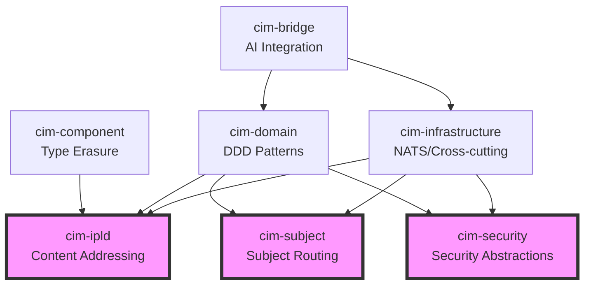

# Core Abstractions Alignment Plan

## Overview

This document reviews the 7 core abstraction modules and provides an alignment plan to ensure they work together cohesively as the foundation of CIM.

## Current State Analysis

### 1. cim-ipld (Content-Addressed Storage)
**Purpose**: Content-addressed storage and IPLD support  
**Dependencies**: None (foundational)  
**Key Exports**:
- `Cid`, `Multihash` - Content identifiers
- `ChainedContent`, `ContentChain` - CID-based chains
- `CodecRegistry` - Content type codecs
- Content types (documents, images, audio, video)
- Object store interface

**Issues Identified**:
- Has NATS dependencies but should be storage-agnostic
- Mixing content types with core IPLD functionality

### 2. cim-infrastructure (Cross-Cutting Concerns)
**Purpose**: Infrastructure abstractions (NATS, etc.)  
**Dependencies**: cim-domain (circular dependency risk)  
**Key Exports**:
- `NatsClient`, `NatsConfig` - NATS messaging
- `MessageHandler` - Message processing trait
- `InfrastructureError` - Error types

**Issues Identified**:
- Depends on cim-domain, creating potential circular dependency
- Limited scope - only NATS currently

### 3. cim-component (Component System)
**Purpose**: Type-erased component trait  
**Dependencies**: None (foundational)  
**Key Exports**:
- `Component` trait - Type-erased components
- `ComponentError` - Error handling
- Component storage utilities

**Issues Identified**:
- Well-isolated, no issues
- Could benefit from integration with cim-ipld for persistence

### 4. cim-domain (DDD Abstractions)
**Purpose**: Core Domain-Driven Design patterns  
**Dependencies**: cim-ipld, cim-subject, cim-component  
**Key Exports**:
- `Entity`, `AggregateRoot` - DDD entities
- `Command`, `Query`, `DomainEvent` - CQRS patterns
- State machines (Moore/Mealy)
- Event sourcing support

**Issues Identified**:
- Large surface area, might benefit from splitting
- Dependencies are appropriate (cim-subject is core)

### 5. cim-bridge (AI Integration)
**Purpose**: Bridge to AI providers  
**Dependencies**: None (well-isolated)  
**Key Exports**:
- Provider interfaces (Ollama, OpenAI, etc.)
- Bridge service
- Message routing

**Issues Identified**:
- Well-isolated, no issues
- Could benefit from using cim-infrastructure for NATS

### 6. cim-subject (Subject Algebra & Routing)
**Purpose**: Subject-based message routing and translation  
**Dependencies**: cim-ipld (for correlation IDs)  
**Key Exports**:
- `Subject`, `Pattern` - Hierarchical addressing
- `SubjectAlgebra` - Compositional operations
- `Translator` - Message translation between schemas
- `MessageIdentity` - Correlation/causation tracking
- In-memory routing (not NATS-dependent)

**Issues Identified**:
- Well-designed as core abstraction
- Provides both NATS bridge and in-memory implementation
- Appropriate dependency on cim-ipld for CIDs

### 7. cim-security (Security Abstractions) - NEW
**Purpose**: Core security abstractions for crypto, claims, and secrets  
**Dependencies**: None (foundational)  
**Key Exports**:
- Cryptographic operation traits (Sign, Verify, Encrypt, Decrypt)
- Claims-based authentication abstractions
- Secrets management interfaces
- Security policy and context
- Authentication/Authorization traits

**Status**:
- To be created as new core abstraction
- Will replace crypto-specific parts of cim-keys
- cim-keys becomes implementation layer

## Alignment Plan

### Phase 1: Dependency Cleanup

#### 1.1 Fix cim-infrastructure circular dependency
```toml
# cim-infrastructure/Cargo.toml
[dependencies]
# Remove: cim-domain = { path = "../cim-domain" }
# Infrastructure should not depend on domain
```

#### 1.2 Extract NATS from cim-ipld
- Move NATS object store to cim-infrastructure
- Keep cim-ipld pure for content addressing
- Create trait in cim-ipld that cim-infrastructure implements

#### 1.3 Keep cim-subject as core
- cim-subject is correctly identified as core
- Provides subject algebra and routing abstractions
- Works both with NATS and in-memory implementations

#### 1.4 Create cim-security as new core abstraction
- Extract security traits from cim-keys
- Define abstract interfaces for crypto, claims, secrets
- Move cim-keys to infrastructure/implementation layer

### Phase 2: Interface Standardization

#### 2.1 Define Core Traits
Each module should expose clear trait-based interfaces:

```rust
// cim-ipld: Storage traits
pub trait ContentStore {
    async fn put(&self, content: &[u8]) -> Result<Cid>;
    async fn get(&self, cid: &Cid) -> Result<Vec<u8>>;
}

// cim-infrastructure: Messaging traits
pub trait MessageBus {
    async fn publish<T: Serialize>(&self, subject: &str, message: &T) -> Result<()>;
    async fn subscribe(&self, subject: &str) -> Result<Box<dyn Stream<Item = Message>>>;
}

// cim-component: Already has Component trait

// cim-domain: Event store traits
pub trait EventStore {
    async fn append(&self, events: Vec<DomainEvent>) -> Result<()>;
    async fn load(&self, id: &str) -> Result<Vec<DomainEvent>>;
}

// cim-bridge: AI provider traits
pub trait AIProvider {
    async fn complete(&self, prompt: &str) -> Result<String>;
    async fn embed(&self, text: &str) -> Result<Vec<f32>>;
}
```

#### 2.2 Standardize Error Handling
Create a common error trait that all modules implement:

```rust
// In a new cim-core crate or in cim-component
pub trait CimError: std::error::Error + Send + Sync {
    fn error_code(&self) -> &str;
    fn is_retryable(&self) -> bool;
}
```

### Phase 3: Integration Points

#### 3.1 Event Flow
```
cim-domain (Commands) → cim-infrastructure (NATS) → cim-domain (Events)
                                ↓
                          cim-ipld (Storage)
```

#### 3.2 Component Persistence
```
cim-component (Components) → cim-ipld (Serialization) → Storage
```

#### 3.3 AI Integration
```
cim-bridge (AI Requests) → cim-infrastructure (NATS) → AI Providers
```

### Phase 4: Module Responsibilities

#### Final Module Boundaries:

**cim-ipld**
- Pure content-addressed storage
- CID operations and chains
- Content type definitions
- Codec registry
- NO infrastructure dependencies

**cim-infrastructure**
- NATS messaging implementation
- Event store implementation (using IPLD)
- Object store implementation (using IPLD)
- Cross-cutting concerns (logging, metrics)
- Implements traits from other modules

**cim-component**
- Component trait and type erasure
- Component storage interface
- Basic component operations
- Foundation for ECS patterns

**cim-domain**
- DDD building blocks
- CQRS patterns
- Event sourcing abstractions
- State machines
- Domain event definitions
- NO infrastructure dependencies

**cim-bridge**
- AI provider abstractions
- Provider implementations
- Request/response routing
- Stream processing for AI
- Uses cim-infrastructure for messaging

**cim-subject**
- Subject algebra and pattern matching
- Message routing abstractions
- Translation between subject schemas
- Correlation/causation tracking
- Works with both NATS and in-memory

## Implementation Steps

1. **Create trait definitions** in each module
2. **Remove circular dependencies**
3. **Move infrastructure-specific code** to cim-infrastructure
4. **Standardize error types** across modules
5. **Create integration tests** between modules
6. **Document module boundaries** clearly

## Success Criteria

- No circular dependencies between core modules
- Each module has a clear, single responsibility
- All modules communicate through well-defined traits
- Infrastructure concerns are isolated in cim-infrastructure
- Domain logic has no infrastructure dependencies
- All modules can be tested independently
- Clear documentation of module interactions

## Migration Guide

For existing code using these modules:

1. **Update imports** after module reorganization
2. **Replace direct NATS usage** with cim-infrastructure
3. **Use traits** instead of concrete types where possible
4. **Update error handling** to use standardized errors
5. **Test integrations** between modules

This alignment ensures the 7 core abstractions work together as a cohesive foundation while maintaining clear boundaries and responsibilities.

## Dependency Graph (Target State)

