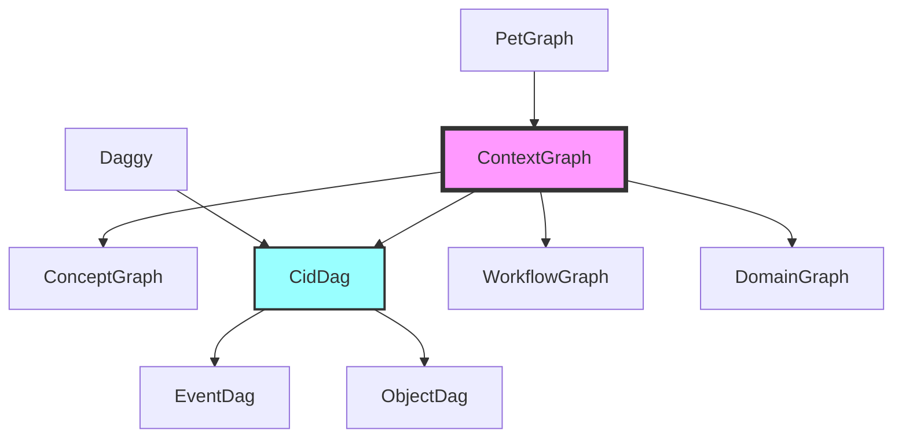

# Graph Abstraction Hierarchy in CIM

## Overview

CIM uses a hierarchy of graph abstractions, each specialized for different purposes while sharing common patterns. This document explains how these abstractions relate and when to use each one.

## Graph Type Hierarchy



## 1. ContextGraph<N, E> - The Universal Base

**Purpose**: The fundamental graph abstraction that ALL other graphs inherit from or compose with.

**Key Features**:
- **Type-flexible**: Nodes and edges can be ANY type (primitives, structs, enums)
- **Component System**: ECS-style components attach metadata without changing core types
- **Wraps PetGraph**: Leverages all PetGraph algorithms while adding our features
- **Recursive**: Nodes can contain subgraphs via the Subgraph component

**When to Use**:
- As the base for any new graph type
- When you need maximum flexibility
- For general-purpose graph operations

**Example**:
```rust
// Simple string nodes with float edge weights
let mut graph = ContextGraph::<String, f64>::new("MyGraph");

// Domain types
let mut domain_graph = ContextGraph::<Customer, Relationship>::new("CustomerGraph");

// With components
node.add_component(Label("Important Customer"));
node.add_component(Position { x: 10.0, y: 20.0 });
```

## 2. CidDag<T> - Content-Addressed DAG

**Purpose**: Specialized for content-addressed storage with cryptographic integrity.

**Key Features**:
- **CID-based**: Nodes identified by Content Identifiers
- **Acyclic**: Enforced by content addressing (can't create cycles)
- **Causal Relationships**: Edges represent temporal/causal ordering
- **Wraps Daggy**: Optimized for DAG operations

**When to Use**:
- Event sourcing (EventDag)
- Content storage (ObjectDag)
- Any append-only, immutable data structure
- Blockchain-like structures

**Example**:
```rust
let mut event_dag = EventDag::new();

// Add events with CID chain
event_dag.add_event(
    event_cid,
    Some(previous_cid), // Links to previous event
    event_node,
    timestamp
)?;

// Verify integrity
let chain = event_dag.verify_chain(&latest_cid, Some(&root_cid))?;
```

## 3. ConceptGraph - Knowledge Representation

**Purpose**: Represents conceptual knowledge and semantic relationships.

**Key Features**:
- **Composes Multiple ContextGraphs**: Can merge different knowledge domains
- **Superconcepts**: Recursive - concepts can contain other concepts
- **Semantic Components**: Distance metrics, similarity measures
- **Conceptual Space Integration**: Maps to geometric representations

**When to Use**:
- Knowledge graphs
- Semantic networks
- AI reasoning systems
- Ontology representation

**Example**:
```rust
let mut concept_graph = ConceptGraph::new("ProductKnowledge");

// Add concept with semantic components
let laptop = concept_graph.add_concept("Laptop");
laptop.add_component(ConceptualPosition {
    dimensions: vec![0.8, 0.9, 0.7] // tech, portable, expensive
});

// Superconcept containing subconcepts
let electronics = concept_graph.add_superconcept("Electronics");
electronics.add_subconcept(laptop);
```

## 4. WorkflowGraph - Process Representation

**Purpose**: Represents business processes and workflows.

**Key Features**:
- **Directed Flow**: Clear start/end points and transitions
- **State Machines**: Nodes can be states, edges are transitions
- **Conditional Logic**: Components for conditions and rules
- **Parallel/Sequential**: Support for complex flow patterns

**When to Use**:
- Business process modeling
- State machines
- Data pipelines
- User journeys

## 5. DomainGraph - DDD Aggregate Representation

**Purpose**: Represents domain aggregates and their relationships.

**Key Features**:
- **Aggregate Boundaries**: Enforces DDD aggregate rules
- **Invariant Checking**: Components for business rules
- **Event Generation**: Tracks domain events from changes
- **Bounded Context Aware**: Respects context boundaries

**When to Use**:
- Domain model visualization
- Aggregate relationship mapping
- Bounded context design
- System architecture documentation

## Component Patterns Across Graph Types

All graph types share the component system but use different components:

### Universal Components
```rust
// Available to all graph types
Label("Description")
Metadata { key: "value" }
Position { x, y, z }
Timestamp(SystemTime::now())
```

### Type-Specific Components
```rust
// CidDag components
CidReference(cid)
ChainPosition { height: 42 }

// ConceptGraph components
ConceptualDistance(0.85)
SemanticCategory("Electronics")

// WorkflowGraph components
StateType::Start
Condition("amount > 100")
```

## Composition and Conversion

### Graph Composition
```rust
// ConceptGraph composes multiple ContextGraphs
let product_graph = ContextGraph::<Product, Relationship>::new("Products");
let customer_graph = ContextGraph::<Customer, Purchase>::new("Customers");

let knowledge_graph = ConceptGraph::compose(vec![
    product_graph,
    customer_graph,
]);
```

### Graph Conversion
```rust
// CidDag can export to ContextGraph for visualization
let event_dag = EventDag::new();
// ... add events ...

let visual_graph = event_dag.to_context_graph();
// Now can use all ContextGraph visualization features
```

## Design Principles

1. **Specialization Over Generalization**: Each graph type optimizes for its use case
2. **Composition Over Inheritance**: Graphs compose rather than inherit
3. **Type Safety**: Leverage Rust's type system for correctness
4. **Performance**: Use specialized libraries (PetGraph, Daggy) under the hood
5. **Flexibility**: Component system allows extension without modification

## Future Graph Types

Potential additions following the same pattern:

- **DependencyGraph**: For package/module dependencies
- **SocialGraph**: For user relationships and interactions
- **ComputeGraph**: For distributed computation planning
- **ConstraintGraph**: For constraint satisfaction problems

Each would:
1. Wrap an appropriate underlying library
2. Define domain-specific node/edge types
3. Create specialized components
4. Provide conversion to ContextGraph for visualization

## Summary

The graph abstraction hierarchy in CIM provides:
- **ContextGraph**: Universal base with maximum flexibility
- **CidDag**: Specialized for content-addressed, append-only data
- **ConceptGraph**: Knowledge and semantic relationships
- **WorkflowGraph**: Business processes and state machines
- **DomainGraph**: DDD aggregates and bounded contexts

Each type optimizes for its domain while sharing common patterns through the component system and conversion capabilities.
