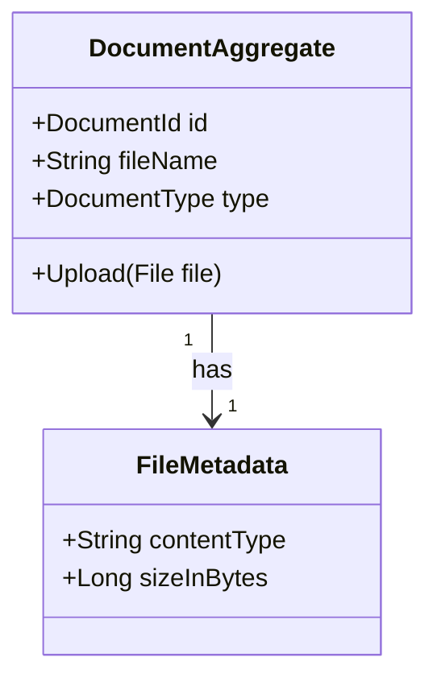

# Mapping DDD Models to ContentGraph

This document explains how to transform traditional DDD models (like those in KECO) into our recursive ContentGraph structure.

## Mapping Rules

### 1. Bounded Context → Concept Graph
```rust
NodeContent::Graph {
    graph_type: GraphType::Concept { concept_type: "BoundedContext" },
    summary: "Description of the context"
}
```

### 2. Aggregate → Aggregate Graph
```rust
NodeContent::Graph {
    graph_type: GraphType::Aggregate { aggregate_type: "DocumentAggregate" },
    summary: "Aggregate description"
}
```

### 3. Entity → Entity Graph
```rust
NodeContent::Graph {
    graph_type: GraphType::Entity { entity_type: "DocumentTypeRequirement" },
    summary: "Entity description"
}
```

### 4. Value Object → ValueObject Graph or Value Node
Complex value objects become graphs:
```rust
NodeContent::Graph {
    graph_type: GraphType::ValueObject { value_type: "FileMetadata" },
    summary: "Value object description"
}
```

Simple value objects become value nodes:
```rust
NodeContent::Value {
    content_type: ContentType::Json,
    data: json!({ "field": "value" })
}
```

### 5. Domain Event → Event Graph
```rust
NodeContent::Graph {
    graph_type: GraphType::Event { event_type: "DocumentUploadedEvent" },
    summary: "Event description"
}
```

### 6. Domain Service → Service Graph
```rust
NodeContent::Graph {
    graph_type: GraphType::Service { service_type: "DocumentVerificationService" },
    summary: "Service description"
}
```

## Relationship Mapping

### Class Relationships → Graph Edges

| UML/DDD Relationship | ContentGraph Edge |
|---------------------|-------------------|
| Composition (●──) | `RelatedBy::Contains` |
| Aggregation (◇──) | `RelatedBy::Contains` (weaker) |
| Association (──) | `RelatedBy::References` |
| Dependency (- - >) | `RelatedBy::DependsOn` |
| Inheritance (──▷) | `RelatedBy::Extends` |
| Implementation (- -▷) | `RelatedBy::Implements` |

## Example: KECO Document Context

### Original Mermaid Class Diagram


### Transformed to ContentGraph
```rust
// DocumentAggregate as a graph
let doc_aggregate = ContentNode {
    content: NodeContent::Graph {
        graph_type: GraphType::Aggregate {
            aggregate_type: "DocumentAggregate"
        },
        // ...
    },
    // ...
};

// FileMetadata as a nested graph
let file_metadata = ContentNode {
    content: NodeContent::Graph {
        graph_type: GraphType::ValueObject {
            value_type: "FileMetadata"
        },
        // ...
    },
    // ...
};

// Relationship
let edge = ContentEdge {
    source: doc_aggregate.id,
    target: file_metadata.id,
    relationship: RelatedBy::Contains,
    // ...
};
```

## Import Process

1. **Parse the DDD Model**
   - Identify bounded contexts
   - Find aggregates and their roots
   - Map entities and value objects
   - Catalog domain events
   - List services

2. **Create Graph Structure**
   - Start with bounded context as root
   - Add aggregates as child graphs
   - Nest entities and value objects
   - Place events in event dimension
   - Position services appropriately

3. **Establish Relationships**
   - Map UML relationships to edges
   - Preserve cardinality in metadata
   - Maintain referential integrity
   - Add cross-context references

4. **Set Conceptual Coordinates**
   - Domain dimension (x): Business area
   - Complexity dimension (y): Abstraction level
   - Time dimension (z): Event/temporal aspects

## Benefits

1. **Uniform Representation**: All DDD concepts use the same graph structure
2. **Recursive Composition**: Complex domains naturally decompose
3. **Visual Clarity**: Direct mapping to graph visualization
4. **Semantic Preservation**: Business meaning retained in graph
5. **Cross-Domain Integration**: Easy to link different contexts

## Tools and Automation

Future tools can automate this mapping:
- Parse Mermaid diagrams → Generate ContentGraph
- Import from DDD modeling tools
- Generate from code annotations
- Reverse engineer from existing systems
