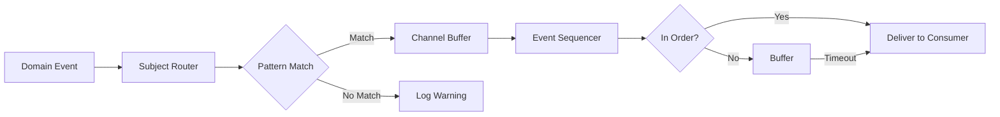

# Event System Architecture

## Overview

The CIM event system provides reliable, ordered event delivery between Bevy ECS and NATS, addressing the limitations of Bevy's built-in event system through subject-based routing and sequence management.

## Key Components

### 1. Subject Router

The `SubjectRouter` provides NATS-style subject-based message routing within Bevy:

```rust
// Subject patterns follow NATS conventions:
// - Exact: "event.graph.node"
// - Single wildcard: "event.*.node"
// - Full wildcard: "event.graph.>"

let router = SubjectRouter::new(RouterConfig {
    channel_capacity: 10_000,
    track_sequences: true,
    enable_dlq: true,
    max_retries: 3,
});
```

**Features:**
- Pattern-based subscriptions with wildcards
- Per-channel buffering with backpressure
- Global and per-aggregate sequence tracking
- Statistics and monitoring

### 2. Event Sequencer

The `EventSequencer` ensures ordered event delivery:

```rust
let sequencer = EventSequencer::new(SequencerConfig {
    max_buffer_size: 1000,
    max_sequence_gap: 100,
    sequence_timeout: Duration::from_secs(30),
});
```

**Features:**
- Per-aggregate sequence ordering
- Global sequence ordering
- Out-of-order event buffering
- Timeout-based progression for missing sequences
- Duplicate detection

### 3. Subject Consumers

Systems consume events through `SubjectConsumer` components:

```rust
#[derive(Component)]
pub struct GraphEventConsumer {
    pub subject_consumer: SubjectConsumer,
    pub last_global_sequence: u64,
    pub events_processed: u64,
}

// Subscribe to patterns
let patterns = vec![
    "event.graph.*.node.>",      // All node events
    "event.graph.123.>",         // All events for graph 123
];
let consumer = SubjectConsumer::new(&router, patterns)?;
```

## Event Flow



## Subject Naming Convention

Events are mapped to subjects based on their type and context:

| Event Type | Subject Pattern | Example |
|------------|----------------|---------|
| NodeAdded | `event.graph.{id}.node.added` | `event.graph.123.node.added` |
| EdgeConnected | `event.graph.{id}.edge.connected` | `event.graph.123.edge.connected` |
| SubgraphCreated | `event.graph.{id}.subgraph.{sid}.created` | `event.graph.123.subgraph.456.created` |
| GraphCreated | `event.graph.{id}.created` | `event.graph.123.created` |

## Reliability Guarantees

### 1. Ordering
- **Global Ordering**: All events have a global sequence number
- **Aggregate Ordering**: Events within an aggregate are strictly ordered
- **Buffering**: Out-of-order events are buffered up to configured limits

### 2. Delivery
- **At-Least-Once**: Events are retried on failure
- **Duplicate Detection**: Sequence numbers prevent duplicate processing
- **Backpressure**: Bounded channels prevent memory exhaustion

### 3. Failure Handling
- **Timeouts**: Missing sequences timeout after configurable duration
- **Dead Letter Queue**: Failed events after max retries
- **Circuit Breaker**: Prevents cascading failures

## Usage Example

```rust
// In your plugin
impl Plugin for MyPlugin {
    fn build(&self, app: &mut App) {
        app.add_plugins((
            SubjectRouterPlugin,
            EventSequencerPlugin,
        ))
        .add_systems(Startup, setup_consumers)
        .add_systems(Update, process_events);
    }
}

// Setup consumers
fn setup_consumers(
    mut commands: Commands,
    router: Res<SubjectRouter>,
) {
    // Consumer for specific graph
    let consumer = GraphEventConsumer::new_for_graph(&router, "my-graph-id")
        .expect("Failed to create consumer");

    commands.spawn(consumer);
}

// Process events
fn process_events(
    mut consumers: Query<&mut GraphEventConsumer>,
    mut commands: Commands,
) {
    for mut consumer in consumers.iter_mut() {
        let events = consumer.subject_consumer.poll_events();

        for event in events {
            // Events are delivered in order
            match &event.event {
                DomainEvent::NodeAdded { .. } => {
                    // Handle node addition
                }
                _ => {}
            }
        }
    }
}
```

## Integration with NATS

The subject router is designed to mirror NATS subject patterns, making integration seamless:

```rust
// NATS subjects map directly
async fn bridge_to_nats(
    router: Res<SubjectRouter>,
    nats_client: &NatsClient,
) {
    // Subscribe to NATS
    let mut sub = nats_client.subscribe("event.>").await?;

    // Route to Bevy
    while let Some(msg) = sub.next().await {
        let event: DomainEvent = serde_json::from_slice(&msg.payload)?;
        router.route_event(event)?;
    }
}
```

## Performance Considerations

1. **Channel Capacity**: Set based on expected event rate
2. **Sequence Gap Tolerance**: Balance between memory usage and reliability
3. **Timeout Duration**: Trade-off between latency and ordering guarantees
4. **Pattern Complexity**: More specific patterns perform better

## Monitoring

Track system health through built-in statistics:

```rust
let stats = router.get_stats();
for (pattern, channel_stats) in stats {
    println!("{}: sent={}, dropped={}",
        pattern,
        channel_stats.messages_sent,
        channel_stats.messages_dropped
    );
}

let seq_stats = sequencer.get_stats();
println!("Global sequence: {}", seq_stats.global_stats.next_sequence);
println!("Pending events: {}", seq_stats.global_stats.pending_count);
```

## Best Practices

1. **Use Specific Patterns**: More specific patterns reduce unnecessary processing
2. **Monitor Sequence Gaps**: Large gaps indicate potential issues
3. **Set Appropriate Timeouts**: Based on your latency requirements
4. **Handle Backpressure**: Implement flow control when channels fill
5. **Test Failure Scenarios**: Ensure graceful degradation

## Comparison with Bevy Events

| Feature | Bevy Events | CIM Event System |
|---------|-------------|------------------|
| Ordering | Best-effort | Guaranteed per-aggregate |
| Routing | Type-based | Subject-based patterns |
| Buffering | Fixed buffer | Configurable per-channel |
| Reliability | Can drop events | At-least-once delivery |
| Monitoring | Limited | Comprehensive statistics |
| Integration | Bevy-only | NATS-compatible |

This architecture provides a robust foundation for event-driven systems that require reliable, ordered event delivery with flexible routing capabilities.
