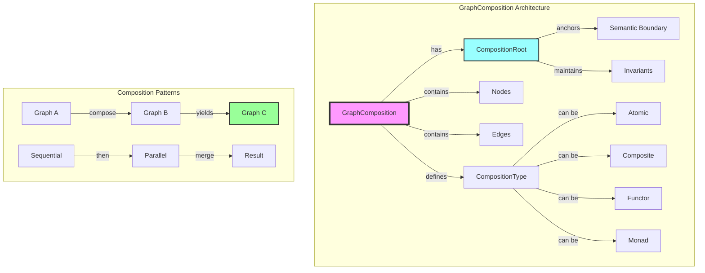

# GraphComposition Architecture

## Core Concept

**GraphComposition** represents the fundamental building block of our system where every domain concept is a graph that can be composed with other graphs. This is not just a data structure - it's a compositional algebra that enables building complex systems from simple, well-understood parts.

## Architecture Diagram



## Key Principles

### 1. Everything is a Graph

In our system, every domain concept is represented as a GraphComposition:
- **Value Objects** are atomic graphs (single node, no edges)
- **Entities** are graphs with identity and state
- **Aggregates** are composite graphs with consistency boundaries
- **Services** are graphs representing operations and transformations
- **Events** are graphs capturing state transitions
- **Commands** are graphs expressing intent

### 2. Composition is the Core Operation

```rust
pub trait Composable {
    type Output;

    /// Compose two graphs into a new graph
    fn compose(&self, other: &Self) -> Result<Self::Output, CompositionError>;

    /// Check if composition is valid
    fn can_compose_with(&self, other: &Self) -> bool;
}

pub struct GraphComposition {
    pub id: GraphId,
    pub composition_root: NodeId,
    pub composition_type: CompositionType,
    pub nodes: HashMap<NodeId, CompositionNode>,
    pub edges: HashMap<EdgeId, CompositionEdge>,
    pub metadata: CompositionMetadata,
}
```

### 3. Composition Types

```rust
pub enum CompositionType {
    /// Single node, no edges - represents a value
    Atomic { value_type: String },

    /// Multiple nodes/edges - represents a structure
    Composite { structure_type: String },

    /// Maps one graph to another - represents transformation
    Functor {
        source_type: String,
        target_type: String,
        mapping: Box<dyn Fn(&GraphComposition) -> GraphComposition>,
    },

    /// Wraps a graph-returning computation - represents context
    Monad {
        context_type: String,
        bind: Box<dyn Fn(&GraphComposition) -> Box<dyn Fn(&GraphComposition) -> GraphComposition>>,
    },

    /// Represents a DDD concept
    Domain(DomainCompositionType),
}

pub enum DomainCompositionType {
    Entity { entity_type: String },
    ValueObject { value_type: String },
    Aggregate { aggregate_type: String },
    Service { service_type: String },
    Event { event_type: String },
    Command { command_type: String },
    BoundedContext { domain: String },
}
```

### 4. Composition Operations

```rust
impl GraphComposition {
    /// Sequential composition: A then B
    pub fn then(&self, other: &GraphComposition) -> Result<GraphComposition, CompositionError> {
        // Connect output of self to input of other
    }

    /// Parallel composition: A and B
    pub fn parallel(&self, other: &GraphComposition) -> Result<GraphComposition, CompositionError> {
        // Run both graphs independently
    }

    /// Choice composition: A or B
    pub fn choice(&self, other: &GraphComposition) -> Result<GraphComposition, CompositionError> {
        // Create branching structure
    }

    /// Loop composition: repeat A while condition
    pub fn loop_while<F>(&self, condition: F) -> Result<GraphComposition, CompositionError>
    where
        F: Fn(&GraphComposition) -> bool,
    {
        // Create cyclic structure with exit condition
    }

    /// Map over nodes: transform each node
    pub fn map<F>(&self, f: F) -> Result<GraphComposition, CompositionError>
    where
        F: Fn(&CompositionNode) -> CompositionNode,
    {
        // Apply transformation to all nodes
    }

    /// Fold: reduce graph to a value
    pub fn fold<T, F>(&self, init: T, f: F) -> T
    where
        F: Fn(T, &CompositionNode) -> T,
    {
        // Traverse and accumulate
    }
}
```

### 5. Category Theory Foundation

GraphComposition forms a category where:
- **Objects** are GraphCompositions
- **Morphisms** are transformations between graphs
- **Identity** is the graph unchanged
- **Composition** is function composition

```rust
/// Morphism between graphs
pub trait GraphMorphism {
    fn apply(&self, graph: &GraphComposition) -> Result<GraphComposition, MorphismError>;

    /// Compose morphisms: (f ∘ g)(x) = f(g(x))
    fn compose<M: GraphMorphism>(&self, other: &M) -> Box<dyn GraphMorphism>;

    /// Identity morphism
    fn identity() -> Box<dyn GraphMorphism>;
}

/// Functor: structure-preserving map between categories
pub trait GraphFunctor {
    fn fmap<F>(&self, f: F) -> Result<GraphComposition, FunctorError>
    where
        F: Fn(&CompositionNode) -> CompositionNode;
}

/// Monad: composition with context
pub trait GraphMonad {
    fn pure(value: CompositionNode) -> GraphComposition;

    fn bind<F>(&self, f: F) -> Result<GraphComposition, MonadError>
    where
        F: Fn(&CompositionNode) -> GraphComposition;
}
```

## Composition Patterns

### 1. Value Object Composition

```rust
// Money as an atomic graph
let amount = GraphComposition::atomic(
    "Money",
    json!({ "amount": 100, "currency": "USD" })
);

// Address as a composite graph
let address = GraphComposition::composite("Address")
    .add_node("street", "123 Main St")
    .add_node("city", "Springfield")
    .add_node("zip", "12345")
    .add_edge("street", "city", RelatedBy::PartOf)
    .add_edge("city", "zip", RelatedBy::Contains);
```

### 2. Entity Composition

```rust
// User entity with identity
let user = GraphComposition::entity("User", UserId::new())
    .add_node("profile", profile_graph)
    .add_node("preferences", preferences_graph)
    .add_edge("root", "profile", RelatedBy::Contains)
    .add_edge("root", "preferences", RelatedBy::Contains);
```

### 3. Aggregate Composition

```rust
// Order aggregate maintaining consistency
let order = GraphComposition::aggregate("Order", OrderId::new())
    .add_node("items", order_items_graph)
    .add_node("payment", payment_graph)
    .add_node("shipping", shipping_graph)
    .with_invariant(|g| g.total_value() > 0)
    .with_invariant(|g| g.has_valid_payment());
```

### 4. Service Composition

```rust
// Service as a graph transformation
let pricing_service = GraphComposition::functor(
    "PricingService",
    |order: &GraphComposition| -> GraphComposition {
        order.map(|node| {
            if node.is_type("OrderItem") {
                node.with_field("price", calculate_price(node))
            } else {
                node.clone()
            }
        })
    }
);
```

### 5. Workflow Composition

```rust
// Complex workflow using composition operators
let order_workflow =
    validate_order
        .then(calculate_pricing)
        .then(
            check_inventory
                .parallel(verify_payment)
        )
        .then(
            fulfill_order
                .choice(backorder_items)
        )
        .then(send_confirmation);
```

## Benefits of GraphComposition

1. **Uniform Representation** - Everything is a graph, enabling uniform operations
2. **Composability** - Build complex systems from simple parts
3. **Type Safety** - Composition rules enforced at compile time
4. **Semantic Clarity** - Graph structure reveals domain relationships
5. **Flexibility** - Easy to extend and modify through composition
6. **Formal Foundation** - Based on category theory for proven properties

## Implementation Strategy

### Phase 1: Core GraphComposition
- Define GraphComposition struct
- Implement basic composition operations
- Add composition type system

### Phase 2: Category Theory Operations
- Implement Functor trait
- Implement Monad trait
- Add morphism support

### Phase 3: Domain Patterns
- Create domain-specific composition helpers
- Add invariant enforcement
- Implement common patterns

### Phase 4: Advanced Composition
- Add parallel composition
- Implement choice operators
- Support recursive compositions

## Migration from ContentGraph

1. Rename ContentGraph → GraphComposition
2. Add composition_type field
3. Implement Composable trait
4. Add composition operations
5. Update all references

## Example: Invoice as GraphComposition

```rust
// Invoice is a graph composition
let invoice = GraphComposition::aggregate("Invoice", InvoiceId::new())
    // Header information
    .add_node("header",
        GraphComposition::composite("InvoiceHeader")
            .add_node("number", "INV-001")
            .add_node("date", "2024-01-10")
            .add_node("due_date", "2024-02-10")
    )
    // Line items
    .add_node("items",
        GraphComposition::composite("LineItems")
            .add_node("item1", line_item_graph("Product A", 2, 50.00))
            .add_node("item2", line_item_graph("Product B", 1, 75.00))
    )
    // Customer
    .add_node("customer", customer_graph)
    // Totals
    .add_node("totals",
        GraphComposition::composite("Totals")
            .add_node("subtotal", 175.00)
            .add_node("tax", 15.75)
            .add_node("total", 190.75)
    )
    // Relationships
    .add_edge("root", "header", RelatedBy::Contains)
    .add_edge("root", "items", RelatedBy::Contains)
    .add_edge("root", "customer", RelatedBy::References)
    .add_edge("items", "totals", RelatedBy::DerivedFrom);
```

This demonstrates how GraphComposition enables building complex domain models through composition of simpler graphs, maintaining both structure and semantics.
