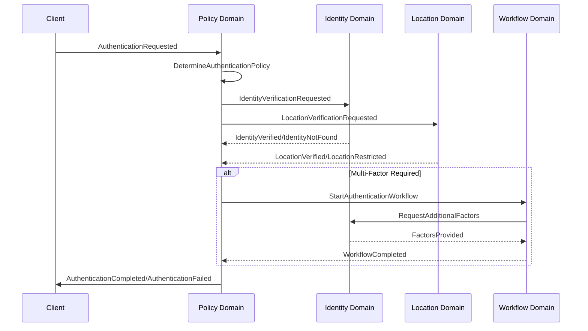
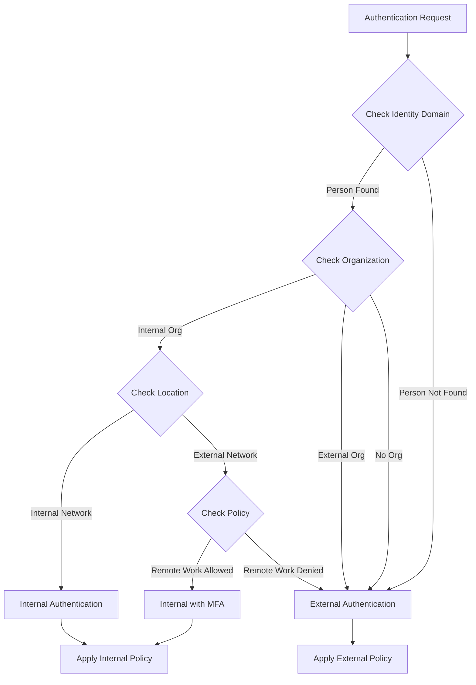

# Policy Domain Authentication Composition Design

## Overview

This document defines how the Policy Domain composes with Identity, Location, and Workflow domains to provide authentication capabilities. This composition is **distinct from authorization** and focuses solely on verifying identity and determining internal vs external authentication requirements.

## Core Principles

1. **External Composition**: All domain interactions occur through events and commands - no direct dependencies
2. **Authentication vs Authorization**: This design covers only authentication (who you are), not authorization (what you can do)
3. **Event-Driven**: All cross-domain communication happens via NATS events
4. **Policy as Orchestrator**: Policy domain orchestrates authentication flows without owning identity data

## Domain Responsibilities

### Policy Domain
- Defines authentication policies and rules
- Orchestrates authentication workflows
- Determines internal vs external authentication requirements
- Manages authentication approval workflows
- Enforces authentication compliance requirements

### Identity Domain
- Manages person and organization identities
- Stores credentials and authentication factors
- Validates authentication attempts
- Maintains trust levels and authentication history

### Location Domain
- Provides geographic and network location context
- Enables location-based authentication policies
- Tracks access patterns by location
- Supports geofencing for authentication

### Workflow Domain
- Executes multi-step authentication workflows
- Manages state transitions in authentication processes
- Handles timeout and retry logic
- Provides workflow templates for common authentication patterns

## Authentication Policy Types

### 1. Internal Authentication Policy
```rust
// Policy for authenticating internal users (employees, systems)
pub struct InternalAuthenticationPolicy {
    // Minimum trust level required
    min_trust_level: TrustLevel,

    // Required authentication factors
    required_factors: Vec<AuthenticationFactor>,

    // Location restrictions
    allowed_locations: Vec<LocationConstraint>,

    // Time-based restrictions
    time_constraints: Option<TimeConstraint>,

    // Device trust requirements
    device_requirements: Option<DeviceRequirements>,
}
```

### 2. External Authentication Policy
```rust
// Policy for authenticating external users (customers, partners)
pub struct ExternalAuthenticationPolicy {
    // Identity verification requirements
    identity_verification: IdentityVerificationLevel,

    // Additional approval workflow
    approval_workflow: Option<WorkflowId>,

    // External identity provider requirements
    allowed_providers: Vec<ExternalProvider>,

    // Risk assessment thresholds
    risk_thresholds: RiskThresholds,
}
```

### 3. Federated Authentication Policy
```rust
// Policy for federated authentication scenarios
pub struct FederatedAuthenticationPolicy {
    // Trusted identity providers
    trusted_providers: Vec<IdentityProvider>,

    // Attribute mapping rules
    attribute_mappings: HashMap<String, AttributeMapping>,

    // Trust establishment requirements
    trust_requirements: TrustRequirements,

    // Session management rules
    session_policy: SessionPolicy,
}
```

## Event Flow Architecture

### Authentication Request Flow



### Internal vs External Determination



## Domain Events

### Policy Domain Events
```rust
// Authentication policy events
pub enum PolicyAuthenticationEvent {
    AuthenticationPolicyCreated {
        policy_id: PolicyId,
        policy_type: AuthenticationPolicyType,
        scope: PolicyScope,
    },

    AuthenticationPolicyActivated {
        policy_id: PolicyId,
        effective_date: DateTime<Utc>,
    },

    AuthenticationRequested {
        request_id: Uuid,
        identity_id: Option<Uuid>,
        location: LocationContext,
        requested_at: DateTime<Utc>,
    },

    AuthenticationPolicyApplied {
        request_id: Uuid,
        policy_id: PolicyId,
        requirements: AuthenticationRequirements,
    },

    AuthenticationDecisionMade {
        request_id: Uuid,
        decision: AuthenticationDecision,
        factors_used: Vec<AuthenticationFactor>,
    },
}
```

### Cross-Domain Events
```rust
// Events consumed from Identity Domain
pub enum IdentityAuthenticationEvent {
    IdentityVerified {
        identity_id: Uuid,
        verification_method: VerificationMethod,
        trust_level: TrustLevel,
    },

    CredentialsValidated {
        identity_id: Uuid,
        credential_type: CredentialType,
        validation_result: ValidationResult,
    },

    MultiFactorChallengeCompleted {
        identity_id: Uuid,
        factors_completed: Vec<AuthenticationFactor>,
    },
}

// Events consumed from Location Domain
pub enum LocationAuthenticationEvent {
    LocationVerified {
        location_id: Uuid,
        location_type: LocationType,
        risk_score: f32,
    },

    GeofenceViolation {
        identity_id: Uuid,
        expected_location: LocationConstraint,
        actual_location: Location,
    },
}

// Events consumed from Workflow Domain
pub enum WorkflowAuthenticationEvent {
    AuthenticationWorkflowStarted {
        workflow_id: WorkflowId,
        authentication_type: AuthenticationType,
    },

    AuthenticationStepCompleted {
        workflow_id: WorkflowId,
        step: AuthenticationStep,
        result: StepResult,
    },

    AuthenticationWorkflowCompleted {
        workflow_id: WorkflowId,
        final_result: AuthenticationResult,
    },
}
```

## Policy Components for Authentication

### Authentication Requirements Component
```rust
#[derive(Debug, Clone, Serialize, Deserialize)]
pub struct AuthenticationRequirementsComponent {
    // Minimum factors required
    pub min_factors: u8,

    // Specific factor types required
    pub required_factors: Vec<AuthenticationFactor>,

    // Optional factors that strengthen authentication
    pub optional_factors: Vec<AuthenticationFactor>,

    // Location-based requirements
    pub location_requirements: Option<LocationRequirements>,

    // Time-based requirements
    pub time_requirements: Option<TimeRequirements>,

    // Risk-based adjustments
    pub risk_adjustments: RiskAdjustments,
}

#[derive(Debug, Clone, Serialize, Deserialize)]
pub enum AuthenticationFactor {
    Password,
    Biometric(BiometricType),
    HardwareToken(TokenType),
    SoftwareToken,
    SecurityQuestion,
    EmailVerification,
    SMSVerification,
    PushNotification,
    CertificateBased,
}
```

### Internal/External Determination Component
```rust
#[derive(Debug, Clone, Serialize, Deserialize)]
pub struct AuthenticationContextComponent {
    // Rules for determining internal vs external
    pub internal_criteria: InternalCriteria,

    // External authentication handling
    pub external_handling: ExternalHandling,

    // Federated authentication mappings
    pub federation_mappings: HashMap<String, FederationConfig>,
}

#[derive(Debug, Clone, Serialize, Deserialize)]
pub struct InternalCriteria {
    // Organization IDs considered internal
    pub internal_organizations: HashSet<OrganizationId>,

    // Network ranges considered internal
    pub internal_networks: Vec<IpNetwork>,

    // Domain patterns for internal emails
    pub internal_domains: Vec<String>,

    // Device trust requirements
    pub trusted_device_required: bool,
}
```

## Composition Patterns

### 1. Policy-Driven Authentication Flow
```rust
// Policy domain handler for authentication requests
impl PolicyCommandHandler {
    pub async fn handle_authentication_request(
        &self,
        request: AuthenticationRequest,
    ) -> Result<AuthenticationResponse> {
        // 1. Determine applicable policies
        let policies = self.find_applicable_policies(&request).await?;

        // 2. Emit event to request identity verification
        self.event_publisher.publish(
            "identity.verification.requested",
            IdentityVerificationRequested {
                identity_ref: request.identity_ref,
                verification_level: policies.required_verification_level(),
            }
        ).await?;

        // 3. Emit event to request location verification
        self.event_publisher.publish(
            "location.verification.requested",
            LocationVerificationRequested {
                location_context: request.location_context,
                constraints: policies.location_constraints(),
            }
        ).await?;

        // 4. Wait for verification results (via event handlers)
        // This would be handled by event correlation

        Ok(AuthenticationResponse::Pending {
            correlation_id: request.correlation_id,
        })
    }
}
```

### 2. Event Handler for Identity Verification
```rust
// Policy domain event handler for identity events
impl PolicyEventHandler {
    pub async fn handle_identity_verified(
        &self,
        event: IdentityVerified,
    ) -> Result<()> {
        // Find the pending authentication request
        let request = self.find_pending_request(event.correlation_id)?;

        // Update authentication context
        let mut context = self.get_authentication_context(request.id)?;
        context.identity_verified = true;
        context.trust_level = event.trust_level;

        // Check if we need additional factors
        if self.requires_additional_factors(&context)? {
            // Start workflow for multi-factor authentication
            self.event_publisher.publish(
                "workflow.start.requested",
                StartWorkflowRequested {
                    workflow_type: "multi_factor_authentication",
                    context: context.into(),
                }
            ).await?;
        } else {
            // Complete authentication
            self.complete_authentication(request.id, context).await?;
        }

        Ok(())
    }
}
```

### 3. Workflow Integration for Complex Authentication
```rust
// Policy defines authentication workflow templates
pub struct AuthenticationWorkflowTemplate {
    pub name: String,
    pub steps: Vec<AuthenticationStep>,
    pub timeout: Duration,
    pub retry_policy: RetryPolicy,
}

pub enum AuthenticationStep {
    VerifyPassword {
        max_attempts: u8,
        lockout_duration: Duration,
    },

    SendOTP {
        delivery_method: OTPDeliveryMethod,
        validity_duration: Duration,
    },

    VerifyOTP {
        max_attempts: u8,
    },

    BiometricChallenge {
        biometric_type: BiometricType,
        fallback_allowed: bool,
    },

    ApprovalRequired {
        approver_role: String,
        timeout: Duration,
    },
}
```

## Security Considerations

### 1. Event Security
- All authentication events must be encrypted in transit
- Sensitive data (passwords, tokens) never included in events
- Use secure references and one-time tokens for sensitive operations

### 2. Correlation Security
- Authentication requests must have secure correlation IDs
- Time-bound validity for authentication sessions
- Automatic cleanup of expired authentication contexts

### 3. Policy Enforcement
- Policies cached locally for performance but validated centrally
- Policy changes trigger re-evaluation of active sessions
- Audit trail for all authentication decisions

## Implementation Guidelines

### 1. Event Naming Conventions
```
policy.authentication.{action}
identity.authentication.{action}
location.authentication.{action}
workflow.authentication.{action}
```

### 2. Error Handling
- Never expose why authentication failed in detail
- Use generic error messages for security
- Log detailed errors internally for debugging

### 3. Performance Optimization
- Cache policy evaluations with TTL
- Pre-compute policy applicability rules
- Use event streaming for real-time updates

## Testing Strategy

### 1. Unit Tests
- Test policy evaluation logic
- Test internal/external determination
- Test event correlation

### 2. Integration Tests
- Test cross-domain event flows
- Test workflow execution
- Test timeout and error scenarios

### 3. Security Tests
- Test authentication bypass attempts
- Test policy circumvention
- Test correlation ID tampering

## Future Enhancements

1. **Adaptive Authentication**: Adjust requirements based on risk scores
2. **Behavioral Biometrics**: Incorporate typing patterns, mouse movements
3. **Zero Trust Integration**: Continuous authentication verification
4. **Decentralized Identity**: Support for blockchain-based identity
