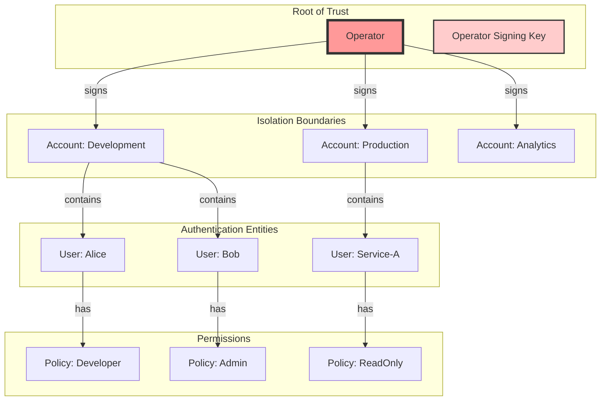
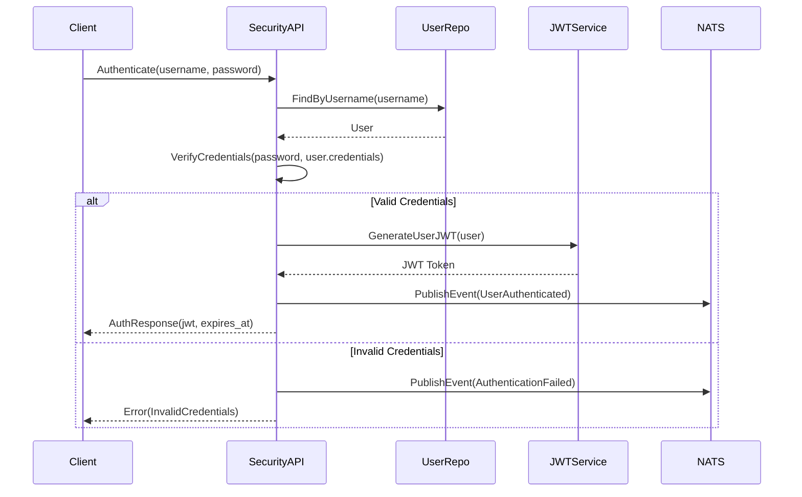
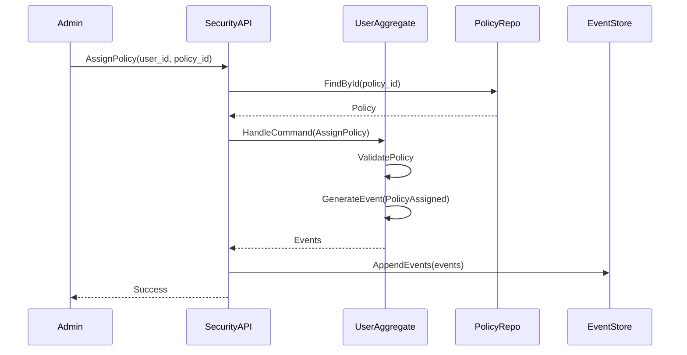

# Security Context Design (NATS-Aligned)

## Overview

The CIM Security Context follows NATS's proven security model, implementing a hierarchical trust system with Operators, Accounts, Users, and Policies. This design provides strong isolation boundaries, JWT-based authentication, and fine-grained permission control.

**Important**: The Security context is not just another bounded context - it provides the security infrastructure that ALL bounded contexts use. Every message in CIM flows through NATS with security headers, and every context validates permissions through the Security infrastructure.

## Core Concepts

### Trust Hierarchy



## Domain Model

### Operator Aggregate

The Operator is the root of trust for the entire system. There is typically one Operator per CIM deployment.

```rust
pub struct OperatorAggregate {
    pub id: OperatorId,
    pub name: String,
    pub signing_keys: Vec<SigningKey>,
    pub active_key_id: KeyId,
    pub created_at: DateTime<Utc>,
    pub system_account_id: Option<AccountId>, // System account for internal operations
}

pub struct SigningKey {
    pub key_id: KeyId,
    pub public_key: PublicKey,
    pub private_key: EncryptedPrivateKey, // Encrypted at rest
    pub created_at: DateTime<Utc>,
    pub expires_at: Option<DateTime<Utc>>,
    pub revoked_at: Option<DateTime<Utc>>,
}

// Commands
pub enum OperatorCommand {
    CreateOperator {
        name: String,
        initial_key: SigningKey,
    },
    RotateSigningKey {
        new_key: SigningKey,
    },
    RevokeSigningKey {
        key_id: KeyId,
        reason: RevocationReason,
    },
}

// Events
pub enum OperatorEvent {
    OperatorCreated {
        operator_id: OperatorId,
        name: String,
        initial_key_id: KeyId,
        public_key: PublicKey,
    },
    SigningKeyRotated {
        operator_id: OperatorId,
        old_key_id: KeyId,
        new_key_id: KeyId,
        new_public_key: PublicKey,
    },
    SigningKeyRevoked {
        operator_id: OperatorId,
        key_id: KeyId,
        reason: RevocationReason,
        revoked_at: DateTime<Utc>,
    },
}
```

### Account Aggregate

Accounts provide isolation boundaries for resources and users. Each Account is signed by the Operator.

```rust
pub struct AccountAggregate {
    pub id: AccountId,
    pub name: String,
    pub operator_id: OperatorId,
    pub limits: AccountLimits,
    pub metadata: HashMap<String, Value>,
    pub created_at: DateTime<Utc>,
    pub expires_at: Option<DateTime<Utc>>,
    pub status: AccountStatus,
}

pub struct AccountLimits {
    pub max_users: Option<u32>,
    pub max_connections: Option<u32>,
    pub max_subscriptions: Option<u32>,
    pub max_payload_size: Option<usize>,
    pub max_data_rate: Option<DataRate>,
    pub allowed_exports: Vec<Export>,
    pub allowed_imports: Vec<Import>,
}

pub enum AccountStatus {
    Active,
    Suspended { reason: String, since: DateTime<Utc> },
    Expired,
}

// Commands
pub enum AccountCommand {
    CreateAccount {
        name: String,
        operator_id: OperatorId,
        limits: AccountLimits,
    },
    UpdateAccountLimits {
        new_limits: AccountLimits,
    },
    SuspendAccount {
        reason: String,
    },
    ReactivateAccount,
}

// Events
pub enum AccountEvent {
    AccountCreated {
        account_id: AccountId,
        name: String,
        operator_id: OperatorId,
        jwt_claims: JwtClaims,
    },
    AccountLimitsUpdated {
        account_id: AccountId,
        old_limits: AccountLimits,
        new_limits: AccountLimits,
    },
    AccountSuspended {
        account_id: AccountId,
        reason: String,
        suspended_at: DateTime<Utc>,
    },
    AccountReactivated {
        account_id: AccountId,
        reactivated_at: DateTime<Utc>,
    },
}
```

### User Aggregate

Users are authentication entities within an Account. Each User can have multiple Policies.

```rust
pub struct UserAggregate {
    pub id: UserId,
    pub account_id: AccountId,
    pub username: String,
    pub credentials: Credentials,
    pub policies: Vec<PolicyId>,
    pub metadata: HashMap<String, Value>,
    pub created_at: DateTime<Utc>,
    pub last_active: Option<DateTime<Utc>>,
    pub status: UserStatus,
}

pub enum Credentials {
    Password {
        hash: PasswordHash,
        salt: Salt,
    },
    PublicKey {
        key: PublicKey,
        algorithm: KeyAlgorithm,
    },
    Token {
        token_hash: TokenHash,
        expires_at: DateTime<Utc>,
    },
}

pub enum UserStatus {
    Active,
    Locked { reason: String, since: DateTime<Utc> },
    Expired,
}

// Commands
pub enum UserCommand {
    CreateUser {
        account_id: AccountId,
        username: String,
        credentials: Credentials,
    },
    AssignPolicy {
        policy_id: PolicyId,
    },
    RemovePolicy {
        policy_id: PolicyId,
    },
    UpdateCredentials {
        new_credentials: Credentials,
    },
    LockUser {
        reason: String,
    },
    UnlockUser,
}

// Events
pub enum UserEvent {
    UserCreated {
        user_id: UserId,
        account_id: AccountId,
        username: String,
        credential_type: CredentialType,
    },
    PolicyAssigned {
        user_id: UserId,
        policy_id: PolicyId,
        assigned_at: DateTime<Utc>,
    },
    PolicyRemoved {
        user_id: UserId,
        policy_id: PolicyId,
        removed_at: DateTime<Utc>,
    },
    CredentialsUpdated {
        user_id: UserId,
        credential_type: CredentialType,
        updated_at: DateTime<Utc>,
    },
    UserLocked {
        user_id: UserId,
        reason: String,
        locked_at: DateTime<Utc>,
    },
    UserUnlocked {
        user_id: UserId,
        unlocked_at: DateTime<Utc>,
    },
}
```

### Policy Aggregate

Policies define permissions and limits that can be applied to Users or Accounts.

```rust
pub struct PolicyAggregate {
    pub id: PolicyId,
    pub name: String,
    pub description: String,
    pub permissions: Permissions,
    pub limits: ResourceLimits,
    pub created_at: DateTime<Utc>,
    pub version: u32,
}

pub struct Permissions {
    pub publish: SubjectPermissions,
    pub subscribe: SubjectPermissions,
    pub allow_responses: bool,
}

pub struct SubjectPermissions {
    pub allow: Vec<SubjectPattern>,
    pub deny: Vec<SubjectPattern>,
}

pub struct SubjectPattern {
    pub pattern: String, // e.g., "orders.>", "users.*.created"
    pub queue_group: Option<String>,
}

pub struct ResourceLimits {
    pub max_payload_size: Option<usize>,
    pub max_subscriptions: Option<u32>,
    pub data_rate: Option<DataRate>,
    pub expires_at: Option<DateTime<Utc>>,
}

// Commands
pub enum PolicyCommand {
    CreatePolicy {
        name: String,
        description: String,
        permissions: Permissions,
        limits: ResourceLimits,
    },
    UpdatePermissions {
        new_permissions: Permissions,
    },
    UpdateLimits {
        new_limits: ResourceLimits,
    },
}

// Events
pub enum PolicyEvent {
    PolicyCreated {
        policy_id: PolicyId,
        name: String,
        permissions: Permissions,
        limits: ResourceLimits,
    },
    PermissionsUpdated {
        policy_id: PolicyId,
        old_permissions: Permissions,
        new_permissions: Permissions,
        version: u32,
    },
    LimitsUpdated {
        policy_id: PolicyId,
        old_limits: ResourceLimits,
        new_limits: ResourceLimits,
        version: u32,
    },
}
```

## JWT Token Structure

### Operator JWT
```json
{
  "jti": "operator_jwt_id",
  "iat": 1234567890,
  "iss": "operator_id",
  "name": "CIM System Operator",
  "sub": "operator_public_key",
  "nats": {
    "version": 2,
    "type": "operator"
  }
}
```

### Account JWT
```json
{
  "jti": "account_jwt_id",
  "iat": 1234567890,
  "iss": "operator_id",
  "name": "Development Account",
  "sub": "account_public_key",
  "nats": {
    "version": 2,
    "type": "account",
    "limits": {
      "subs": 1000,
      "data": 1048576,
      "payload": 65536,
      "imports": [...],
      "exports": [...]
    }
  }
}
```

### User JWT
```json
{
  "jti": "user_jwt_id",
  "iat": 1234567890,
  "exp": 1234567890,
  "iss": "account_public_key",
  "name": "alice@example.com",
  "sub": "user_public_key",
  "nats": {
    "version": 2,
    "type": "user",
    "pub": {
      "allow": ["orders.>", "inventory.>"],
      "deny": ["orders.delete"]
    },
    "sub": {
      "allow": ["orders.>", "inventory.>"],
      "deny": []
    },
    "subs": 10,
    "data": 1048576,
    "payload": 65536
  }
}
```

## Integration with Identity Context

The Security context reacts to events from the Identity context to maintain synchronization:

```rust
pub struct SecurityIdentityIntegration;

impl SecurityIdentityIntegration {
    pub async fn handle_identity_event(
        &self,
        event: IdentityIntegrationEvent,
        security_service: &SecurityService,
    ) -> Result<()> {
        match event {
            IdentityIntegrationEvent::PersonCreated { person_id, email, .. } => {
                // Create a User for this Person in their organization's Account
                let org_id = self.get_person_organization(person_id).await?;
                let account_id = self.get_organization_account(org_id).await?;

                security_service.create_user(CreateUser {
                    account_id,
                    username: email.to_string(),
                    credentials: Credentials::Password {
                        // Temporary password, must be changed on first login
                        hash: self.generate_temp_password_hash(),
                        salt: self.generate_salt(),
                    },
                    metadata: hashmap! {
                        "person_id" => person_id.to_string(),
                        "created_from" => "identity_sync",
                    },
                }).await?;
            }

            IdentityIntegrationEvent::OrganizationCreated { org_id, name, .. } => {
                // Create an Account for this Organization
                security_service.create_account(CreateAccount {
                    name: format!("{} Account", name),
                    operator_id: self.get_system_operator_id(),
                    limits: self.get_default_account_limits(),
                    metadata: hashmap! {
                        "organization_id" => org_id.to_string(),
                        "created_from" => "identity_sync",
                    },
                }).await?;
            }

            _ => {} // Other events might not require security actions
        }

        Ok(())
    }
}
```

## Security Workflows

### User Authentication Flow



### Policy Assignment Flow



## Testing Strategy

### Unit Tests
```rust
#[cfg(test)]
mod tests {
    use super::*;

    #[test]
    fn test_operator_key_rotation() {
        let mut operator = OperatorAggregate::new("Test Operator");
        let new_key = SigningKey::generate();

        let events = operator.handle_command(
            OperatorCommand::RotateSigningKey { new_key }
        ).unwrap();

        assert_eq!(events.len(), 1);
        match &events[0] {
            OperatorEvent::SigningKeyRotated { new_key_id, .. } => {
                assert_eq!(operator.active_key_id, *new_key_id);
            }
            _ => panic!("Expected SigningKeyRotated event"),
        }
    }

    #[test]
    fn test_user_policy_assignment() {
        let mut user = UserAggregate::new(account_id, "alice@example.com");
        let policy_id = PolicyId::new();

        let events = user.handle_command(
            UserCommand::AssignPolicy { policy_id }
        ).unwrap();

        assert!(user.policies.contains(&policy_id));
        assert_eq!(events.len(), 1);
    }
}
```

### Integration Tests
```rust
#[tokio::test]
async fn test_jwt_generation_and_validation() {
    let security_service = SecurityService::new();

    // Create operator
    let operator = security_service.create_operator("Test Operator").await.unwrap();

    // Create account
    let account = security_service.create_account(CreateAccount {
        name: "Test Account".to_string(),
        operator_id: operator.id,
        limits: AccountLimits::default(),
    }).await.unwrap();

    // Create user
    let user = security_service.create_user(CreateUser {
        account_id: account.id,
        username: "test@example.com".to_string(),
        credentials: test_credentials(),
    }).await.unwrap();

    // Generate JWT
    let jwt = security_service.generate_user_jwt(&user).await.unwrap();

    // Validate JWT
    let claims = security_service.validate_jwt(&jwt).await.unwrap();
    assert_eq!(claims.sub, user.id.to_string());
}
```

## Migration Notes

When migrating from the current system:

1. **Agent → User**: Current Agent entities map to User aggregates
2. **No direct Account mapping**: Need to create Accounts based on Organizations
3. **Policy mapping**: Current permissions need to be restructured into Policy aggregates
4. **JWT implementation**: Need to implement full JWT generation/validation

## Security Considerations

1. **Key Management**: Operator private keys must be encrypted at rest
2. **Key Rotation**: Regular rotation of signing keys with proper revocation
3. **Audit Trail**: All security events must be logged for compliance
4. **Rate Limiting**: Implement rate limiting on authentication attempts
5. **Token Expiry**: User JWTs should have reasonable expiry times
6. **Permission Inheritance**: Users inherit Account-level permissions

## Security Infrastructure for All Contexts

### How Contexts Use Security

Every bounded context in CIM integrates with the Security infrastructure:

```rust
// Example: Workflow Context using Security
pub struct WorkflowCommandHandler {
    workflow_repo: Arc<dyn WorkflowRepository>,
    security_client: Arc<dyn SecurityClient>,
}

impl WorkflowCommandHandler {
    pub async fn create_workflow(
        &self,
        cmd: CreateWorkflow,
        auth_token: &str,
    ) -> Result<WorkflowId> {
        // 1. Validate authentication
        let user_claims = self.security_client
            .validate_jwt(auth_token)
            .await?;

        // 2. Check authorization
        if !user_claims.can_publish("workflow.commands.create") {
            return Err(SecurityError::Unauthorized);
        }

        // 3. Check account limits
        let account_limits = self.security_client
            .get_account_limits(user_claims.account_id)
            .await?;

        if self.workflow_repo.count_by_account(user_claims.account_id).await?
            >= account_limits.max_workflows.unwrap_or(u32::MAX) {
            return Err(SecurityError::LimitExceeded);
        }

        // 4. Execute with security context
        let workflow = Workflow::new(cmd, user_claims.account_id);
        self.workflow_repo.save(workflow).await
    }
}
```

### NATS Message Security Pattern

All NATS messages in CIM include security information:

```rust
// Standard message envelope used by all contexts
#[derive(Serialize, Deserialize)]
pub struct SecureMessage<T> {
    pub payload: T,
    pub security: SecurityContext,
}

#[derive(Serialize, Deserialize)]
pub struct SecurityContext {
    pub account_id: AccountId,
    pub user_id: UserId,
    pub trace_id: TraceId,
    pub timestamp: DateTime<Utc>,
}

// How contexts publish secure messages
impl NatsPublisher {
    pub async fn publish_secure<T: Serialize>(
        &self,
        subject: &str,
        payload: T,
        jwt: &str,
    ) -> Result<()> {
        // Validate JWT and extract claims
        let claims = self.security_client.validate_jwt(jwt).await?;

        // Check publish permissions
        if !claims.can_publish(subject) {
            return Err(SecurityError::Unauthorized);
        }

        // Wrap in secure envelope
        let message = SecureMessage {
            payload,
            security: SecurityContext {
                account_id: claims.account_id,
                user_id: claims.user_id,
                trace_id: TraceId::new(),
                timestamp: Utc::now(),
            },
        };

        // Publish with auth header
        let headers = HeaderMap::new()
            .insert("Authorization", format!("Bearer {}", jwt));

        self.client
            .publish_with_headers(subject, headers, &message)
            .await
    }
}
```

### Security Middleware Pattern

All contexts use security middleware for their APIs:

```rust
// Generic security middleware for any context
pub struct SecurityMiddleware<T> {
    inner: T,
    security_client: Arc<dyn SecurityClient>,
}

impl<T: Handler> Handler for SecurityMiddleware<T> {
    async fn handle(&self, req: Request) -> Result<Response> {
        // Extract JWT from request
        let jwt = req.headers()
            .get("Authorization")
            .and_then(|h| h.strip_prefix("Bearer "))
            .ok_or(SecurityError::MissingToken)?;

        // Validate and inject claims
        let claims = self.security_client.validate_jwt(jwt).await?;
        let req = req.with_extension(claims);

        // Forward to actual handler
        self.inner.handle(req).await
    }
}
```

## Future Enhancements

1. **Multi-factor Authentication**: Support for TOTP/WebAuthn
2. **OAuth2/OIDC Integration**: External identity provider support
3. **Role-Based Access Control**: Higher-level role abstractions
4. **Delegation**: Allow Users to delegate limited permissions
5. **Audit Logging**: Comprehensive security audit trail
