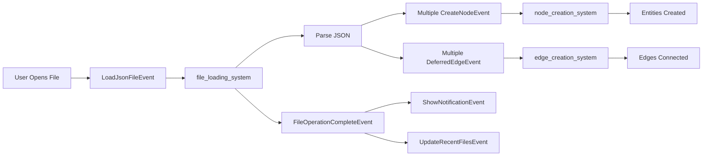
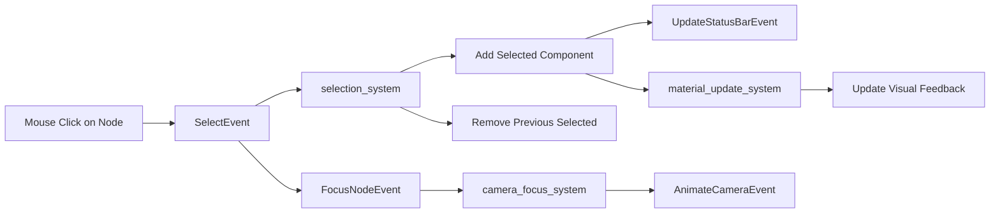
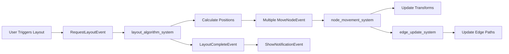

# Event Flow Guide for Alchemist Graph Editor

## Overview

The Alchemist Graph Editor uses an event-driven architecture to ensure loose coupling between systems and enable reactive, composable behaviors. This guide documents the event flows for common operations and provides patterns for implementing new features.

## Core Event Flow Principles

1. **Events are immutable messages** - Once sent, events cannot be modified
2. **Systems react to events** - No direct system-to-system calls
3. **Events enable traceability** - All state changes flow through events
4. **Events support undo/redo** - State changes can be recorded and reversed

## Common Event Flow Patterns

### 1. User Creates a Node

```mermaid
graph LR
    A[User Right-clicks] --> B[ShowContextMenuEvent]
    B --> C[context_menu_system]
    C --> D[User Selects "Create Node"]
    D --> E[CreateNodeEvent]
    E --> F[node_creation_system]
    F --> G[Spawn Entity with Components]
    F --> H[GraphModificationEvent]
    H --> I[undo_system]
    H --> J[graph_metrics_system]
    J --> K[GraphMetricsEvent]
    K --> L[UpdateStatusBarEvent]
```

**Key Points:**
- User interaction triggers UI event
- UI event leads to domain event
- Domain event causes entity creation
- Side effects (undo, metrics) handled by separate events

### 2. File Loading Flow



**Key Points:**
- File operation spawns multiple creation events
- Edges deferred until nodes exist
- Completion event triggers UI feedback
- Recent files updated automatically

### 3. Selection and Interaction Flow



**Key Points:**
- Selection changes trigger visual updates
- Camera can auto-focus on selection
- Status bar reflects current selection

### 4. Graph Layout Update Flow



**Key Points:**
- Layout changes expressed as move events
- Each node movement is trackable
- Edge updates follow node movements

## Event Categories and Their Interactions

### Graph Events
Primary events for graph manipulation. These often trigger cascading events:
- `CreateNodeEvent` → `GraphModificationEvent` → `GraphMetricsEvent`
- `DeleteNodeEvent` → `DeleteEdgeEvent` (for connected edges)
- `MoveNodeEvent` → Edge visual updates

### UI Events
Handle user interface state and feedback:
- `ShowContextMenuEvent` → User action → Graph events
- `TogglePanelEvent` → Layout recalculation
- `ShowNotificationEvent` → User feedback

### I/O Events
File and data persistence:
- `SaveJsonFileEvent` → Serialization → `FileOperationCompleteEvent`
- `AutoSaveEvent` → `CreateBackupEvent` → `SaveJsonFileEvent`

### Camera Events
View control and navigation:
- `FocusNodeEvent` → `AnimateCameraEvent` → Transform updates
- `SwitchViewModeEvent` → Camera component swaps

## Implementing New Features with Events

### Example: Adding a "Duplicate Node" Feature

1. **Define the Event**:
```rust
#[derive(Event)]
pub struct DuplicateNodeEvent {
    pub source_entity: Entity,
    pub offset: Vec3,
}
```

2. **Create Producer System**:
```rust
fn handle_duplicate_shortcut(
    keyboard: Res<Input<KeyCode>>,
    selected: Query<Entity, With<Selected>>,
    mut duplicate_events: EventWriter<DuplicateNodeEvent>,
) {
    if keyboard.just_pressed(KeyCode::D) && keyboard.pressed(KeyCode::ControlLeft) {
        for entity in selected.iter() {
            duplicate_events.send(DuplicateNodeEvent {
                source_entity: entity,
                offset: Vec3::new(50.0, 50.0, 0.0),
            });
        }
    }
}
```

3. **Create Consumer System**:
```rust
fn handle_duplicate_node(
    mut events: EventReader<DuplicateNodeEvent>,
    nodes: Query<(&Transform, &DomainNodeType, &NodeProperties)>,
    mut create_events: EventWriter<CreateNodeEvent>,
) {
    for event in events.read() {
        if let Ok((transform, domain_type, properties)) = nodes.get(event.source_entity) {
            create_events.send(CreateNodeEvent {
                id: Uuid::new_v4(),
                position: transform.translation + event.offset,
                domain_type: domain_type.clone(),
                name: format!("{} (Copy)", properties.name),
                labels: properties.labels.clone(),
                properties: properties.properties.clone(),
                subgraph_id: None,
                color: properties.color.clone(),
            });
        }
    }
}
```

4. **Register in Plugin**:
```rust
app.add_event::<DuplicateNodeEvent>()
   .add_systems(Update, (
       handle_duplicate_shortcut.in_set(GraphSystemSet::Input),
       handle_duplicate_node.in_set(GraphSystemSet::EventProcessing),
   ));
```

## Best Practices for Event-Driven Development

### 1. Event Naming
- Use verb-noun format: `CreateNodeEvent`, `DeleteEdgeEvent`
- Be specific: `MoveNodeEvent` not `UpdateNodeEvent`
- Include context: `GraphModificationEvent` not just `ModificationEvent`

### 2. Event Data
- Include all necessary data for the operation
- Prefer IDs over entity references for persistence
- Include "before" state for undo operations
- Keep events focused - one event per logical operation

### 3. System Organization
- One system per event type (usually)
- Clear producer/consumer documentation
- Explicit system ordering via SystemSets
- Avoid event cycles

### 4. Error Handling
```rust
fn safe_node_creation(
    mut events: EventReader<CreateNodeEvent>,
    mut commands: Commands,
    existing_nodes: Query<&NodeId>,
) {
    for event in events.read() {
        // Validate before processing
        if existing_nodes.iter().any(|id| id.0 == event.id) {
            warn!("Attempted to create duplicate node: {}", event.id);
            continue;
        }

        // Process event
        commands.spawn(NodeBundle::from_event(event));
    }
}
```

### 5. Event Debugging
```rust
// Add debug system to trace event flow
fn debug_graph_events(
    create_events: EventReader<CreateNodeEvent>,
    delete_events: EventReader<DeleteNodeEvent>,
    move_events: EventReader<MoveNodeEvent>,
) {
    for event in create_events.read() {
        debug!("CreateNodeEvent: {} at {:?}", event.name, event.position);
    }
    // ... similar for other events
}
```

## Migration from Direct Mutations

### Before (Direct Mutation):
```rust
fn move_selected_nodes(
    keyboard: Res<Input<KeyCode>>,
    mut nodes: Query<&mut Transform, With<Selected>>,
) {
    if keyboard.pressed(KeyCode::Right) {
        for mut transform in nodes.iter_mut() {
            transform.translation.x += 10.0;
        }
    }
}
```

### After (Event-Driven):
```rust
fn detect_move_input(
    keyboard: Res<Input<KeyCode>>,
    selected: Query<(Entity, &Transform), With<Selected>>,
    mut move_events: EventWriter<MoveNodeEvent>,
) {
    if keyboard.pressed(KeyCode::Right) {
        for (entity, transform) in selected.iter() {
            move_events.send(MoveNodeEvent {
                entity,
                from: transform.translation,
                to: transform.translation + Vec3::new(10.0, 0.0, 0.0),
            });
        }
    }
}

fn apply_node_movement(
    mut events: EventReader<MoveNodeEvent>,
    mut transforms: Query<&mut Transform>,
) {
    for event in events.read() {
        if let Ok(mut transform) = transforms.get_mut(event.entity) {
            transform.translation = event.to;
        }
    }
}
```

## Testing Event-Driven Systems

```rust
#[cfg(test)]
mod tests {
    use super::*;
    use bevy::app::App;

    #[test]
    fn test_node_creation_flow() {
        let mut app = App::new();
        app.add_event::<CreateNodeEvent>()
           .add_event::<GraphModificationEvent>()
           .add_systems(Update, (
               node_creation_system,
               track_modifications,
           ));

        // Send event
        app.world.send_event(CreateNodeEvent {
            id: Uuid::new_v4(),
            position: Vec3::ZERO,
            // ... other fields
        });

        // Run systems
        app.update();

        // Verify entity was created
        let nodes = app.world.query::<&NodeId>().iter(&app.world).count();
        assert_eq!(nodes, 1);

        // Verify modification event was sent
        let mod_events = app.world.resource::<Events<GraphModificationEvent>>();
        assert_eq!(mod_events.len(), 1);
    }
}
```

## Performance Considerations

1. **Event Batching**: For operations that generate many events, consider batching:
```rust
#[derive(Event)]
pub struct BatchCreateNodesEvent {
    pub nodes: Vec<CreateNodeData>,
}
```

2. **Event Filtering**: Use change detection to avoid unnecessary events:
```rust
fn detect_position_changes(
    changed_nodes: Query<(Entity, &Transform), Changed<Transform>>,
    mut move_events: EventWriter<MoveNodeEvent>,
) {
    // Only send events for actual changes
}
```

3. **Event Cleanup**: Events are automatically cleaned up, but for high-frequency events, consider manual cleanup:
```rust
fn cleanup_old_events(
    mut events: ResMut<Events<HighFrequencyEvent>>,
) {
    events.clear();
}
```

## Conclusion

The event-driven architecture in Alchemist provides:
- **Decoupling**: Systems don't directly depend on each other
- **Traceability**: All changes flow through events
- **Extensibility**: New features can hook into existing event flows
- **Testability**: Events make testing individual systems easier
- **Debuggability**: Event flow can be logged and analyzed

By following these patterns and best practices, you can build robust, maintainable features that integrate seamlessly with the existing architecture.
