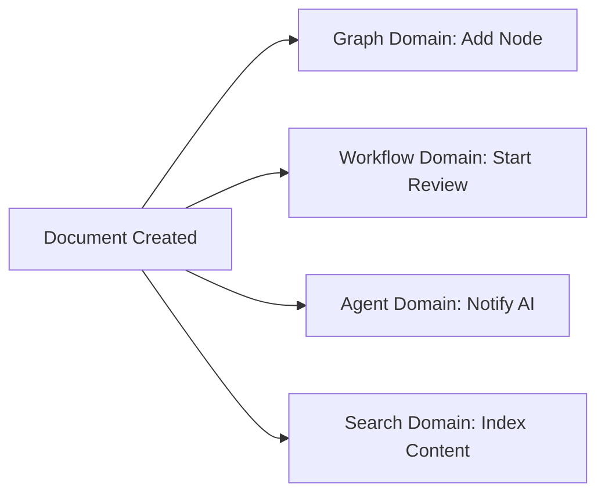

# Cross-Domain Integration Patterns

This guide demonstrates how CIM domains work together through event-driven integration patterns. Each domain maintains its bounded context while communicating through well-defined events over NATS.

## Table of Contents

1. [Core Integration Principles](#core-integration-principles)
2. [Event Choreography Patterns](#event-choreography-patterns)
3. [Command Orchestration Patterns](#command-orchestration-patterns)
4. [Common Integration Scenarios](#common-integration-scenarios)
5. [Implementation Examples](#implementation-examples)
6. [Best Practices](#best-practices)
7. [Anti-Patterns to Avoid](#anti-patterns-to-avoid)

## Core Integration Principles

### 1. Domain Autonomy

Each domain is self-contained and can operate independently:

```rust
// ❌ WRONG: Direct cross-domain dependency
use cim_domain_document::DocumentAggregate;

impl WorkflowAggregate {
    fn attach_document(&mut self, doc: DocumentAggregate) {
        // This creates tight coupling!
    }
}

// ✅ CORRECT: Event-based integration
impl WorkflowEventHandler {
    async fn handle_document_created(&self, event: DocumentCreated) {
        // React to document events without direct dependency
        let cmd = AttachDocumentToWorkflow {
            workflow_id: self.workflow_id,
            document_id: event.document_id,
            attached_at: SystemTime::now(),
        };
        self.command_bus.send(cmd).await?;
    }
}
```

### 2. Event-Driven Communication

Domains communicate exclusively through events:

```rust
// Publishing domain events
impl DocumentCommandHandler {
    async fn handle_create_document(&self, cmd: CreateDocument) -> Result<()> {
        // Process command...
        let event = DocumentCreated {
            document_id: cmd.document_id,
            title: cmd.title,
            author_id: cmd.author_id,
            created_at: SystemTime::now(),
        };
        
        // Publish to NATS for other domains
        self.event_bus.publish("document.created", &event).await?;
        Ok(())
    }
}

// Subscribing to events from other domains
impl WorkflowDomainService {
    async fn start_event_handlers(&self) -> Result<()> {
        // Subscribe to document events
        self.event_bus.subscribe("document.created", |event: DocumentCreated| {
            // Handle document creation
        }).await?;
        
        // Subscribe to person events
        self.event_bus.subscribe("person.registered", |event: PersonRegistered| {
            // Handle person registration
        }).await?;
        
        Ok(())
    }
}
```

### 3. Shared Kernel

Minimal shared types between domains:

```rust
// cim-shared-kernel/src/lib.rs
pub mod ids {
    #[derive(Debug, Clone, Copy, PartialEq, Eq, Hash)]
    pub struct UserId(pub Uuid);
    
    #[derive(Debug, Clone, Copy, PartialEq, Eq, Hash)]
    pub struct Timestamp(pub DateTime<Utc>);
}

// Domains use shared types for cross-domain references
pub struct DocumentCreated {
    pub document_id: DocumentId,  // Domain-specific
    pub author_id: UserId,         // Shared kernel
    pub created_at: Timestamp,     // Shared kernel
}
```

## Event Choreography Patterns

### Pattern 1: Cascade Events

One domain event triggers actions in multiple domains:



**Implementation:**

```rust
// Document domain publishes
self.publish("document.created", DocumentCreated { ... }).await?;

// Multiple domains react independently
// Graph domain
subscribe("document.created", |e: DocumentCreated| {
    create_node_for_document(e.document_id).await
});

// Workflow domain
subscribe("document.created", |e: DocumentCreated| {
    if requires_review(&e) {
        start_review_workflow(e.document_id).await
    }
});

// Agent domain
subscribe("document.created", |e: DocumentCreated| {
    analyze_document_content(e.document_id).await
});
```

### Pattern 2: Event Aggregation

Collect events from multiple domains before taking action:

```rust
pub struct WorkflowReadyChecker {
    required_documents: HashSet<DocumentId>,
    received_documents: HashSet<DocumentId>,
    required_approvals: HashSet<UserId>,
    received_approvals: HashSet<UserId>,
}

impl WorkflowReadyChecker {
    async fn handle_document_created(&mut self, event: DocumentCreated) {
        self.received_documents.insert(event.document_id);
        self.check_if_ready().await?;
    }
    
    async fn handle_approval_granted(&mut self, event: ApprovalGranted) {
        self.received_approvals.insert(event.approver_id);
        self.check_if_ready().await?;
    }
    
    async fn check_if_ready(&self) -> Result<()> {
        if self.all_requirements_met() {
            self.publish("workflow.ready_to_proceed", WorkflowReady {
                workflow_id: self.workflow_id,
                collected_documents: self.received_documents.clone(),
                collected_approvals: self.received_approvals.clone(),
            }).await?;
        }
        Ok(())
    }
}
```

### Pattern 3: Saga Pattern

Coordinate long-running transactions across domains:

```rust
pub struct DocumentPublishingSaga {
    saga_id: SagaId,
    state: SagaState,
    compensations: Vec<CompensationAction>,
}

impl DocumentPublishingSaga {
    async fn execute(&mut self) -> Result<()> {
        // Step 1: Validate document
        match self.validate_document().await {
            Ok(_) => self.compensations.push(CompensationAction::RevertValidation),
            Err(e) => return self.compensate().await,
        }
        
        // Step 2: Create graph visualization
        match self.create_graph_visualization().await {
            Ok(_) => self.compensations.push(CompensationAction::DeleteGraph),
            Err(e) => return self.compensate().await,
        }
        
        // Step 3: Notify subscribers
        match self.notify_subscribers().await {
            Ok(_) => self.compensations.push(CompensationAction::RevokeNotifications),
            Err(e) => return self.compensate().await,
        }
        
        // Step 4: Update search index
        match self.update_search_index().await {
            Ok(_) => {
                self.publish("saga.completed", SagaCompleted {
                    saga_id: self.saga_id,
                    result: "Document published successfully".to_string(),
                }).await?;
            }
            Err(e) => return self.compensate().await,
        }
        
        Ok(())
    }
    
    async fn compensate(&mut self) -> Result<()> {
        // Execute compensations in reverse order
        for action in self.compensations.iter().rev() {
            action.execute().await?;
        }
        Ok(())
    }
}
```

## Command Orchestration Patterns

### Pattern 1: Command Router

Central router directs commands to appropriate domains:

```rust
pub struct CrossDomainCommandRouter {
    document_handler: Arc<DocumentCommandHandler>,
    workflow_handler: Arc<WorkflowCommandHandler>,
    graph_handler: Arc<GraphCommandHandler>,
}

impl CrossDomainCommandRouter {
    async fn route_command(&self, cmd: CrossDomainCommand) -> Result<()> {
        match cmd {
            CrossDomainCommand::CreateDocumentWithWorkflow { doc, workflow } => {
                // Orchestrate across domains
                let doc_id = self.document_handler.create_document(doc).await?;
                let workflow_cmd = CreateWorkflow {
                    attached_document: Some(doc_id),
                    ..workflow
                };
                self.workflow_handler.create_workflow(workflow_cmd).await?;
            }
            CrossDomainCommand::PublishDocumentToGraph { doc_id, graph_id } => {
                // Coordinate publication
                let doc = self.document_handler.get_document(doc_id).await?;
                let node_cmd = AddNode {
                    graph_id,
                    node_type: NodeType::Document,
                    metadata: doc.to_metadata(),
                };
                self.graph_handler.add_node(node_cmd).await?;
            }
        }
        Ok(())
    }
}
```

### Pattern 2: Process Manager

Stateful coordination of multi-domain processes:

```rust
pub struct OnboardingProcessManager {
    process_id: ProcessId,
    state: OnboardingState,
    person_id: Option<PersonId>,
    organization_id: Option<OrganizationId>,
    documents: Vec<DocumentId>,
}

impl OnboardingProcessManager {
    async fn start_onboarding(&mut self, cmd: StartOnboarding) -> Result<()> {
        // Step 1: Create person
        let person_cmd = CreatePerson {
            name: cmd.employee_name,
            email: cmd.employee_email,
            ..Default::default()
        };
        
        self.send_command("person.create", person_cmd).await?;
        self.state = OnboardingState::AwaitingPersonCreation;
        Ok(())
    }
    
    async fn handle_person_created(&mut self, event: PersonCreated) -> Result<()> {
        self.person_id = Some(event.person_id);
        
        // Step 2: Add to organization
        let org_cmd = AddOrganizationMember {
            organization_id: self.organization_id.unwrap(),
            person_id: event.person_id,
            role: "Employee".to_string(),
        };
        
        self.send_command("organization.add_member", org_cmd).await?;
        self.state = OnboardingState::AwaitingOrgMembership;
        Ok(())
    }
    
    async fn handle_member_added(&mut self, event: MemberAdded) -> Result<()> {
        // Step 3: Create onboarding documents
        for template in &self.onboarding_templates {
            let doc_cmd = CreateDocumentFromTemplate {
                template_id: template.id,
                variables: self.build_template_vars(),
            };
            self.send_command("document.create_from_template", doc_cmd).await?;
        }
        
        self.state = OnboardingState::AwaitingDocuments;
        Ok(())
    }
}
```

## Common Integration Scenarios

### Scenario 1: Document Approval Workflow

Integrates Document, Workflow, Person, and Notification domains:

```rust
// 1. Document created → triggers workflow
subscribe("document.created", |e: DocumentCreated| {
    if requires_approval(&e) {
        create_approval_workflow(e.document_id).await
    }
});

// 2. Workflow assigns tasks → notifies people
subscribe("workflow.task_assigned", |e: TaskAssigned| {
    notify_assignee(e.assignee_id, e.task_details).await
});

// 3. Person approves → updates workflow
subscribe("person.action_taken", |e: ActionTaken| {
    if e.action_type == "approve" {
        complete_workflow_step(e.workflow_id, e.step_id).await
    }
});

// 4. Workflow completes → updates document
subscribe("workflow.completed", |e: WorkflowCompleted| {
    update_document_state(e.document_id, DocumentState::Approved).await
});
```

### Scenario 2: AI-Enhanced Knowledge Graph

Integrates Agent, ConceptualSpaces, Graph, and Document domains:

```rust
// 1. Document analyzed by AI
subscribe("document.created", |e: DocumentCreated| {
    let analysis_cmd = AnalyzeDocument {
        document_id: e.document_id,
        extract_entities: true,
        extract_concepts: true,
    };
    send_to_agent(analysis_cmd).await
});

// 2. AI extracts concepts
subscribe("agent.analysis_completed", |e: AnalysisCompleted| {
    for concept in e.extracted_concepts {
        let space_cmd = AddConceptToSpace {
            concept,
            space_id: determine_space(&concept),
        };
        send_to_conceptual_spaces(space_cmd).await
    }
});

// 3. Concepts mapped to graph nodes
subscribe("conceptualspace.concept_added", |e: ConceptAdded| {
    let node_cmd = AddNode {
        graph_id: knowledge_graph_id(),
        node_type: NodeType::Concept,
        position: e.conceptual_position.to_3d(),
        metadata: e.concept.to_metadata(),
    };
    send_to_graph(node_cmd).await
});

// 4. Graph connects similar concepts
subscribe("graph.node_added", |e: NodeAdded| {
    if e.node_type.is_concept() {
        find_and_connect_similar_concepts(e.node_id).await
    }
});
```

### Scenario 3: Location-Based Organization Search

Integrates Location, Organization, and Search domains:

```rust
// 1. Organization updates location
subscribe("organization.location_changed", |e: LocationChanged| {
    let geo_cmd = GeocodeAddress {
        address: e.new_address,
        organization_id: e.organization_id,
    };
    send_to_location(geo_cmd).await
});

// 2. Location service geocodes
subscribe("location.geocoded", |e: Geocoded| {
    let update_cmd = UpdateOrganizationCoordinates {
        organization_id: e.entity_id,
        coordinates: e.coordinates,
    };
    send_to_organization(update_cmd).await
});

// 3. Organization updates search index
subscribe("organization.coordinates_updated", |e: CoordinatesUpdated| {
    let index_cmd = UpdateSearchIndex {
        entity_type: "organization",
        entity_id: e.organization_id,
        geo_point: e.coordinates,
    };
    send_to_search(index_cmd).await
});

// 4. Enable proximity searches
async fn find_nearby_organizations(location: GeoPoint, radius_km: f32) -> Vec<Organization> {
    let search_cmd = ProximitySearch {
        center: location,
        radius_km,
        entity_type: "organization",
    };
    search_service.execute(search_cmd).await
}
```

## Implementation Examples

### Example 1: Event Bus Setup

```rust
use async_nats::jetstream;

pub struct DomainEventBus {
    client: async_nats::Client,
    jetstream: jetstream::Context,
    domain_name: String,
}

impl DomainEventBus {
    pub async fn new(domain_name: &str) -> Result<Self> {
        let client = async_nats::connect("nats://localhost:4222").await?;
        let jetstream = jetstream::new(client.clone());
        
        // Create domain-specific stream
        jetstream.create_stream(jetstream::stream::Config {
            name: format!("{}_EVENTS", domain_name.to_uppercase()),
            subjects: vec![format!("{}.>", domain_name)],
            ..Default::default()
        }).await?;
        
        Ok(Self {
            client,
            jetstream,
            domain_name: domain_name.to_string(),
        })
    }
    
    pub async fn publish<E: Serialize>(&self, event_type: &str, event: &E) -> Result<()> {
        let subject = format!("{}.{}", self.domain_name, event_type);
        let payload = serde_json::to_vec(event)?;
        
        self.jetstream.publish(subject, payload.into()).await?;
        Ok(())
    }
    
    pub async fn subscribe<E, F>(&self, pattern: &str, handler: F) -> Result<()>
    where
        E: DeserializeOwned + Send + 'static,
        F: Fn(E) -> BoxFuture<'static, Result<()>> + Send + Sync + 'static,
    {
        let mut subscriber = self.client.subscribe(pattern).await?;
        
        tokio::spawn(async move {
            while let Some(msg) = subscriber.next().await {
                if let Ok(event) = serde_json::from_slice::<E>(&msg.payload) {
                    if let Err(e) = handler(event).await {
                        eprintln!("Handler error: {}", e);
                    }
                }
            }
        });
        
        Ok(())
    }
}
```

### Example 2: Cross-Domain Transaction

```rust
pub struct CrossDomainTransaction {
    transaction_id: TransactionId,
    operations: Vec<DomainOperation>,
    completed: Vec<OperationId>,
    failed: Option<OperationId>,
}

impl CrossDomainTransaction {
    pub async fn execute(&mut self) -> Result<TransactionResult> {
        for operation in &self.operations {
            match self.execute_operation(operation).await {
                Ok(result) => {
                    self.completed.push(operation.id);
                    self.publish_progress(operation.id, result).await?;
                }
                Err(e) => {
                    self.failed = Some(operation.id);
                    self.rollback().await?;
                    return Err(e);
                }
            }
        }
        
        Ok(TransactionResult::Committed {
            transaction_id: self.transaction_id,
            operations_completed: self.completed.len(),
        })
    }
    
    async fn rollback(&mut self) -> Result<()> {
        // Rollback in reverse order
        for op_id in self.completed.iter().rev() {
            let operation = self.find_operation(*op_id);
            self.execute_compensation(operation).await?;
        }
        Ok(())
    }
}
```

### Example 3: Event Correlation

```rust
pub struct EventCorrelator {
    correlation_rules: Vec<CorrelationRule>,
    event_buffer: HashMap<CorrelationKey, Vec<DomainEvent>>,
    timeout_duration: Duration,
}

impl EventCorrelator {
    pub async fn correlate(&mut self, event: DomainEvent) -> Option<CorrelatedEvents> {
        let key = self.extract_correlation_key(&event);
        
        self.event_buffer
            .entry(key.clone())
            .or_insert_with(Vec::new)
            .push(event);
        
        // Check if correlation is complete
        for rule in &self.correlation_rules {
            if rule.is_satisfied(&self.event_buffer[&key]) {
                let correlated = CorrelatedEvents {
                    correlation_id: key.clone(),
                    events: self.event_buffer.remove(&key).unwrap(),
                    rule_matched: rule.name.clone(),
                };
                return Some(correlated);
            }
        }
        
        // Set timeout for incomplete correlations
        self.schedule_timeout(key, self.timeout_duration).await;
        None
    }
}
```

## Best Practices

### 1. Design for Eventual Consistency

```rust
// Don't expect immediate consistency
// ❌ WRONG
let doc_id = create_document(cmd).await?;
let doc = get_document(doc_id).await?; // May not exist yet!

// ✅ CORRECT
let doc_id = create_document(cmd).await?;
subscribe_once("document.created", |e: DocumentCreated| {
    if e.document_id == doc_id {
        // Now we can safely work with the document
    }
}).await;
```

### 2. Use Idempotent Event Handlers

```rust
impl EventHandler for DocumentEventHandler {
    async fn handle_person_created(&self, event: PersonCreated) -> Result<()> {
        // Check if we've already processed this event
        if self.processed_events.contains(&event.event_id) {
            return Ok(());
        }
        
        // Process event
        self.create_author_profile(event.person_id).await?;
        
        // Mark as processed
        self.processed_events.insert(event.event_id);
        Ok(())
    }
}
```

### 3. Implement Circuit Breakers

```rust
pub struct DomainServiceClient {
    circuit_breaker: CircuitBreaker,
    client: HttpClient,
}

impl DomainServiceClient {
    async fn call_service(&self, request: ServiceRequest) -> Result<ServiceResponse> {
        self.circuit_breaker
            .call(async {
                self.client.post("/api/service", &request).await
            })
            .await
            .map_err(|e| match e {
                CircuitBreakerError::Open => Error::ServiceUnavailable,
                CircuitBreakerError::CallFailed(e) => Error::ServiceError(e),
            })
    }
}
```

### 4. Version Your Events

```rust
#[derive(Serialize, Deserialize)]
#[serde(tag = "version")]
pub enum DocumentCreatedEvent {
    #[serde(rename = "1.0")]
    V1(DocumentCreatedV1),
    
    #[serde(rename = "2.0")]
    V2(DocumentCreatedV2),
}

impl DocumentCreatedEvent {
    pub fn document_id(&self) -> DocumentId {
        match self {
            Self::V1(e) => e.document_id,
            Self::V2(e) => e.document_id,
        }
    }
}
```

### 5. Monitor Integration Points

```rust
pub struct IntegrationMonitor {
    metrics: MetricsCollector,
}

impl IntegrationMonitor {
    pub async fn track_cross_domain_call<F, T>(&self, 
        source: &str, 
        target: &str, 
        operation: F
    ) -> Result<T>
    where
        F: Future<Output = Result<T>>,
    {
        let start = Instant::now();
        let result = operation.await;
        let duration = start.elapsed();
        
        self.metrics.record_integration_call(
            source,
            target,
            duration,
            result.is_ok(),
        );
        
        result
    }
}
```

## Anti-Patterns to Avoid

### ❌ Distributed Monolith

```rust
// WRONG: Synchronous calls between domains
impl DocumentService {
    async fn create_document(&self, cmd: CreateDocument) -> Result<Document> {
        // Don't call other domains synchronously!
        let author = self.person_service.get_person(cmd.author_id).await?;
        let org = self.org_service.get_organization(author.org_id).await?;
        
        // This creates a distributed monolith!
    }
}
```

### ❌ Chatty Communication

```rust
// WRONG: Too many fine-grained events
publish("field.updated", FieldUpdated { field: "title", value: "..." });
publish("field.updated", FieldUpdated { field: "content", value: "..." });
publish("field.updated", FieldUpdated { field: "status", value: "..." });

// CORRECT: Batch related changes
publish("document.updated", DocumentUpdated {
    changes: vec![
        Change::Title(new_title),
        Change::Content(new_content),
        Change::Status(new_status),
    ]
});
```

### ❌ Tight Coupling Through Shared Database

```rust
// WRONG: Multiple domains sharing database
impl DocumentRepository {
    async fn find_documents_by_author(&self, author_id: PersonId) -> Vec<Document> {
        // Don't query person table directly!
        sqlx::query("SELECT d.* FROM documents d 
                     JOIN persons p ON d.author_id = p.id 
                     WHERE p.id = ?")
    }
}
```

### ❌ Ignoring Domain Boundaries

```rust
// WRONG: Leaking domain logic
pub struct DocumentCreatedEvent {
    pub document_id: DocumentId,
    pub workflow_state: WorkflowState,  // Workflow domain concept!
    pub search_keywords: Vec<String>,    // Search domain concept!
}

// CORRECT: Keep events domain-focused
pub struct DocumentCreatedEvent {
    pub document_id: DocumentId,
    pub title: String,
    pub author_id: UserId,
    pub created_at: Timestamp,
}
```

## Summary

Cross-domain integration in CIM follows these key principles:

1. **Autonomy**: Each domain is independent and self-contained
2. **Asynchrony**: Domains communicate through asynchronous events
3. **Resilience**: Design for failures and eventual consistency
4. **Simplicity**: Keep integration points simple and well-defined
5. **Observability**: Monitor and trace cross-domain interactions

By following these patterns, CIM achieves a truly composable architecture where domains can evolve independently while working together seamlessly. 