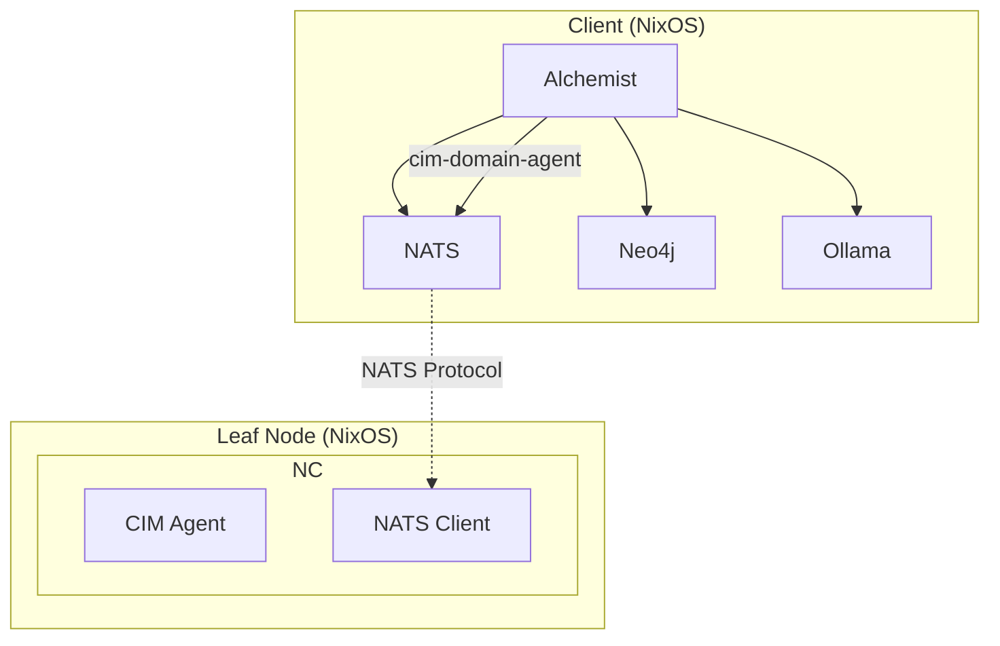

# CIM NixOS Deployment Guide

## Overview

CIM follows a NixOS-first deployment strategy with a clear separation between:
- **Client**: Runs Alchemist with local services (NATS, Neo4j, Ollama)
- **Leaf Nodes**: Run CIM agents as NixOS containers communicating via NATS

All deployments use Nix flakes for reproducibility and `nixos-rebuild --target` for remote deployment.

## Architecture



## Client Setup

### Client Flake Configuration

```nix
# flake.nix for Alchemist client
{
  description = "Alchemist CIM Client";

  inputs = {
    nixpkgs.url = "github:NixOS/nixpkgs/nixos-unstable";
    flake-utils.url = "github:numtide/flake-utils";
    rust-overlay.url = "github:oxalica/rust-overlay";
  };

  outputs = { self, nixpkgs, flake-utils, rust-overlay, ... }:
    flake-utils.lib.eachDefaultSystem (system:
      let
        overlays = [ (import rust-overlay) ];
        pkgs = import nixpkgs { inherit system overlays; };
        
        rust-nightly = pkgs.rust-bin.selectLatestNightlyWith (toolchain:
          toolchain.default.override {
            extensions = [ "rust-src" "rust-analyzer" ];
          }
        );
      in
      {
        # Development shell
        devShells.default = pkgs.mkShell {
          buildInputs = with pkgs; [
            rust-nightly
            pkg-config
            
            # Required services
            nats-server
            neo4j
            ollama
            
            # Build dependencies
            openssl
            protobuf
            
            # Development tools
            cargo-watch
            cargo-nextest
            bacon
          ];
          
          shellHook = ''
            export RUST_LOG=info,cim=debug
            export NATS_URL=nats://localhost:4222
            
            # Start local services
            echo "Starting NATS server..."
            nats-server -js -sd ./data/nats &
            
            echo "Services available at:"
            echo "  NATS: localhost:4222"
            echo "  Neo4j: localhost:7474"
            echo "  Ollama: localhost:11434"
          '';
        };
      });
}
```

### Client NixOS Module

```nix
# modules/alchemist-client.nix
{ config, lib, pkgs, ... }:

with lib;

let
  cfg = config.services.alchemist-client;
in
{
  options.services.alchemist-client = {
    enable = mkEnableOption "Alchemist CIM client";
    
    natsUrl = mkOption {
      type = types.str;
      default = "nats://localhost:4222";
      description = "NATS server URL";
    };
    
    leafNodes = mkOption {
      type = types.listOf types.str;
      default = [];
      description = "List of leaf node addresses for agent communication";
    };
  };

  config = mkIf cfg.enable {
    # NATS with JetStream
    services.nats = {
      enable = true;
      jetstream = true;
      extraConfig = ''
        max_payload = 8MB
        
        leafnodes {
          port: 7422
          remotes = [
            ${concatMapStringsSep "\n" (node: ''
              {
                url: "nats://${node}:7422"
                credentials: "/var/lib/nats/leaf.creds"
              }
            '') cfg.leafNodes}
          ]
        }
      '';
    };
    
    # Neo4j for graph storage
    services.neo4j = {
      enable = true;
      bolt.enable = true;
      https.enable = false;
      
      directories = {
        data = "/var/lib/neo4j/data";
        logs = "/var/log/neo4j";
      };
    };
    
    # Ollama for local AI
    services.ollama = {
      enable = true;
      listenAddress = "0.0.0.0:11434";
      models = [ "llama3" "codellama" ];
    };
    
    # Firewall rules
    networking.firewall = {
      allowedTCPPorts = [ 
        4222  # NATS client
        7422  # NATS leaf
        7474  # Neo4j browser
        7687  # Neo4j bolt
        11434 # Ollama
      ];
    };
  };
}
```

## Leaf Node Configuration

### Agent Container Flake

```nix
# cim-agent-alchemist/flake.nix
{
  description = "CIM Agent for Alchemist";

  inputs = {
    nixpkgs.url = "github:NixOS/nixpkgs/nixos-unstable";
    rust-overlay.url = "github:oxalica/rust-overlay";
  };

  outputs = { self, nixpkgs, rust-overlay }:
    let
      system = "x86_64-linux";
      pkgs = import nixpkgs {
        inherit system;
        overlays = [ rust-overlay.overlays.default ];
      };
      
      rust = pkgs.rust-bin.stable.latest.default;
      
      cim-agent = pkgs.rustPlatform.buildRustPackage {
        pname = "cim-agent-alchemist";
        version = "0.1.0";
        
        src = ./.;
        
        cargoLock = {
          lockFile = ./Cargo.lock;
        };
        
        buildInputs = with pkgs; [
          openssl
          pkg-config
        ];
      };
    in
    {
      # NixOS module for the agent
      nixosModules.default = { config, lib, pkgs, ... }:
        with lib;
        let
          cfg = config.services.cim-agent;
        in
        {
          options.services.cim-agent = {
            enable = mkEnableOption "CIM Agent";
            
            natsUrl = mkOption {
              type = types.str;
              default = "nats://nats:4222";
              description = "NATS server URL";
            };
            
            agentId = mkOption {
              type = types.str;
              description = "Unique agent identifier";
            };
            
            capabilities = mkOption {
              type = types.listOf types.str;
              default = [ "graph-analysis" "workflow-optimization" ];
              description = "Agent capabilities";
            };
          };
          
          config = mkIf cfg.enable {
            systemd.services.cim-agent = {
              description = "CIM Agent Service";
              wantedBy = [ "multi-user.target" ];
              after = [ "network.target" ];
              
              serviceConfig = {
                Type = "simple";
                ExecStart = "${cim-agent}/bin/cim-agent";
                Restart = "on-failure";
                RestartSec = 5;
                
                # Security hardening
                DynamicUser = true;
                ProtectSystem = "strict";
                ProtectHome = true;
                NoNewPrivileges = true;
                PrivateTmp = true;
              };
              
              environment = {
                RUST_LOG = "info,cim=debug";
                NATS_URL = cfg.natsUrl;
                AGENT_ID = cfg.agentId;
                AGENT_CAPABILITIES = builtins.toJSON cfg.capabilities;
              };
            };
          };
        };
      
      # Container configuration
      nixosConfigurations.container = nixpkgs.lib.nixosSystem {
        inherit system;
        modules = [
          self.nixosModules.default
          ({ ... }: {
            boot.isContainer = true;
            
            services.cim-agent = {
              enable = true;
              agentId = "alchemist-agent-001";
              natsUrl = "nats://host:4222";
            };
            
            # Minimal container setup
            networking.useDHCP = false;
            system.stateVersion = "24.05";
          })
        ];
      };
    };
}
```

### Leaf Node Host Configuration

```nix
# /etc/nixos/leaf-node.nix
{ config, pkgs, lib, ... }:

{
  # Enable container support
  boot.enableContainers = true;
  
  # Extra containers configuration
  containers.cim-agent-alchemist = {
    autoStart = true;
    privateNetwork = false;  # Share host network for NATS
    
    config = { config, pkgs, ... }: {
      imports = [ 
        # Import the agent flake module
        (builtins.getFlake "git+https://github.com/thecowboyai/cim-agent-alchemist").nixosModules.default
      ];
      
      services.cim-agent = {
        enable = true;
        agentId = "alchemist-${config.networking.hostName}";
        natsUrl = "nats://10.0.0.1:4222";  # Client NATS server
        capabilities = [
          "graph-analysis"
          "workflow-optimization"
          "semantic-search"
        ];
      };
      
      # Container-specific settings
      system.stateVersion = "24.05";
    };
    
    # Bind mounts if needed
    bindMounts = {
      "/var/lib/cim-agent" = {
        hostPath = "/var/lib/containers/cim-agent-alchemist";
        isReadOnly = false;
      };
    };
  };
  
  # Alternative: Using extra-containers
  services.extra-containers = {
    cim-agent-alchemist = {
      definition = {
        imports = [
          (builtins.getFlake "git+https://github.com/thecowboyai/cim-agent-alchemist").nixosModules.default
        ];
        
        services.cim-agent = {
          enable = true;
          agentId = "alchemist-${config.networking.hostName}";
          natsUrl = "nats://10.0.0.1:4222";
        };
      };
    };
  };
  
  # NATS leaf node configuration
  services.nats = {
    enable = true;
    extraConfig = ''
      port: 4222
      
      leafnodes {
        port: 7422
        remotes = [
          {
            url: "nats://10.0.0.1:7422"
            credentials: "/var/lib/nats/client.creds"
          }
        ]
      }
    '';
  };
}
```

## Deployment Process

### 1. Deploy to Leaf Node

```bash
# Build and deploy to remote leaf node
nixos-rebuild switch --target-host root@leaf-node-01 \
  --flake .#leaf-node

# Or using colmena for multiple nodes
colmena apply --on leaf-node-01,leaf-node-02
```

### 2. Verify Container Status

```bash
# SSH to leaf node
ssh root@leaf-node-01

# Check container status
nixos-container status cim-agent-alchemist

# View container logs
journalctl -u container@cim-agent-alchemist -f

# Enter container for debugging
nixos-container root-login cim-agent-alchemist
```

### 3. Test NATS Connectivity

```bash
# From client
nats pub test.ping "hello"
nats sub "agent.>" 

# From leaf node
nats --server nats://10.0.0.1:4222 sub ">"
```

## CI/CD Integration

### GitHub Actions Workflow

```yaml
# .github/workflows/deploy.yml
name: Deploy CIM Agents

on:
  push:
    branches: [ main ]
    paths:
      - 'cim-agent-*/**'
      - 'flake.nix'
      - 'flake.lock'

jobs:
  deploy:
    runs-on: ubuntu-latest
    steps:
      - uses: actions/checkout@v4
      
      - name: Install Nix
        uses: cachix/install-nix-action@v24
        with:
          extra_nix_config: |
            experimental-features = nix-command flakes
      
      - name: Build agent
        run: |
          nix build .#cim-agent-alchemist
      
      - name: Deploy to leaf nodes
        env:
          SSH_KEY: ${{ secrets.DEPLOY_SSH_KEY }}
        run: |
          echo "$SSH_KEY" > deploy_key
          chmod 600 deploy_key
          
          for node in leaf-node-01 leaf-node-02; do
            nixos-rebuild switch \
              --target-host root@$node \
              --build-host localhost \
              --flake .#leaf-node \
              --option ssh-config-file ./ssh_config
          done
```

## Monitoring and Maintenance

### Health Checks

```nix
# monitoring.nix
{ config, pkgs, ... }:

{
  services.prometheus = {
    enable = true;
    
    scrapeConfigs = [
      {
        job_name = "nats";
        static_configs = [{
          targets = [ "localhost:8222" ];
        }];
      }
      {
        job_name = "cim-agents";
        static_configs = [{
          targets = map (node: "${node}:9090") config.leafNodes;
        }];
      }
    ];
  };
  
  services.grafana = {
    enable = true;
    addr = "0.0.0.0";
    port = 3000;
    
    provision = {
      enable = true;
      datasources = [{
        name = "Prometheus";
        type = "prometheus";
        url = "http://localhost:9090";
      }];
    };
  };
}
```

### Backup Strategy

```bash
#!/usr/bin/env bash
# backup-cim.sh

# Backup NATS JetStream
nats stream backup EVENTS /backup/nats/events-$(date +%Y%m%d).tar.gz

# Backup Neo4j
systemctl stop neo4j
tar -czf /backup/neo4j/neo4j-$(date +%Y%m%d).tar.gz /var/lib/neo4j/data
systemctl start neo4j

# Sync to remote storage
rclone sync /backup remote:cim-backups/
```

## Troubleshooting

### Common Issues

1. **Container fails to start**
   ```bash
   # Check container journal
   journalctl -u container@cim-agent-alchemist
   
   # Verify flake inputs
   nix flake metadata
   nix flake check
   ```

2. **NATS connectivity issues**
   ```bash
   # Test from container
   nixos-container run cim-agent-alchemist -- nats-cli ping
   
   # Check leaf node connection
   nats server info --server nats://leaf-node:4222
   ```

3. **Agent not responding**
   ```bash
   # Check agent health endpoint
   curl http://localhost:9090/health
   
   # Verify NATS subscriptions
   nats sub --server nats://localhost:4222 "agent.>"
   ```

## Security Considerations

1. **NATS Authentication**: Use credentials files for leaf node connections
2. **Network Isolation**: Containers use host networking only when necessary
3. **Secrets Management**: Use agenix or sops-nix for sensitive configuration
4. **Firewall Rules**: Restrict ports to known client/leaf addresses

## Future Enhancements

1. **Distributed Tracing**: OpenTelemetry integration
2. **Service Mesh**: Consul Connect for zero-trust networking
3. **GitOps**: Flux or ArgoCD for automated deployments
4. **Multi-Region**: WireGuard mesh for cross-region communication

---

This deployment guide reflects the actual CIM architecture using NixOS containers and NATS-based communication. 