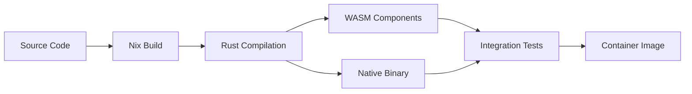

# Information Alchemist Technical Architecture

## System Architecture Overview

Information Alchemist employs a dual-layer architecture that separates computational concerns from visualization, enabling both high performance and flexibility. The system is built on Bevy's Entity-Component-System (ECS) architecture and integrates with the broader Composable Information Machine (CIM) ecosystem.

```
┌─────────────────────────────────────────────────────────────┐
│                     User Interface Layer                      │
│  ┌─────────────┐  ┌──────────────┐  ┌──────────────────┐   │
│  │   3D View   │  │   2D View    │  │   Control Panel  │   │
│  └─────────────┘  └──────────────┘  └──────────────────┘   │
└─────────────────────────────────────────────────────────────┘
                              │
┌─────────────────────────────────────────────────────────────┐
│                    Visualization Layer (Bevy)                 │
│  ┌─────────────┐  ┌──────────────┐  ┌──────────────────┐   │
│  │  Rendering  │  │  Interaction │  │    Animation     │   │
│  │   Systems   │  │   Systems    │  │     Systems      │   │
│  └─────────────┘  └──────────────┘  └──────────────────┘   │
└─────────────────────────────────────────────────────────────┘
                              │
┌─────────────────────────────────────────────────────────────┐
│                    Computational Layer                        │
│  ┌─────────────┐  ┌──────────────┐  ┌──────────────────┐   │
│  │  Petgraph   │  │    Daggy     │  │  Layout Engine   │   │
│  │ Algorithms  │  │  DAG Ops     │  │    Physics       │   │
│  └─────────────┘  └──────────────┘  └──────────────────┘   │
└─────────────────────────────────────────────────────────────┘
                              │
┌─────────────────────────────────────────────────────────────┐
│                      Event Store Layer                        │
│  ┌─────────────┐  ┌──────────────┐  ┌──────────────────┐   │
│  │    NATS     │  │  Event Log   │  │   Projections    │   │
│  │  JetStream  │  │   Storage    │  │    (Read Models) │   │
│  └─────────────┘  └──────────────┘  └──────────────────┘   │
└─────────────────────────────────────────────────────────────┘
```

## Core Components

### 1. Visualization Layer (Bevy ECS)

#### Entity Hierarchy

```
World
├── GraphEntity
│   ├── GraphId (Component)
│   ├── GraphMetadata (Component)
│   └── GraphBounds (Component)
├── NodeEntity[]
│   ├── NodeId (Component)
│   ├── Transform (Component)
│   ├── Mesh (Component)
│   ├── Material (Component)
│   ├── NodeData (Component)
│   ├── Selectable (Component)
│   └── Draggable (Component)
└── EdgeEntity[]
    ├── EdgeId (Component)
    ├── EdgeEndpoints (Component)
    ├── LineRenderer (Component)
    ├── Material (Component)
    └── EdgeData (Component)
```

#### Core Systems

##### RenderingSystem
- Manages mesh generation and updates
- Handles LOD (Level of Detail) switching
- Performs frustum culling
- Batches draw calls for performance

##### InteractionSystem
- Processes mouse/keyboard input
- Manages selection state
- Handles drag operations
- Triggers interaction events

##### AnimationSystem
- Interpolates position changes
- Manages transition animations
- Handles camera movements
- Queues and sequences animations

##### CameraSystem
- Manages camera state and controls
- Switches between 2D/3D modes
- Handles zoom, pan, orbit
- Maintains view frustum

### 2. Computational Layer

#### Graph Engine
- **Storage**: Petgraph data structures
- **Algorithms**:
  - Shortest path (Dijkstra, A*)
  - Topological sort
  - Cycle detection
  - Connected components
  - Minimum spanning tree

#### Layout Engine
- **Force-Directed Layout**:
  ```rust
  // Hooke's Law (Spring Forces)
  F_spring = -k * (|d| - L) * d̂

  // Coulomb's Law (Repulsion)
  F_repulsion = k_e * (q1 * q2) / |d|²
  ```
- **Hierarchical Layout**: For directed acyclic graphs
- **Circular Layout**: Nodes arranged in circles
- **Grid Layout**: Regular grid positioning

#### Physics Simulation
- Velocity Verlet integration
- Spatial indexing (R-tree) for collision detection
- Configurable force parameters
- Constraint satisfaction

### 3. Event Store Layer

#### Event Stream Architecture

```
User Action → Command → Validation → Event → Storage → Projection
                                        ↓
                                    NATS JetStream
                                        ↓
                                 Other Systems/Contexts
```

#### Event Categories

1. **Graph Events**
   - Subject: `graph.{graphId}.{eventType}`
   - Persistence: Durable, replicated
   - Retention: Unlimited (event sourcing)

2. **Visualization Events**
   - Subject: `viz.{sessionId}.{eventType}`
   - Persistence: Memory-only
   - Retention: Session lifetime

3. **Layout Events**
   - Subject: `layout.{graphId}.{eventType}`
   - Persistence: Durable
   - Retention: Latest state only

4. **Collaboration Events**
   - Subject: `collab.{sessionId}.{eventType}`
   - Persistence: Durable
   - Retention: Configurable window

## Data Flow Architecture

### 1. Read Path
```
User Request
    ↓
Query Handler
    ↓
Read Model (Projection)
    ↓
Response
```

### 2. Write Path
```
User Action
    ↓
Command Handler
    ↓
Domain Validation
    ↓
Event Generation
    ↓
Event Store (NATS)
    ↓
Projection Updates
    ↓
UI Updates
```

### 3. Real-time Updates
```
Event Store
    ↓
NATS Subscription
    ↓
Event Handler
    ↓
ECS Component Update
    ↓
System Processing
    ↓
Frame Render
```

## Performance Optimizations

### 1. Spatial Indexing
- R-tree for 3D spatial queries
- Quadtree for 2D mode
- Chunk-based loading for large graphs

### 2. Rendering Optimizations
- Instanced rendering for similar nodes
- Billboarding for 2D sprites in 3D
- Occlusion culling
- Dynamic batching

### 3. Data Structures
- Entity archetype optimization
- Component pools for memory locality
- Sparse sets for component storage
- Arena allocators for temporary data

### 4. Concurrency
- Parallel ECS systems
- Lock-free data structures
- Work-stealing job system
- GPU compute for physics

## Integration Architecture

### 1. NATS JetStream Integration

```rust
// Event Publishing
struct EventPublisher {
    connection: nats::Connection,
    stream: Stream,
}

// Event Subscription
struct EventSubscriber {
    subscription: Subscription,
    handler: Box<dyn EventHandler>,
}
```

### 2. WebAssembly Components

```rust
// Domain Logic Component
#[wasm_bindgen]
pub struct DomainValidator {
    rules: Vec<Rule>,
}

// AI Agent Component
#[wasm_bindgen]
pub struct LayoutOptimizer {
    model: Model,
}
```

### 3. Storage Abstraction

```rust
trait GraphStorage {
    async fn save_graph(&self, graph: &Graph) -> Result<()>;
    async fn load_graph(&self, id: GraphId) -> Result<Graph>;
    async fn list_graphs(&self) -> Result<Vec<GraphMetadata>>;
}

// Implementations
struct NatsStorage { /* ... */ }
struct FileStorage { /* ... */ }
struct S3Storage { /* ... */ }
```

## Security Architecture

### 1. Authentication
- JWT tokens for user identity
- NATS user credentials
- Certificate-based service auth

### 2. Authorization
- Graph-level permissions
- Element-level access control
- Operation-based policies

### 3. Data Protection
- Event encryption in transit
- At-rest encryption for storage
- Audit logging of all operations

## Deployment Architecture

### 1. Container Structure
```dockerfile
# Nix-based deterministic build
FROM nixos/nix
COPY flake.nix flake.lock ./
RUN nix build
```

### 2. Service Topology
```
┌─────────────┐     ┌─────────────┐     ┌─────────────┐
│   Frontend  │────▶│   Backend   │────▶│    NATS     │
│   (Bevy)    │     │   (API)     │     │  JetStream  │
└─────────────┘     └─────────────┘     └─────────────┘
                            │
                    ┌───────┴────────┐
                    │                │
              ┌─────────────┐  ┌─────────────┐
              │   Storage   │  │  AI Agents  │
              │  Provider   │  │   (Wasm)    │
              └─────────────┘  └─────────────┘
```

### 3. Scaling Strategy
- Horizontal scaling of visualization instances
- NATS cluster for message throughput
- Read model replication
- CDN for static assets

## Development Architecture

### 1. Module Structure
```
alchemist/
├── core/
│   ├── domain/         # Domain models
│   ├── events/         # Event definitions
│   └── commands/       # Command handlers
├── visualization/
│   ├── systems/        # ECS systems
│   ├── components/     # ECS components
│   └── resources/      # Shared resources
├── computational/
│   ├── algorithms/     # Graph algorithms
│   ├── layout/         # Layout engines
│   └── physics/        # Physics simulation
└── integration/
    ├── nats/          # NATS integration
    ├── storage/       # Storage providers
    └── wasm/          # WebAssembly components
```

### 2. Build Pipeline


### 3. Testing Strategy
- Unit tests for domain logic
- Integration tests for event flows
- Performance benchmarks
- Visual regression tests
- Load testing with large graphs

## Technology Stack

### Core Technologies
- **Language**: Rust
- **Game Engine**: Bevy 0.16.0
- **Graph Library**: petgraph 0.8+
- **DAG Operations**: daggy 0.9+
- **UI Framework**: bevy_egui 0.34+
- **Messaging**: NATS JetStream 2.10+

### Development Tools
- **Build System**: Nix
- **Version Control**: Git
- **CI/CD**: Nix-based pipelines
- **Documentation**: mdBook
- **Benchmarking**: criterion.rs

### Deployment
- **Container**: Nix-based OCI images
- **Orchestration**: Kubernetes/NixOS
- **Monitoring**: Prometheus/Grafana
- **Logging**: Vector/Loki
