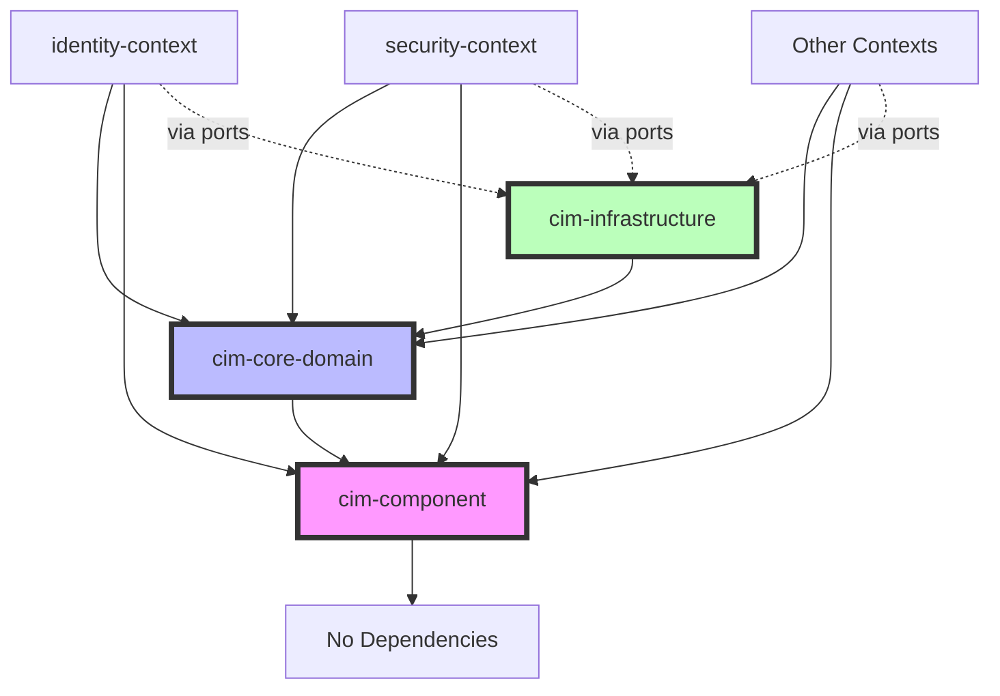
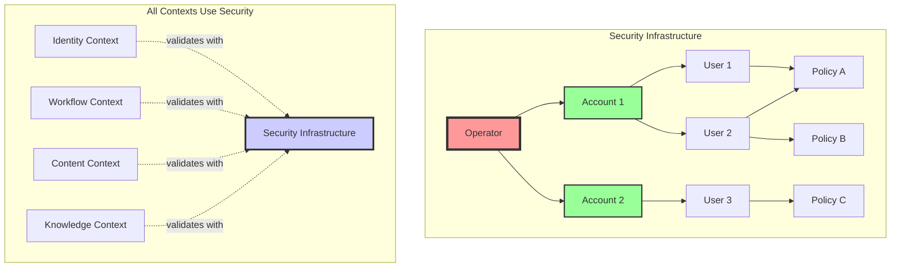

# Bounded Context Refactoring Quick Reference

## Module Dependency Rules



## Foundation Module Checklist

### ✅ cim-component
- [ ] Component trait extracted
- [ ] ComponentStorage implementation
- [ ] Only serde and uuid dependencies
- [ ] No domain logic
- [ ] No infrastructure code

### ✅ cim-core-domain
- [ ] Entity trait
- [ ] AggregateRoot trait
- [ ] ValueObject trait
- [ ] DomainEvent trait
- [ ] Command trait
- [ ] Query trait
- [ ] Core error types
- [ ] Shared identifiers
- [ ] NO implementations
- [ ] NO infrastructure dependencies

### ✅ cim-infrastructure
- [ ] EventStore trait and implementations
- [ ] NATS client wrapper
- [ ] Repository implementations
- [ ] Command bus
- [ ] Query bus
- [ ] NO domain logic

## Context Structure Template

```
cim-{name}-context/
├── Cargo.toml              # Minimal dependencies
├── src/
│   ├── lib.rs             # Public exports only
│   ├── domain/            # Pure business logic
│   │   └── {aggregate}/
│   │       ├── aggregate.rs
│   │       ├── commands.rs
│   │       ├── events.rs
│   │       └── value_objects.rs
│   ├── application/       # Use cases
│   │   ├── command_handlers.rs
│   │   ├── query_handlers.rs
│   │   └── services.rs
│   ├── infrastructure/    # Adapters
│   │   └── repositories.rs
│   └── ports/            # Interfaces
│       ├── inbound.rs
│       └── outbound.rs
└── tests/
    ├── unit/
    └── integration/
```

## Code Patterns

### ✅ CORRECT: Aggregate Pattern
```rust
pub struct PersonAggregate {
    id: PersonId,
    // fields...
}

impl PersonAggregate {
    pub fn handle_command(&mut self, cmd: PersonCommand) -> Result<Vec<PersonEvent>> {
        // Validate → Generate Events → Apply Events
    }
}
```

### ✅ CORRECT: Port Pattern
```rust
// In ports/outbound.rs
#[async_trait]
pub trait PersonRepository {
    async fn find_by_id(&self, id: PersonId) -> Result<Option<PersonAggregate>>;
    async fn save(&self, person: &PersonAggregate) -> Result<()>;
}

// In infrastructure/repositories.rs
pub struct NatsPersonRepository { /* ... */ }

#[async_trait]
impl PersonRepository for NatsPersonRepository {
    // Implementation
}
```

### ✅ CORRECT: Event Translation
```rust
pub struct SecurityEventTranslator;

impl SecurityEventTranslator {
    pub fn translate(&self, event: IdentityIntegrationEvent) -> Option<SecurityCommand> {
        // Map external events to internal commands
    }
}
```

## Anti-Pattern Checklist

### ❌ AVOID These Patterns
- [ ] Direct imports between contexts
- [ ] Shared domain models
- [ ] Infrastructure in domain layer
- [ ] Domain logic in services
- [ ] Mutable events
- [ ] Anemic domain models
- [ ] Cross-aggregate queries
- [ ] Circular dependencies

## Verification Commands

```bash
# Check for circular dependencies
cargo depgraph | grep -E "circular|cycle"

# Build context independently
cd cim-{context}-context && cargo build

# Run isolated tests
cd cim-{context}-context && cargo test

# Check module dependencies
cargo tree -p cim-{context}-context

# Verify no cross-context imports
rg "use cim_.*_context" --type rust
```

## NATS Subject Convention

```
{context}.events.{aggregate}.{event}
{context}.commands.{aggregate}.{command}
{context}.queries.{query_type}

Examples:
- identity.events.person.created
- security.events.operator.created
- security.events.account.created
- security.events.user.created
- security.commands.user.create
- workflow.queries.find_active_workflows
```

## Security Context (NATS Model)

**Note**: Security is infrastructure that ALL contexts use, not just another bounded context.



### Security Aggregates
- **Operator**: Root of trust, signs Account JWTs
- **Account**: Isolation boundary, contains Users
- **User**: Authentication entity, has Policies
- **Policy**: Permissions and resource limits

### How Contexts Use Security
```rust
// Every context follows this pattern
pub struct AnyContextHandler {
    domain_logic: Arc<dyn DomainService>,
    security_client: Arc<dyn SecurityClient>, // Always included
}
```

## Migration Strategy

1. **Phase 1**: Foundation modules (cim-component, cim-core-domain, cim-infrastructure)
2. **Phase 2**: Create contexts one by one
3. **Phase 3**: Implement event translators
4. **Phase 4**: Update existing modules
5. **Phase 5**: Integration testing
6. **Phase 6**: Remove old code

## Success Criteria

- [ ] Zero circular dependencies
- [ ] Each context compiles independently
- [ ] All tests pass in isolation
- [ ] Clear import boundaries
- [ ] Event-based integration only
- [ ] < 30s build time per context
- [ ] < 2min integration test suite

## Emergency Procedures

If you encounter circular dependencies:
1. Check import statements
2. Verify module boundaries
3. Use event translation instead of direct calls
4. Create integration events if needed
5. Document the issue and solution

Remember: **Independence > Convenience**
