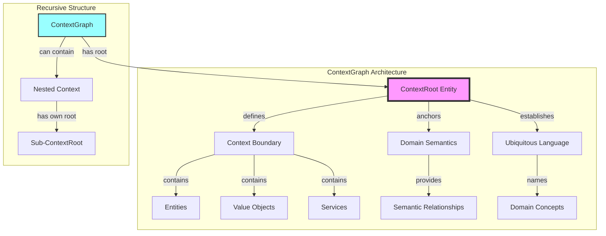

# ContextGraph Architecture

## Core Concept

A **ContextGraph** represents a bounded context in Domain-Driven Design, with a designated **ContextRoot** entity that serves as the semantic anchor for the entire graph. This aligns perfectly with DDD principles where each bounded context has a clear boundary and a root aggregate that maintains consistency.

## Architecture Diagram



## Key Principles

### 1. ContextRoot as Semantic Anchor

The ContextRoot entity:
- **Defines the boundary** of what belongs in this context
- **Establishes identity** for the entire context
- **Maintains invariants** across the context
- **Provides entry point** for all operations

### 2. Recursive Context Nesting

```rust
pub struct ContextGraph {
    pub id: GraphId,
    pub context_root: NodeId,  // The root entity that defines this context
    pub context_type: ContextType,
    pub nodes: HashMap<NodeId, ContextNode>,
    pub edges: HashMap<EdgeId, ContextEdge>,
    // ...
}

pub enum ContextType {
    /// Bounded Context (top-level)
    BoundedContext { domain: String },

    /// Aggregate Context (consistency boundary)
    Aggregate { aggregate_type: String },

    /// Module Context (functional grouping)
    Module { module_name: String },

    /// Service Context (operational boundary)
    Service { service_type: String },
}
```

### 3. Context Boundaries

Each ContextGraph maintains:
- **Internal consistency** through the root entity
- **External interfaces** for cross-context communication
- **Semantic coherence** within its boundary
- **Clear ownership** of its domain concepts

## Benefits of ContextRoot Pattern

1. **Clear Entry Points**: All operations flow through the context root
2. **Consistency Enforcement**: Root maintains invariants
3. **Semantic Clarity**: Root defines what the context represents
4. **Navigation Aid**: Start from root to explore the context
5. **Boundary Definition**: Root determines what's inside/outside

## Implementation Strategy

### Phase 1: Rename ContentGraph to ContextGraph
- Update all references from ContentGraph to ContextGraph
- Add context_root field to track the root entity
- Ensure every ContextGraph has a designated root

### Phase 2: Implement ContextRoot Semantics
- Root entity validation
- Invariant enforcement through root
- Navigation helpers starting from root

### Phase 3: Leverage Recursive Structure
- Nested contexts with their own roots
- Context composition patterns
- Cross-context references through roots

## Example Usage

```rust
// Create a User Management context
let user_context = ContextGraph::new_with_root(
    GraphId::new(),
    ContextType::BoundedContext { domain: "UserManagement".into() },
    "User Aggregate Root"
);

// The root entity defines the context
let root_id = user_context.context_root;

// All entities in this context relate to the root
user_context.add_entity("User Profile", RelatedBy::Contains);
user_context.add_entity("User Preferences", RelatedBy::Contains);
user_context.add_service("User Authentication", RelatedBy::DependsOn);
```

## Migration Path

1. Rename ContentGraph → ContextGraph
2. Identify context roots in existing graphs
3. Add context_root field
4. Update event names and commands
5. Refactor to use root-centric operations
