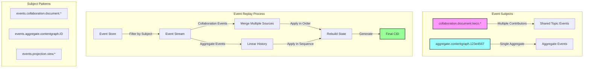

# Event Replay Demo Architecture

## Overview

The Event Replay Demo demonstrates two critical patterns in our event-driven architecture:

1. **Collaboration Subjects** - Multiple actors contributing events about a shared topic
2. **Aggregate Subjects** - Events that belong to a specific aggregate instance

## Architecture Diagram

## Subject Naming Conventions

### Collaboration Subjects
- Pattern: `events.collaboration.{context}.{topic}`
- Example: `events.collaboration.document.keco`
- Purpose: Multiple actors can publish events about a shared topic
- Use Case: Collaborative editing, shared workflows, distributed contributions

### Aggregate Subjects
- Pattern: `events.aggregate.{type}.{id}`
- Example: `events.aggregate.contentgraph.123e4567-89ab-cdef`
- Purpose: Single source of truth for an aggregate's state changes
- Use Case: Domain aggregate lifecycle, state transitions, business operations

### Projection Subjects
- Pattern: `events.projection.{view}.{context}`
- Example: `events.projection.dashboard.analytics`
- Purpose: Denormalized views for query optimization
- Use Case: Read models, reporting, UI views

## Event Replay Capabilities

### 1. Time Travel
- Replay events up to a specific point in time
- Reconstruct historical state at any moment
- Useful for debugging and auditing

### 2. Selective Replay
- Filter by subject pattern
- Replay only specific aggregates or collaborations
- Enables focused analysis

### 3. State Verification
- Compare CIDs at different points
- Verify deterministic replay
- Ensure consistency across replays

### 4. Snapshot Integration
- Start replay from a snapshot
- Reduce replay time for large event streams
- Balance between performance and flexibility

## Implementation Notes

1. **Event Ordering**: Events must be applied in the correct order based on timestamps and causality
2. **Idempotency**: Event handlers must be idempotent to handle potential replay scenarios
3. **CID Verification**: The final CID should match the original if events are replayed identically
4. **Performance**: Consider using snapshots for aggregates with long event histories

## Demo Scenarios

1. **Collaboration Replay**: Show how multiple contributors' events merge into a coherent state
2. **Aggregate Replay**: Demonstrate linear history replay for a single aggregate
3. **Point-in-Time**: Replay to specific timestamps to show historical states
4. **Selective Replay**: Filter events by subject to replay only relevant changes
