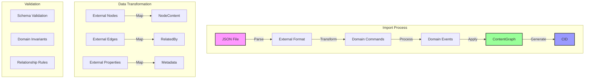

# JSON Import Demo Architecture

## Overview

The JSON Import Demo demonstrates how to import external graph data (from tools like Neo4j, Cytoscape, or other graph visualization tools) into our ContentGraph system. This showcases:

1. **Format Translation** - Converting external JSON formats to our domain model
2. **Event Generation** - Creating proper domain events from imported data
3. **CID Assignment** - Generating content-addressable identifiers for imported content
4. **Validation** - Ensuring imported data meets our domain invariants

## Architecture Diagram



## Import Patterns

### 1. External Format Support

The demo supports common graph export formats:
- **Neo4j Export Format** - nodes/relationships with properties
- **Cytoscape JSON** - network visualization format
- **GraphML** - XML-based graph format (converted to JSON)
- **Custom CIM Format** - Our native format

### 2. Transformation Pipeline

```rust
// Pipeline stages
ExternalFormat → ParsedData → ValidationResult → DomainCommands → Events → ContentGraph
```

### 3. Error Handling

- **Schema Errors** - Invalid JSON structure
- **Validation Errors** - Domain rule violations
- **Partial Import** - Continue on non-critical errors
- **Rollback Support** - Transactional import with event sourcing

## Implementation Strategy

### Phase 1: Basic Import
- Parse JSON file
- Create nodes and edges
- Generate events
- Calculate CID

### Phase 2: Advanced Features
- Property mapping
- Style preservation
- Layout information
- Metadata enrichment

### Phase 3: Export Capability
- Round-trip support
- Multiple format export
- CID-based versioning

## Benefits

1. **Interoperability** - Work with existing graph tools
2. **Migration Path** - Import legacy graph data
3. **Collaboration** - Share graphs with external teams
4. **Backup/Restore** - JSON as portable format
