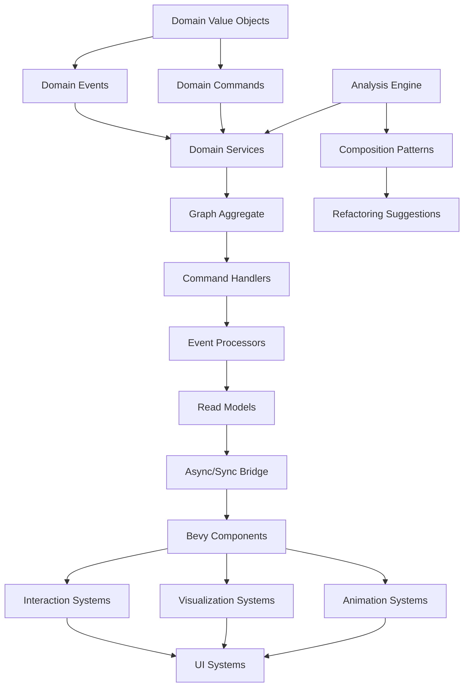

# Subgraph Advanced Operations - Modular Implementation Breakdown

## Module Dependency Graph



## Module 1: Domain Foundation

### 1.1 Value Objects Module
**File**: `src/domain/value_objects/subgraph_operations.rs`

```rust
// Core types needed by all other modules
pub mod subgraph_state;
pub mod subgraph_metadata;
pub mod subgraph_type;
pub mod layout_strategy;
pub mod merge_strategy;
pub mod split_criteria;
pub mod collapse_strategy;
```

**Dependencies**: None (foundation module)

**Implementation Order**:
1. Define enums for states and strategies
2. Create metadata structures
3. Add validation logic
4. Implement Display and Debug traits

### 1.2 Domain Events Module
**File**: `src/domain/events/subgraph_operations.rs`

```rust
// Events that capture what happened
pub mod collapse_events;
pub mod expand_events;
pub mod merge_events;
pub mod split_events;
pub mod drag_drop_events;
pub mod metadata_events;
```

**Dependencies**: Value Objects

**Implementation Order**:
1. Define event structures
2. Add serialization support
3. Implement event validation
4. Create event factories

### 1.3 Domain Commands Module
**File**: `src/domain/commands/subgraph_operations.rs`

```rust
// Commands that express intent
pub mod collapse_commands;
pub mod expand_commands;
pub mod merge_commands;
pub mod split_commands;
pub mod drag_drop_commands;
pub mod metadata_commands;
```

**Dependencies**: Value Objects

**Implementation Order**:
1. Define command structures
2. Add command validation
3. Create command builders
4. Implement command routing

## Module 2: Domain Services

### 2.1 Subgraph Analyzer
**File**: `src/domain/services/subgraph_analyzer.rs`

```rust
pub struct SubgraphAnalyzer {
    metrics_calculator: MetricsCalculator,
    pattern_detector: PatternDetector,
    complexity_analyzer: ComplexityAnalyzer,
}

// Key methods:
// - analyze_cohesion()
// - analyze_coupling()
// - find_split_points()
// - calculate_merge_cost()
```

**Dependencies**: Value Objects, Graph structure

**Implementation Order**:
1. Implement metrics calculations
2. Add pattern detection algorithms
3. Create complexity scoring
4. Build suggestion engine

### 2.2 Layout Calculator
**File**: `src/domain/services/layout_calculator.rs`

```rust
pub struct SubgraphLayoutCalculator {
    force_directed: ForceDirectedLayout,
    hierarchical: HierarchicalLayout,
    circular: CircularLayout,
    grid: GridLayout,
}

// Key methods:
// - calculate_collapsed_position()
// - calculate_expansion_layout()
// - optimize_edge_crossings()
// - apply_constraints()
```

**Dependencies**: Value Objects, Spatial algorithms

**Implementation Order**:
1. Implement basic layouts
2. Add constraint system
3. Create optimization algorithms
4. Build layout transitions

## Module 3: Interaction Systems

### 3.1 Collapse/Expand System
**File**: `src/presentation/bevy_systems/subgraph_collapse_expand.rs`

```rust
// Components
#[derive(Component)]
pub struct CollapsedSubgraph { ... }

#[derive(Component)]
pub struct CollapseAnimation { ... }

// Systems
pub fn detect_collapse_trigger() { ... }
pub fn execute_collapse() { ... }
pub fn animate_collapse() { ... }
pub fn detect_expand_trigger() { ... }
pub fn execute_expand() { ... }
pub fn animate_expand() { ... }
```

**Dependencies**: Bevy ECS, Domain Events, Animation System

**Implementation Order**:
1. Create component structures
2. Implement trigger detection
3. Add collapse logic
4. Build expand logic
5. Create animations

### 3.2 Drag and Drop System
**File**: `src/presentation/bevy_systems/subgraph_drag_drop.rs`

```rust
// Resources
#[derive(Resource)]
pub struct DragDropState { ... }

// Components
#[derive(Component)]
pub struct Draggable { ... }

#[derive(Component)]
pub struct DropZone { ... }

// Systems
pub fn handle_drag_start() { ... }
pub fn update_drag() { ... }
pub fn handle_drop() { ... }
pub fn visualize_drop_zones() { ... }
```

**Dependencies**: Bevy ECS, Input handling, Visual feedback

**Implementation Order**:
1. Create state management
2. Implement drag detection
3. Add drag visualization
4. Build drop validation
5. Create drop execution

### 3.3 Merge/Split System
**File**: `src/presentation/bevy_systems/subgraph_merge_split.rs`

```rust
// Resources
#[derive(Resource)]
pub struct MergeState { ... }

#[derive(Resource)]
pub struct SplitState { ... }

// Systems
pub fn handle_multi_selection() { ... }
pub fn preview_merge() { ... }
pub fn execute_merge() { ... }
pub fn detect_split_gesture() { ... }
pub fn preview_split() { ... }
pub fn execute_split() { ... }
```

**Dependencies**: Selection system, Preview rendering, Domain services

**Implementation Order**:
1. Build selection system
2. Create merge preview
3. Implement merge execution
4. Add split detection
5. Build split execution

## Module 4: Visualization Systems

### 4.1 Visual Styles System
**File**: `src/presentation/bevy_systems/subgraph_visual_styles.rs`

```rust
// Components
#[derive(Component)]
pub struct SubgraphStyle { ... }

// Resources
#[derive(Resource)]
pub struct StyleRegistry { ... }

// Systems
pub fn apply_type_styles() { ... }
pub fn render_boundaries() { ... }
pub fn animate_styles() { ... }
```

**Dependencies**: Bevy rendering, Material system

**Implementation Order**:
1. Define style components
2. Create style registry
3. Implement style application
4. Add boundary rendering
5. Build style animations

### 4.2 Connection Visualization
**File**: `src/presentation/bevy_systems/subgraph_connections.rs`

```rust
// Components
#[derive(Component)]
pub struct SubgraphConnection { ... }

// Systems
pub fn calculate_connections() { ... }
pub fn render_connections() { ... }
pub fn animate_flow() { ... }
```

**Dependencies**: Edge analysis, Rendering pipeline

**Implementation Order**:
1. Analyze edge patterns
2. Create connection geometry
3. Implement flow visualization
4. Add connection styles

### 4.3 Metadata Display
**File**: `src/presentation/bevy_systems/subgraph_metadata_display.rs`

```rust
// Components
#[derive(Component)]
pub struct MetadataPanel { ... }

// Systems
pub fn spawn_panels() { ... }
pub fn update_statistics() { ... }
pub fn handle_hover() { ... }
```

**Dependencies**: UI system, Text rendering

**Implementation Order**:
1. Create panel components
2. Implement panel spawning
3. Add data binding
4. Build hover detection

## Module 5: Analysis and Composition

### 5.1 Analysis Engine
**File**: `src/domain/services/analysis_engine.rs`

```rust
pub struct AnalysisEngine {
    cohesion_analyzer: CohesionAnalyzer,
    coupling_analyzer: CouplingAnalyzer,
    complexity_scorer: ComplexityScorer,
    pattern_matcher: PatternMatcher,
}
```

**Dependencies**: Graph algorithms, Domain services

**Implementation Order**:
1. Implement cohesion metrics
2. Add coupling analysis
3. Create complexity scoring
4. Build pattern matching

### 5.2 Composition Patterns
**File**: `src/domain/services/composition_patterns.rs`

```rust
pub trait CompositionPattern {
    fn detect(&self, subgraphs: &[Subgraph]) -> bool;
    fn optimize(&self, subgraphs: &mut [Subgraph]);
    fn suggest_refactoring(&self) -> Vec<RefactoringSuggestion>;
}
```

**Dependencies**: Pattern recognition, Graph theory

**Implementation Order**:
1. Define pattern traits
2. Implement common patterns
3. Add pattern detection
4. Create optimization algorithms

## Module 6: Integration Layer

### 6.1 Command Handlers
**File**: `src/application/command_handlers/subgraph_operations_handler.rs`

```rust
pub struct SubgraphOperationsHandler {
    // Handles all subgraph-related commands
    // Coordinates with domain services
    // Generates appropriate events
}
```

**Dependencies**: All domain modules, Event store

**Implementation Order**:
1. Create handler structure
2. Implement command routing
3. Add validation logic
4. Build event generation

### 6.2 Event Processors
**File**: `src/application/event_processors/subgraph_event_processor.rs`

```rust
pub struct SubgraphEventProcessor {
    // Processes domain events
    // Updates read models
    // Triggers side effects
}
```

**Dependencies**: Event handling, Read models

**Implementation Order**:
1. Create processor structure
2. Implement event routing
3. Add projection updates
4. Build side effect handling

### 6.3 Read Models
**File**: `src/application/read_models/subgraph_read_models.rs`

```rust
pub struct SubgraphReadModel {
    state_projection: HashMap<SubgraphId, SubgraphState>,
    statistics_cache: HashMap<SubgraphId, Statistics>,
    connection_graph: Graph<SubgraphId, ConnectionInfo>,
}
```

**Dependencies**: Projection system, Caching

**Implementation Order**:
1. Define read model structures
2. Implement projections
3. Add caching logic
4. Build query interfaces

## Implementation Schedule

### Week 1: Foundation (Domain Layer)
- **Day 1-2**: Value Objects and basic types
- **Day 3-4**: Events and Commands
- **Day 5**: Domain Services structure

### Week 2: Core Functionality
- **Day 1-2**: Collapse/Expand system
- **Day 3-4**: Drag and Drop system
- **Day 5**: Basic merge/split

### Week 3: Visual Enhancement
- **Day 1-2**: Style system
- **Day 3-4**: Connection visualization
- **Day 5**: Metadata display

### Week 4: Advanced Features
- **Day 1-2**: Analysis engine
- **Day 3-4**: Composition patterns
- **Day 5**: Refactoring suggestions

### Week 5: Integration & Polish
- **Day 1-2**: Command handlers and processors
- **Day 3**: Read models and projections
- **Day 4**: Testing and debugging
- **Day 5**: Documentation and examples

## Testing Strategy

### Unit Tests
- Test each module in isolation
- Mock dependencies
- Focus on business logic

### Integration Tests
- Test module interactions
- Verify event flow
- Check state consistency

### Visual Tests
- Screenshot comparisons
- Animation smoothness
- User interaction flows

### Performance Tests
- Measure operation latency
- Check memory usage
- Profile rendering performance

## Key Success Factors

1. **Modularity**: Each module should be independently testable
2. **Event-Driven**: All state changes through events
3. **Performance**: Sub-100ms operations, 60 FPS animations
4. **User Experience**: Intuitive interactions, clear feedback
5. **Maintainability**: Clear code, comprehensive docs

## Risk Mitigation

1. **Complexity**: Start simple, iterate
2. **Performance**: Profile early, optimize later
3. **Integration**: Test boundaries thoroughly
4. **User Experience**: Get feedback early
5. **Technical Debt**: Refactor continuously
