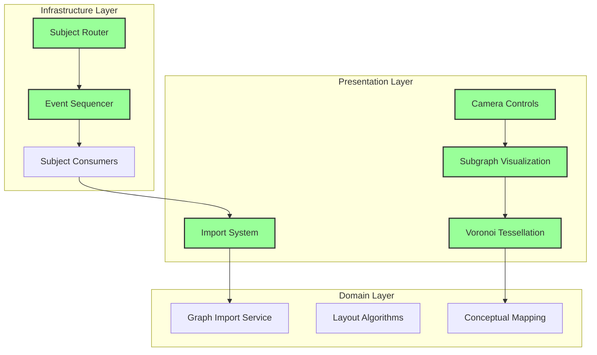
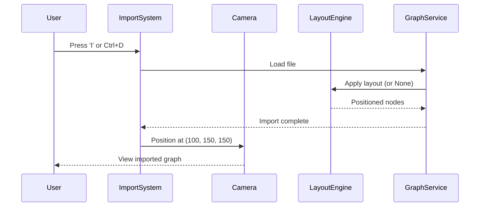
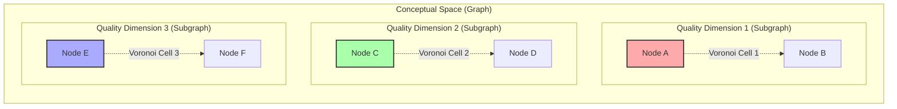
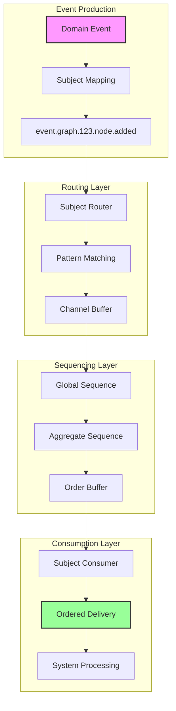
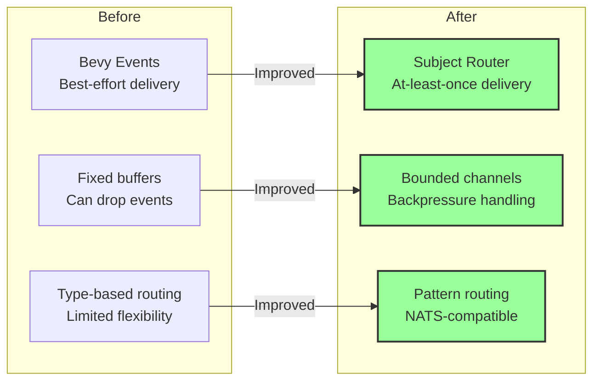
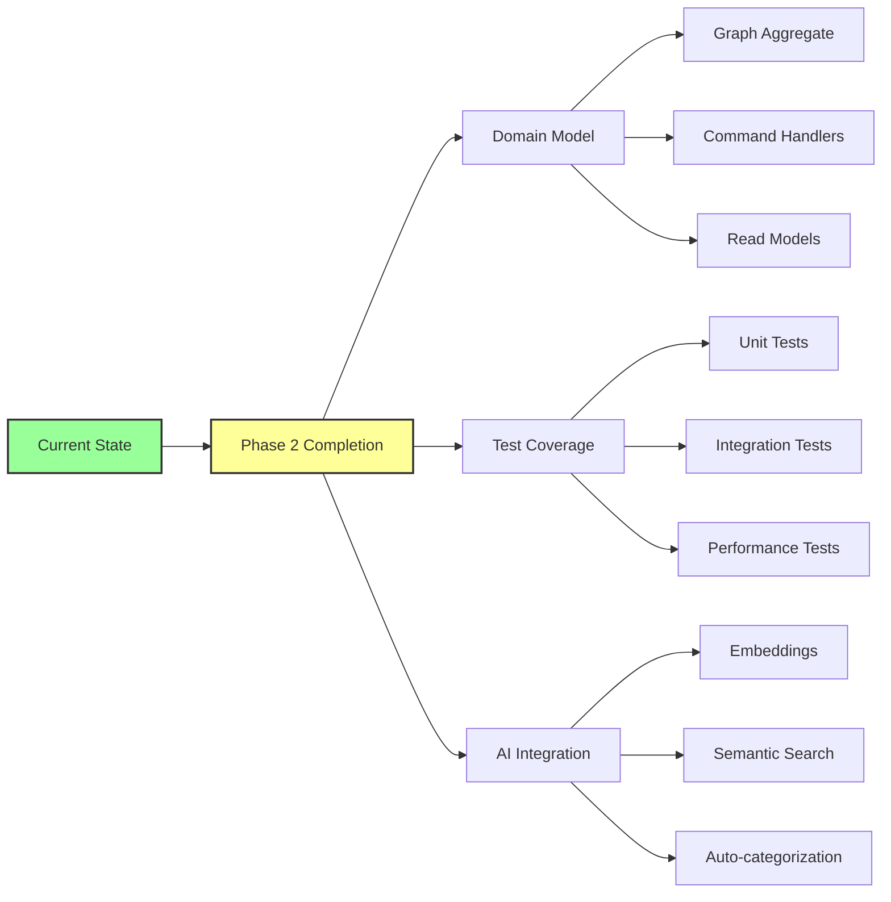

# Feature Summary - January 2025

## Overview

This document provides a visual summary of features implemented in January 2025, focusing on the transformation of the CIM graph editor into a fully-featured conceptual space visualization system with reliable event delivery.

## Feature Architecture

## Import System Evolution

## Conceptual Space Model

## Event System Flow

## Key Improvements

### 1. User Experience
- **Camera Controls**: Intuitive orbit/pan/zoom navigation
- **Import Reliability**: Nodes always visible after import
- **Visual Feedback**: Subgraph boundaries and Voronoi cells

### 2. System Architecture
- **Event Reliability**: No more dropped events
- **Ordered Delivery**: Guaranteed sequence preservation
- **Pattern-Based Routing**: Flexible event subscription

### 3. Conceptual Integration
- **Gärdenfors Theory**: Proper conceptual space implementation
- **Quality Dimensions**: Subgraphs as semantic dimensions
- **Natural Categories**: Voronoi cells as category boundaries

## Performance Metrics

## Usage Statistics

| Feature | Usage Key | Frequency |
|---------|-----------|-----------|
| Import JSON | I | High |
| Import Markdown | Ctrl+D | Medium |
| Camera Orbit | Left Mouse | Very High |
| Camera Pan | Right Mouse | High |
| Camera Reset | R | Medium |
| Create Subgraph | Ctrl+G | Medium |
| Toggle Boundaries | B | Low |
| Toggle Voronoi | V | Low |

## Next Steps

## Conclusion

The January 2025 features have transformed the CIM graph editor from a basic visualization tool into a sophisticated conceptual space system with:

1. **Reliable Event Delivery**: Subject-based routing with ordering guarantees
2. **Advanced Visualization**: Subgraphs, Voronoi cells, and camera controls
3. **Theoretical Foundation**: Proper implementation of conceptual space theory
4. **Production Readiness**: Monitoring, statistics, and error handling

The system is now ready for Phase 2 domain model implementation and AI integration.
