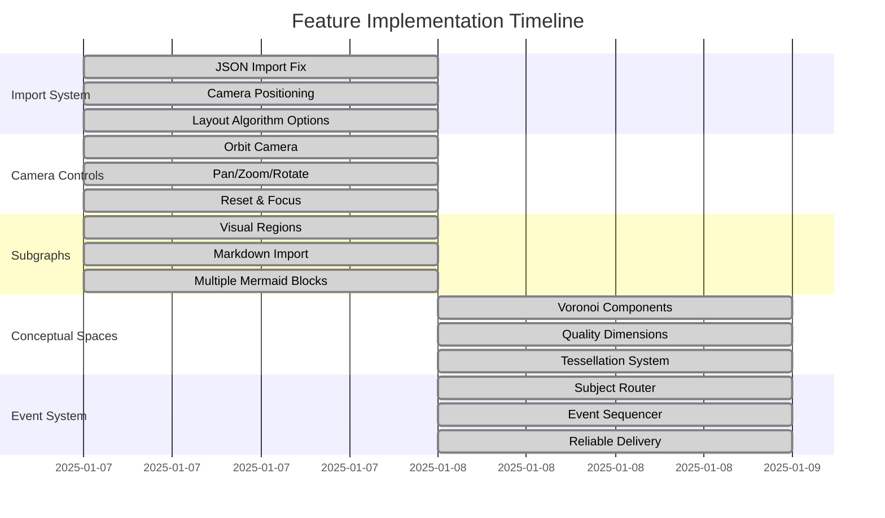
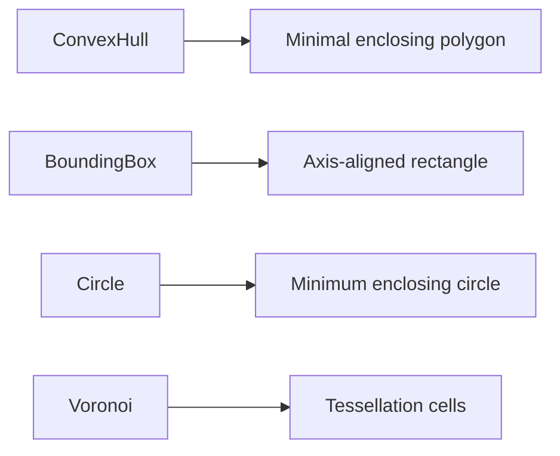
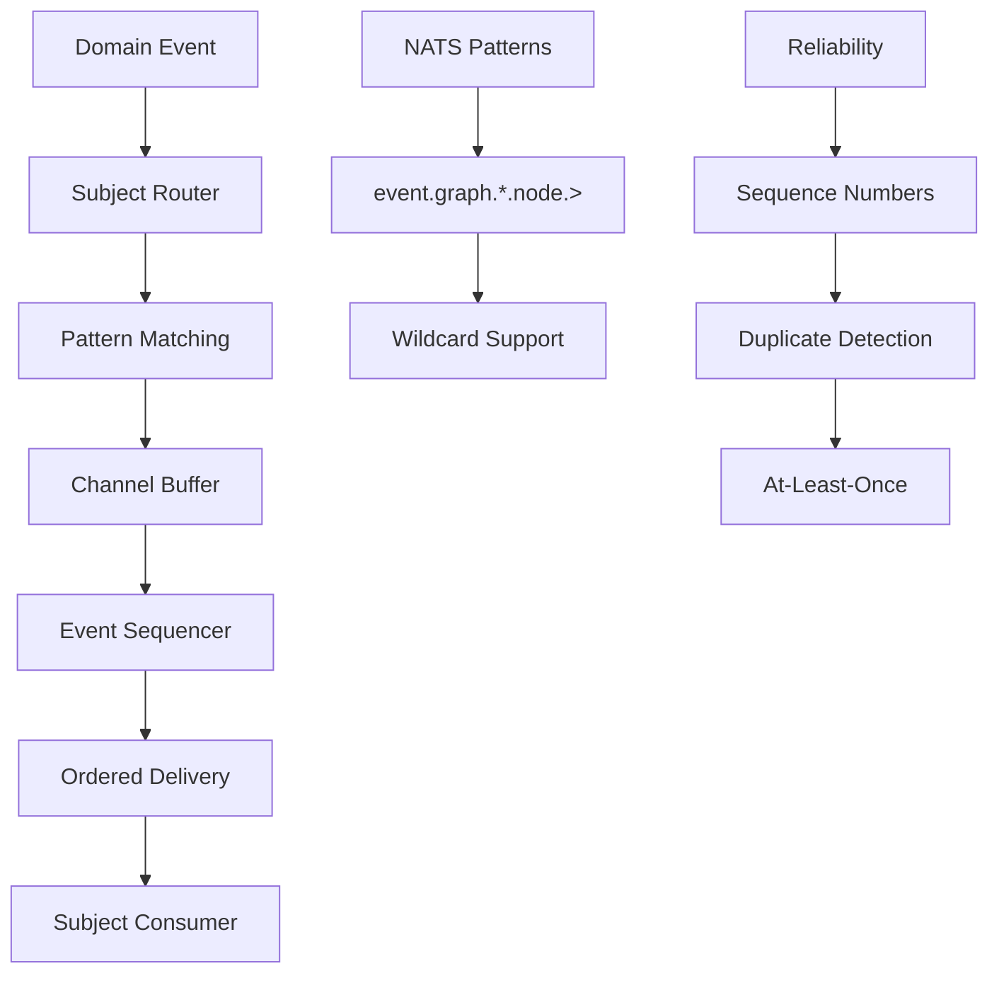

# Recent Feature Implementations

## Overview

This document tracks the recent feature implementations in the CIM graph editor, focusing on visualization enhancements, conceptual space integration, and event system improvements.

## Feature Timeline



## 1. Import System Enhancements

### Problem Solved
- Import functionality wasn't rendering nodes visually
- Camera was positioned incorrectly for imported content
- Force-directed layout was overriding original positions

### Implementation Details

#### Camera Positioning Fix
```rust
// Before: Camera at (65, 30, 30) looking at (65, 0, 0)
// After: Camera at (100, 150, 150) looking at (100, 0, 0)
Transform::from_xyz(100.0, 150.0, 150.0)
    .looking_at(Vec3::new(100.0, 0.0, 0.0), Vec3::Y)
```

#### Layout Algorithm Options
```rust
pub enum LayoutAlgorithm {
    None,              // Preserve original positions
    ForceDirected,     // Physics-based layout
    Circular,          // Arrange in circle
    Grid,              // Grid layout
}
```

### Key Files Modified
- `src/presentation/plugins/mod.rs` - Camera setup
- `src/presentation/systems/import_system.rs` - Import shortcuts
- `src/domain/services/graph_import.rs` - Layout options

## 2. Camera Control System

### Features Added
- **Orbit Camera**: Rotate around focus point
- **Pan**: Right-click drag to move view
- **Zoom**: Mouse wheel for distance control
- **Reset**: R key to reset view
- **Focus**: F key to focus on selection

### Implementation

```rust
#[derive(Component)]
pub struct OrbitCamera {
    pub focus: Vec3,
    pub distance: f32,
    pub yaw: f32,
    pub pitch: f32,
    pub sensitivity: f32,
    pub zoom_speed: f32,
}
```

### Controls
| Input | Action |
|-------|--------|
| Left Mouse Drag | Orbit around focus |
| Right Mouse Drag | Pan camera |
| Mouse Wheel | Zoom in/out |
| R | Reset camera |
| F | Focus on selection |

## 3. Subgraph Visualization

### Conceptual Model
- **Subgraphs**: Visual regions denoting logical groupings
- **Boundaries**: Convex hull, bounding box, circle, or Voronoi
- **Markdown Import**: Extract multiple mermaid blocks as subgraphs

### Features
```rust
#[derive(Component)]
pub struct SubgraphRegion {
    pub subgraph_id: SubgraphId,
    pub name: String,
    pub color: Color,
    pub nodes: HashSet<NodeId>,
    pub boundary_type: BoundaryType,
}
```

### Boundary Types


## 4. Conceptual Space Integration

### Theory Application
Based on Gärdenfors' conceptual spaces theory:
- **Graph** = Conceptual Space
- **Subgraphs** = Quality Dimensions
- **Voronoi Cells** = Natural Categories

### Implementation Components

#### Quality Dimensions
```rust
#[derive(Component)]
pub struct QualityDimension {
    pub subgraph_id: SubgraphId,
    pub name: String,
    pub prototype: Vec3,
    pub weight: f32,
    pub metric: DistanceMetric,
}
```

#### Voronoi Tessellation
```rust
#[derive(Component)]
pub struct VoronoiCell {
    pub subgraph_id: SubgraphId,
    pub prototype: Vec3,
    pub vertices: Vec<Vec3>,
    pub neighbors: HashSet<SubgraphId>,
}
```

### Visualization
- **V key**: Toggle Voronoi visualization
- **B key**: Cycle boundary types
- **Lloyd's Relaxation**: Smooth cell shapes

## 5. Event System Redesign

### Problem Addressed
Bevy's event system limitations:
- No subject-based routing
- Unreliable ordering
- Buffer overruns possible
- No delivery guarantees

### Solution Architecture



### Key Components

#### Subject Router
```rust
pub struct SubjectRouter {
    routes: Arc<RwLock<HashMap<String, SubjectChannel>>>,
    global_sequence: Arc<RwLock<u64>>,
    aggregate_sequences: Arc<RwLock<HashMap<AggregateId, u64>>>,
}
```

#### Event Sequencer
```rust
pub struct EventSequencer {
    aggregate_buffers: Arc<RwLock<HashMap<AggregateId, AggregateBuffer>>>,
    global_buffer: Arc<RwLock<GlobalBuffer>>,
    config: SequencerConfig,
}
```

### Subject Patterns
| Pattern | Description | Example |
|---------|-------------|---------|
| Exact | Specific subject | `event.graph.node` |
| Single Wildcard | One segment | `event.*.node` |
| Full Wildcard | All following | `event.graph.>` |

### Reliability Features
1. **Ordering**: Global and per-aggregate sequences
2. **Buffering**: Out-of-order event handling
3. **Timeouts**: Force progression on missing sequences
4. **Monitoring**: Built-in statistics and health checks

## Usage Examples

### Import Workflow
```rust
// Import with preserved positions
let import_request = ImportRequest {
    file_path: "graph.json",
    layout: LayoutAlgorithm::None,
    offset: Vec3::new(50.0, 0.0, 0.0),
};
```

### Event Consumption
```rust
// Subscribe to graph events
let consumer = SubjectConsumer::new(&router, vec![
    "event.graph.*.node.>",
    "event.graph.123.>",
])?;

// Process events in order
let events = consumer.poll_events();
for event in events {
    // Guaranteed ordering
}
```

### Voronoi Visualization
```rust
// Enable Voronoi tessellation
app.add_plugins(VoronoiTessellationPlugin)
    .insert_resource(VoronoiSettings {
        update_frequency: 0.5,
        smoothing_factor: 0.3,
        min_cell_size: 10.0,
    });
```

## Performance Considerations

### Import System
- Offset increment prevents node overlap
- Layout algorithms are optional for performance

### Camera System
- Smooth interpolation for orbit movements
- Configurable sensitivity and zoom speed

### Event System
- Bounded channels prevent memory exhaustion
- Configurable buffer sizes and timeouts
- Pattern-based routing reduces unnecessary processing

## Future Enhancements

1. **Import System**
   - Support for more file formats
   - Batch import operations
   - Import preview mode

2. **Conceptual Spaces**
   - Semantic similarity calculations
   - Automatic categorization
   - AI-driven layout optimization

3. **Event System**
   - Dead letter queue implementation
   - Circuit breaker patterns
   - Event replay from snapshots

## Testing

All features include comprehensive tests:
- Unit tests for core logic
- Integration tests for system interactions
- Performance benchmarks for critical paths

See `/tests/` directory for test implementations.
