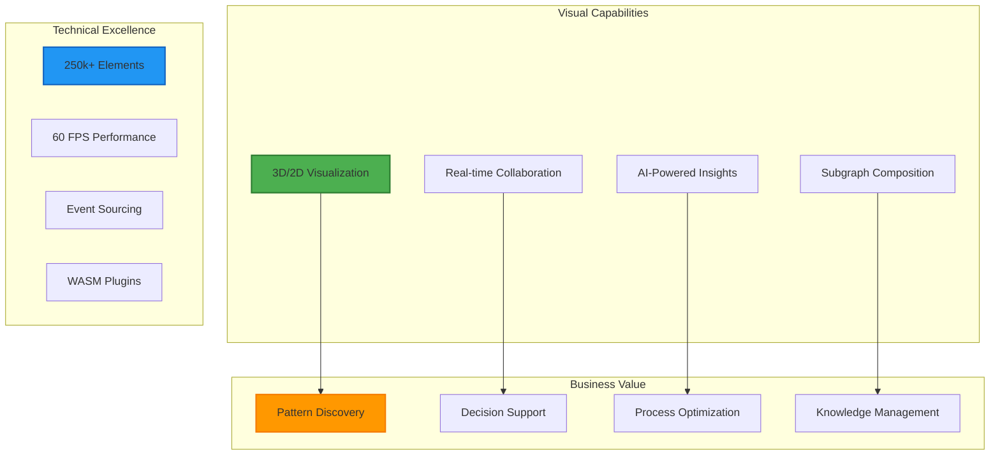

# Information Alchemist Documentation

## Visual Intelligence for the Composable Information Machine

Welcome to the comprehensive documentation for Information Alchemist, the powerful graph visualization and manipulation frontend for the Composable Information Machine (CIM).

## Documentation Sets

### 📊 [Business Documentation](business/)
**For Business Leaders and Decision Makers**

Discover how Information Alchemist transforms complex business data into actionable visual intelligence:

- **Introduction**: Understanding the value proposition
- **Core Concepts**: Visual building blocks for business
- **Use Cases**: Real-world applications across industries
- **Getting Started**: Your journey from data to insight

[Start with Business Documentation →](business/README.md)

### 🔧 [Technical Documentation](technical/)
**For Developers and Technical Implementers**

Deep dive into the architecture, components, and implementation details:

- **Architecture Overview**: System design and principles
- **Core Components**: Detailed component documentation
- **Event System**: Event-driven architecture patterns
- **Integration Guide**: Connecting with CIM backend
- **Performance Guide**: Optimization strategies
- **Plugin Development**: Extending functionality

[Start with Technical Documentation →](technical/README.md)

## What is Information Alchemist?

Information Alchemist is a next-generation 3D-capable graph editor that serves as the visual interface for the Composable Information Machine. It transforms abstract data relationships into tangible, manipulable visual spaces.

### Key Features

## Quick Links

### For Business Users
- [What is Information Alchemist?](business/01-introduction.md)
- [Core Concepts Explained](business/02-core-concepts.md)
- [Industry Use Cases](business/03-use-cases.md)
- [Getting Started Guide](business/04-getting-started.md)

### For Technical Users
- [Architecture Overview](technical/01-architecture-overview.md)
- [Component Design](technical/02-core-components.md)
- [Event System](technical/03-event-system.md)
- [Integration Guide](technical/04-integration-guide.md)
- [Performance Optimization](technical/05-performance-guide.md)
- [Plugin Development](technical/06-plugin-development.md)

## Key Differentiators

### 1. **Dual-Mode Visualization**
Seamlessly switch between immersive 3D exploration and efficient 2D overview modes.

### 2. **Subgraph Composition**
Load and compose multiple graphs while maintaining their structure and relationships.

### 3. **Event-Driven Intelligence**
Every change is captured as an event, enabling perfect audit trails and time-travel debugging.

### 4. **AI-Powered Analysis**
Integrated AI agents provide real-time insights and pattern recognition.

### 5. **Extensible Architecture**
WASM-based plugin system allows custom algorithms and visualizations.

## Technology Stack

- **Frontend**: Rust, Bevy 0.16.0, WebGPU
- **Integration**: NATS JetStream, GraphQL, WebSocket
- **Architecture**: Entity-Component-System (ECS)
- **Patterns**: Domain-Driven Design (DDD), Event Sourcing

## Getting Help

### Documentation
- Business users: Start with the [Business Documentation](business/)
- Developers: Dive into the [Technical Documentation](technical/)

### Community
- **GitHub**: Report issues and contribute
- **Discord**: Real-time community support
- **Forum**: Design discussions and Q&A

### Professional Support
- Enterprise support packages available
- Custom plugin development services
- Training and workshops

## License

Information Alchemist is part of the Composable Information Machine ecosystem. See LICENSE file for details.

---

*Information Alchemist: Where Data Becomes Understanding*

Transform your information into visual intelligence. Start exploring today.
